# 🗺️ DuLichViet — AI Travel Itinerary Recommendation System

<div align="center">


**NT208 · Web Programming Project · UIT 2023.2**

</div>

---

## 📖 Mô tả

**DuLichViet** là hệ thống gợi ý và lập kế hoạch chuyến đi thông minh dành riêng cho du lịch Việt Nam. Người dùng chỉ cần mô tả điểm đến, ngân sách và sở thích — hệ thống AI sẽ tự động sinh ra lịch trình chi tiết theo từng ngày, bao gồm các hoạt động, địa điểm ăn uống, tham quan và chỗ ở phù hợp.

Lịch trình được tạo ra dựa trên dữ liệu địa điểm thực tế từ Goong Maps API, sau đó được Gemini AI sắp xếp thành hành trình hợp lý. Người dùng có thể chỉnh sửa thủ công, chia sẻ qua link công khai, hoặc đánh giá sau chuyến đi. Khách vãng lai (guest) có thể tạo lịch trình ngay mà không cần đăng ký, và claim về tài khoản sau khi đăng nhập.

**Điểm nổi bật:**
- 🤖 AI sinh lịch trình từ DB recommendation context — không hallucinate địa điểm
- 🔒 Bảo mật token: refresh rotation, share/claim token hash SHA-256, không lưu raw token
- ⚡ Optimistic update trên FE — UI phản hồi ngay, revert nếu API fail
- 🗄️ Redis cache cho places/destinations, fail-open khi Redis down
- 📊 Rate limit AI fail-closed — Redis down thì block, không cho bypass

---

## 📋 Mục lục

1. [Tính năng chính](#1-tính-năng-chính)
2. [Tech Stack](#2-tech-stack)
3. [High-Level Architecture](#3-high-level-architecture)
4. [Low-Level Architecture](#4-low-level-architecture)
5. [Database Schema & Quan hệ](#5-database-schema--quan-hệ)
6. [API Reference](#6-api-reference)
7. [User Flow & CRUD Flow](#7-user-flow--crud-flow)
8. [AI Pipeline Flow](#8-ai-pipeline-flow)
9. [Auth & Security Flow](#9-auth--security-flow)
10. [Trạng thái Phase C](#10-trạng-thái-phase-c)
11. [Tài liệu Documentation](#11-tài-liệu-documentation)
12. [Quick Start](#12-quick-start)
13. [Tests & Verification](#13-tests--verification)
14. [ETL](#14-etl)
15. [Cấu trúc thư mục](#15-cấu-trúc-thư-mục)
15. [Team](#15-team)

---

## 1. Tính năng chính

| Nhóm | Tính năng | Trạng thái |
|---|---|---|
| **Auth** | Đăng ký / đăng nhập / đăng xuất | ✅ Done |
| **Auth** | Refresh token rotation (JWT) | ✅ Done |
| **Auth** | Quên mật khẩu / đặt lại qua email | ✅ Done |
| **Profile** | Xem / cập nhật hồ sơ, đổi mật khẩu | ✅ Done |
| **Trip** | Tạo lịch trình thủ công | ✅ Done |
| **Trip** | Chỉnh sửa ngày / hoạt động / chỗ ở (auto-save) | ✅ Done |
| **Trip** | Xem / xóa / đánh giá lịch trình | ✅ Done |
| **Trip** | Chia sẻ lịch trình qua link công khai | ✅ Done |
| **Trip** | Guest tạo trip → claim sau khi đăng nhập | ✅ Done |
| **Places** | Tìm kiếm địa điểm theo thành phố / danh mục | ✅ Done |
| **Places** | Lưu địa điểm yêu thích | ✅ Done |
| **Places** | Destination data quality advisory — limited-data cities (e.g., Đà Lạt) show non-blocking warning, remain submittable | ✅ Done |
| **AI C.1** | Sinh lịch trình tự động bằng Gemini AI | ✅ Done |
| **AI C.2** | Gợi ý địa điểm thay thế (DB-only, không LLM) | ✅ Done |
| **AI C.3A** | Chat session foundation owner-only, trip-scoped | ✅ Done |
| **AI C.3B** | Companion chat message flow, real provider call, quota riêng | ✅ Review-ready |
| **AI C.4** | Lịch sử chat persisted + reload theo session | ✅ Partial |
| **AI C.5** | Analytics Text-to-SQL (optional) | 🔄 Optional |
| **ETL** | Goong-first ETL nạp dữ liệu địa điểm | ✅ Done |

---

## 1.1 Trạng thái hiện tại sau khi C3C apply-patch đã được verify cục bộ

Current truth trên local branch `feat/00101-c-c3c-apply-patch-confirm`:

| Hạng mục | Trạng thái |
|---|---|
| Readiness tổng thể sau hardening `00101` | `C3C_RUNTIME_VERIFIED_ETL_PENDING` |
| `C3A — Chat Session Foundation` | Đã merge (`PR #98-100`) |
| `C3B — Companion Chat API` | Đã có message send thật, real AI call, owner-check, chat quota riêng, persisted `chat_messages` |
| `C4 — Chat History` | Đã có persisted history read-path qua `GET /itineraries/chat-sessions/{sessionId}/messages`; phần quản lý history nâng cao vẫn pending |
| `FloatingAIChat.tsx` hiện tại | Component legacy/mock còn nằm trên source nhưng đã không còn được mount ở `TripWorkspace` và `DailyItinerary` |
| `ChatPanel` trong `TripWorkspace` | Đã create/load session, load history, send message thật, render `requiresConfirmation` + `proposedOperations` |
| `chat_sessions` / `chat_messages` | Đã có schema/migration và đang được persist thật ở runtime |
| Chat session/message API | Đã có session CRUD + `POST/GET /itineraries/chat-sessions/{sessionId}/messages` |
| Real AI call trong chat | Đã có qua `Backend/src/itineraries/companion_service.py` |
| Chat quota tách khỏi generate quota | Đã có `rate:ai:chat:user:{user_id}:{YYYYMMDD}` |
| Apply-patch confirm vào itinerary | Đã có `POST /api/v1/itineraries/{tripId}/apply-patch`, FE confirm/cancel UI, và browser/API/DB evidence cho apply/cancel/stale |
| Guest AI workspace trong cùng browser session | Đã ổn định bằng `sessionStorage.currentTrip` + `pendingClaim`; guest xem được trip vừa generate nhưng chưa chat trước khi claim |
| Generated activity images sau reload | Đã ưu tiên `Place.image` khi `place_id` hợp lệ, FE có fallback khi image rỗng/hỏng |
| Gemini SDK backend | Đã migrate sang `google-genai`; timeout vẫn trả `503 AI_PROVIDER_TIMEOUT` |
| ETL scheduler local smoke | Đã có `Backend/src/etl/scheduler.py`; local/manual smoke `--once` pass nhưng chưa wire vào compose/CI schedule |

**Ý nghĩa thực tế:**

- `C3A` đã chốt session foundation owner-only, trip-scoped trong `TripWorkspace`.
- `C3B` hiện đã có message generation, provider abstraction, real Gemini call,
  `requiresConfirmation` / `proposedOperations`, chat quota riêng, và FE error UX riêng cho chat.
- `C4` không còn là “chưa bắt đầu”: persisted message history và reload session đã có,
  nhưng delete/history-management UX và các policy bổ sung vẫn còn phía sau.
- Các mock AI surface chủ động trong runtime đã được gỡ khỏi `TripWorkspace` và `DailyItinerary`;
  luồng chat thật hiện nằm ở `ChatPanel`.
- Browser `429` submit-path của generate đã có regression test; chat quota riêng cho auth user đã được verify trên current source.
- Guest chưa đăng nhập vẫn có thể generate và xem trip vừa tạo trong chính browser session hiện tại; đăng nhập mới cần để nhận ownership dài hạn, share, và edit/save server-side đầy đủ.
- Generate hiện vẫn là sync HTTP flow; tăng timeout chỉ giúp local/staging dễ smoke hơn, còn "eventually complete" cần background job/polling ở phase tương lai.
- Companion editing core hiện đã qua local verification cho `apply`, `cancel`, `stale`.
- Phần còn lại trước khi xem hệ thống là ổn định hơn ở mức phase tiếp theo nằm ở:
  ETL scheduler wiring, sparse-city enrichment, patch-specific rate limit, và history-management UX sâu hơn.

---

## 2. Tech Stack

### Backend

| Thành phần | Công nghệ | Phiên bản |
|---|---|---|
| Framework | FastAPI | 0.115+ |
| Language | Python | 3.12+ |
| Package Manager | uv | 0.4+ |
| ORM | SQLAlchemy (async) | 2.0+ |
| Database | PostgreSQL | 16 |
| Migration | Alembic | 1.14+ |
| Cache | Redis | 7 |
| Auth | JWT (python-jose) + bcrypt | — |
| AI | Google Gemini (google-genai SDK) | gemini-2.5-flash |
| HTTP Client | httpx | 0.28+ |
| Email | aiosmtplib | 3.0+ |
| Logging | structlog | 24.4+ |
| Validation | Pydantic v2 | 2.10+ |
| Lint/Format | Ruff | 0.8+ |
| Test | pytest + pytest-asyncio | — |

### Frontend

| Thành phần | Công nghệ | Phiên bản |
|---|---|---|
| Framework | React | 18.3 |
| Language | TypeScript | 5 |
| Build Tool | Vite | 6.4 |
| Styling | TailwindCSS | 4.1 |
| UI Components | MUI + Radix UI | 7.x / latest |
| Icons | Lucide React | 0.487 |
| Routing | React Router | 7.13 |
| Charts | Recharts | 2.15 |
| Drag & Drop | React DnD | 16 |
| Animation | Motion | 12 |
| E2E Testing | Playwright | 1.59+ |

### Infrastructure

| Thành phần | Công nghệ |
|---|---|
| Container | Docker + Docker Compose |
| CI/CD | GitHub Actions (7 required checks) |
| Maps/ETL | Goong Maps API |
| AI Provider | Google AI Studio (Gemini) |

---

## 3. High-Level Architecture

> Sơ đồ dưới mô tả toàn bộ hệ thống từ góc nhìn tổng quan: người dùng tương tác với Frontend React, Frontend gọi REST API đến FastAPI Backend, Backend đọc/ghi PostgreSQL và dùng Redis để cache + rate-limit. ETL pipeline chạy độc lập để nạp dữ liệu địa điểm từ Goong Maps API vào DB. Gemini AI chỉ được gọi khi user yêu cầu sinh lịch trình.

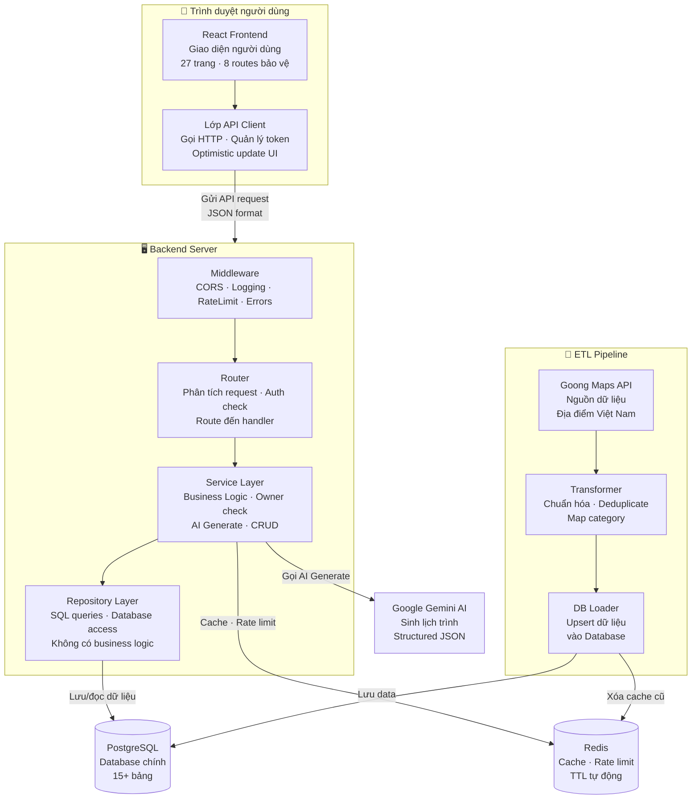

**Luồng chi tiết theo từng bước:**

**Bước 1: Người dùng tương tác với Frontend**
- User mở browser và truy cập ứng dụng React
- Frontend render 27 pages với 8 protected routes
- Các thao tác trên UI (click, submit form, v.v.) trigger actions

**Bước 2: API Client Layer xử lý request**
- Tự động inject JWT Bearer token vào mọi request
- Tự động refresh token khi nhận 401 Unauthorized
- Optimistic update UI ngay lập tức trước khi API confirm
- Nếu API fail, revert UI về state trước đó

**Bước 3: Backend nhận và xử lý request**
- **Middleware Pipeline:** CORS → RequestLog → RateLimiter → ErrorHandler
- **Router Layer:** Parse request, auth dependency injection, route đến handler phù hợp
- **Service Layer:** 
  - AuthService: Xử lý đăng ký/đăng nhập/refresh token
  - ItineraryService: CRUD trip, generate AI, share/claim
  - PlaceService: Tìm kiếm, cache places/destinations
  - SuggestionService: Gợi ý địa điểm (DB-only, không LLM)
- **Repository Layer:** Thực thi SQL queries, không chứa business logic

**Bước 4: Tương tác với Database và Cache**
- **PostgreSQL:** Lưu trữ persistently (users, trips, places, destinations, v.v.)
- **Redis:** 
  - Cache places/destinations (TTL 30min-1h, fail-open nếu down)
  - Rate-limit AI (fail-closed nếu down - block request)
- **Gemini AI:** Chỉ gọi khi user generate itinerary, không dùng cho suggestions

**Bước 5: ETL Pipeline nạp dữ liệu (chạy độc lập)**
- Goong Maps API cung cấp dữ liệu địa điểm
- Transformer normalize và deduplicate dữ liệu
- DB Loader upsert vào PostgreSQL
- Redis cache bị invalidate sau ETL

**Kiến trúc quan trọng:**
- **FE → BE:** HTTP REST, JSON camelCase format
- **BE → DB:** Async SQLAlchemy, non-blocking
- **Redis:** Dual role - cache (fail-open) và rate-limit (fail-closed)
- **AI:** Isolated - chỉ cho generate, không cho suggestions
- **ETL:** Decoupled - chạy CLI riêng, không phụ thuộc app server

```
┌──────────────────────────────────────────────────────────────────────────┐
│                         👤 USER (Browser)                                │
│                                                                          │
│  ┌──────────────────────────── FRONTEND ──────────────────────────────┐  │
│  │  React 18 + Vite 6 + TypeScript + TailwindCSS + MUI + Radix UI    │  │
│  │                                                                     │  │
│  │  ┌──────────┐ ┌──────────┐ ┌──────────┐ ┌──────────┐             │  │
│  │  │CreateTrip│ │Workspace │ │TripLib   │ │CityList  │  27 pages   │  │
│  │  │(AI Gen)  │ │(Edit+AI) │ │(List)    │ │(Browse)  │             │  │
│  │  └────┬─────┘ └────┬─────┘ └────┬─────┘ └────┬─────┘             │  │
│  │       │ POST/gen    │ PUT/GET     │ GET         │ GET               │  │
│  │  ┌────┴─────────────┴────────────┴─────────────┴───────────────┐  │  │
│  │  │  API Client Layer (services/api.ts + 4 modules)              │  │  │
│  │  │  • JWT Bearer injection + auto-refresh on 401               │  │  │
│  │  │  • Optimistic update + revert-on-failure                    │  │  │
│  │  │  • Mock fallback khi BE không có data                       │  │  │
│  │  └────────────────────────────┬────────────────────────────────┘  │  │
│  └───────────────────────────────┼────────────────────────────────────┘  │
│                                  │ HTTP REST (JSON, camelCase)            │
│                                  ▼                                        │
│  ┌────────────────────── FASTAPI BACKEND ─────────────────────────────┐  │
│  │  Uvicorn (Port 8000)                                              │  │
│  │                                                                    │  │
│  │  ┌──────────────── MIDDLEWARE PIPELINE ──────────────────────┐    │  │
│  │  │  CORS → RequestLog → RateLimiter → ErrorHandler → JWT    │    │  │
│  │  └──────────────────────┬───────────────────────────────────┘    │  │
│  │                          ▼                                        │  │
│  │  ┌──────────────── ROUTER LAYER (api/v1/) ───────────────────┐   │  │
│  │  │  auth.py  │ users.py │ itineraries.py │ places.py │ shared │   │  │
│  │  │  6 EPs    │ 3 EPs    │ 14 EPs          │ 7 EPs     │ 1 EP   │   │  │
│  │  └─────┬──────┴────┬─────┴───────┬─────────┴─────┬────┴───────┘   │  │
│  │        ▼           ▼             ▼               ▼                 │  │
│  │  ┌──────────────── SERVICE LAYER ──────────────────────────────┐   │  │
│  │  │  AuthService │ UserService │ ItineraryService │ PlaceService │   │  │
│  │  │  (JWT+hash)  │ (CRUD)      │ (CRUD+generate)  │ (search)    │   │  │
│  │  │  EmailService│             │                   │             │   │  │
│  │  └──────┬───────┴──────┬──────┴────────┬──────────┴────────────┘   │  │
│  │         ▼              ▼               ▼                           │  │
│  │  ┌──────────────── REPOSITORY LAYER ───────────────────────────┐   │  │
│  │  │  UserRepo │ TripRepo │ PlaceRepo │ TokenRepo               │   │  │
│  │  └──────┬─────┴────┬────┴───────────┬────────────────────────┘   │  │
│  └─────────┼──────────┼────────────────┼─────────────────────────────┘  │
│             ▼          ▼                ▼                               │
│  ┌─────────────── POSTGRESQL ──────────┐  ┌──────── REDIS ──────────┐ │
│  │  users, refresh_tokens              │  │  destinations cache     │ │
│  │  trips, trip_days, activities       │  │  place search cache     │ │
│  │  accommodations, extra_expenses     │  │  rate-limit counter     │ │
│  │  destinations, places, hotels       │  └─────────────────────────┘ │
│  │  saved_places                       │                               │
│  │  share_links, guest_claim_tokens    │                               │
│  │  trip_ratings                       │                               │
│  │  chat_sessions, chat_messages       │                               │
│  │  scraped_sources                    │                               │
│  └─────────────────────────────────────┘                               │
└──────────────────────────────────────────────────────────────────────────┘
```

**Mô tả các thành phần:**

| Thành phần | Vai trò |
|---|---|
| **Frontend** | React SPA — 27 trang, API client layer với JWT auto-refresh, optimistic update |
| **FastAPI Backend** | REST API server, Uvicorn port 8000, middleware pipeline, 34 endpoints |
| **Middleware Pipeline** | CORS → RequestLog → RateLimiter → ErrorHandler — xử lý trước khi vào router |
| **Router Layer** | Parse request, auth dependency injection, gọi service, trả response schema |
| **Service Layer** | Business logic: owner check, token validation, AI pipeline, cache logic |
| **Repository Layer** | SQL queries thuần — không chứa business rules |
| **PostgreSQL** | Primary database — 15+ bảng, integer PK, async SQLAlchemy |
| **Redis** | Cache destinations/places (TTL 30min–1h), rate-limit counter, fail-open cho places |

---

## 4. Low-Level Architecture

> Sơ đồ dưới đi sâu vào cấu trúc nội bộ của Backend (by-domain pattern) và Frontend (component tree + data flow). Mỗi domain BE có đủ router → service → repository → model. FE dùng hook pattern với optimistic update.

### 4.1 Backend — Dependency Injection & Layer Boundary

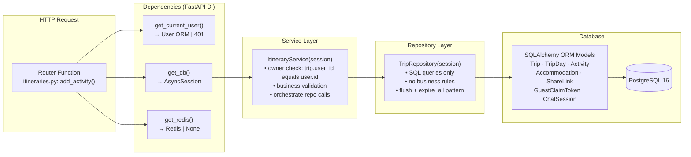

#### Ý nghĩa sơ đồ

- Router nhận request và chỉ làm nhiệm vụ parse input, gọi dependency FastAPI, rồi chuyển xuống service.
- `ItineraryService` là nơi giữ business rules như owner check, validation, và orchestration nhiều repository call.
- `TripRepository` chỉ nên chứa SQL/query logic; không nhét auth rule hay decision nghiệp vụ xuống đây.
- Kiểu phân tầng này là khuôn hiện tại để `C3A` thêm session foundation theo đúng style repo, thay vì tạo một nhánh xử lý chat tách rời khỏi `itineraries/`.

### 4.2 Backend — Domain Structure

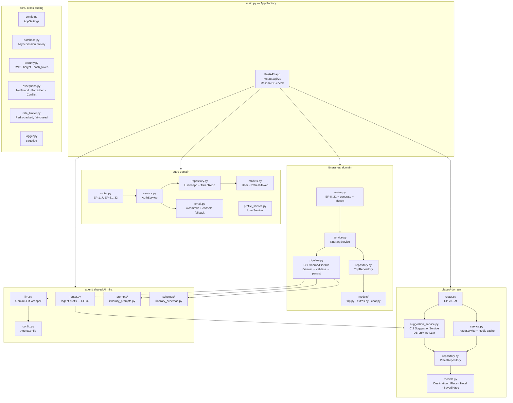

#### Ý nghĩa sơ đồ

- `main.py` chỉ đóng vai trò app factory và mount router tổng `api/v1`.
- Các domain chính đang vận hành là `auth/`, `itineraries/`, và `places/`; chúng mới là nơi chứa business flow user-facing.
- `agent/` hiện là hạ tầng AI dùng chung, không phải nơi chứa companion chat business logic.
- Vì vậy nếu đi tiếp `C3A/C3B`, phần trip-bound companion nên bám vào `itineraries/`, còn `agent/` chỉ giữ provider/prompt infra tái sử dụng.

### 4.3 Frontend — Component & Data Flow

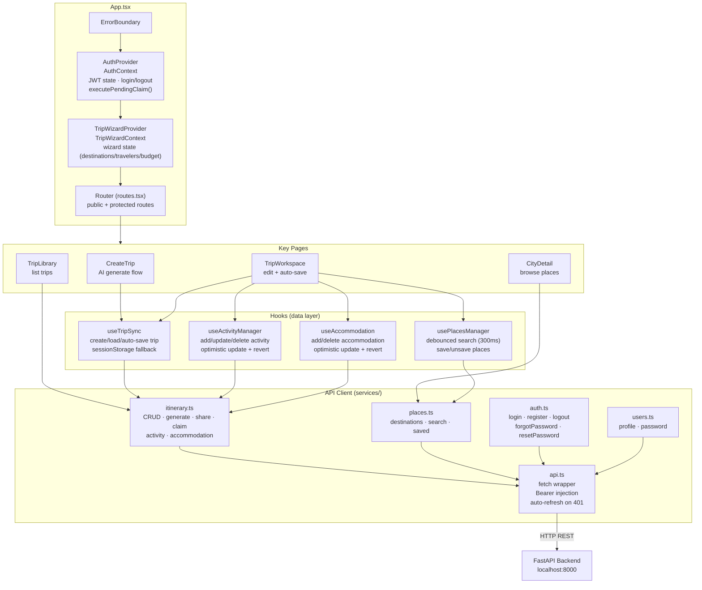

#### Ý nghĩa sơ đồ

- `AuthProvider` chịu trách nhiệm giữ JWT state, load profile, và chạy `executePendingClaim()` sau login/register.
- Các page chính đi qua hook layer (`useTripSync`, `useActivityManager`, `useAccommodation`, `usePlacesManager`) thay vì gọi API trực tiếp trong JSX.
- `services/api.ts` là lớp bọc chung cho Bearer injection, auto-refresh 401, và parse metadata như `Retry-After` / `X-RateLimit-*`.
- `FloatingAIChat` là legacy mock UI còn nằm trên source; điểm đúng hiện tại là context đã derive từ trip hiện tại thay vì hardcoded `Hà Nội`, và component này không còn được mount trên runtime chính.

### 4.4 Optimistic Update Pattern (FE)

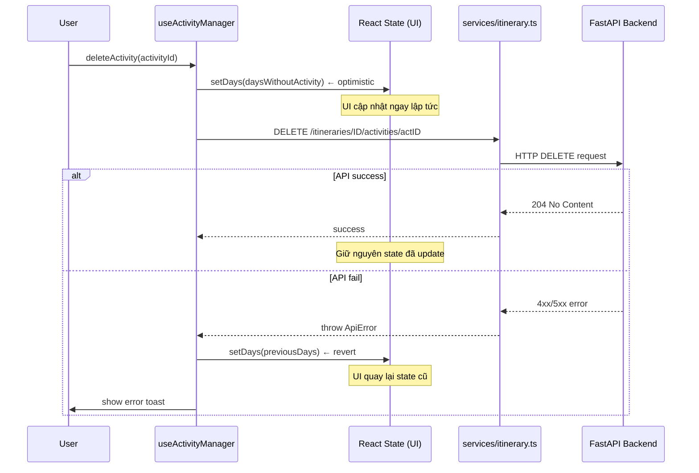

#### Ý nghĩa luồng

- FE ưu tiên cập nhật UI trước để thao tác sửa activity/accommodation mượt hơn cho người dùng.
- Hook luôn giữ `prevState` để có thể rollback nếu BE trả lỗi hoặc timeout.
- Quy tắc này chỉ áp dụng cho CRUD đã có thật trong workspace; các thay đổi do companion chat đề xuất vẫn phải đi qua `apply-patch` confirm riêng.
- Vì vậy `C3A` có thể gắn panel chat vào `TripWorkspace` mà không cần thay đổi cơ chế optimistic update hiện tại.

### 4.6 Backend — Cấu trúc file theo domain

```text
Backend/src/
├── api/v1/
│   ├── auth.py          # EP-1..4, EP-31..32 (register, login, refresh, logout, forgot/reset)
│   ├── users.py         # EP-5..7 (profile, update, change password)
│   ├── itineraries.py   # EP-8..21 (trip CRUD, share, claim, activity/accommodation)
│   ├── places.py        # EP-23..29 (destinations, search, detail, saved)
│   └── shared.py        # EP-22 (public share read)
├── core/
│   ├── config.py        # AppSettings (pydantic-settings), get_settings()
│   ├── database.py      # AsyncSession factory, Base, get_db dependency
│   ├── security.py      # JWT, bcrypt, opaque token, hash_token (SHA-256)
│   ├── exceptions.py    # NotFound, Forbidden, Conflict, Unauthorized
│   ├── logger.py        # structlog structured logging
│   └── dependencies.py  # get_current_user, get_current_user_optional, get_redis
├── models/
│   ├── user.py          # User, RefreshToken
│   ├── trip.py          # Trip, TripDay, Activity
│   ├── place.py         # Destination, Place, Hotel, SavedPlace
│   └── extras.py        # ExtraExpense, Accommodation, ShareLink, TripRating,
│                        # GuestClaimToken, ChatSession, ChatMessage, ScrapedSource
├── repositories/
│   ├── base.py          # BaseRepository (common CRUD)
│   ├── user_repo.py     # User + refresh token queries
│   ├── token_repo.py    # RefreshToken rotation/revoke
│   ├── trip_repo.py     # Trip + day + activity + accommodation + share/claim/rating
│   └── place_repo.py    # Destination + place + hotel + saved_place
├── schemas/
│   ├── common.py        # CamelCaseModel, PaginatedResponse
│   ├── auth.py          # LoginRequest, RegisterRequest, AuthResponse, ...
│   ├── user.py          # UserResponse, UpdateProfileRequest, ChangePasswordRequest
│   ├── itinerary.py     # CreateTripRequest, ItineraryResponse, DaySchema, ActivitySchema, ...
│   └── place.py         # DestinationResponse, PlaceResponse, SavedPlaceResponse
├── services/
│   ├── auth_service.py      # Register, login, refresh, logout, forgot/reset password
│   ├── user_service.py      # Profile read/update, change password
│   ├── itinerary_service.py # Trip CRUD, share/claim, rating, activity/accommodation, auto-save diff/sync
│   ├── place_service.py     # Destinations, search, detail, saved places, Redis cache
│   └── email_service.py     # aiosmtplib + console fallback
└── etl/                     # ETL pipeline (Goong Maps → PostgreSQL)
```

### 4.7 Frontend — Component tree

```text
App.tsx
└── ErrorBoundary
    └── AuthProvider (AuthContext)
        └── TripWizardProvider (TripWizardContext)
            └── Router (routes.tsx)
                ├── Public routes
                │   ├── /               → Home
                │   ├── /cities         → CityList
                │   ├── /cities/:cityId → CityDetail
                │   ├── /create-trip    → CreateTrip
                │   ├── /login          → Login
                │   ├── /register       → Register
                │   ├── /forgot-password → ForgotPassword
                │   ├── /reset-password → ResetPassword
                │   ├── /budget-setup   → BudgetSetup (wizard)
                │   ├── /travelers-selection → TravelersSelection (wizard)
                │   ├── /day-allocation → DayAllocation (wizard)
                │   ├── /daily-itinerary → DailyItinerary
                │   └── /shared/:token  → SharedTripView
                │
                ├── Protected / owner routes (đa số cần login → redirect /login)
                │   ├── /trip-library     → TripLibrary
                │   ├── /saved-places     → SavedPlaces
                │   ├── /account          → Account
                │   ├── /trip-history     → TripHistory
                │   ├── /settings         → Settings
                │   ├── /manual-trip-setup → ManualTripSetup
                │   ├── /trip-workspace   → TripWorkspace (guest được vào khi có local `currentTrip` hợp lệ)
                │   ├── /itinerary/:id    → ItineraryView
                │   ├── /profile          → Profile
                │   └── /saved-itineraries → SavedItineraries
                │
                └── * → NotFound (404)
```

### 4.8 Backend Request Flow

```text
HTTP Request
  → CORS Middleware          (allow origins: localhost:5173)
  → RequestLog Middleware    (log method + path + status + duration)
  → RateLimiter Middleware   (per-IP, Redis-backed, AI fail-closed)
  → ErrorHandler Middleware  (404/403/409/401/500 mapping)
  → Router                   (parse request, auth dependency injection)
  → Service                  (business logic, owner check, token validation)
  → Repository               (DB query — SQL only, no business rules)
  → Model / Database         (SQLAlchemy ORM → PostgreSQL async)
  → Response                 (camelCase JSON via CamelCaseModel alias_generator)
```

---

## 5. Database Schema & Quan hệ

> Hệ thống dùng PostgreSQL với 15+ bảng. Tất cả token nhạy cảm (refresh, share, claim, reset) đều lưu dạng SHA-256 hash — không bao giờ lưu raw token. `trips.user_id` nullable để hỗ trợ guest trips.

### 5.1 ERD — Mermaid

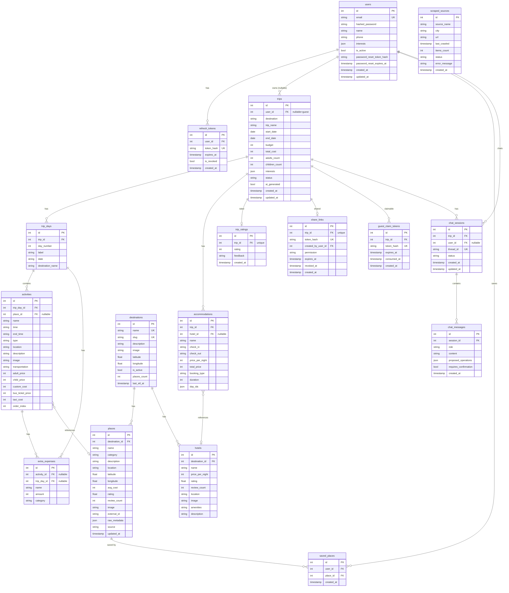

#### Cách đọc ERD

- `users` là bảng trung tâm cho tài khoản đăng nhập. Các bảng như `refresh_tokens`, `trips`, `saved_places`, `share_links` và `chat_sessions` liên kết về `users` để xác định chủ sở hữu hoặc người thực hiện hành động.
- `trips` là thực thể nghiệp vụ chính của hệ thống. Một trip có nhiều `trip_days`, mỗi ngày có nhiều `activities`, và activity có thể tham chiếu đến `places`; phần lưu trú được tách riêng qua `accommodations` và có thể tham chiếu đến `hotels`.
- `destinations` đại diện cho thành phố/điểm đến cấp cao như Hà Nội, Huế, Đà Lạt. Các bảng dữ liệu địa điểm như `places` và `hotels` gắn về `destinations` để phục vụ generate itinerary và kiểm tra data readiness.
- `share_links` dùng cho public shared view. `trip_id FK "unique"` nghĩa là link gắn với một trip và đang bị ràng buộc unique theo thiết kế hiện tại; Mermaid dùng comment `"unique"` để tránh lỗi render khi một field vừa là FK vừa có unique constraint.
- `guest_claim_tokens` hỗ trợ guest claim flow. Token thật không lưu plaintext mà chỉ lưu dạng hash để giảm rủi ro lộ token.
- `trip_ratings` lưu đánh giá sau chuyến đi. `trip_id FK "unique"` biểu diễn quan hệ một đánh giá cho một trip theo ràng buộc hiện tại.
- `chat_sessions` và `chat_messages` đã có trong schema để làm nền cho Phase `C3/C4`; sau `PR #98-100` phần session CRUD đã có, và current source đã mở thêm message send/history APIs qua `POST/GET /itineraries/chat-sessions/{sessionId}/messages`.

**Quy ước ký hiệu:**

| Ký hiệu | Ý nghĩa |
|---|---|
| `PK` | Primary key, khóa chính của bảng |
| `FK` | Foreign key, khóa ngoại liên kết sang bảng khác |
| `UK` | Unique key, giá trị duy nhất |
| `FK "unique"` | Field là khóa ngoại và có ràng buộc unique; viết dạng comment để GitHub Mermaid render hợp lệ |

### 5.2 Quan hệ chính

```
users
  ├── id (PK, integer)
  ├── email (unique)
  ├── hashed_password
  ├── name, phone, interests
  ├── password_reset_token_hash, password_reset_expires_at
  └── is_active, created_at, updated_at

refresh_tokens
  ├── id (PK)
  ├── user_id (FK → users.id)
  ├── token_hash (SHA-256, unique)
  ├── expires_at
  └── is_revoked

trips
  ├── id (PK)
  ├── user_id (FK → users.id, nullable — guest trips)
  ├── destination, trip_name
  ├── start_date, end_date
  ├── budget, total_cost
  ├── adults_count, children_count
  └── interests, created_at, updated_at

trip_days
  ├── id (PK)
  ├── trip_id (FK → trips.id)
  ├── label, date, destination_name
  └── order_index

activities
  ├── id (PK)
  ├── day_id (FK → trip_days.id)
  ├── name, time, end_time, type
  ├── location, description, image
  ├── transportation
  ├── adult_price, child_price, custom_cost
  ├── bus_ticket_price, taxi_cost
  └── order_index

extra_expenses
  ├── id (PK)
  ├── activity_id (FK → activities.id, nullable)
  ├── day_id (FK → trip_days.id, nullable)
  ├── label, amount
  └── created_at

accommodations
  ├── id (PK)
  ├── trip_id (FK → trips.id)
  ├── name, check_in, check_out
  ├── price_per_night, total_price
  ├── booking_type (hourly/nightly/daily)
  ├── duration
  └── day_ids (JSON array)

destinations
  ├── id (PK)
  ├── name, slug (unique)
  ├── description, image
  └── region, province

places
  ├── id (PK)
  ├── destination_id (FK → destinations.id)
  ├── name, category, address
  ├── description, image
  ├── adult_price, child_price
  └── goong_place_id

hotels
  ├── id (PK)
  ├── destination_id (FK → destinations.id)
  ├── name, address, description
  ├── price_per_night, image
  └── goong_place_id

saved_places
  ├── id (PK)
  ├── user_id (FK → users.id)
  ├── place_id (FK → places.id)
  └── created_at

share_links
  ├── id (PK)
  ├── trip_id (FK → trips.id)
  ├── created_by_user_id (FK → users.id)
  ├── token_hash (SHA-256, unique)
  ├── permission (view)
  ├── expires_at (nullable)
  └── revoked_at (nullable)

guest_claim_tokens
  ├── id (PK)
  ├── trip_id (FK → trips.id)
  ├── token_hash (SHA-256, unique)
  ├── expires_at
  └── consumed_at (nullable — one-time use)

trip_ratings
  ├── id (PK)
  ├── trip_id (FK → trips.id)
  ├── rating (1–5)
  └── feedback, created_at
```

### 5.3 Quan hệ chính

| Bảng | Quan hệ |
|---|---|
| `users` → `trips` | 1:N (user có nhiều trips; guest trips có user_id = NULL) |
| `trips` → `trip_days` | 1:N (ordered by order_index) |
| `trip_days` → `activities` | 1:N (ordered by order_index) |
| `activities` → `extra_expenses` | 1:N |
| `trips` → `accommodations` | 1:N |
| `trips` → `share_links` | 1:1 (current unique constraint on `trip_id`) |
| `trips` → `guest_claim_tokens` | 1:N |
| `trips` → `trip_ratings` | 1:1 (current unique constraint on `trip_id`) |
| `destinations` → `places` | 1:N |
| `destinations` → `hotels` | 1:N |
| `users` → `saved_places` | 1:N |

### 5.4 Token Security Pattern

```
┌─────────────────────────────────────────────────────┐
│              TOKEN SECURITY PATTERN                  │
│                                                      │
│  Raw token (chỉ client giữ)                         │
│    → SHA-256 hash → lưu DB                          │
│                                                      │
│  Áp dụng cho:                                        │
│  • refresh_tokens.token_hash                         │
│  • share_links.share_token_hash                      │
│  • guest_claim_tokens.token_hash                     │
│  • users.password_reset_token_hash                   │
│                                                      │
│  Khi verify: hash(raw_input) → lookup DB            │
│  → Không bao giờ lưu raw token trong DB             │
│  → Không thể recover raw token từ DB                │
└─────────────────────────────────────────────────────┘
```

---

## 6. API Reference

**Base URL:** `http://localhost:8000/api/v1`

### Auth (6 endpoints)

| Method | Path | Auth | Mô tả |
|---|---|---|---|
| POST | `/auth/register` | Public | Đăng ký → trả JWT pair |
| POST | `/auth/login` | Public | Đăng nhập → trả JWT pair |
| POST | `/auth/refresh` | Public | Refresh token rotation |
| POST | `/auth/logout` | Bearer | Revoke refresh token |
| POST | `/auth/forgot-password` | Public | Gửi reset link qua email (silent nếu email không tồn tại) |
| POST | `/auth/reset-password` | Public | Đặt lại mật khẩu bằng token |

### Users (3 endpoints)

| Method | Path | Auth | Mô tả |
|---|---|---|---|
| GET | `/users/profile` | Bearer | Lấy thông tin hồ sơ |
| PUT | `/users/profile` | Bearer | Cập nhật name, phone, interests |
| PUT | `/users/password` | Bearer | Đổi mật khẩu (verify current password) |

### Itineraries (14 endpoints)

| Method | Path | Auth | Mô tả |
|---|---|---|---|
| POST | `/itineraries/generate` | Optional | AI sinh lịch trình tự động (Gemini) |
| POST | `/itineraries` | Optional | Tạo lịch trình thủ công |
| GET | `/itineraries` | Bearer | Danh sách lịch trình (paginated) |
| GET | `/itineraries/{tripId}` | Bearer | Chi tiết lịch trình |
| PUT | `/itineraries/{tripId}` | Bearer | Cập nhật / auto-save (diff/sync) |
| DELETE | `/itineraries/{tripId}` | Bearer | Xóa lịch trình |
| PUT | `/itineraries/{tripId}/rating` | Bearer | Đánh giá sau chuyến đi |
| POST | `/itineraries/{tripId}/share` | Bearer | Tạo share link |
| POST | `/itineraries/{tripId}/claim` | Bearer | Guest claim trip về tài khoản |
| POST | `/itineraries/{tripId}/activities` | Bearer | Thêm activity vào ngày |
| PUT | `/itineraries/{tripId}/activities/{actId}` | Bearer | Cập nhật activity |
| DELETE | `/itineraries/{tripId}/activities/{actId}` | Bearer | Xóa activity |
| POST | `/itineraries/{tripId}/accommodations` | Bearer | Thêm chỗ ở |
| DELETE | `/itineraries/{tripId}/accommodations/{accId}` | Bearer | Xóa chỗ ở |

### Shared (1 endpoint)

| Method | Path | Auth | Mô tả |
|---|---|---|---|
| GET | `/shared/{shareToken}` | Public | Xem lịch trình được chia sẻ (read-only) |

### Places (7 endpoints)

| Method | Path | Auth | Mô tả |
|---|---|---|---|
| GET | `/places/destinations` | Public | Danh sách tất cả điểm đến (Redis cache 1h) |
| GET | `/places/destinations/{name}` | Public | Chi tiết điểm đến + places + hotels |
| GET | `/places/search` | Public | Tìm kiếm địa điểm (query, city, category, limit) — Redis cache 30min |
| GET | `/places/{placeId}` | Public | Chi tiết một địa điểm |
| GET | `/places/saved/list` | Bearer | Danh sách địa điểm đã lưu |
| POST | `/places/saved` | Bearer | Lưu địa điểm yêu thích |
| DELETE | `/places/saved/{savedId}` | Bearer | Bỏ lưu địa điểm |

### AI / Agent (1 endpoint — C.2 done)

| Method | Path | Auth | Mô tả |
|---|---|---|---|
| GET | `/agent/suggest/{activityId}` | Bearer | Gợi ý địa điểm thay thế (DB-only, không LLM) |

---

## 7. User Flow & CRUD Flow

### 7.1 User Registration & Login Flow

```
[Register]
User điền form → POST /auth/register → BE hash password (bcrypt)
  → tạo JWT pair (access 30min + refresh 7d)
  → hash refresh token → lưu DB
  → FE lưu tokens vào localStorage
  → executePendingClaim() (nếu có guest trips chờ claim)
  → redirect "/"

[Login]
User điền form → POST /auth/login → BE verify bcrypt
  → tạo JWT pair → FE lưu tokens vào localStorage
  → GET /users/profile → load user state
  → executePendingClaim()
  → redirect "/" (hoặc trang đang cố truy cập)

[Token Refresh]
API call → 401 Unauthorized
  → FE đọc refreshToken từ localStorage
  → POST /auth/refresh {refreshToken}
  → BE hash(raw) → lookup DB → verify !revoked
  → revoke token cũ (rotation) → tạo JWT pair mới
  → FE update localStorage (access + refresh mới)
  → retry original request với accessToken mới
  → Nếu refresh fail → xóa tokens → redirect /login
```

### 7.2 Trip CRUD Flow

```
[Tạo lịch trình thủ công]
User → POST /itineraries {destination, tripName, dates, budget, ...}
  → BE check trip limit (max 5 active trips nếu đã login)
  → create Trip (user_id = user.id hoặc NULL nếu guest)
  → Nếu guest: tạo claimToken (raw + hash, expires 24h)
  → Return ItineraryResponse (+ claimToken nếu guest)
  → FE lưu claimToken vào sessionStorage (pendingClaim)

[Chỉnh sửa — Auto-save]
User thay đổi → FE optimistic update (UI cập nhật ngay lập tức)
  → PUT /itineraries/{id} (debounce 500ms, gửi full trip state)
  → BE diff/sync days + activities + accommodations
  → Success: giữ nguyên UI | Fail: revert UI về state trước
  → Hiển thị error toast nếu fail

[Thêm Activity]
POST /itineraries/{id}/activities?day_id={dayId} {ActivitySchema}
  → BE owner check (trip.user_id == user.id)
  → add activity → flush → return ActivitySchema

[Cập nhật Activity]
PUT /itineraries/{id}/activities/{actId} {ActivitySchema}
  → BE owner check → update scalar fields → return ActivitySchema

[Xóa Activity]
DELETE /itineraries/{id}/activities/{actId}
  → BE owner check → delete → 204 No Content

[Accommodation CRUD]
POST /itineraries/{id}/accommodations {AccommodationSchema}
  → BE owner check → persist → return AccommodationSchema

DELETE /itineraries/{id}/accommodations/{accId}
  → BE owner check → delete → 204 No Content
```

### 7.3 Places Flow

```
[Tìm kiếm địa điểm]
User nhập query → GET /places/search?query=...&city=...&category=...
  → BE check Redis cache (key: "places:search:{query}:{city}:{category}:{limit}")
  → HIT: return cached JSON (TTL 30min)
  → MISS: query PostgreSQL → cache 30min → return list[PlaceResponse]
  → Redis down: fail-open → query DB trực tiếp (không cache)

[Lưu địa điểm yêu thích]
POST /places/saved {placeId}
  → BE check duplicate (user đã lưu chưa)
  → save → return SavedPlaceResponse

DELETE /places/saved/{savedId}
  → BE owner check → delete → 204 No Content
```

### 7.4 Share & Claim Flow

```
[Share Trip]
Owner → POST /itineraries/{id}/share
  → BE tạo opaque shareToken (random bytes)
  → hash SHA-256 → lưu share_links.share_token_hash
  → trả raw shareToken cho FE
  → FE hiển thị link: /shared/{rawToken}

Người khác mở link:
  → GET /shared/{rawToken}
  → BE hash(rawToken) → lookup share_links
  → Không tìm thấy / revoked → 404
  → Tìm thấy → return ItineraryResponse (read-only, không cần auth)

[Guest Claim Flow]
Guest tạo trip → nhận claimToken trong response
  → FE lưu {tripId, claimToken} vào sessionStorage (pendingClaim)

Guest đăng nhập / đăng ký:
  → AuthContext.executePendingClaim()
  → POST /itineraries/{tripId}/claim {claimToken: "raw_token"}
  → BE hash(claimToken) → tìm guest_claim_tokens
  → Verify: !consumed_at + expires_at > now()
  → trip.user_id = current_user.id (transfer ownership)
  → consumed_at = now() (one-time use — chống replay)
  → FE xóa pending claim khỏi sessionStorage
```

**Boundary notes:**

- Sau guest generate thành công, FE lưu thêm session snapshot `currentTrip` để `TripWorkspace` trong cùng browser session render itinerary ngay cả trước khi claim.
- Nếu chưa đăng nhập, các chỉnh sửa ở workspace chỉ được giữ tạm trong trình duyệt hiện tại; owner-only save/share/list vẫn cần auth.
- Public shared view chỉ đọc (`read-only`) và không có owner controls.
- Future owner-only chat controls không được xuất hiện ở shared view mặc định.
- Guest phải claim trip xong rồi mới được vào session/chat owner-only của `C3A`.

---

## 8. AI Pipeline Flow

> Toàn bộ AI trong hệ thống hiện đi qua 3 luồng chính: **C.1 Generate** (sinh lịch trình từ đầu bằng Gemini), **C.2 Suggest** (gợi ý thay thế từ DB, không LLM), và **C.3C Companion Chat patch-confirm flow** (trip-bound, owner-only, persisted history + confirm mutation). Phần còn lại sau `00101` không còn là thiếu endpoint/UI, mà là ops/data hardening.

### 8.1 C.1 — Generate Itinerary (Mermaid)

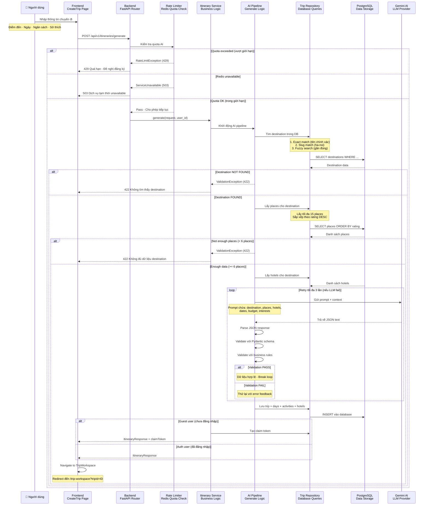

#### Luồng chi tiết AI Generate Pipeline

**Bước 1: Người dùng nhập thông tin chuyến đi**
- Nhập destination (Hà Nội, Đà Nẵng, v.v.)
- Chọn ngày bắt đầu và kết thúc
- Thiết lập ngân sách cho chuyến đi
- Chọn số người (người lớn, trẻ em)
- Chọn sở thích (food, culture, nature, v.v.)

**Bước 2: Frontend gửi request đến Backend**
- FE call POST /api/v1/itineraries/generate
- Gửi kèm toàn bộ thông tin người dùng vừa nhập
- Request được định dạng JSON camelCase

**Bước 3: Backend kiểm tra Rate Limit**
- Kiểm tra quota AI trong Redis
- **Auth user:** 5 trips/ngày, key: `rate:ai:user:{id}:{YYYYMMDD}`
- **Guest user:** 3 trips/ngày, key: `rate:ai:guest:{hash}:{YYYYMMDD}`
- Nếu vượt giới hạn → return 429 với message gợi ý đăng ký
- Nếu Redis down → return 503 (fail-closed, không bypass)

**Bước 4: Resolve Destination từ Database**
- Tìm destination theo 3 cách (từ chính xác → gần đúng):
  1. Exact match: "Hà Nội" → "Hà Nội"
  2. Slug match: "Ha Noi" → slug "ha-noi" → "Hà Nội"
  3. Fuzzy ILIKE: "hà nôi" → ILIKE "%hà nôi%"
- Nếu không tìm thấy → return 422 "Destination data not found"

**Bước 5: Lấy Recommendation Context**
- Lấy tối đa 15 places từ destination, sắp xếp theo rating DESC
- Lấy tối đa 4 hotels từ destination
- Nếu places < 6 → return 422 "Not enough destination places"
- Context này dùng để build prompt cho Gemini (không hallucinate)

**Bước 6: Gọi Gemini AI Generate**
- Gửi prompt chứa: destination, places, hotels, dates, budget, interests
- Yêu cầu Gemini trả về structured JSON (schema đã định nghĩa)
- Retry tối đa 3 lần nếu parse/validate fail
- Mỗi lần retry có error feedback để Gemini cải thiện

**Bước 7: Validate và Persist**
- Parse JSON response từ Gemini
- Validate với Pydantic schema (AgentItinerary)
- Validate với business rules (số days, activities per day, v.v.)
- Nếu validation pass → lưu vào database:
  - INSERT trips
  - INSERT trip_days
  - INSERT activities
  - INSERT accommodations

**Bước 8: Xử lý Guest vs Auth User**
- **Auth user:** Return ItineraryResponse với trip data
- **Guest user:** Return ItineraryResponse + claimToken
  - claimToken dùng để claim về account sau khi đăng nhập
  - Token lưu trong sessionStorage (pendingClaim)

**Bước 9: Navigate đến TripWorkspace**
- FE redirect đến /trip-workspace?tripId={id}
- User có thể xem/chỉnh sửa lịch trình vừa sinh

**Quan trọng:**
- Generate pipeline KHÔNG gọi Gemini cho suggestions (C.2) - chỉ cho C.1
- Guest và Auth user dùng chung pipeline, chỉ khác ở claimToken
- `C3A` (companion chat) không chạm vào pipeline này
- Rate limit fail-closed: Redis down → block AI requests

### 8.2 C.2 — Suggestion Service (Mermaid)

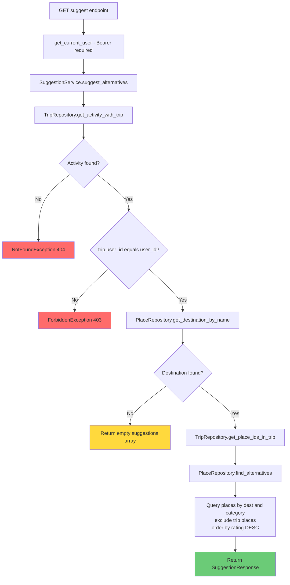

#### Ý nghĩa luồng

- Đây là luồng gợi ý thay thế dựa trên DB, không gọi Gemini và không tiêu quota generate.
- Owner check vẫn được giữ vì activity phải thuộc trip của user hiện tại.
- Kết quả trả về là danh sách candidate để FE cho user chọn, không tự mutate itinerary.
- Mô hình này là tiền đề tốt cho future companion actions: chat có thể đề xuất trước, còn việc persist chỉ xảy ra sau confirm.

### 8.3 C.1 — Generate Pipeline Text Flow

```
FE (CreateTrip.tsx)
  → POST /api/v1/itineraries/generate
    { destination, startDate, endDate, budget, adults, children, interests }

ItineraryService.generate()
  1. Validate request (dates hợp lệ, budget > 0)
  2. ItineraryPipeline.generate(request)
     ├── Resolve destination → query DB lấy places/hotels làm recommendation context
     ├── Build prompt với context (không hallucinate — chỉ dùng data từ DB)
     ├── Gemini LLM structured output (JSON schema)
     ├── Pydantic validation (tối đa 3 attempts, 2 retries nếu parse fail)
     └── Return validated DaySchema[] + AccommodationSchema[]
  3. Save trip + days + activities + accommodations vào DB
  4. Return ItineraryResponse (camelCase)

FE navigate → /trip-workspace?tripId={id}

KEY: Generate KHÔNG qua Supervisor — gọi direct ItineraryPipeline.
     Mặc định 5 hoạt động/ngày (cấu hình qua AGENT_MIN/MAX_ACTIVITIES_PER_DAY).
```

### 8.4 C.2 — Suggestion Service (DB-Only)

```
GET /api/v1/agent/suggest/{activityId}
  → Owner check (trip.user_id == user.id)
  → SuggestionService.find_alternatives(activity_id, limit)
     ├── Lấy activity hiện tại → xác định category + destination
     ├── Query places cùng category + destination từ DB
     ├── Loại trừ places đã có trong trip
     └── Return list[PlaceResponse] (không gọi LLM)

WHY DB-only: Gợi ý địa điểm chỉ cần filter + sort data có sẵn.
             Không cần "sáng tạo" nội dung mới.
```

### 8.5 C.3A — Chat Session Foundation (Merged)

```
FE (TripWorkspace + ChatPanel)
  → ChatPanel session-aware mounted trong TripWorkspace
  → POST /api/v1/itineraries/{tripId}/chat-sessions
  → GET  /api/v1/itineraries/{tripId}/chat-sessions
  → GET  /api/v1/itineraries/chat-sessions/{sessionId}

C3A shipped
  1. Verify owner hiện tại của trip
  2. Guest chưa claim → không tạo session
  3. Shared viewer → không tạo/đọc session
  4. Return session metadata + empty state

KEY:
  - C3A KHÔNG gọi Gemini thật
  - C3A KHÔNG gửi message thật
  - C3A KHÔNG apply patch vào itinerary
  - C3A chỉ dựng owner-only, trip-scoped session foundation
```

> Note: Detailed C.1/C.2 flow is already documented in sections **8.3** và **8.4** ở trên. Phần dưới đây chỉ tập trung vào future boundary của companion chat sau khi `C3A` hoàn tất.

> Runtime note (`00060D-FIX` + `00100`): `TripWorkspace` hiện đã derive `selectedCities` từ current trip/days nên floating chat không còn hardcoded `Hà Nội` trên trip `Huế`. Sau `C3A/C3B`, chat thật đang đi qua `ChatPanel`; `FloatingAIChat` chỉ còn là legacy mock/promo component trên source và không còn mount ở route runtime chính.

### 8.6 C.3B/C.3C — Current Companion Chat Contract + Patch-Confirm Pending

```
FE (ChatPanel trong TripWorkspace)
  → POST /api/v1/itineraries/chat-sessions/{sessionId}/messages

CompanionService.chat()
  1. Classify intent (modify / info / suggest / general)
  2. Load trip context + chat history (OWNER-CHECK bắt buộc)
  3. Call provider abstraction (fake provider trong test, real provider ở smoke riêng)
  4. Return:
     {
       message: "Tôi đề xuất thêm Văn Miếu vào ngày 2...",
       requiresConfirmation: true,
       proposedOperations: [
         { type: "add_activity", description: "...",
           target: { dayId: 2, activity: {...} } }
       ]
     }

FE hiển thị proposed changes
  → current source chưa tự apply DB
  → current source dùng `POST /api/v1/itineraries/{tripId}/apply-patch` để persist itinerary sau confirm

KEY: Chat KHÔNG TỰ PERSIST DB trước khi user confirm.
     Quota chat đã tách khỏi generate quota ở current source.
     Shared viewer không có owner chat controls mặc định.
```

---

## 9. Auth & Security Flow

> Hệ thống dùng JWT access token (ngắn hạn) + opaque refresh token (dài hạn, lưu hash). Tất cả token nhạy cảm đều hash SHA-256 trước khi lưu DB. Guest trips dùng claimToken one-time để transfer ownership.

### 9.1 Register & Login Flow (Mermaid)

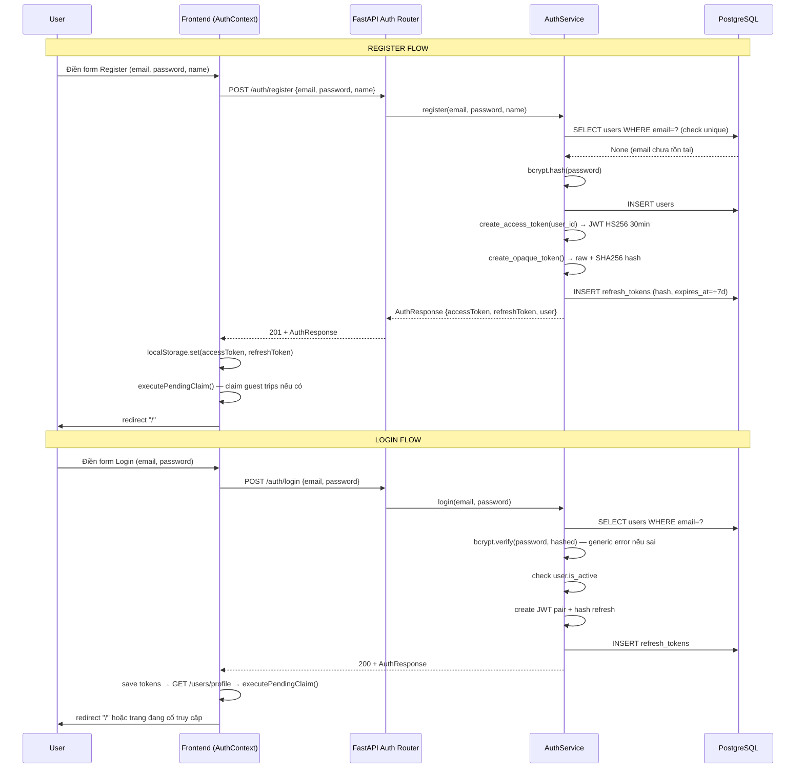

#### Ý nghĩa luồng

- Cả register và login đều quy về một điểm chung: nhận JWT pair, hydrate profile, rồi xử lý pending guest claim nếu có.
- OTP/email verification hiện không nằm trên critical path runtime này; flow hiện tại dựa vào auth API đang merge trên `main`.
- Việc claim trip sau auth là lý do `C3A` phải coi guest-unclaimed trip là ngoài phạm vi owner chat.
- Diagram này cũng nhắc reviewer rằng login state và claim flow đã gắn với nhau ngay từ tầng `AuthContext`.

### 9.2 Token Refresh Flow (Mermaid)

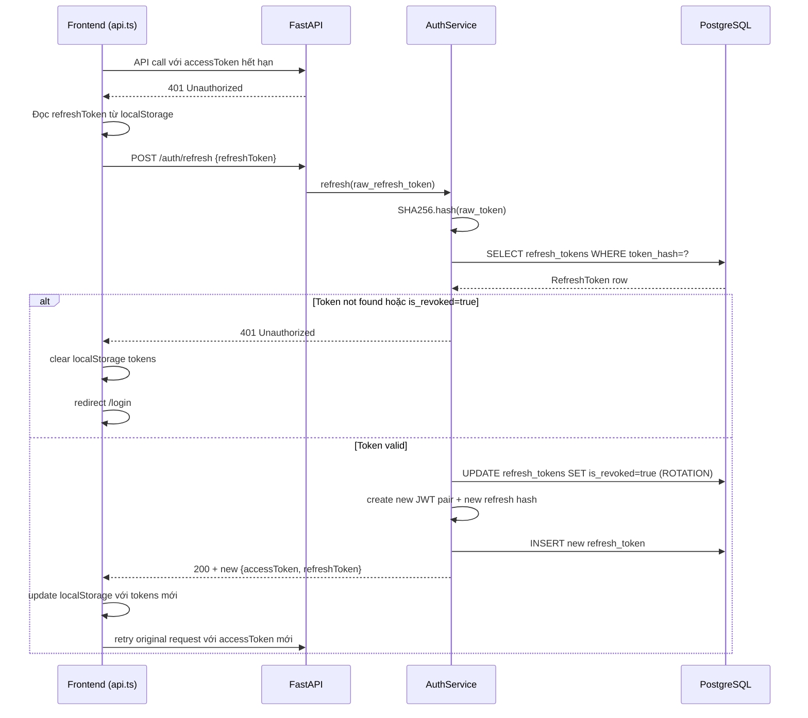

#### Ý nghĩa luồng

- `api.ts` tự động refresh khi gặp `401`, nên phần lớn page/hook không phải tự viết retry logic riêng.
- Refresh token được hash trong DB và rotate mỗi lần dùng để giảm rủi ro replay.
- Nếu refresh fail, FE phải clear token và đưa user về `/login`; không có fail-open cho auth state.
- Pattern này tiếp tục hữu ích cho `C3A/C3B` vì chat REST endpoints cũng sẽ đi qua cùng API client.

### 9.3 Guest Claim Flow (Mermaid)

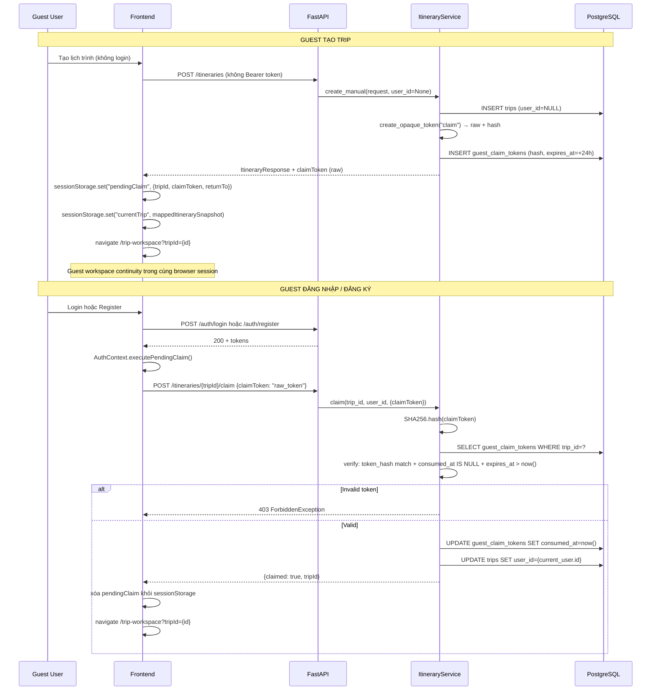

#### Ý nghĩa luồng

- Guest claim flow hiện dùng `sessionStorage` với một object `pendingClaim`, không còn dùng mảng `pendingClaims` trong `localStorage`.
- Raw claim token chỉ tồn tại ở FE tạm thời; BE chỉ lưu hash để chống lộ token và chống replay.
- Shared/public view là read-only và không thay thế cho claim flow; muốn thành owner thì phải đi qua bước claim thật.
- Đây là boundary quan trọng cho `C3A`: guest phải claim trip xong rồi mới được tạo session chat owner-only.

### 9.4 JWT Token Architecture

```
┌─────────────────────────────────────────────────────┐
│              JWT ACCESS TOKEN                        │
│  • HS256 signed, expires 30 phút                    │
│  • Payload: { user_id, exp }                        │
│  • Gửi qua Authorization: Bearer {token}            │
│  • KHÔNG lưu trong DB                               │
└─────────────────────────────────────────────────────┘

┌─────────────────────────────────────────────────────┐
│              REFRESH TOKEN                           │
│  • Opaque random bytes (raw chỉ client giữ)         │
│  • SHA-256 hash lưu refresh_tokens.token_hash       │
│  • Expires 7 ngày                                   │
│  • Rotation: mỗi refresh = revoke cũ + issue mới   │
│  • Force re-login khi đổi password (revoke all)     │
└─────────────────────────────────────────────────────┘
```

### 9.5 Register Flow

```
User điền form Register
  → POST /api/v1/auth/register {email, password, name}
  → BE validate (email unique, password ≥ 6 chars)
  → bcrypt hash password
  → create User + create JWT pair
  → hash refresh token → lưu refresh_tokens
  → Return {accessToken, refreshToken, user}
  → FE lưu tokens localStorage → executePendingClaim() → redirect "/"
```

### 9.6 Login Flow

```
User điền form Login
  → POST /api/v1/auth/login {email, password}
  → BE get_by_email → verify bcrypt (generic error message — chống enumeration)
  → check user.is_active
  → tạo JWT pair → hash refresh → lưu DB
  → Return {accessToken, refreshToken, user}
  → FE lưu tokens → GET /users/profile → executePendingClaim() → redirect
```

### 9.7 Token Refresh Flow

```
API call → 401 Unauthorized
  → FE POST /auth/refresh {refreshToken}
  → BE hash(raw) → lookup refresh_tokens
  → Không tìm thấy / is_revoked → 401
  → revoke(stored.id) → tạo JWT pair mới
  → FE update localStorage → retry original request
  → Nếu refresh fail → clear tokens → redirect /login
```

### 9.8 Forgot / Reset Password Flow

```
POST /auth/forgot-password {email}
  → BE lookup email → SILENT nếu không tồn tại (chống enumeration)
  → create_password_reset_token() → raw + hash + expires 1h
  → lưu hash vào users.password_reset_token_hash
  → EmailService: SMTP configured → gửi email | No SMTP → log console
  → Return 200 (luôn luôn, không tiết lộ email có tồn tại không)

POST /auth/reset-password {token, newPassword}
  → BE hash(token) → lookup user
  → check expires_at > now()
  → bcrypt hash newPassword → update user
  → clear reset token fields
  → token_repo.revoke_all_for_user() → FORCE RE-LOGIN mọi thiết bị
```

### 9.9 Security Rules Summary

```
┌─────────────────────────────────────────────────────┐
│              JWT ACCESS TOKEN                        │
│  • HS256 signed, expires 30 phút                    │
│  • Payload: { user_id, exp }                        │
│  • Gửi qua Authorization: Bearer {token}            │
│  • KHÔNG lưu trong DB                               │
└─────────────────────────────────────────────────────┘

┌─────────────────────────────────────────────────────┐
│              REFRESH TOKEN                           │
│  • Opaque random bytes (raw chỉ client giữ)         │
│  • SHA-256 hash lưu refresh_tokens.token_hash       │
│  • Expires 7 ngày                                   │
│  • Rotation: mỗi refresh = revoke cũ + issue mới   │
│  • Force re-login khi đổi password (revoke all)     │
└─────────────────────────────────────────────────────┘
```

> Note: Detailed register/login/refresh/reset subflows are already documented in sections **9.5** đến **9.8** ở trên. Phần dưới đây giữ lại checklist vận hành ngắn gọn.

### 9.10 Security Rules Summary (Operational)

| Rule | Chi tiết |
|---|---|
| Raw token không lưu DB | SHA-256 hash cho refresh, share, claim, reset tokens |
| Token rotation | Mỗi refresh = revoke cũ + issue mới |
| Owner-only access | `trip.user_id == user.id` check trên mọi write endpoint |
| Share token opaque | Không đoán được từ trip ID |
| Claim token one-time | `consumed_at` + `expires_at` + hash — chống replay |
| Password reset silent | Không tiết lộ email có tồn tại hay không |
| Force re-login on reset | Revoke tất cả refresh tokens khi đổi password |
| AI rate limit fail-closed | Redis down → block AI requests (không bypass) |
| Places cache fail-open | Redis down → query DB trực tiếp (app vẫn chạy) |

### 9.11 Rate Limit & Quota Boundary

- Generate quota hiện tại bảo vệ **AI itinerary generation**.
- Authenticated user và guest được key riêng theo source implementation hiện tại.
- Namespace hiện tại là:
  - `rate:ai:user:{id}:{YYYYMMDD}`
  - `rate:ai:guest:{hash}:{YYYYMMDD}`
- Redis-backed AI limiter là **fail-closed**: Redis unavailable sẽ block AI requests thay vì bypass quota.
- Runtime `00060D-R` đã xác minh response `429` thực tế trả về:
  - `X-RateLimit-Limit`
  - `X-RateLimit-Remaining`
  - `X-RateLimit-Reset`
  - `Retry-After`
- Runtime `00060D-R` cũng xác minh browser UX cho một path `503` thực tế theo provider-timeout control, với copy thân thiện thay vì stack trace.
- `00060H` giữ nguyên generate namespace hiện tại nhưng chốt plan rằng `C3B` phải tách riêng:
  - `rate:ai:generate:user:{id}:{YYYYMMDD}`
  - `rate:ai:generate:guest:{hash}:{YYYYMMDD}`
  - `rate:ai:chat:user:{id}:{YYYYMMDD}`
- Guest chat chưa được mở trong `C3A`; nếu mở ở `C3B` thì phải có policy riêng, quota riêng, hoặc explicit login-required rule.

---

## 10. Trạng thái Phase C

| Phase | Tính năng | Current gate | Trạng thái |
|---|---|---|---|
| **C.1** | AI Generate Itinerary (Gemini direct pipeline) | `merged` | ✅ Done |
| **C.2** | Suggestion Service (DB-only, EP-30) | `merged` | ✅ Done |
| **C.3A** | Chat Session Foundation (owner-only, trip-scoped, no real AI call) | `merged` | ✅ Done (`PR #98-100`) |
| **C.3B** | Companion Chat API + provider abstraction + chat quota | `merged` | ✅ Done (`PR #104`) |
| **C.3C** | Apply-patch confirm + stale handling + workspace companion UX | `pr_00101_open` | ✅ Review-ready (`PR #105`) |
| **C.4** | Chat history persistence + session UX | `partial_on_00101` | 🔄 Persisted history read-path đã có; delete/history-management UX còn pending |
| **C.5** | Analytics Text-to-SQL (optional) | `future optional` | 🔄 Optional |

**Latest runtime snapshot after hardening `00100`:**

- `00060D-R` đã verify một lần generate Gemini thật thành công cho auth user (`201`, ~31s), workspace render đúng, và trip vẫn mở lại được sau refresh.
- `00060D-R` đã re-check edit persistence bằng browser trên activity thật sau reload.
- `00060D-R` đã confirm public shared view vẫn read-only và không có floating owner chat trigger.
- `00060D-FIX` đã bỏ hardcoded `Hà Nội` của `FloatingAIChat` bằng cách derive context từ trip hiện tại.
- `00060D-FIX` đã verify browser-level submit-path `429` UX bằng Playwright route-mocked regression mà không tiêu Gemini quota.
- `00060H` đã chốt guest generate flow: FE lưu `currentTrip` + `pendingClaim`, nên guest có thể mở `TripWorkspace` trong cùng browser session mà không bị ép login ngay.
- Current local full Playwright suite: **33 passed, 3 skipped** trên `36` test cases / `17` spec files; bao phủ thêm C3B `ChatPanel` message/history UI contract.
- `00060H` đã sửa generated activity image persistence: activity có `place_id` hợp lệ sẽ ưu tiên `Place.image`, còn FE vẫn có fallback image khi dữ liệu rỗng hoặc URL hỏng.
- `00060H` đã migrate backend Gemini client sang `google-genai`; timeout `503` vẫn được classify rõ là `AI_PROVIDER_TIMEOUT`.
- `00060H` cũng chốt rõ rằng sync generate chưa thể hứa "eventually complete"; muốn đảm bảo hoàn tất khi provider chậm cần background job/polling ở phase tương lai.
- Current local backend suite: **199 passed, 30 skipped, 1 warning** trên stack DB/Redis thật của project.
- Real AI smoke đã pass trên current source:
  - `POST /api/v1/itineraries/generate` → `201`
  - `POST /api/v1/itineraries/chat-sessions/{sessionId}/messages` → `201`
  - `GET /api/v1/itineraries/chat-sessions/{sessionId}/messages` → `200`
- ETL scheduler smoke `uv run python -m src.etl.scheduler --once --cities "Buôn Ma Thuột"` đã nạp `69` places cho `Buôn Ma Thuột`.

### File map Phase C

| File Backend | Mục đích | Layer | Trạng thái |
|---|---|---|---|
| `src/itineraries/pipeline.py` | LLM orchestration cho generate | Service | ✅ C.1 |
| `src/agent/config.py` | AI config facade | Shared AI infra | ✅ C.1 |
| `src/agent/llm.py` | `google-genai` client wrapper + JSON parsing | Shared AI infra | ✅ C.1 |
| `src/agent/prompts/itinerary_prompts.py` | Generate prompt builder | Shared AI infra | ✅ C.1 |
| `src/agent/schemas/itinerary_schemas.py` | LLM output schema | Shared AI infra | ✅ C.1 |
| `src/places/suggestion_service.py` | Gợi ý DB-only (không LLM) | Service | ✅ C.2 |
| `src/itineraries/models/chat.py` | `ChatSession`, `ChatMessage` schema đã có sẵn | Model | ✅ Schema ready |
| `src/itineraries/service.py` | Trip orchestration + chat session foundation + history ownership checks | Service | ✅ `C3A` + partial `C4` |
| `src/itineraries/companion_service.py` | Message handling + provider abstraction + persisted chat contract | Service | ✅ `C3B` local verified |

---

## 11. Tài liệu Documentation 📚

> **📖 Documentation Index:** Xem [`docs/INDEX.md`](docs/INDEX.md) để xem danh sách đầy đủ **150 files documentation** với categorization và navigation guide.

### Core Architecture Docs (Bắt buộc đọc)

| Tài liệu | Mô tả | Khi nào đọc |
|----------|--------|-------------|
| [`01_overview.md`](docs/01_overview.md) | Entry point, reading order, invariant rules | **Đọc đầu tiên** |
| [`02_architecture.md`](docs/02_architecture.md) | System architecture FE-BE-DB-Redis-AI | Understanding system design |
| [`03_backend.md`](docs/03_backend.md) | Backend endpoints, services, repositories | Backend development |
| [`04_frontend.md`](docs/04_frontend.md) | Frontend components, hooks, API client | Frontend development |
| [`05_database_etl.md`](docs/05_database_etl.md) | Database ERD, Redis, ETL pipeline | Data layer understanding |
| [`06_ai_roadmap.md`](docs/06_ai_roadmap.md) | Phase C AI architecture | AI feature planning |
| [`07_workflow_ci.md`](docs/07_workflow_ci.md) | Branch/commit/PR format, CI/CD rules | Contributing |
| [`08_testing_local_run.md`](docs/08_testing_local_run.md) | Local development and testing guide | Running tests |
| [`09_execution_tracker.md`](docs/09_execution_tracker.md) | Task/branch/PR tracker | Project status |

### Strategic Planning

| Tài liệu | Mô tả |
|----------|--------|
| [`C3_C4_IMPLEMENTATION_PLAN.md`](docs/C3_C4_IMPLEMENTATION_PLAN.md) | Detailed C3/C4 implementation phases |
| [`LOCAL_MANUAL_UAT_GUIDE.md`](docs/LOCAL_MANUAL_UAT_GUIDE.md) | PowerShell-safe manual UAT guide |
| [`STAGING_DEPLOYMENT_GUIDE.md`](docs/STAGING_DEPLOYMENT_GUIDE.md) | Production deployment strategy |
| [`USER_JOURNEY_UAT.md`](docs/USER_JOURNEY_UAT.md) | End-to-end user journey matrix |

### Critical Reports (00060 Series)

**Phase trước C3/C4 - Các reports quan trọng nhất:**

| Report | Mô tả | Trạng thái |
|--------|--------|------------|
| [`00060b_architecture_c3_c4_readiness.md`](docs/REPORTS/00060b_architecture_c3_c4_readiness.md) | **KEY** C3/C4 go/no-go decision | ✅ Approved |
| [`00060k_r2_full_testing_report.md`](docs/REPORTS/00060k_r2_full_testing_report.md) | Complete testing report | ✅ Complete |
| [`00060k_r1_critical_data_fixes.md`](docs/REPORTS/00060k_r1_critical_data_fixes.md) | Bug #1, #3 fixes | ✅ Fixed |
| [`00060i_real_user_smoke_critical_flow.md`](docs/REPORTS/00060i_real_user_smoke_critical_flow.md) | Critical user flow testing | ✅ Verified |

### Issue Reports (Bugs & Plans)

| Issue | Mô tả | Trạng thái |
|-------|--------|------------|
| [`issue_generated_accommodation_dayids_do_not_match_tripday_ids.md`](docs/REPORTS/ISSUES/issue_generated_accommodation_dayids_do_not_match_tripday_ids.md) | **Bug #1 (P0)** - Accommodation dayIds mismatch | ✅ FIXED |
| [`issue_etl_place_image_pipeline_gap.md`](docs/REPORTS/ISSUES/issue_etl_place_image_pipeline_gap.md) | **Bug #2** - Place images empty (Goong API limitation) | ⏸️ Pending decision |
| [`plan_00060_critical_data_fixes.md`](docs/REPORTS/ISSUES/plan_00060_critical_data_fixes.md) | **Bug #3 (P1)** - DB loader conflict update | ✅ FIXED |
| [`explanation_option_c_admin_panel.md`](docs/REPORTS/ISSUES/explanation_option_c_admin_panel.md) | **Option C** - Admin Panel solution for Bug #2 | ✅ APPROVED |

### Documentation Index

📖 **[`docs/INDEX.md`](docs/INDEX.md)** - Navigation cho toàn bộ 150 .md files:
- Core Architecture (13 files)
- Strategic Planning (4 files)
- Phase Reports (40+ files)
- Numbered Series (00050-00060)
- PR Descriptions (35+ files)
- Issue Reports (45+ files)

---

## 12. Quick Start

> 💡 **Local UAT guide:** Quy trình PowerShell-safe mới nhất nằm ở [`docs/LOCAL_MANUAL_UAT_GUIDE.md`](docs/LOCAL_MANUAL_UAT_GUIDE.md). User journey matrix nằm ở [`docs/USER_JOURNEY_UAT.md`](docs/USER_JOURNEY_UAT.md). Các lệnh human-facing dùng `localhost:<port>`; không ghi địa chỉ máy cá nhân vào docs/reports.
>
> 🚀 **Staging deploy guide:** Khi cần dựng môi trường internet-facing theo current source truth, xem [`docs/STAGING_DEPLOYMENT_GUIDE.md`](docs/STAGING_DEPLOYMENT_GUIDE.md).

### Cách 1 — Docker Compose (khuyến nghị)

**Yêu cầu:** Docker Desktop đang chạy.

```bash
# 1. Clone repo
git clone https://github.com/<org>/NT208-ai-travel-itinerary-recommendation-system.git
cd NT208-ai-travel-itinerary-recommendation-system

# 2. Tạo file .env cho Backend
cp Backend/.env.example Backend/.env
# Chỉnh sửa Backend/.env: thêm JWT_SECRET_KEY, GEMINI_API_KEY (optional), GOONG_API_KEY (optional)

# 3. Khởi động toàn bộ stack
docker compose up --build

# 4. Chạy migration (lần đầu)
docker compose exec api alembic upgrade head

# 5. (Optional) Chạy ETL nạp dữ liệu địa điểm
docker compose exec api python -m src.etl
```

Sau khi khởi động:
- **Frontend:** `http://localhost:5173`
- **Backend API:** `http://localhost:8000`
- **API Docs (Swagger):** `http://localhost:8000/docs`
- **Health check:** `http://localhost:8000/api/v1/health`

### Cách 2 — Local Dev (Windows PowerShell, khuyến nghị khi dev hàng ngày)

**Yêu cầu:** Python 3.12+, Node.js 20+, Docker Desktop (cho PostgreSQL + Redis), `uv`, `npm`.

```powershell
$ROOT = git rev-parse --show-toplevel
Set-Location $ROOT

# 1) DB + Redis
docker compose up -d db redis
docker compose ps

# 2) Backend env (bắt buộc: JWT_SECRET_KEY; generate/ETL cần GEMINI_API_KEY + GOONG_API_KEY)
Set-Location "$ROOT\Backend"
if (-not (Test-Path .env)) { Copy-Item .env.example .env }
uv sync
uv run alembic upgrade head

# 3) ETL — nạp địa điểm thật từ Goong (chạy lại sau khi sửa db_loader)
uv run python -m src.etl --cities "Hà Nội" "TP. Hồ Chí Minh" "Đà Nẵng" "Hội An" "Huế" "Nha Trang" "Hạ Long" "Phú Quốc" "Sapa" "Đà Lạt"

# 4) Terminal Backend
$env:AGENT_TIMEOUT_SECONDS="120"
uv run uvicorn src.main:app --host localhost --port 8000 --reload

# 5) Terminal Frontend
Set-Location "$ROOT\Frontend"
npm ci
$env:VITE_API_URL="http://localhost:8000"
npm run dev -- --host localhost --port 5173
```

**Sau khi chạy:**
- Frontend: `http://localhost:5173`
- Backend health: `http://localhost:8000/api/v1/health`
- Swagger: `http://localhost:8000/docs`

**Lưu ý dữ liệu thật vs fallback:**
- Places/hotels trong PostgreSQL là **nguồn thật** sau ETL Goong.
- Goong Place Detail **không trả URL ảnh** — `places.image` có thể rỗng; FE dùng fallback có nhãn, không phải ảnh từ Goong.
- Map tile Goong (`VITE_GOONG_MAP_KEY`) vẫn chưa được dùng ở FE runtime; companion chat thật hiện đi qua `ChatPanel`, còn follow-up chính sau `00101` là patch-specific rate limit, ETL scheduler wiring và data enrichment cho city sparse.

#### Kiểm tra DB nhanh (sau ETL)

```powershell
docker compose exec db psql -U postgres -d dulichviet -c "select d.name, count(p.id) places from destinations d left join places p on p.destination_id=d.id group by d.name order by d.name;"
docker compose exec db psql -U postgres -d dulichviet -c "select max(id) latest_trip_id from trips;"
docker compose exec db psql -U postgres -d dulichviet -c "select id, trip_id, day_ids from accommodations where trip_id = (select max(id) from trips);"
```

#### Kiểm tra nhanh

```bash
# Health check
curl http://localhost:8000/api/v1/health
# → {"status":"healthy"}

# Đăng ký tài khoản test
curl -X POST http://localhost:8000/api/v1/auth/register \
  -H "Content-Type: application/json" \
  -d '{"email":"test@example.com","password":"password123","name":"Test User"}'
```

---

## 13. Tests & Verification

### 12.1 Latest live UAT snapshot after C3B hardening

- `00060D-R` real Gemini smoke: **PASS** (`201`, auth user, workspace render)
- `00060D-R` trip edit persistence re-check: **PASS**
- `00060D-R` share/public boundary: **PASS**
- `00060D-R` actual `429` API contract: **PASS**
- `00060D-FIX` browser `429` submit-path UX: **PASS**
- `00060D-R` browser `503` UX from controlled provider-timeout path: **PASS**
- `00060D-FIX` `FloatingAIChat` hardcoded-`Hà Nội` context bug: **FIXED_PRE_C3A**
- `00060G` Home destination image fallback and AI provider-timeout submit-path UX regressions: **PASS**
- `00060H` guest generate → same-browser `TripWorkspace` continuity via `currentTrip` / `pendingClaim`: **PASS**
- `00060H` generated activity image persistence + UI fallback after reload: **PASS**
- Current full Playwright suite on `00100`: **PASS** (`33 passed`, `3 skipped`)
- `2026-06-20` live Chrome smoke: **PASS** cho `/`, `/cities/ha-noi`, `/cities/chau-doc`, `/trip-workspace?tripId=712`
- `2026-06-20` real chat persistence: **PASS** (`chat_sessions.id=206`, `chat_messages` persisted `4` rows)
- `2026-06-20` bounded ETL re-check for `Châu Đốc`: **PASS_WITH_DATA_GAP** (run thật xong nhưng `places_count` vẫn `0`)

### Backend Tests

```bash
cd Backend

# Chạy tất cả tests
uv run pytest

# Chạy với coverage
uv run pytest --cov=src --cov-report=term-missing

# Chỉ unit tests
uv run pytest tests/unit/ -v

# Chỉ integration tests
uv run pytest tests/integration/ -v
```

**Kết quả local mới nhất:** backend full suite đạt **199 passed, 30 skipped, 1 warning** trên stack DB/Redis thật của project.

| Suite | Số test | Mô tả |
|---|---|---|
| Unit + Integration | 229 collected | Service logic, schema validation, token hashing, AI pipeline, ETL scheduler, chat companion contract, authz regressions, DB-backed API integration với PostgreSQL + Redis |

### Frontend E2E Tests (Playwright)

```bash
cd Frontend

# Cài Playwright browsers (lần đầu)
npx playwright install chromium

# Chạy e2e tests (cần BE đang chạy)
npx playwright test

# Chạy với UI mode
npx playwright test --ui

# Xem report
npx playwright show-report
```

**Kết quả hiện tại:** `36` Playwright tests total trong `17` spec files; latest full local result: **33 passed, 3 skipped**.

| Suite | Số test | Mô tả |
|---|---|---|
| Calendar + destination readiness | 2 | Calendar helper/date range, partial destination advisory |
| Rate-limit UX | 5 | 429 response structure, CreateTrip shell, submit-path 429 regression |
| Auth flow | 5 | Register, login, protected route redirect, guest claim after login/register/reload |
| Trip CRUD | 3 | Create trip, view list, delete trip |
| Public pages | 5 | Home, login, register, forgot-password, 404 |
| Floating chat pre-C3A context | 1 | Non-Hà Nội trip no longer shows hardcoded `Hà Nội` |
| Home destination image fallback | 1 | Empty/null/broken API images fall back to stable destination/default images |
| AI timeout UX | 1 | 503 `AI_PROVIDER_TIMEOUT` submit path stays on CreateTrip and shows actionable copy |
| Guest workspace boundary | 2 | Guest generate giữ được `currentTrip` + `pendingClaim`; auth generate vẫn ưu tiên API state thay vì session fallback |
| C3A chat session CRUD | 5 | Owner-only create/list/get/reload; guest/cross-user blocked |
| C3B chat panel UI | 1 | ChatPanel load history thật, gửi message thật, render `proposedOperations` contract |
| Legacy B3 flows | 3 skipped | Historical fullstack observation flows kept skipped in current suite |

### CI/CD — GitHub Actions

7 required checks trước khi merge:

| Check | Mô tả |
|---|---|
| `pr-policy` | Branch, PR title, PR body template |
| `backend-lint` | Ruff lint + format check |
| `backend-unit` | pytest unit tests |
| `backend-integration` | pytest integration tests (PostgreSQL + Redis containers) |
| `backend-migrations` | Alembic upgrade/check |
| `frontend-build` | Vite production build |
| `frontend-e2e` | Playwright e2e (BE + FE stack) |

---

## 14. ETL

> ETL pipeline nạp dữ liệu địa điểm từ Goong Maps API vào PostgreSQL. Đây là bước **bắt buộc** trước khi AI generate có thể hoạt động — pipeline cần ít nhất 6 places/destination để không trả 422.

### 13.1 ETL Pipeline Flow (Mermaid)

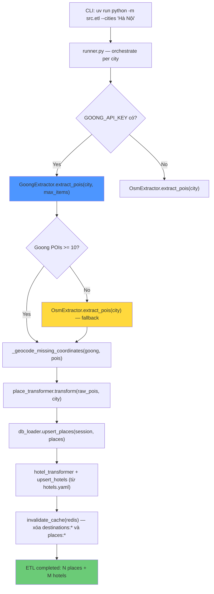

#### Ý nghĩa luồng ETL

- ETL đi theo hướng Goong-first nhưng vẫn có OSM fallback để tránh đứt pipeline khi nguồn chính không đủ dữ liệu.
- Sau khi transform và upsert xong, Redis cache của destinations/places phải bị invalidate để generate dùng dữ liệu mới.
- Chất lượng `C.1 Generate` phụ thuộc trực tiếp vào luồng này, nhưng `C3A` không cần thay đổi ETL để bắt đầu session foundation.
- Các API như `Direction` hay `DistanceMatrix` vẫn là tiềm năng cho giai đoạn companion nâng cao sau này, chưa phải scope runtime hiện tại.

### 13.2 Goong API Endpoints đang dùng

ETL dùng **3 Goong REST API endpoints** từ `https://rsapi.goong.io`:

| Endpoint | Method | Mục đích trong ETL | Params chính |
|---|---|---|---|
| `/Place/AutoComplete` | GET | Tìm POIs theo keyword + category cho từng city | `input`, `location`, `limit`, `radius` |
| `/Place/Detail` | GET | Lấy chi tiết place (tên, địa chỉ, tọa độ) từ `place_id` | `place_id`, `sessiontoken` |
| `/Geocode` | GET | Forward geocoding — điền tọa độ cho POIs thiếu lat/lng | `address` |

**Goong API còn có nhưng ETL chưa dùng:**

| Endpoint | Mô tả | Tiềm năng |
|---|---|---|
| `/Geocode` (reverse) | Tọa độ → địa chỉ | Có thể dùng để enrich address từ lat/lng |
| `/Direction` | Tính đường đi giữa 2 điểm | C.3 Companion Chat — `calculate_route` tool |
| `/DistanceMatrix` | Ma trận khoảng cách nhiều điểm | Tối ưu thứ tự hoạt động trong ngày |
| `/StaticMap` | Tạo ảnh bản đồ tĩnh | Thumbnail cho trip/activity |

### 13.3 Chạy ETL

```bash
cd Backend

# Cần GOONG_API_KEY trong .env
uv run python -m src.etl

# Một thành phố
uv run python -m src.etl --cities "Hà Nội"

# Nhiều thành phố
uv run python -m src.etl --cities "Hà Nội" "Đà Nẵng" "Hội An"

# Dry-run (không ghi DB)
uv run python -m src.etl --cities "Hà Nội" --dry-run

# Chỉ load hotels từ YAML
uv run python -m src.etl --hotels-only

# Hoặc với Docker
docker compose exec api uv run python -m src.etl --cities "Hà Nội"
```

### 13.4 Kiểm tra sau ETL

```bash
# Kiểm tra destinations
curl http://localhost:8000/api/v1/places/destinations

# Kiểm tra places (cần encode UTF-8)
curl "http://localhost:8000/api/v1/places/search?city=H%C3%A0%20N%E1%BB%99i&limit=10"

# Xóa Redis cache để load fresh data
docker compose exec redis redis-cli FLUSHDB
```

### 13.5 Lưu ý quan trọng

- ETL là **idempotent** — chạy nhiều lần không tạo duplicate (upsert theo `external_id`, fallback `(name, destination_id)`)
- `GOONG_API_KEY` là **bắt buộc** để có data chất lượng. Không có key → OSM fallback → data ít và thiếu tọa độ
- AI generate cần **tối thiểu 6 places/destination** — nếu thiếu sẽ trả 422 trước khi gọi Gemini
- Destination string trong generate request được resolve qua **slug matching** — `"Ha Noi"` (không dấu) → slug `ha-noi` → match DB
- Sau ETL, Redis cache bị invalidate tự động — request tiếp theo sẽ load fresh data từ DB

```bash
cd Backend

# Cần GOONG_API_KEY trong .env
uv run python -m src.etl

# Hoặc với Docker
docker compose exec api python -m src.etl
```

---

## 15. Cấu trúc thư mục

```
NT208-ai-travel-itinerary-recommendation-system/
├── Backend/
│   ├── src/
│   │   ├── main.py                    # App factory, middleware, router registration
│   │   ├── auth/                      # Auth + user domain
│   │   ├── itineraries/               # Trip CRUD, generate, share/claim, chat schema
│   │   ├── places/                    # Destinations, places, hotels, saved places
│   │   ├── agent/                     # Shared AI infrastructure only
│   │   ├── core/                      # Config, db, security, exceptions, rate-limit
│   │   ├── etl/                       # Goong Maps ETL pipeline
│   │   ├── geo/                       # Goong REST client
│   │   └── shared/                    # Truly shared base helpers
│   ├── tests/
│   │   ├── unit/                      # 126 unit tests
│   │   └── integration/               # 51 integration tests
│   ├── alembic/                       # DB migrations
│   │   └── versions/
│   ├── config.yaml                    # Non-secret config
│   ├── .env.example                   # Secret config template
│   ├── pyproject.toml                 # uv dependencies + Ruff config
│   └── Dockerfile
│
├── Frontend/
│   ├── src/
│   │   ├── app/
│   │   │   ├── App.tsx                # Root component
│   │   │   ├── routes.tsx             # Route definitions
│   │   │   ├── components/            # 40+ shared components
│   │   │   ├── contexts/              # AuthContext, TripWizardContext
│   │   │   ├── data/                  # Static/mock fallback data
│   │   │   ├── hooks/                 # useTripSync, useActivityManager, ...
│   │   │   ├── pages/                 # 27 page components
│   │   │   ├── services/              # API client layer (api.ts + 4 modules)
│   │   │   ├── types/                 # trip.types.ts (FE-BE contract)
│   │   │   └── utils/
│   │   └── styles/
│   ├── tests/e2e/                     # 36 Playwright tests / 17 spec files (latest full suite: 33 passed, 3 skipped)
│   ├── playwright.config.ts
│   ├── package.json
│   └── vite.config.ts
│
├── docs/                              # Architecture & context docs
│   ├── 02_architecture.md
│   ├── 03_backend.md
│   ├── 04_frontend.md
│   └── REPORTS/
│
├── .claude/                           # Claude AI context & skills
│   ├── context/                       # Project context files
│   └── skills/                        # Code review, db-migration, debug skills
│
├── docker-compose.yml
├── CLAUDE.md                          # AI agent instructions
├── AGENTS.md                          # Agent coordination guide
└── README.md
```

---

## 16. Team

**NT208 — Web Programming · UIT 2023.2**

| Thành viên | MSSV | Vai trò | Đóng góp |
|---|---|---|---|
| Bùi Nhật Anh Khôi | — | Leader, Backend, AI | 25% |
| Dương Đăng Chính | — | Frontend | 25% |
| Lê Văn Chí | — | Backend | 25% |
| Nguyễn Hữu Chiến | — | Backend | 25% |

## 17. Video / Demo / Public Links

Tất cả các đường dẫn dưới đây phải truy cập được công khai tại thời điểm nộp bài:

- Full source code: `<điền link GitHub public của project>`
- Video demo tính năng mới nhất hoặc full demo tính năng: `<điền link video public, tối đa 5 phút/video>`
- Video khảo sát user: `<điền link nếu có>`
- Ảnh chụp minh chứng cộng điểm / tài nguyên bổ sung: `<điền link nếu có>`
- Report hoặc slide bổ sung: `<điền link nếu có>`

---

Chúng em đã biết làm web và hiểu hệ thống web hoạt động như thế nào.
