# 🗺️ DuLichViet — AI Travel Itinerary Recommendation System

<div align="center">


**NT208 · Web Programming Project · UIT 2023.2**

</div>

---

## 📖 Mô tả

**DuLichViet** là hệ thống gợi ý và lập kế hoạch chuyến đi thông minh dành riêng cho du lịch Việt Nam. Người dùng chỉ cần mô tả điểm đến, ngân sách và sở thích — hệ thống AI sẽ tự động sinh ra lịch trình chi tiết theo từng ngày, bao gồm các hoạt động, địa điểm ăn uống, tham quan và chỗ ở phù hợp.

Lịch trình được tạo ra dựa trên dữ liệu địa điểm thực tế từ Goong Maps API, sau đó được Gemini AI sắp xếp thành hành trình hợp lý. Người dùng có thể chỉnh sửa thủ công, chia sẻ qua link công khai, hoặc đánh giá sau chuyến đi. Khách vãng lai (guest) có thể tạo lịch trình ngay mà không cần đăng ký, và claim về tài khoản sau khi đăng nhập.

**Điểm nổi bật:**
- 🤖 AI sinh lịch trình từ DB recommendation context — không hallucinate địa điểm
- 🔒 Bảo mật token: refresh rotation, share/claim token hash SHA-256, không lưu raw token
- ⚡ Optimistic update trên FE — UI phản hồi ngay, revert nếu API fail
- 🗄️ Redis cache cho places/destinations, fail-open khi Redis down
- 📊 Rate limit AI fail-closed — Redis down thì block, không cho bypass

---

## 📋 Mục lục

1. [Tính năng chính](#1-tính-năng-chính)
2. [Tech Stack](#2-tech-stack)
3. [High-Level Architecture](#3-high-level-architecture)
4. [Low-Level Architecture](#4-low-level-architecture)
5. [Database Schema & Quan hệ](#5-database-schema--quan-hệ)
6. [API Reference](#6-api-reference)
7. [User Flow & CRUD Flow](#7-user-flow--crud-flow)
8. [AI Pipeline Flow](#8-ai-pipeline-flow)
9. [Auth & Security Flow](#9-auth--security-flow)
10. [Trạng thái Phase C](#10-trạng-thái-phase-c)
11. [Quick Start](#11-quick-start)
12. [Tests & Verification](#12-tests--verification)
13. [ETL](#13-etl)
14. [Cấu trúc thư mục](#14-cấu-trúc-thư-mục)
15. [Team](#15-team)

---

## 1. Tính năng chính

| Nhóm | Tính năng | Trạng thái |
|---|---|---|
| **Auth** | Đăng ký / đăng nhập / đăng xuất | ✅ Done |
| **Auth** | Refresh token rotation (JWT) | ✅ Done |
| **Auth** | Quên mật khẩu / đặt lại qua email | ✅ Done |
| **Profile** | Xem / cập nhật hồ sơ, đổi mật khẩu | ✅ Done |
| **Trip** | Tạo lịch trình thủ công | ✅ Done |
| **Trip** | Chỉnh sửa ngày / hoạt động / chỗ ở (auto-save) | ✅ Done |
| **Trip** | Xem / xóa / đánh giá lịch trình | ✅ Done |
| **Trip** | Chia sẻ lịch trình qua link công khai | ✅ Done |
| **Trip** | Guest tạo trip → claim sau khi đăng nhập | ✅ Done |
| **Places** | Tìm kiếm địa điểm theo thành phố / danh mục | ✅ Done |
| **Places** | Lưu địa điểm yêu thích | ✅ Done |
| **Places** | Destination data quality advisory — limited-data cities (e.g., Đà Lạt) show non-blocking warning, remain submittable | ✅ Done |
| **AI C.1** | Sinh lịch trình tự động bằng Gemini AI | ✅ Done |
| **AI C.2** | Gợi ý địa điểm thay thế (DB-only, không LLM) | ✅ Done |
| **AI C.3** | Companion chat + patch-confirm flow | 🔄 Todo |
| **AI C.4** | Lịch sử chat | 🔄 Todo |
| **AI C.5** | Analytics Text-to-SQL (optional) | 🔄 Optional |
| **ETL** | Goong-first ETL nạp dữ liệu địa điểm | ✅ Done |

---

## 2. Tech Stack

### Backend

| Thành phần | Công nghệ | Phiên bản |
|---|---|---|
| Framework | FastAPI | 0.115+ |
| Language | Python | 3.12+ |
| Package Manager | uv | 0.4+ |
| ORM | SQLAlchemy (async) | 2.0+ |
| Database | PostgreSQL | 16 |
| Migration | Alembic | 1.14+ |
| Cache | Redis | 7 |
| Auth | JWT (python-jose) + bcrypt | — |
| AI | Google Gemini (google-generativeai) | gemini-2.5-flash |
| HTTP Client | httpx | 0.28+ |
| Email | aiosmtplib | 3.0+ |
| Logging | structlog | 24.4+ |
| Validation | Pydantic v2 | 2.10+ |
| Lint/Format | Ruff | 0.8+ |
| Test | pytest + pytest-asyncio | — |

### Frontend

| Thành phần | Công nghệ | Phiên bản |
|---|---|---|
| Framework | React | 18.3 |
| Language | TypeScript | 5 |
| Build Tool | Vite | 6.4 |
| Styling | TailwindCSS | 4.1 |
| UI Components | MUI + Radix UI | 7.x / latest |
| Icons | Lucide React | 0.487 |
| Routing | React Router | 7.13 |
| Charts | Recharts | 2.15 |
| Drag & Drop | React DnD | 16 |
| Animation | Motion | 12 |
| E2E Testing | Playwright | 1.59+ |

### Infrastructure

| Thành phần | Công nghệ |
|---|---|
| Container | Docker + Docker Compose |
| CI/CD | GitHub Actions (7 required checks) |
| Maps/ETL | Goong Maps API |
| AI Provider | Google AI Studio (Gemini) |

---

## 3. High-Level Architecture

> Sơ đồ dưới mô tả toàn bộ hệ thống từ góc nhìn tổng quan: người dùng tương tác với Frontend React, Frontend gọi REST API đến FastAPI Backend, Backend đọc/ghi PostgreSQL và dùng Redis để cache + rate-limit. ETL pipeline chạy độc lập để nạp dữ liệu địa điểm từ Goong Maps API vào DB. Gemini AI chỉ được gọi khi user yêu cầu sinh lịch trình.

```mermaid
graph TB
    subgraph Browser["👤 User (Browser)"]
        FE["React 18 + Vite 6 + TypeScript<br/>TailwindCSS + MUI + Radix UI<br/>27 pages · 8 protected routes"]
        API_CLIENT["API Client Layer<br/>services/api.ts + auth/itinerary/places/users<br/>JWT Bearer injection · auto-refresh on 401<br/>Optimistic update · revert-on-failure"]
        FE --> API_CLIENT
    end

    API_CLIENT -->|"HTTP REST<br/>JSON camelCase"| BACKEND

    subgraph BACKEND["FastAPI Backend (port 8000)"]
        MW["Middleware Pipeline<br/>CORS → RequestLog → RateLimiter → ErrorHandler"]
        ROUTER["Router Layer /api/v1/<br/>auth(6) · users(3) · itineraries(14) · places(7) · shared(1) · agent(1)"]
        SERVICE["Service Layer<br/>AuthService · UserService · ItineraryService<br/>PlaceService · SuggestionService · ItineraryPipeline"]
        REPO["Repository Layer<br/>UserRepo · TripRepo · PlaceRepo · TokenRepo"]
        MW --> ROUTER --> SERVICE --> REPO
    end

    REPO -->|"async SQLAlchemy"| PG[("PostgreSQL 16<br/>15+ tables<br/>Alembic migrations")]
    SERVICE -->|"Redis cache<br/>rate-limit"| REDIS[("Redis 7<br/>places cache TTL 30min<br/>destinations cache TTL 1h<br/>AI rate-limit keys")]

    SERVICE -->|"Gemini API<br/>structured JSON output"| GEMINI["Google Gemini<br/>gemini-2.5-flash<br/>AI Generate only"]

    subgraph ETL["Goong ETL (CLI runner)"]
        GOONG_API["Goong Maps API<br/>autocomplete · place detail · geocode"]
        TRANSFORM["Transformer<br/>normalize · deduplicate · map category"]
        LOADER["DB Loader<br/>upsert destinations · places · hotels"]
        GOONG_API --> TRANSFORM --> LOADER
    end

    LOADER -->|"upsert"| PG
    LOADER -->|"invalidate cache"| REDIS
```

**Giải thích luồng chính:**
- **FE → BE:** Mọi request đều qua API Client Layer — tự động inject Bearer token, tự refresh khi 401, optimistic update UI trước khi API confirm.
- **BE layers:** Router chỉ parse/route, Service chứa business logic (owner check, rate limit), Repository chỉ query DB.
- **Redis:** Cache places/destinations (fail-open — Redis down thì query DB), rate-limit AI (fail-closed — Redis down thì block).
- **Gemini:** Chỉ được gọi từ `ItineraryPipeline` khi user generate lịch trình, không gọi từ suggestion service.
- **ETL:** Chạy độc lập qua CLI, không phụ thuộc vào app server.

```
┌──────────────────────────────────────────────────────────────────────────┐
│                         👤 USER (Browser)                                │
│                                                                          │
│  ┌──────────────────────────── FRONTEND ──────────────────────────────┐  │
│  │  React 18 + Vite 6 + TypeScript + TailwindCSS + MUI + Radix UI    │  │
│  │                                                                     │  │
│  │  ┌──────────┐ ┌──────────┐ ┌──────────┐ ┌──────────┐             │  │
│  │  │CreateTrip│ │Workspace │ │TripLib   │ │CityList  │  27 pages   │  │
│  │  │(AI Gen)  │ │(Edit+AI) │ │(List)    │ │(Browse)  │             │  │
│  │  └────┬─────┘ └────┬─────┘ └────┬─────┘ └────┬─────┘             │  │
│  │       │ POST/gen    │ PUT/GET     │ GET         │ GET               │  │
│  │  ┌────┴─────────────┴────────────┴─────────────┴───────────────┐  │  │
│  │  │  API Client Layer (services/api.ts + 4 modules)              │  │  │
│  │  │  • JWT Bearer injection + auto-refresh on 401               │  │  │
│  │  │  • Optimistic update + revert-on-failure                    │  │  │
│  │  │  • Mock fallback khi BE không có data                       │  │  │
│  │  └────────────────────────────┬────────────────────────────────┘  │  │
│  └───────────────────────────────┼────────────────────────────────────┘  │
│                                  │ HTTP REST (JSON, camelCase)            │
│                                  ▼                                        │
│  ┌────────────────────── FASTAPI BACKEND ─────────────────────────────┐  │
│  │  Uvicorn (Port 8000)                                              │  │
│  │                                                                    │  │
│  │  ┌──────────────── MIDDLEWARE PIPELINE ──────────────────────┐    │  │
│  │  │  CORS → RequestLog → RateLimiter → ErrorHandler → JWT    │    │  │
│  │  └──────────────────────┬───────────────────────────────────┘    │  │
│  │                          ▼                                        │  │
│  │  ┌──────────────── ROUTER LAYER (api/v1/) ───────────────────┐   │  │
│  │  │  auth.py  │ users.py │ itineraries.py │ places.py │ shared │   │  │
│  │  │  6 EPs    │ 3 EPs    │ 14 EPs          │ 7 EPs     │ 1 EP   │   │  │
│  │  └─────┬──────┴────┬─────┴───────┬─────────┴─────┬────┴───────┘   │  │
│  │        ▼           ▼             ▼               ▼                 │  │
│  │  ┌──────────────── SERVICE LAYER ──────────────────────────────┐   │  │
│  │  │  AuthService │ UserService │ ItineraryService │ PlaceService │   │  │
│  │  │  (JWT+hash)  │ (CRUD)      │ (CRUD+generate)  │ (search)    │   │  │
│  │  │  EmailService│             │                   │             │   │  │
│  │  └──────┬───────┴──────┬──────┴────────┬──────────┴────────────┘   │  │
│  │         ▼              ▼               ▼                           │  │
│  │  ┌──────────────── REPOSITORY LAYER ───────────────────────────┐   │  │
│  │  │  UserRepo │ TripRepo │ PlaceRepo │ TokenRepo               │   │  │
│  │  └──────┬─────┴────┬────┴───────────┬────────────────────────┘   │  │
│  └─────────┼──────────┼────────────────┼─────────────────────────────┘  │
│             ▼          ▼                ▼                               │
│  ┌─────────────── POSTGRESQL ──────────┐  ┌──────── REDIS ──────────┐ │
│  │  users, refresh_tokens              │  │  destinations cache     │ │
│  │  trips, trip_days, activities       │  │  place search cache     │ │
│  │  accommodations, extra_expenses     │  │  rate-limit counter     │ │
│  │  destinations, places, hotels       │  └─────────────────────────┘ │
│  │  saved_places                       │                               │
│  │  share_links, guest_claim_tokens    │                               │
│  │  trip_ratings                       │                               │
│  │  chat_sessions, chat_messages       │                               │
│  │  scraped_sources                    │                               │
│  └─────────────────────────────────────┘                               │
└──────────────────────────────────────────────────────────────────────────┘
```

**Mô tả các thành phần:**

| Thành phần | Vai trò |
|---|---|
| **Frontend** | React SPA — 27 trang, API client layer với JWT auto-refresh, optimistic update |
| **FastAPI Backend** | REST API server, Uvicorn port 8000, middleware pipeline, 34 endpoints |
| **Middleware Pipeline** | CORS → RequestLog → RateLimiter → ErrorHandler — xử lý trước khi vào router |
| **Router Layer** | Parse request, auth dependency injection, gọi service, trả response schema |
| **Service Layer** | Business logic: owner check, token validation, AI pipeline, cache logic |
| **Repository Layer** | SQL queries thuần — không chứa business rules |
| **PostgreSQL** | Primary database — 15+ bảng, integer PK, async SQLAlchemy |
| **Redis** | Cache destinations/places (TTL 30min–1h), rate-limit counter, fail-open cho places |

---

## 4. Low-Level Architecture

> Sơ đồ dưới đi sâu vào cấu trúc nội bộ của Backend (by-domain pattern) và Frontend (component tree + data flow). Mỗi domain BE có đủ router → service → repository → model. FE dùng hook pattern với optimistic update.

### 4.1 Backend — Dependency Injection & Layer Boundary

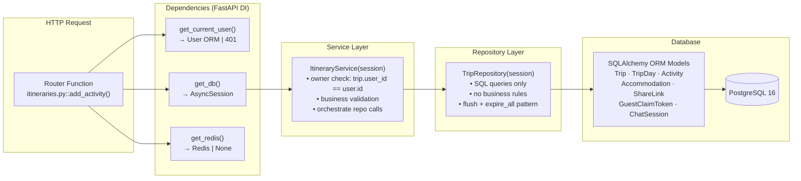

### 4.2 Backend — Domain Structure

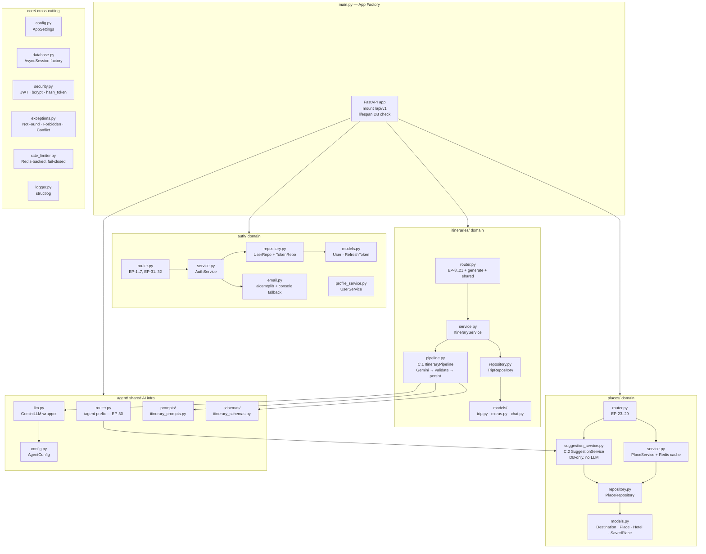

### 4.3 Frontend — Component & Data Flow

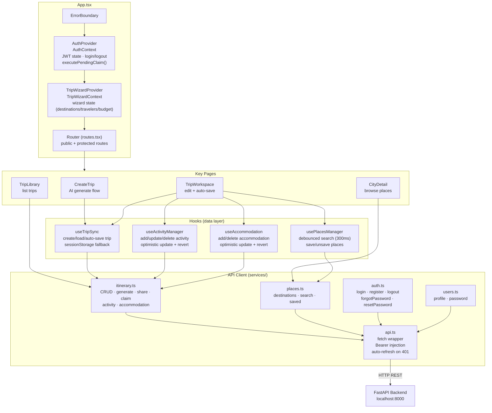

### 4.4 Optimistic Update Pattern (FE)

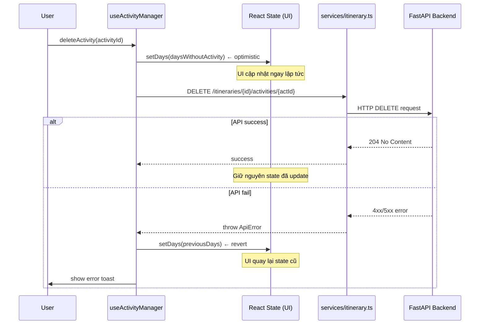

### 4.6 Backend — Cấu trúc file theo domain

```text
Backend/src/
├── api/v1/
│   ├── auth.py          # EP-1..4, EP-31..32 (register, login, refresh, logout, forgot/reset)
│   ├── users.py         # EP-5..7 (profile, update, change password)
│   ├── itineraries.py   # EP-8..21 (trip CRUD, share, claim, activity/accommodation)
│   ├── places.py        # EP-23..29 (destinations, search, detail, saved)
│   └── shared.py        # EP-22 (public share read)
├── core/
│   ├── config.py        # AppSettings (pydantic-settings), get_settings()
│   ├── database.py      # AsyncSession factory, Base, get_db dependency
│   ├── security.py      # JWT, bcrypt, opaque token, hash_token (SHA-256)
│   ├── exceptions.py    # NotFound, Forbidden, Conflict, Unauthorized
│   ├── logger.py        # structlog structured logging
│   └── dependencies.py  # get_current_user, get_current_user_optional, get_redis
├── models/
│   ├── user.py          # User, RefreshToken
│   ├── trip.py          # Trip, TripDay, Activity
│   ├── place.py         # Destination, Place, Hotel, SavedPlace
│   └── extras.py        # ExtraExpense, Accommodation, ShareLink, TripRating,
│                        # GuestClaimToken, ChatSession, ChatMessage, ScrapedSource
├── repositories/
│   ├── base.py          # BaseRepository (common CRUD)
│   ├── user_repo.py     # User + refresh token queries
│   ├── token_repo.py    # RefreshToken rotation/revoke
│   ├── trip_repo.py     # Trip + day + activity + accommodation + share/claim/rating
│   └── place_repo.py    # Destination + place + hotel + saved_place
├── schemas/
│   ├── common.py        # CamelCaseModel, PaginatedResponse
│   ├── auth.py          # LoginRequest, RegisterRequest, AuthResponse, ...
│   ├── user.py          # UserResponse, UpdateProfileRequest, ChangePasswordRequest
│   ├── itinerary.py     # CreateTripRequest, ItineraryResponse, DaySchema, ActivitySchema, ...
│   └── place.py         # DestinationResponse, PlaceResponse, SavedPlaceResponse
├── services/
│   ├── auth_service.py      # Register, login, refresh, logout, forgot/reset password
│   ├── user_service.py      # Profile read/update, change password
│   ├── itinerary_service.py # Trip CRUD, share/claim, rating, activity/accommodation, auto-save diff/sync
│   ├── place_service.py     # Destinations, search, detail, saved places, Redis cache
│   └── email_service.py     # aiosmtplib + console fallback
└── etl/                     # ETL pipeline (Goong Maps → PostgreSQL)
```

### 4.7 Frontend — Component tree

```text
App.tsx
└── ErrorBoundary
    └── AuthProvider (AuthContext)
        └── TripWizardProvider (TripWizardContext)
            └── Router (routes.tsx)
                ├── Public routes
                │   ├── /               → Home
                │   ├── /cities         → CityList
                │   ├── /cities/:cityId → CityDetail
                │   ├── /create-trip    → CreateTrip
                │   ├── /login          → Login
                │   ├── /register       → Register
                │   ├── /forgot-password → ForgotPassword
                │   ├── /reset-password → ResetPassword
                │   ├── /budget-setup   → BudgetSetup (wizard)
                │   ├── /travelers-selection → TravelersSelection (wizard)
                │   ├── /day-allocation → DayAllocation (wizard)
                │   ├── /daily-itinerary → DailyItinerary
                │   └── /shared/:token  → SharedTripView
                │
                ├── Protected routes (cần login → redirect /login)
                │   ├── /trip-library     → TripLibrary
                │   ├── /saved-places     → SavedPlaces
                │   ├── /account          → Account
                │   ├── /trip-history     → TripHistory
                │   ├── /settings         → Settings
                │   ├── /manual-trip-setup → ManualTripSetup
                │   ├── /trip-workspace   → TripWorkspace
                │   ├── /itinerary/:id    → ItineraryView
                │   ├── /profile          → Profile
                │   └── /saved-itineraries → SavedItineraries
                │
                └── * → NotFound (404)
```

### 4.8 Backend Request Flow

```text
HTTP Request
  → CORS Middleware          (allow origins: localhost:5173)
  → RequestLog Middleware    (log method + path + status + duration)
  → RateLimiter Middleware   (per-IP, Redis-backed, AI fail-closed)
  → ErrorHandler Middleware  (404/403/409/401/500 mapping)
  → Router                   (parse request, auth dependency injection)
  → Service                  (business logic, owner check, token validation)
  → Repository               (DB query — SQL only, no business rules)
  → Model / Database         (SQLAlchemy ORM → PostgreSQL async)
  → Response                 (camelCase JSON via CamelCaseModel alias_generator)
```

---

## 5. Database Schema & Quan hệ

> Hệ thống dùng PostgreSQL với 15+ bảng. Tất cả token nhạy cảm (refresh, share, claim, reset) đều lưu dạng SHA-256 hash — không bao giờ lưu raw token. `trips.user_id` nullable để hỗ trợ guest trips.

### 5.1 ERD — Mermaid

```mermaid
erDiagram
    users {
        int id PK
        string email UK
        string hashed_password
        string name
        string phone
        json interests
        bool is_active
        string password_reset_token_hash
        timestamp password_reset_expires_at
        timestamp created_at
        timestamp updated_at
    }

    refresh_tokens {
        int id PK
        int user_id FK
        string token_hash UK
        timestamp expires_at
        bool is_revoked
        timestamp created_at
    }

    trips {
        int id PK
        int user_id FK "nullable=guest"
        string destination
        string trip_name
        date start_date
        date end_date
        int budget
        int total_cost
        int adults_count
        int children_count
        json interests
        string status
        bool ai_generated
        timestamp created_at
        timestamp updated_at
    }

    trip_days {
        int id PK
        int trip_id FK
        int day_number
        string label
        string date
        string destination_name
    }

    activities {
        int id PK
        int trip_day_id FK
        int place_id FK "nullable"
        string name
        string time
        string end_time
        string type
        string location
        string description
        string image
        string transportation
        int adult_price
        int child_price
        int custom_cost
        int bus_ticket_price
        int taxi_cost
        int order_index
    }

    extra_expenses {
        int id PK
        int activity_id FK "nullable"
        int trip_day_id FK "nullable"
        string name
        int amount
        string category
    }

    accommodations {
        int id PK
        int trip_id FK
        int hotel_id FK "nullable"
        string name
        string check_in
        string check_out
        int price_per_night
        int total_price
        string booking_type
        int duration
        json day_ids
    }

    trip_ratings {
        int id PK
        int trip_id FK UK
        int rating
        string feedback
        timestamp created_at
    }

    share_links {
        int id PK
        int trip_id FK UK
        string token_hash UK
        int created_by_user_id FK
        string permission
        timestamp expires_at
        timestamp revoked_at
        timestamp created_at
    }

    guest_claim_tokens {
        int id PK
        int trip_id FK
        string token_hash UK
        timestamp expires_at
        timestamp consumed_at
        timestamp created_at
    }

    destinations {
        int id PK
        string name UK
        string slug UK
        string description
        string image
        float latitude
        float longitude
        bool is_active
        int places_count
        timestamp last_etl_at
    }

    places {
        int id PK
        int destination_id FK
        string name
        string category
        string description
        string location
        float latitude
        float longitude
        int avg_cost
        float rating
        int review_count
        string image
        string external_id
        json raw_metadata
        string source
        timestamp updated_at
    }

    hotels {
        int id PK
        int destination_id FK
        string name
        int price_per_night
        float rating
        int review_count
        string location
        string image
        string amenities
        string description
    }

    saved_places {
        int id PK
        int user_id FK
        int place_id FK
        timestamp created_at
    }

    chat_sessions {
        int id PK
        int trip_id FK
        int user_id FK "nullable"
        string thread_id UK
        string status
        timestamp created_at
        timestamp updated_at
    }

    chat_messages {
        int id PK
        int session_id FK
        string role
        string content
        json proposed_operations
        bool requires_confirmation
        timestamp created_at
    }

    scraped_sources {
        int id PK
        string source_name
        string city
        string url
        timestamp last_crawled
        int items_count
        string status
        string error_message
        timestamp created_at
    }

    users ||--o{ refresh_tokens : "has"
    users ||--o{ trips : "owns (nullable)"
    users ||--o{ saved_places : "saves"
    users ||--o{ chat_sessions : "chats"
    trips ||--o{ trip_days : "has"
    trips ||--o{ accommodations : "has"
    trips ||--o| trip_ratings : "rated"
    trips ||--o| share_links : "shared"
    trips ||--o{ guest_claim_tokens : "claimable"
    trips ||--o{ chat_sessions : "has"
    trip_days ||--o{ activities : "contains"
    trip_days ||--o{ extra_expenses : "has"
    activities ||--o{ extra_expenses : "has"
    activities }o--o| places : "references"
    accommodations }o--o| hotels : "references"
    destinations ||--o{ places : "has"
    destinations ||--o{ hotels : "has"
    places ||--o{ saved_places : "saved by"
    chat_sessions ||--o{ chat_messages : "contains"
```

### 5.2 Quan hệ chính

```
users
  ├── id (PK, integer)
  ├── email (unique)
  ├── hashed_password
  ├── name, phone, interests
  ├── password_reset_token_hash, password_reset_expires_at
  └── is_active, created_at, updated_at

refresh_tokens
  ├── id (PK)
  ├── user_id (FK → users.id)
  ├── token_hash (SHA-256, unique)
  ├── expires_at
  └── is_revoked

trips
  ├── id (PK)
  ├── user_id (FK → users.id, nullable — guest trips)
  ├── destination, trip_name
  ├── start_date, end_date
  ├── budget, total_cost
  ├── adults_count, children_count
  └── interests, created_at, updated_at

trip_days
  ├── id (PK)
  ├── trip_id (FK → trips.id)
  ├── label, date, destination_name
  └── order_index

activities
  ├── id (PK)
  ├── day_id (FK → trip_days.id)
  ├── name, time, end_time, type
  ├── location, description, image
  ├── transportation
  ├── adult_price, child_price, custom_cost
  ├── bus_ticket_price, taxi_cost
  └── order_index

extra_expenses
  ├── id (PK)
  ├── activity_id (FK → activities.id, nullable)
  ├── day_id (FK → trip_days.id, nullable)
  ├── label, amount
  └── created_at

accommodations
  ├── id (PK)
  ├── trip_id (FK → trips.id)
  ├── name, check_in, check_out
  ├── price_per_night, total_price
  ├── booking_type (hourly/nightly/daily)
  ├── duration
  └── day_ids (JSON array)

destinations
  ├── id (PK)
  ├── name, slug (unique)
  ├── description, image
  └── region, province

places
  ├── id (PK)
  ├── destination_id (FK → destinations.id)
  ├── name, category, address
  ├── description, image
  ├── adult_price, child_price
  └── goong_place_id

hotels
  ├── id (PK)
  ├── destination_id (FK → destinations.id)
  ├── name, address, description
  ├── price_per_night, image
  └── goong_place_id

saved_places
  ├── id (PK)
  ├── user_id (FK → users.id)
  ├── place_id (FK → places.id)
  └── created_at

share_links
  ├── id (PK)
  ├── trip_id (FK → trips.id)
  ├── created_by (FK → users.id)
  ├── share_token_hash (SHA-256, unique)
  ├── permission (view)
  ├── expires_at (nullable)
  └── is_revoked

guest_claim_tokens
  ├── id (PK)
  ├── trip_id (FK → trips.id)
  ├── token_hash (SHA-256)
  ├── expires_at
  └── consumed_at (nullable — one-time use)

trip_ratings
  ├── id (PK)
  ├── trip_id (FK → trips.id)
  ├── user_id (FK → users.id)
  ├── rating (1–5)
  └── feedback, created_at
```

### 5.3 Quan hệ chính

| Bảng | Quan hệ |
|---|---|
| `users` → `trips` | 1:N (user có nhiều trips; guest trips có user_id = NULL) |
| `trips` → `trip_days` | 1:N (ordered by order_index) |
| `trip_days` → `activities` | 1:N (ordered by order_index) |
| `activities` → `extra_expenses` | 1:N |
| `trips` → `accommodations` | 1:N |
| `trips` → `share_links` | 1:N |
| `trips` → `guest_claim_tokens` | 1:N |
| `destinations` → `places` | 1:N |
| `destinations` → `hotels` | 1:N |
| `users` → `saved_places` | 1:N |

### 5.4 Token Security Pattern

```
┌─────────────────────────────────────────────────────┐
│              TOKEN SECURITY PATTERN                  │
│                                                      │
│  Raw token (chỉ client giữ)                         │
│    → SHA-256 hash → lưu DB                          │
│                                                      │
│  Áp dụng cho:                                        │
│  • refresh_tokens.token_hash                         │
│  • share_links.share_token_hash                      │
│  • guest_claim_tokens.token_hash                     │
│  • users.password_reset_token_hash                   │
│                                                      │
│  Khi verify: hash(raw_input) → lookup DB            │
│  → Không bao giờ lưu raw token trong DB             │
│  → Không thể recover raw token từ DB                │
└─────────────────────────────────────────────────────┘
```

---

## 6. API Reference

**Base URL:** `http://localhost:8000/api/v1`

### Auth (6 endpoints)

| Method | Path | Auth | Mô tả |
|---|---|---|---|
| POST | `/auth/register` | Public | Đăng ký → trả JWT pair |
| POST | `/auth/login` | Public | Đăng nhập → trả JWT pair |
| POST | `/auth/refresh` | Public | Refresh token rotation |
| POST | `/auth/logout` | Bearer | Revoke refresh token |
| POST | `/auth/forgot-password` | Public | Gửi reset link qua email (silent nếu email không tồn tại) |
| POST | `/auth/reset-password` | Public | Đặt lại mật khẩu bằng token |

### Users (3 endpoints)

| Method | Path | Auth | Mô tả |
|---|---|---|---|
| GET | `/users/profile` | Bearer | Lấy thông tin hồ sơ |
| PUT | `/users/profile` | Bearer | Cập nhật name, phone, interests |
| PUT | `/users/password` | Bearer | Đổi mật khẩu (verify current password) |

### Itineraries (14 endpoints)

| Method | Path | Auth | Mô tả |
|---|---|---|---|
| POST | `/itineraries/generate` | Optional | AI sinh lịch trình tự động (Gemini) |
| POST | `/itineraries` | Optional | Tạo lịch trình thủ công |
| GET | `/itineraries` | Bearer | Danh sách lịch trình (paginated) |
| GET | `/itineraries/{tripId}` | Bearer | Chi tiết lịch trình |
| PUT | `/itineraries/{tripId}` | Bearer | Cập nhật / auto-save (diff/sync) |
| DELETE | `/itineraries/{tripId}` | Bearer | Xóa lịch trình |
| PUT | `/itineraries/{tripId}/rating` | Bearer | Đánh giá sau chuyến đi |
| POST | `/itineraries/{tripId}/share` | Bearer | Tạo share link |
| POST | `/itineraries/{tripId}/claim` | Bearer | Guest claim trip về tài khoản |
| POST | `/itineraries/{tripId}/activities` | Bearer | Thêm activity vào ngày |
| PUT | `/itineraries/{tripId}/activities/{actId}` | Bearer | Cập nhật activity |
| DELETE | `/itineraries/{tripId}/activities/{actId}` | Bearer | Xóa activity |
| POST | `/itineraries/{tripId}/accommodations` | Bearer | Thêm chỗ ở |
| DELETE | `/itineraries/{tripId}/accommodations/{accId}` | Bearer | Xóa chỗ ở |

### Shared (1 endpoint)

| Method | Path | Auth | Mô tả |
|---|---|---|---|
| GET | `/shared/{shareToken}` | Public | Xem lịch trình được chia sẻ (read-only) |

### Places (7 endpoints)

| Method | Path | Auth | Mô tả |
|---|---|---|---|
| GET | `/places/destinations` | Public | Danh sách tất cả điểm đến (Redis cache 1h) |
| GET | `/places/destinations/{name}` | Public | Chi tiết điểm đến + places + hotels |
| GET | `/places/search` | Public | Tìm kiếm địa điểm (query, city, category, limit) — Redis cache 30min |
| GET | `/places/{placeId}` | Public | Chi tiết một địa điểm |
| GET | `/places/saved/list` | Bearer | Danh sách địa điểm đã lưu |
| POST | `/places/saved` | Bearer | Lưu địa điểm yêu thích |
| DELETE | `/places/saved/{savedId}` | Bearer | Bỏ lưu địa điểm |

### AI / Agent (1 endpoint — C.2 done)

| Method | Path | Auth | Mô tả |
|---|---|---|---|
| GET | `/agent/suggest/{activityId}` | Bearer | Gợi ý địa điểm thay thế (DB-only, không LLM) |

---

## 7. User Flow & CRUD Flow

### 7.1 User Registration & Login Flow

```
[Register]
User điền form → POST /auth/register → BE hash password (bcrypt)
  → tạo JWT pair (access 30min + refresh 7d)
  → hash refresh token → lưu DB
  → FE lưu tokens vào localStorage
  → executePendingClaim() (nếu có guest trips chờ claim)
  → redirect "/"

[Login]
User điền form → POST /auth/login → BE verify bcrypt
  → tạo JWT pair → FE lưu tokens vào localStorage
  → GET /users/profile → load user state
  → executePendingClaim()
  → redirect "/" (hoặc trang đang cố truy cập)

[Token Refresh]
API call → 401 Unauthorized
  → FE đọc refreshToken từ localStorage
  → POST /auth/refresh {refreshToken}
  → BE hash(raw) → lookup DB → verify !revoked
  → revoke token cũ (rotation) → tạo JWT pair mới
  → FE update localStorage (access + refresh mới)
  → retry original request với accessToken mới
  → Nếu refresh fail → xóa tokens → redirect /login
```

### 7.2 Trip CRUD Flow

```
[Tạo lịch trình thủ công]
User → POST /itineraries {destination, tripName, dates, budget, ...}
  → BE check trip limit (max 5 active trips nếu đã login)
  → create Trip (user_id = user.id hoặc NULL nếu guest)
  → Nếu guest: tạo claimToken (raw + hash, expires 24h)
  → Return ItineraryResponse (+ claimToken nếu guest)
  → FE lưu claimToken vào localStorage (pendingClaims)

[Chỉnh sửa — Auto-save]
User thay đổi → FE optimistic update (UI cập nhật ngay lập tức)
  → PUT /itineraries/{id} (debounce 500ms, gửi full trip state)
  → BE diff/sync days + activities + accommodations
  → Success: giữ nguyên UI | Fail: revert UI về state trước
  → Hiển thị error toast nếu fail

[Thêm Activity]
POST /itineraries/{id}/activities?day_id={dayId} {ActivitySchema}
  → BE owner check (trip.user_id == user.id)
  → add activity → flush → return ActivitySchema

[Cập nhật Activity]
PUT /itineraries/{id}/activities/{actId} {ActivitySchema}
  → BE owner check → update scalar fields → return ActivitySchema

[Xóa Activity]
DELETE /itineraries/{id}/activities/{actId}
  → BE owner check → delete → 204 No Content

[Accommodation CRUD]
POST /itineraries/{id}/accommodations {AccommodationSchema}
  → BE owner check → persist → return AccommodationSchema

DELETE /itineraries/{id}/accommodations/{accId}
  → BE owner check → delete → 204 No Content
```

### 7.3 Places Flow

```
[Tìm kiếm địa điểm]
User nhập query → GET /places/search?query=...&city=...&category=...
  → BE check Redis cache (key: "places:search:{query}:{city}:{category}:{limit}")
  → HIT: return cached JSON (TTL 30min)
  → MISS: query PostgreSQL → cache 30min → return list[PlaceResponse]
  → Redis down: fail-open → query DB trực tiếp (không cache)

[Lưu địa điểm yêu thích]
POST /places/saved {placeId}
  → BE check duplicate (user đã lưu chưa)
  → save → return SavedPlaceResponse

DELETE /places/saved/{savedId}
  → BE owner check → delete → 204 No Content
```

### 7.4 Share & Claim Flow

```
[Share Trip]
Owner → POST /itineraries/{id}/share
  → BE tạo opaque shareToken (random bytes)
  → hash SHA-256 → lưu share_links.share_token_hash
  → trả raw shareToken cho FE
  → FE hiển thị link: /shared/{rawToken}

Người khác mở link:
  → GET /shared/{rawToken}
  → BE hash(rawToken) → lookup share_links
  → Không tìm thấy / revoked → 404
  → Tìm thấy → return ItineraryResponse (read-only, không cần auth)

[Guest Claim Flow]
Guest tạo trip → nhận claimToken trong response
  → FE lưu {tripId, claimToken} vào localStorage (pendingClaims)

Guest đăng nhập / đăng ký:
  → AuthContext.executePendingClaim()
  → POST /itineraries/{tripId}/claim {claimToken: "raw_token"}
  → BE hash(claimToken) → tìm guest_claim_tokens
  → Verify: !consumed_at + expires_at > now()
  → trip.user_id = current_user.id (transfer ownership)
  → consumed_at = now() (one-time use — chống replay)
  → FE xóa pending claim khỏi localStorage
```

---

## 8. AI Pipeline Flow

> Toàn bộ AI trong hệ thống đi qua 2 luồng chính: **C.1 Generate** (sinh lịch trình từ đầu bằng Gemini) và **C.2 Suggest** (gợi ý thay thế từ DB, không LLM). C.3 Companion Chat chưa implement.

### 8.1 C.1 — Generate Itinerary (Mermaid)

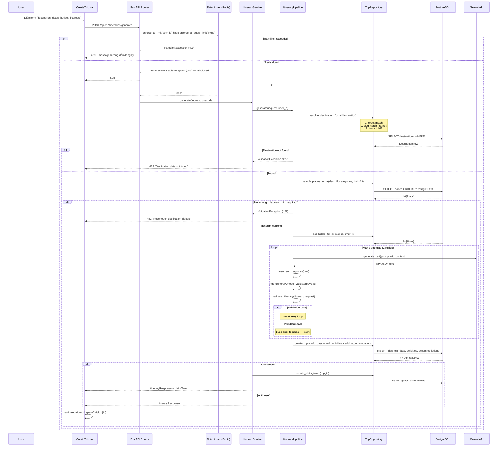

### 8.2 C.2 — Suggestion Service (Mermaid)

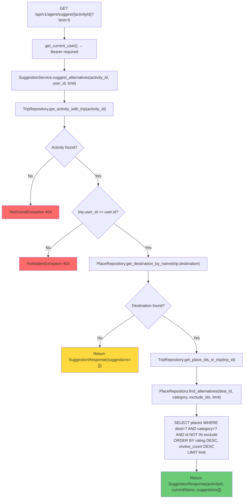

### 8.3 C.1 — Generate Pipeline Text Flow

```
FE (CreateTrip.tsx)
  → POST /api/v1/itineraries/generate
    { destination, startDate, endDate, budget, adults, children, interests }

ItineraryService.generate()
  1. Validate request (dates hợp lệ, budget > 0)
  2. ItineraryPipeline.generate(request)
     ├── Resolve destination → query DB lấy places/hotels làm recommendation context
     ├── Build prompt với context (không hallucinate — chỉ dùng data từ DB)
     ├── Gemini LLM structured output (JSON schema)
     ├── Pydantic validation (tối đa 3 attempts, 2 retries nếu parse fail)
     └── Return validated DaySchema[] + AccommodationSchema[]
  3. Save trip + days + activities + accommodations vào DB
  4. Return ItineraryResponse (camelCase)

FE navigate → /trip-workspace?tripId={id}

KEY: Generate KHÔNG qua Supervisor — gọi direct ItineraryPipeline.
     Mặc định 5 hoạt động/ngày (cấu hình qua AGENT_MIN/MAX_ACTIVITIES_PER_DAY).
```

### 8.4 C.2 — Suggestion Service (DB-Only)

```
GET /api/v1/agent/suggest/{activityId}
  → Owner check (trip.user_id == user.id)
  → SuggestionService.find_alternatives(activity_id, limit)
     ├── Lấy activity hiện tại → xác định category + destination
     ├── Query places cùng category + destination từ DB
     ├── Loại trừ places đã có trong trip
     └── Return list[PlaceResponse] (không gọi LLM)

WHY DB-only: Gợi ý địa điểm chỉ cần filter + sort data có sẵn.
             Không cần "sáng tạo" nội dung mới.
```

### 8.5 C.3 — Companion Chat + Patch-Confirm (Todo)

```
FE (FloatingAIChat.tsx)
  → POST /api/v1/agent/chat { message, tripId }

CompanionService.chat()
  1. Classify intent (modify / info / suggest / general)
  2. Load trip context (OWNER-CHECK bắt buộc)
  3. Call Gemini LLM với tool definitions
  4. Return:
     {
       message: "Tôi đề xuất thêm Văn Miếu vào ngày 2...",
       requiresConfirmation: true,
       proposedOperations: [
         { type: "add_activity", description: "...",
           target: { dayId: 2, activity: {...} } }
       ]
     }

FE hiển thị proposed changes + confirm button
  → User confirm
  → POST /api/v1/agent/apply-patch { operations }
  → BE validate + apply to DB

KEY: Chat KHÔNG TỰ PERSIST DB trước khi user confirm.
     Mỗi operation có audit-friendly type + description.
```

```
FE (CreateTrip.tsx)
  → POST /api/v1/itineraries/generate
    { destination, startDate, endDate, budget, adults, children, interests }

ItineraryService.generate()
  1. Validate request (dates hợp lệ, budget > 0)
  2. ItineraryPipeline.generate(request)
     ├── Resolve destination → query DB lấy places/hotels làm recommendation context
     ├── Build prompt với context (không hallucinate — chỉ dùng data từ DB)
     ├── Gemini LLM structured output (JSON schema)
     ├── Pydantic validation (tối đa 3 attempts, 2 retries nếu parse fail)
     └── Return validated DaySchema[] + AccommodationSchema[]
  3. Save trip + days + activities + accommodations vào DB
  4. Return ItineraryResponse (camelCase)

FE navigate → /trip-workspace?tripId={id}

KEY: Generate KHÔNG qua Supervisor — gọi direct ItineraryPipeline.
     Mặc định 5 hoạt động/ngày (cấu hình qua AGENT_MIN/MAX_ACTIVITIES_PER_DAY).
```

### C.2 — Suggestion Service (DB-Only)

```
GET /api/v1/agent/suggest/{activityId}
  → Owner check (trip.user_id == user.id)
  → SuggestionService.find_alternatives(activity_id, limit)
     ├── Lấy activity hiện tại → xác định category + destination
     ├── Query places cùng category + destination từ DB
     ├── Loại trừ places đã có trong trip
     └── Return list[PlaceResponse] (không gọi LLM)

WHY DB-only: Gợi ý địa điểm chỉ cần filter + sort data có sẵn.
             Không cần "sáng tạo" nội dung mới.
```

### C.3 — Companion Chat + Patch-Confirm (Todo)

```
FE (FloatingAIChat.tsx)
  → POST /api/v1/agent/chat { message, tripId }

CompanionService.chat()
  1. Classify intent (modify / info / suggest / general)
  2. Load trip context (OWNER-CHECK bắt buộc)
  3. Call Gemini LLM với tool definitions
  4. Return:
     {
       message: "Tôi đề xuất thêm Văn Miếu vào ngày 2...",
       requiresConfirmation: true,
       proposedOperations: [
         { type: "add_activity", description: "...",
           target: { dayId: 2, activity: {...} } }
       ]
     }

FE hiển thị proposed changes + confirm button
  → User confirm
  → POST /api/v1/agent/apply-patch { operations }
  → BE validate + apply to DB

KEY: Chat KHÔNG TỰ PERSIST DB trước khi user confirm.
     Mỗi operation có audit-friendly type + description.
```

---

## 9. Auth & Security Flow

> Hệ thống dùng JWT access token (ngắn hạn) + opaque refresh token (dài hạn, lưu hash). Tất cả token nhạy cảm đều hash SHA-256 trước khi lưu DB. Guest trips dùng claimToken one-time để transfer ownership.

### 9.1 Register & Login Flow (Mermaid)

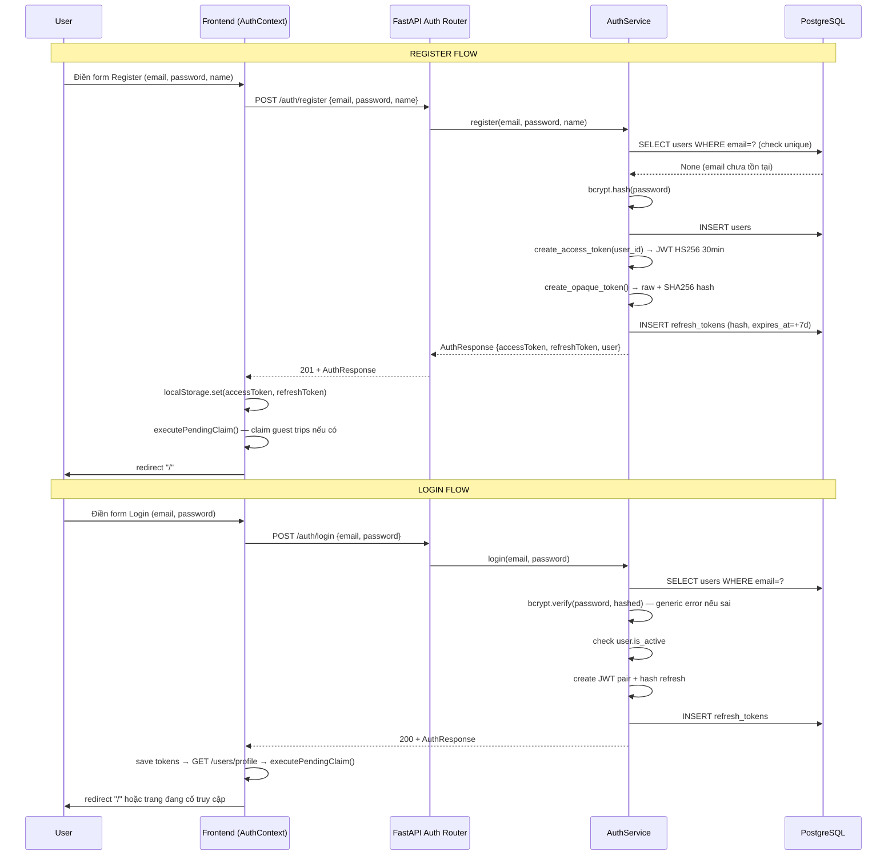

### 9.2 Token Refresh Flow (Mermaid)

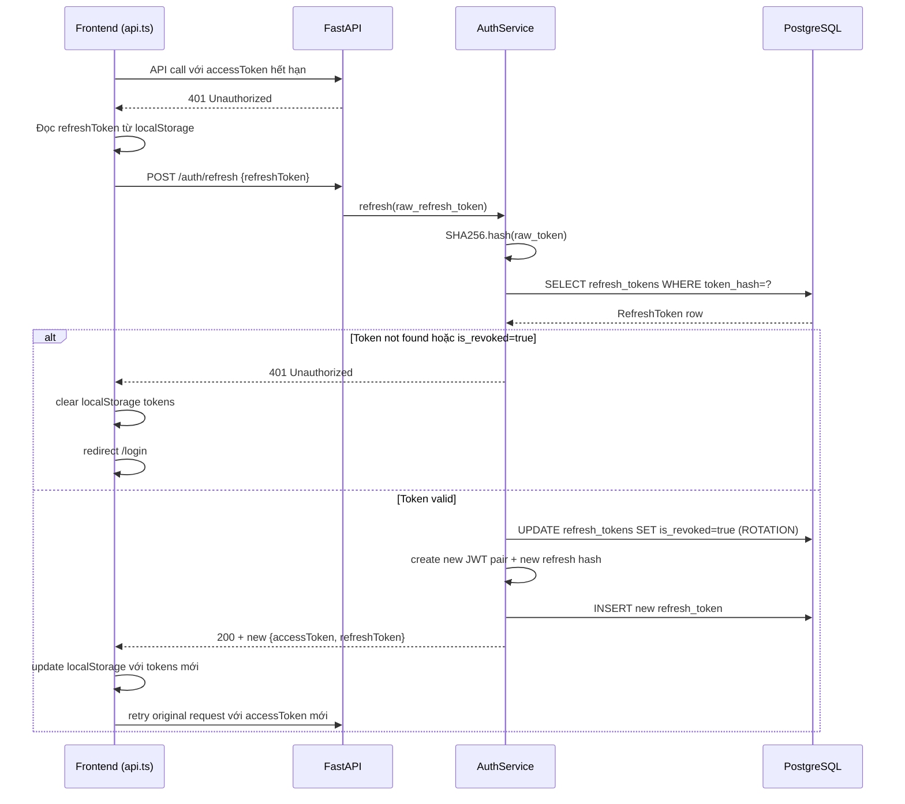

### 9.3 Guest Claim Flow (Mermaid)

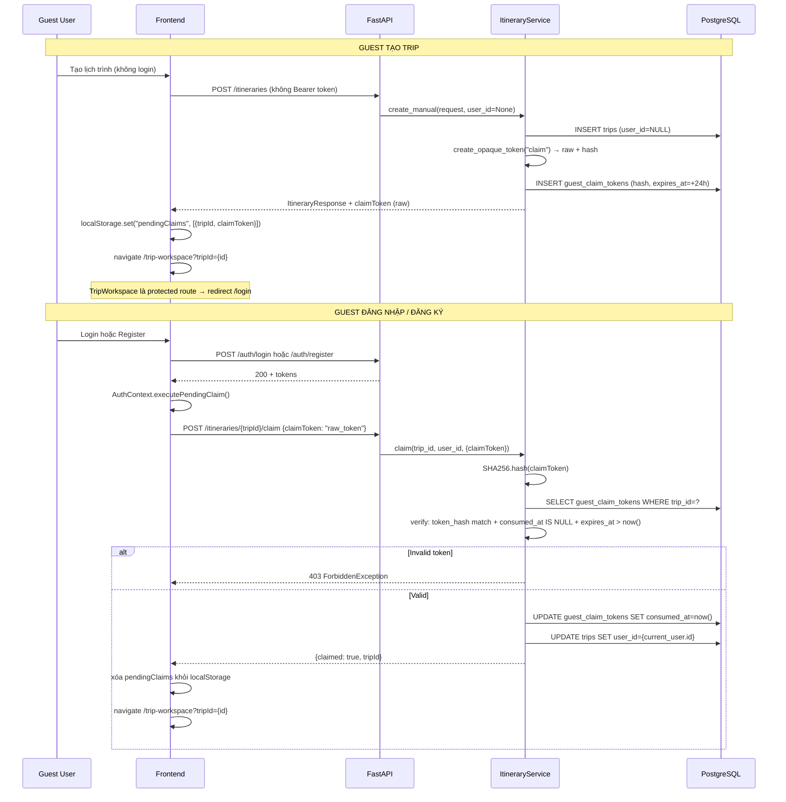

### 9.4 JWT Token Architecture

```
┌─────────────────────────────────────────────────────┐
│              JWT ACCESS TOKEN                        │
│  • HS256 signed, expires 30 phút                    │
│  • Payload: { user_id, exp }                        │
│  • Gửi qua Authorization: Bearer {token}            │
│  • KHÔNG lưu trong DB                               │
└─────────────────────────────────────────────────────┘

┌─────────────────────────────────────────────────────┐
│              REFRESH TOKEN                           │
│  • Opaque random bytes (raw chỉ client giữ)         │
│  • SHA-256 hash lưu refresh_tokens.token_hash       │
│  • Expires 7 ngày                                   │
│  • Rotation: mỗi refresh = revoke cũ + issue mới   │
│  • Force re-login khi đổi password (revoke all)     │
└─────────────────────────────────────────────────────┘
```

### 9.5 Register Flow

```
User điền form Register
  → POST /api/v1/auth/register {email, password, name}
  → BE validate (email unique, password ≥ 6 chars)
  → bcrypt hash password
  → create User + create JWT pair
  → hash refresh token → lưu refresh_tokens
  → Return {accessToken, refreshToken, user}
  → FE lưu tokens localStorage → executePendingClaim() → redirect "/"
```

### 9.6 Login Flow

```
User điền form Login
  → POST /api/v1/auth/login {email, password}
  → BE get_by_email → verify bcrypt (generic error message — chống enumeration)
  → check user.is_active
  → tạo JWT pair → hash refresh → lưu DB
  → Return {accessToken, refreshToken, user}
  → FE lưu tokens → GET /users/profile → executePendingClaim() → redirect
```

### 9.7 Token Refresh Flow

```
API call → 401 Unauthorized
  → FE POST /auth/refresh {refreshToken}
  → BE hash(raw) → lookup refresh_tokens
  → Không tìm thấy / is_revoked → 401
  → revoke(stored.id) → tạo JWT pair mới
  → FE update localStorage → retry original request
  → Nếu refresh fail → clear tokens → redirect /login
```

### 9.8 Forgot / Reset Password Flow

```
POST /auth/forgot-password {email}
  → BE lookup email → SILENT nếu không tồn tại (chống enumeration)
  → create_password_reset_token() → raw + hash + expires 1h
  → lưu hash vào users.password_reset_token_hash
  → EmailService: SMTP configured → gửi email | No SMTP → log console
  → Return 200 (luôn luôn, không tiết lộ email có tồn tại không)

POST /auth/reset-password {token, newPassword}
  → BE hash(token) → lookup user
  → check expires_at > now()
  → bcrypt hash newPassword → update user
  → clear reset token fields
  → token_repo.revoke_all_for_user() → FORCE RE-LOGIN mọi thiết bị
```

### 9.9 Security Rules Summary

```
┌─────────────────────────────────────────────────────┐
│              JWT ACCESS TOKEN                        │
│  • HS256 signed, expires 30 phút                    │
│  • Payload: { user_id, exp }                        │
│  • Gửi qua Authorization: Bearer {token}            │
│  • KHÔNG lưu trong DB                               │
└─────────────────────────────────────────────────────┘

┌─────────────────────────────────────────────────────┐
│              REFRESH TOKEN                           │
│  • Opaque random bytes (raw chỉ client giữ)         │
│  • SHA-256 hash lưu refresh_tokens.token_hash       │
│  • Expires 7 ngày                                   │
│  • Rotation: mỗi refresh = revoke cũ + issue mới   │
│  • Force re-login khi đổi password (revoke all)     │
└─────────────────────────────────────────────────────┘
```

### Register Flow

```
User điền form Register
  → POST /api/v1/auth/register {email, password, name}
  → BE validate (email unique, password ≥ 6 chars)
  → bcrypt hash password
  → create User + create JWT pair
  → hash refresh token → lưu refresh_tokens
  → Return {accessToken, refreshToken, user}
  → FE lưu tokens localStorage → executePendingClaim() → redirect "/"
```

### Login Flow

```
User điền form Login
  → POST /api/v1/auth/login {email, password}
  → BE get_by_email → verify bcrypt (generic error message — chống enumeration)
  → check user.is_active
  → tạo JWT pair → hash refresh → lưu DB
  → Return {accessToken, refreshToken, user}
  → FE lưu tokens → GET /users/profile → executePendingClaim() → redirect
```

### Token Refresh Flow

```
API call → 401 Unauthorized
  → FE POST /auth/refresh {refreshToken}
  → BE hash(raw) → lookup refresh_tokens
  → Không tìm thấy / is_revoked → 401
  → revoke(stored.id) → tạo JWT pair mới
  → FE update localStorage → retry original request
  → Nếu refresh fail → clear tokens → redirect /login
```

### Forgot / Reset Password Flow

```
POST /auth/forgot-password {email}
  → BE lookup email → SILENT nếu không tồn tại (chống enumeration)
  → create_password_reset_token() → raw + hash + expires 1h
  → lưu hash vào users.password_reset_token_hash
  → EmailService: SMTP configured → gửi email | No SMTP → log console
  → Return 200 (luôn luôn, không tiết lộ email có tồn tại không)

POST /auth/reset-password {token, newPassword}
  → BE hash(token) → lookup user
  → check expires_at > now()
  → bcrypt hash newPassword → update user
  → clear reset token fields
  → token_repo.revoke_all_for_user() → FORCE RE-LOGIN mọi thiết bị
```

### 9.9 Security Rules Summary

| Rule | Chi tiết |
|---|---|
| Raw token không lưu DB | SHA-256 hash cho refresh, share, claim, reset tokens |
| Token rotation | Mỗi refresh = revoke cũ + issue mới |
| Owner-only access | `trip.user_id == user.id` check trên mọi write endpoint |
| Share token opaque | Không đoán được từ trip ID |
| Claim token one-time | `consumed_at` + `expires_at` + hash — chống replay |
| Password reset silent | Không tiết lộ email có tồn tại hay không |
| Force re-login on reset | Revoke tất cả refresh tokens khi đổi password |
| AI rate limit fail-closed | Redis down → block AI requests (không bypass) |
| Places cache fail-open | Redis down → query DB trực tiếp (app vẫn chạy) |

---

## 10. Trạng thái Phase C

| Phase | Tính năng | Branch | Trạng thái |
|---|---|---|---|
| **C.1** | AI Generate Itinerary (Gemini direct pipeline) | `feat/00046` | ✅ merged |
| **C.2** | Suggestion Service (DB-only, EP-30) | `feat/00047` | ✅ merged |
| **C.3** | Companion Chat + patch-confirm flow | `feat/00048` | 🔄 Todo |
| **C.4** | Chat history API | `feat/00049` | 🔄 Todo |
| **C.5** | Analytics Text-to-SQL (optional) | `feat/00050` | 🔄 Optional |

### File map Phase C

| File Backend | Mục đích | Layer | Trạng thái |
|---|---|---|---|
| `src/itineraries/pipeline.py` | LLM orchestration cho generate | Service | ✅ C.1 |
| `src/agent/config.py` | AI config facade | Shared AI infra | ✅ C.1 |
| `src/agent/llm.py` | Gemini client wrapper + JSON parsing | Shared AI infra | ✅ C.1 |
| `src/agent/prompts/itinerary_prompts.py` | Generate prompt builder | Shared AI infra | ✅ C.1 |
| `src/agent/schemas/itinerary_schemas.py` | LLM output schema | Shared AI infra | ✅ C.1 |
| `src/places/suggestion_service.py` | Gợi ý DB-only (không LLM) | Service | ✅ C.2 |
| `src/itineraries/companion.py` | Intent routing, tool-calling cho chat | Service | 🔄 C.3 |
| `src/itineraries/chat_service.py` | Quản lý chat session/message | Service | 🔄 C.4 |

---

## 11. Quick Start

> 💡 **Lưu ý địa chỉ:** Các lệnh dưới dùng `localhost`. Nếu truy cập từ thiết bị khác trong LAN, tìm IPv4 của máy bằng lệnh `ipconfig` (Windows) hoặc `ifconfig` (Linux/macOS) rồi thay `localhost` bằng địa chỉ đó.

### Cách 1 — Docker Compose (khuyến nghị)

**Yêu cầu:** Docker Desktop đang chạy.

```bash
# 1. Clone repo
git clone https://github.com/<org>/NT208-ai-travel-itinerary-recommendation-system.git
cd NT208-ai-travel-itinerary-recommendation-system

# 2. Tạo file .env cho Backend
cp Backend/.env.example Backend/.env
# Chỉnh sửa Backend/.env: thêm JWT_SECRET_KEY, GEMINI_API_KEY (optional), GOONG_API_KEY (optional)

# 3. Khởi động toàn bộ stack
docker compose up --build

# 4. Chạy migration (lần đầu)
docker compose exec backend alembic upgrade head

# 5. (Optional) Chạy ETL nạp dữ liệu địa điểm
docker compose exec backend python -m src.etl
```

Sau khi khởi động:
- **Frontend:** `http://localhost:5173`
- **Backend API:** `http://localhost:8000`
- **API Docs (Swagger):** `http://localhost:8000/docs`
- **Health check:** `http://localhost:8000/api/v1/health`

### Cách 2 — Local Dev (không Docker)

**Yêu cầu:** Python 3.12+, Node.js 20+, PostgreSQL 16, Redis 7, `uv` package manager.

#### Backend

```bash
cd Backend

# Cài dependencies
uv sync

# Tạo .env
cp .env.example .env
# Chỉnh sửa DATABASE_URL, REDIS_URL, JWT_SECRET_KEY

# Chạy migration
uv run alembic upgrade head

# Khởi động server
uv run uvicorn src.main:app --reload --host 0.0.0.0 --port 8000
```

#### Frontend

```bash
cd Frontend

# Cài dependencies
npm install

# Tạo .env.local
echo "VITE_API_URL=http://localhost:8000" > .env.local

# Khởi động dev server
npm run dev
```

#### Kiểm tra nhanh

```bash
# Health check
curl http://localhost:8000/api/v1/health
# → {"status":"healthy"}

# Đăng ký tài khoản test
curl -X POST http://localhost:8000/api/v1/auth/register \
  -H "Content-Type: application/json" \
  -d '{"email":"test@example.com","password":"password123","name":"Test User"}'
```

---

## 12. Tests & Verification

### Backend Tests

```bash
cd Backend

# Chạy tất cả tests
uv run pytest

# Chạy với coverage
uv run pytest --cov=src --cov-report=term-missing

# Chỉ unit tests
uv run pytest tests/unit/ -v

# Chỉ integration tests
uv run pytest tests/integration/ -v
```

**Kết quả hiện tại:** 97 unit tests + 44 integration tests = **141 backend tests**

| Suite | Số test | Mô tả |
|---|---|---|
| Unit | 97 | Service logic, schema validation, security utils, token hashing |
| Integration | 44 | Endpoint tests với DB thật (PostgreSQL + Redis) |

### Frontend E2E Tests (Playwright)

```bash
cd Frontend

# Cài Playwright browsers (lần đầu)
npx playwright install chromium

# Chạy e2e tests (cần BE đang chạy)
npx playwright test

# Chạy với UI mode
npx playwright test --ui

# Xem report
npx playwright show-report
```

**Kết quả hiện tại:** 13 e2e tests

| Suite | Số test | Mô tả |
|---|---|---|
| Auth flow | 3 | Register, login, protected route redirect |
| Trip CRUD | 3 | Create trip, view list, delete trip |
| Public pages | 5 | Home, login, register, forgot-password, 404 |
| Shared trip | 2 | Share link generation, public view |

### CI/CD — GitHub Actions

7 required checks trước khi merge:

| Check | Mô tả |
|---|---|
| `backend-lint` | Ruff lint + format check |
| `backend-type` | Pyright type check |
| `backend-unit` | pytest unit tests |
| `backend-integration` | pytest integration tests (PostgreSQL + Redis containers) |
| `frontend-lint` | ESLint + TypeScript check |
| `frontend-build` | Vite production build |
| `frontend-e2e` | Playwright e2e (BE + FE stack) |

---

## 13. ETL

> ETL pipeline nạp dữ liệu địa điểm từ Goong Maps API vào PostgreSQL. Đây là bước **bắt buộc** trước khi AI generate có thể hoạt động — pipeline cần ít nhất 6 places/destination để không trả 422.

### 13.1 ETL Pipeline Flow (Mermaid)

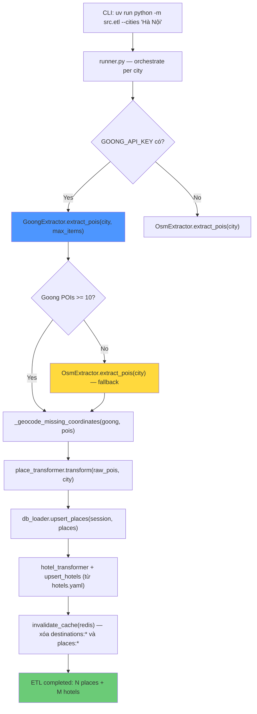

### 13.2 Goong API Endpoints đang dùng

ETL dùng **3 Goong REST API endpoints** từ `https://rsapi.goong.io`:

| Endpoint | Method | Mục đích trong ETL | Params chính |
|---|---|---|---|
| `/Place/AutoComplete` | GET | Tìm POIs theo keyword + category cho từng city | `input`, `location`, `limit`, `radius` |
| `/Place/Detail` | GET | Lấy chi tiết place (tên, địa chỉ, tọa độ) từ `place_id` | `place_id`, `sessiontoken` |
| `/Geocode` | GET | Forward geocoding — điền tọa độ cho POIs thiếu lat/lng | `address` |

**Goong API còn có nhưng ETL chưa dùng:**

| Endpoint | Mô tả | Tiềm năng |
|---|---|---|
| `/Geocode` (reverse) | Tọa độ → địa chỉ | Có thể dùng để enrich address từ lat/lng |
| `/Direction` | Tính đường đi giữa 2 điểm | C.3 Companion Chat — `calculate_route` tool |
| `/DistanceMatrix` | Ma trận khoảng cách nhiều điểm | Tối ưu thứ tự hoạt động trong ngày |
| `/StaticMap` | Tạo ảnh bản đồ tĩnh | Thumbnail cho trip/activity |

### 13.3 Chạy ETL

```bash
cd Backend

# Cần GOONG_API_KEY trong .env
uv run python -m src.etl

# Một thành phố
uv run python -m src.etl --cities "Hà Nội"

# Nhiều thành phố
uv run python -m src.etl --cities "Hà Nội" "Đà Nẵng" "Hội An"

# Dry-run (không ghi DB)
uv run python -m src.etl --cities "Hà Nội" --dry-run

# Chỉ load hotels từ YAML
uv run python -m src.etl --hotels-only

# Hoặc với Docker
docker compose exec api uv run python -m src.etl --cities "Hà Nội"
```

### 13.4 Kiểm tra sau ETL

```bash
# Kiểm tra destinations
curl http://localhost:8000/api/v1/places/destinations

# Kiểm tra places (cần encode UTF-8)
curl "http://localhost:8000/api/v1/places/search?city=H%C3%A0%20N%E1%BB%99i&limit=10"

# Xóa Redis cache để load fresh data
docker compose exec redis redis-cli FLUSHDB
```

### 13.5 Lưu ý quan trọng

- ETL là **idempotent** — chạy nhiều lần không tạo duplicate (upsert theo `external_id`, fallback `(name, destination_id)`)
- `GOONG_API_KEY` là **bắt buộc** để có data chất lượng. Không có key → OSM fallback → data ít và thiếu tọa độ
- AI generate cần **tối thiểu 6 places/destination** — nếu thiếu sẽ trả 422 trước khi gọi Gemini
- Destination string trong generate request được resolve qua **slug matching** — `"Ha Noi"` (không dấu) → slug `ha-noi` → match DB
- Sau ETL, Redis cache bị invalidate tự động — request tiếp theo sẽ load fresh data từ DB

```bash
cd Backend

# Cần GOONG_API_KEY trong .env
uv run python -m src.etl

# Hoặc với Docker
docker compose exec backend python -m src.etl
```

---

## 14. Cấu trúc thư mục

```
NT208-ai-travel-itinerary-recommendation-system/
├── Backend/
│   ├── src/
│   │   ├── main.py                    # App factory, middleware, router registration
│   │   ├── api/v1/                    # Router layer (34 endpoints)
│   │   │   ├── auth.py
│   │   │   ├── users.py
│   │   │   ├── itineraries.py
│   │   │   ├── places.py
│   │   │   └── shared.py
│   │   ├── core/                      # Cross-cutting: config, db, security, exceptions
│   │   ├── models/                    # SQLAlchemy ORM models
│   │   ├── repositories/              # DB query layer
│   │   ├── schemas/                   # Pydantic request/response schemas
│   │   ├── services/                  # Business logic layer
│   │   ├── agent/                     # AI infrastructure (Gemini client, prompts, schemas)
│   │   └── etl/                       # Goong Maps ETL pipeline
│   ├── tests/
│   │   ├── unit/                      # 97 unit tests
│   │   └── integration/               # 44 integration tests
│   ├── alembic/                       # DB migrations
│   │   └── versions/
│   ├── config.yaml                    # Non-secret config
│   ├── .env.example                   # Secret config template
│   ├── pyproject.toml                 # uv dependencies + Ruff config
│   └── Dockerfile
│
├── Frontend/
│   ├── src/
│   │   ├── app/
│   │   │   ├── App.tsx                # Root component
│   │   │   ├── routes.tsx             # Route definitions
│   │   │   ├── components/            # 40+ shared components
│   │   │   ├── contexts/              # AuthContext, TripWizardContext
│   │   │   ├── data/                  # Static/mock fallback data
│   │   │   ├── hooks/                 # useTripSync, useActivityManager, ...
│   │   │   ├── pages/                 # 27 page components
│   │   │   ├── services/              # API client layer (api.ts + 4 modules)
│   │   │   ├── types/                 # trip.types.ts (FE-BE contract)
│   │   │   └── utils/
│   │   └── styles/
│   ├── tests/e2e/                     # 13 Playwright e2e tests
│   ├── playwright.config.ts
│   ├── package.json
│   └── vite.config.ts
│
├── docs/                              # Architecture & context docs
│   ├── 02_architecture.md
│   ├── 03_backend.md
│   ├── 04_frontend.md
│   └── REPORTS/
│
├── .claude/                           # Claude AI context & skills
│   ├── context/                       # Project context files
│   └── skills/                        # Code review, db-migration, debug skills
│
├── docker-compose.yml
├── CLAUDE.md                          # AI agent instructions
├── AGENTS.md                          # Agent coordination guide
└── README.md
```

---

## 15. Team

**NT208 — Web Programming · UIT 2023.2**

| Thành viên | MSSV | Vai trò |
|---|---|---|
| (Thành viên 1) | — | Backend, AI Pipeline, ETL |
| (Thành viên 2) | — | Frontend, UI/UX |
| (Thành viên 3) | — | Backend, Database, DevOps |
| (Thành viên 4) | — | Frontend, Testing |

> Cập nhật thông tin thành viên thực tế vào bảng trên.

---

<div align="center">

Made with ❤️ for Vietnam travel · NT208 · UIT 2023.2

</div>
