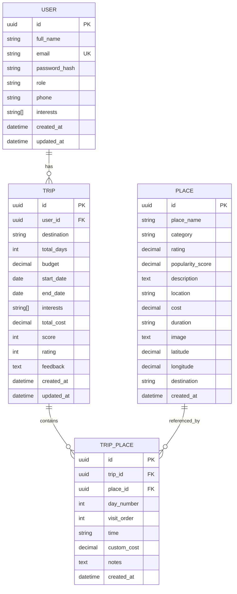

# Part 1: MVP1 Analysis — Phân tích hiện trạng

> Phân tích toàn bộ source code hiện tại trên branch `feat/frontend-revamp` (đang active)

---

## Mục đích file này

File này là "bản chụp" hiện trạng hệ thống Backend. Trước khi thay đổi bất cứ thứ gì, cần hiểu rõ hệ thống đang có GÌ, hoạt động THẾ NÀO, và YẾU ở đâu. Đọc file này để trả lời câu hỏi: "BE cũ có những endpoint nào? DB có bao nhiêu bảng? AI hoạt động ra sao? Auth bảo mật thế nào?"

Nội dung chia làm 3 phần chính:
1. **Backend Architecture** — cấu trúc folder, models, endpoints, auth flow, AI flow
2. **Frontend Architecture** — trang nào, component nào, data flow ra sao
3. **Gap Analysis** — 15 lỗ hổng cụ thể giữa FE mới và BE cũ

---

## 1. Backend Architecture hiện tại

### 1.1 Cấu trúc folder

Đây là cấu trúc folder hiện tại của Backend. Nhìn sơ qua thì có vẻ hợp lý — có models, schemas, routers, services — nhưng vấn đề nằm ở **bên trong** các file này. Router chứa business logic, service gọi DB trực tiếp, và không có repository layer.

```
Backend/
├── main.py                 ← Entry point (FastAPI + CORS + lifespan)
├── app/
│   ├── config.py           ← Settings (pydantic-settings, .env)
│   ├── database.py         ← Async engine + session (asyncpg)
│   ├── models/
│   │   ├── user.py         ← User (UUID, email, password_hash, role, phone, interests)
│   │   ├── trip.py         ← Trip (destination, budget, dates, rating, feedback)
│   │   ├── place.py        ← Place (place_name, category, cost, lat/lng, image)
│   │   └── trip_place.py   ← TripPlace junction (day_number, visit_order, time)
│   ├── schemas/
│   │   ├── auth.py         ← RegisterRequest, LoginRequest, AuthResponse
│   │   ├── user.py         ← UserResponse (alias: full_name→name, created_at→createdAt)
│   │   ├── trip.py         ← TripCreateRequest, ItineraryResponse, RatingRequest
│   │   └── place.py        ← ActivityResponse, ItineraryDayResponse, PlaceResponse
│   ├── routers/
│   │   ├── auth.py         ← POST /register, /login
│   │   ├── users.py        ← GET/PUT /profile (protected)
│   │   ├── trips.py        ← POST /generate, GET /, GET /{id}, DELETE, PUT /rating
│   │   └── places.py       ← GET /destinations, GET /{name}/places
│   ├── services/
│   │   ├── auth_service.py     ← register_user, login_user
│   │   ├── user_service.py     ← update_profile, get_user_profile
│   │   └── itinerary_service.py ← generate_itinerary (654 lines, AI + fallback + CRUD)
│   └── utils/
│       ├── security.py         ← hash_password, verify_password, create/verify JWT
│       └── dependencies.py     ← get_current_user, get_current_user_optional
├── requirements.txt         ← pip dependencies (13 packages)
├── seed_data.py             ← Seed places data
└── test_*.py                ← Test files
```

### 1.2 Database Models (ERD)

Hiện tại chỉ có **4 bảng**. Mối quan hệ đơn giản: User → Trip → TripPlace ← Place. Bảng `trip_places` là junction table (bảng nối) giữa Trip và Place. Tất cả dùng UUID làm primary key — đây sẽ là vấn đề vì FE mới dùng `number` (integer).

Đáng chú ý: KHÔNG có bảng cho trip_days (ngày), activities (hoạt động riêng lẻ), hotels (khách sạn), extra_expenses (chi phí phát sinh), hoặc saved_places (bookmark). Tất cả những thứ này đều cần có trong MVP2.



### 1.3 API Endpoints hiện tại (10 endpoints)

BE hiện tại có tổng cộng 10 endpoint chính (thực tế 12 nếu đếm cả destinations). Đây là danh sách đầy đủ — đáng lưu ý là **thiếu rất nhiều endpoint** mà FE mới cần: không có refresh token, không có auto-save trip, không có CRUD hoạt động riêng lẻ, không có AI chat, không có saved places.

| Method | Path | Auth | Function |
|--------|------|------|----------|
| `POST` | `/api/v1/auth/register` | Public | Đăng ký, trả JWT + user info |
| `POST` | `/api/v1/auth/login` | Public | Đăng nhập, trả JWT + user info |
| `GET` | `/api/v1/users/profile` | Protected | Lấy profile user |
| `PUT` | `/api/v1/users/profile` | Protected | Cập nhật name/phone/interests |
| `POST` | `/api/v1/itineraries/generate` | Optional | Tạo lịch trình AI/fallback |
| `GET` | `/api/v1/itineraries/` | Protected | Danh sách trips của user |
| `GET` | `/api/v1/itineraries/{id}` | Public | Chi tiết 1 trip |
| `DELETE` | `/api/v1/itineraries/{id}` | Protected | Xóa trip (owner only) |
| `PUT` | `/api/v1/itineraries/{id}/rating` | Optional | Đánh giá 1-5 sao |
| `DELETE` | `/api/v1/itineraries/{id}/activities/{aid}` | Protected | Xóa 1 activity |
| `GET` | `/api/v1/destinations/` | Public | Danh sách thành phố |
| `GET` | `/api/v1/destinations/{name}/places` | Public | Places của 1 thành phố |

### 1.4 Authentication Flow

Auth hiện tại rất đơn giản: user gửi email + password, BE trả JWT token (hết hạn sau 24 giờ). KHÔNG có refresh token — nghĩa là sau 24h user phải login lại. KHÔNG có logout thật — khi user nhấn "Đăng xuất", FE chỉ xóa token khỏi localStorage nhưng token vẫn valid trên server cho đến khi hết hạn. Nếu attacker copy token trước khi user logout, attacker vẫn truy cập được trong 24h.

```
┌────────┐       POST /register        ┌────────┐
│   FE   │ ─── { email, pass, name } ──►│   BE   │
│        │ ◄── { success, token, user } │        │
│        │                               │        │
│        │       POST /login            │        │
│        │ ─── { email, password } ─────►│        │
│        │ ◄── { success, token, user } │        │
│        │                               │        │
│        │     Authorization: Bearer <t> │        │
│        │ ─── GET /users/profile ──────►│ verify │
│        │ ◄── { id, email, name, ... } │ token  │
└────────┘                               └────────┘

JWT payload: { sub: user_id(UUID), exp: timestamp }
Algorithm: HS256
Expiry: 24 hours (no refresh token!)
```

### 1.5 AI Generation Flow

Đây là phần quan trọng cần hiểu rõ. Khi user nhấn "Tạo lộ trình", request đi vào `itinerary_service.generate_itinerary()` — 1 function trong file 654 dòng. Luồng xử lý hiện tại:

1. Tính số ngày từ date range
2. Gọi Gemini 1.5 Flash với prompt text thô
3. Parse response bằng `json.loads()` — DỄ CRASH nếu AI trả sai format
4. Nếu crash → dùng `_generate_fallback_activities()` — trả data HARDCODED cho 4 thành phố
5. User nhận kết quả và NGHĨ là AI tạo ra, nhưng thực tế là mock data

Đây là lý do chính phải refactor: user bị lừa bởi mock data, và `json.loads()` trên text thô là cách parse rất không đáng tin cậy.

```
POST /itineraries/generate
    ↓
itinerary_service.generate_itinerary()
    ↓
1. _calculate_days(startDate, endDate)
2. Thử _generate_with_ai(destination, days, budget, interests)
   ├── Nếu OK: Gemini 1.5 Flash → parse JSON text → list[list[dict]]
   └── Nếu FAIL: _generate_fallback_activities() → hardcoded mock data
3. Tạo Trip record
4. Loop: _get_or_create_place() → tạo TripPlace records
5. Thêm phí ăn ở (500k + 300k/ngày)
6. Commit + reload với relationships
7. Return ItineraryResponse.from_db(trip)
```

> [!WARNING]
> **Vấn đề nghiêm trọng trong AI generation hiện tại:**
> - Dùng `google.generativeai` raw SDK (KHÔNG phải LangChain)
> - Model cũ: `gemini-1.5-flash` 
> - Parse JSON text thô bằng `json.loads()` → dễ crash
> - Fallback là hardcoded dict cho 4 thành phố → KHÔNG đa dạng
> - Không có structured output → AI có thể trả format sai

---

## 2. Frontend Architecture hiện tại

Để refactor BE đúng cách, cần hiểu FE mới đã xây ĐƯỢC gì. FE branch `feat/frontend-revamp` đã được đại tu hoàn toàn — từ 8 trang lên 25 trang, thêm hàng loạt hooks quản lý state, và UI phong phú hơn nhiều. Tuy nhiên, tất cả đều chạy bằng mock data và localStorage — chưa gọi BE cho bất kỳ chức năng trip nào.

### 2.1 Cấu trúc (branch `feat/frontend-revamp`)

| Thành phần | Số lượng | Highlights |
|-----------|---------|-----------|
| **Pages** | 25 | TripWorkspace (22KB), DailyItinerary (33KB), CompanionDemo, CreateTrip, ManualTripSetup, TripHistory |
| **Components** | 23+ | ActivityDetailModal (24KB), TripAccommodation (22KB), PlaceSelectionModal (18KB), FloatingAIChat |
| **Hooks** | 6 | useActivityManager, useAccommodation, usePlacesManager, useTripSync, useTripCost, useTripState |
| **Data (mock)** | 7 files | cities.ts (16KB), tripConstants.ts (16KB), places.ts, suggestions.ts |
| **Types** | 1 | trip.types.ts — Source of Truth |

### 2.2 Routing (25 routes)

```
/                    → Home
/cities              → CityList
/cities/:cityId      → CityDetail
/onboarding          → Onboarding
/trip-library        → TripLibrary
/saved-places        → SavedPlaces
/account             → Account
/trip-history        → TripHistory
/settings            → Settings
/daily-itinerary     → DailyItinerary (TripWorkspace)
/create-trip         → CreateTrip (AI form)
/budget-setup        → BudgetSetup
/travelers-selection → TravelersSelection
/manual-trip-setup   → ManualTripSetup
/day-allocation      → DayAllocation
/trip-workspace      → TripWorkspace
/trip-planning       → TripPlanning (legacy)
/itinerary/:id       → ItineraryView
/login               → Login
/register            → Register
/forgot-password     → ForgotPassword
/profile             → Profile
/saved-itineraries   → SavedItineraries
```

### 2.3 Data Flow hiện tại

Điểm quan trọng nhất cần hiểu: **FE mới không gọi BE cho bất kỳ trip workflow nào**. Toàn bộ data lưu trong `localStorage` của trình duyệt. Nghĩa là:
- Clear cache trình duyệt = mất toàn bộ dữ liệu
- Không sync giữa laptop và điện thoại
- Không có AI thật (chỉ `setTimeout` giả lập)
- BE hiện tại = **vô dụng** cho FE mới

Đây chính là lý do chính phải refactor BE — để FE có API thật để gọi.

> [!CAUTION]
> FE hiện tại hoạt động **HOÀN TOÀN OFFLINE** cho trip workflow. Tất cả data lưu trong `localStorage`.
> Auth cũng dùng `localStorage` (KHÔNG gọi BE).

```
CreateTrip → setTimeout (fake AI) → navigate("/daily-itinerary")
                                          ↓
DailyItinerary → localStorage.getItem("currentTrip")
                 → Nếu rỗng: tạo empty days[]
                 → User tự thêm activities
                 → Auto-save: localStorage.setItem("currentTrip")
                 → handleSaveItinerary: localStorage.setItem("savedTrips")
```

---

## 3. Gap Analysis — BE vs FE

Bảng dưới liệt kê **15 lỗ hổng cụ thể** giữa khả năng của BE hiện tại và nhu cầu của FE mới. Các gap đánh dấu 🔴 (Breaking) nghĩa là FE mới KHÔNG THỂ hoạt động với BE cũ ở chức năng đó — cần sửa triệt để. Các gap 🟡 (Missing) nghĩa là FE có tính năng nhưng BE chưa hỗ trợ — cần thêm mới.

| # | Gap | Mức độ | Giải thích |
|---|-----|--------|-----------|
| 1 | FE dùng `id: number`, BE dùng `id: UUID` | 🔴 Breaking | FE mới KHÔNG dùng UUID string |
| 2 | FE dùng `Activity.name`, BE dùng `Activity.title` | 🔴 Breaking | Field name khác hoàn toàn |
| 3 | FE có `endTime, adultPrice, childPrice, customCost` | 🟡 Missing | BE không có các field này |
| 4 | FE có `Hotel`, `Accommodation` entities | 🟡 Missing | BE không có hotel/accommodation |
| 5 | FE có `TravelerInfo (adults, children)` | 🟡 Missing | BE không track travelers |
| 6 | FE có `ExtraExpense` per activity/day | 🟡 Missing | BE không có extra expenses |
| 7 | FE có `Day.label`, `Day.destinationName` | 🟡 Missing | BE dùng `day_number` only |
| 8 | FE dùng `transportation` enum | 🟡 Missing | BE không track transport mode |
| 9 | FE cần CRUD activities riêng lẻ | 🟡 Missing | BE chỉ có delete activity |
| 10 | FE cần auto-save (PUT full trip) | 🟡 Missing | BE không có update trip endpoint |
| 11 | FE cần AI Chat (WebSocket) | 🔴 Missing | BE không có companion agent |
| 12 | FE cần contextual suggestions | 🟡 Missing | BE không có suggestion logic |
| 13 | FE cần saved places CRUD | 🟡 Missing | BE không có saved places |
| 14 | FE cần share trip | 🟡 Missing | BE không có sharing |
| 15 | Không có Refresh Token | 🟡 Security | JWT 24h, không refresh |

> [!NOTE]
> **Cross-references cho MVP2 plan:**
> - **Toàn bộ kiến trúc hệ thống mới** → [13_architecture_overview.md](13_architecture_overview.md) (5-layer diagram, tech stack, deploy topology)
> - **Config centralized (30+ params)** → [14_config_plan.md](14_config_plan.md) (config.yaml + .env + AppSettings)
> - **33 endpoints chi tiết** → [12_be_crud_endpoints.md](12_be_crud_endpoints.md)
> - **3 new features (Guest Claim, Trip Limit, Chat History)** → [06_scalability_plan.md §7](06_scalability_plan.md)
