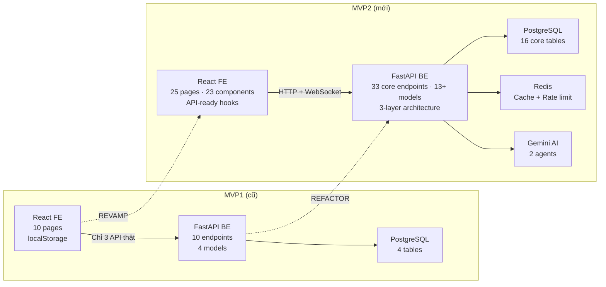
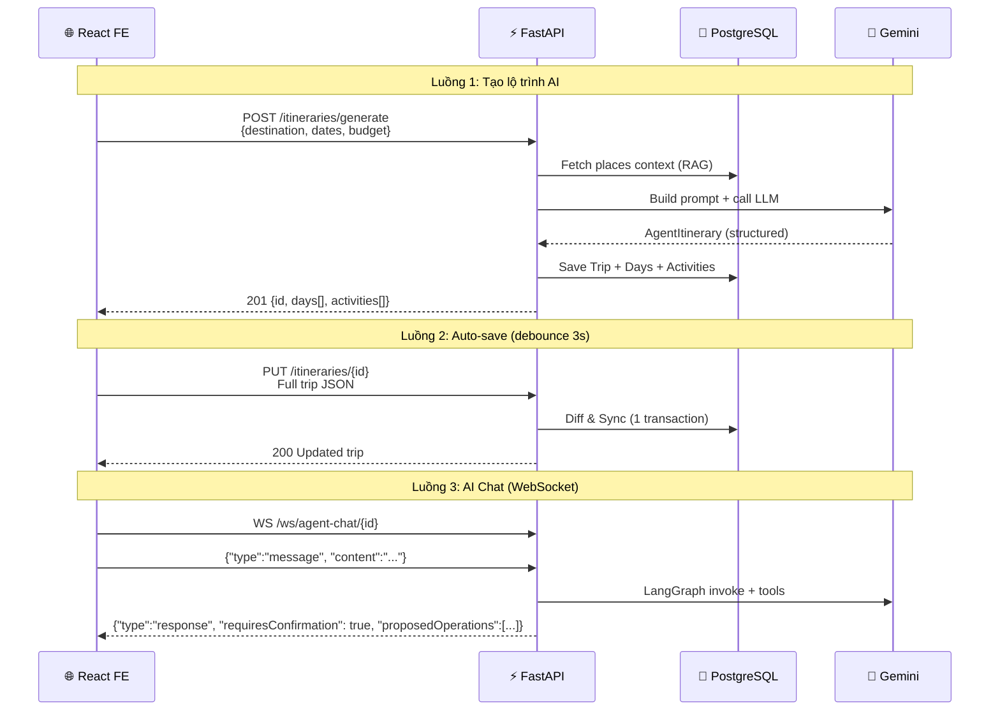
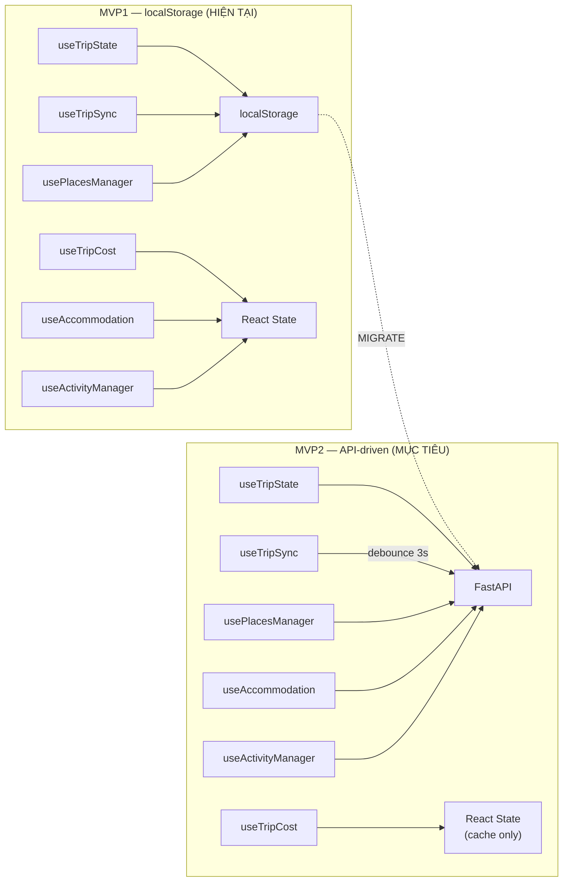
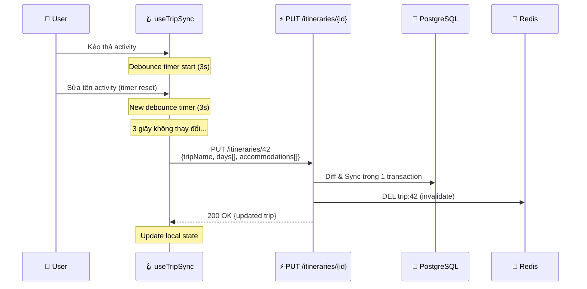

# Part 2: FE Revamp Analysis — Branch `feat/frontend-revamp`

> Branch stats: **+20,408 lines**, **~35+ new files**, **152 files changed**
> **Decision lock v4.1:** `Frontend/src/app/types/trip.types.ts` là source of truth cho public API.
> BE có thể dùng snake_case nội bộ, nhưng request/response JSON cho FE phải là camelCase.
> MVP2 core có 33 endpoints; `EP-34 Analytics` là optional/MVP2+. Public share dùng
> `shareToken`; guest claim dùng `claimToken`; raw integer itinerary ID không public.

---

## Mục đích file này

### WHAT — File này chứa gì?

File này phân tích **source-code FE mới** (branch `feat/frontend-revamp`) để xác định chính xác: BE cần xây/sửa những gì để FE hoạt động đúng. Nó là **cầu nối** giữa team FE và team BE — đảm bảo 2 bên nói cùng ngôn ngữ.

### WHY — Tại sao cần file này?

FE đã được revamp hoàn toàn — từ 10 trang lên 25 trang, từ localStorage lên API-ready hooks, từ mock data lên real API calls. Nhưng BE vẫn giữ schema cũ (MVP1). Nếu BE không biết FE cần gì → build endpoint sai → FE gọi API fail → trang trắng.

### HOW — Đọc file này thế nào?

1. §1: Schema source of truth → biết FE expect data format nào
2. §2: Breaking changes → biết 15 thứ CHẮC CHẮN phải sửa
3. §3-4: Pages + Hooks → biết endpoint nào mapping trang nào
4. §5-6: Mock data → biết file nào cần thay bằng API
5. §7: Tổng hợp API list → bảng tóm tắt 33 endpoint core (31 gốc + EP-32 Claim + EP-33 Chat History) và EP-34 Analytics optional

### WHEN — Khi nào đọc lại?

| Thời điểm | Đọc phần nào |
|-----------|-------------|
| **Bắt đầu Phase B** (CRUD) | §1 (Schema), §2 (Breaking changes) |
| **Code endpoint mới** | §3 (Pages → cần endpoint nào) |
| **Debug FE-BE mismatch** | §1 (field names), §2 (type changes) |
| **Planning sprint** | §7 (tổng hợp endpoint list) |

---

## 0. Architecture Comparison — MVP1 vs MVP2

### 0.1 WHAT changed? — Tổng quan thay đổi



### 0.2 WHY change? — Tại sao phải đổi?

| Aspect | MVP1 (vấn đề) | MVP2 (giải pháp) | WHY |
|--------|---------------|-------------------|-----|
| **Data storage** | localStorage (mất khi xóa browser) | PostgreSQL (persistent) | User mất data → UX tệ |
| **API endpoints** | 10 (thiếu CRUD) | 33 core + EP-34 optional | FE mới cần CRUD + AI + share/claim/chat history |
| **Schema** | UUID string, `title` | Integer, `name`, 15 field mới | FE thay đổi → BE phải khớp |
| **AI** | Mock `setTimeout` | Real Gemini + LangGraph | Core feature của sản phẩm |
| **Auth** | Basic JWT (no refresh) | JWT + refresh rotation | Session expiry mỗi 15 phút |
| **Cost management** | Không có | adultPrice, childPrice, extraExpenses | FE xây xong, BE chưa hỗ trợ |

### 0.3 HOW — Data flow FE ↔ BE (MVP2)



Đọc file này SAU khi đọc 01_mvp1_analysis.md, để so sánh "BE có gì" vs "FE cần gì".

---

## 1. Schema Source of Truth — `trip.types.ts`

File `trip.types.ts` trong FE là **nguồn sự thật duy nhất** cho dữ liệu. Tất cả Pydantic schema bên BE **PHẢI khớp 1:1** với các interface trong file này. Nếu BE trả field `title` nhưng FE đọc `name` → UI không hiển thị. Nếu BE trả UUID nhưng FE expect number → parse fail.

Quy ước implementation: Python models/services dùng snake_case (`adult_price`) nhưng Pydantic request/response dùng alias camelCase (`adultPrice`). Khi docs hoặc code sample ghi public JSON, luôn dùng camelCase: `tripName`, `startDate`, `endDate`, `adultPrice`, `childPrice`, `claimToken`, `shareToken`, `refreshToken`.

Dưới đây là các interface TypeScript — mỗi field đánh dấu ⚠️ là field khác biệt so với MVP1, mỗi field đánh dấu "MỞ I" là field FE có nhưng BE chưa có.

> [!IMPORTANT]
> Tất cả Pydantic models bên BE **PHẢI** khớp 1:1 với file này.

### 1.1 Activity Interface (khác hoàn toàn MVP1)

So với MVP1, Activity giờ có thêm 10 field mới — đặc biệt quan trọng là `adultPrice`/`childPrice` (giá riêng cho người lớn/trẻ em), `transportation` (phương tiện di chuyển), và `extraExpenses` (chi phí phát sinh). Những field này là cốt lõi của tính năng quản lý chi phí mà FE đã xây xong.

```typescript
export interface Activity {
  id: number;              // ⚠️ INTEGER, không phải UUID string
  time: string;            // "09:00"
  endTime?: string;        // MỚI: "11:00"
  name: string;            // ⚠️ "name" không phải "title"
  location: string;
  description: string;
  type: "food" | "attraction" | "nature" | "entertainment" | "shopping";
  image: string;
  transportation?: "walk" | "bike" | "bus" | "taxi";   // MỚI
  adultPrice?: number;     // MỚI: giá người lớn
  childPrice?: number;     // MỚI: giá trẻ em
  customCost?: number;     // MỚI: chi phí tùy chỉnh
  busTicketPrice?: number; // MỚI
  taxiCost?: number;       // MỚI
  extraExpenses?: ExtraExpense[];  // MỚI: chi phí phát sinh
}
```

### 1.2 Day Interface

```typescript
export interface Day {
  id: number;
  label: string;           // MỚI: "Ngày 1 - Hà Nội"
  date: string;
  activities: Activity[];
  destinationName?: string; // MỚI: tên thành phố cho ngày đó
  extraExpenses?: DayExtraExpense[];  // MỚI
}
```

### 1.3 Entities hoàn toàn mới (MVP1 không có)

| Entity | Fields | Lưu ý |
|--------|--------|-------|
| `Hotel` | id, name, rating, reviewCount, price, image, location, city, amenities[], description | 9 fields, cần bảng DB mới |
| `Accommodation` | hotel (Hotel), dayIds[], bookingType, duration | Many-to-many với Day |
| `TravelerInfo` | adults, children, total | Lưu trong Trip, total = computed |
| `ExtraExpense` | id, name, amount, category | Cấp Activity hoặc Day |
| `DateAllocation` | from, to, days | FE workflow tạo trip thủ công |
| `TimeConflictWarning` | hasConflict, conflictWith | FE-only validation |

---

## 2. Breaking Changes (15 thay đổi phá vỡ)

Bảng này là **checklist bắt buộc** khi refactor BE. Mỗi dòng là 1 chỗ không khớp giữa FE và BE. Tất cả 15 mục này ĐỀU phải được giải quyết trong MVP2, không được bỏ qua.

Cột "Action" cho biết cần làm gì ở BE: thêm column mới, đổi kiểu dữ liệu, hoặc tạo bảng mới.

| # | Field | MVP1 (main) | MVP2 (revamp) | Action |
|---|-------|-------------|---------------|--------|
| 1 | `Activity.id` | `string` (UUID) | `number` | Đổi sang auto-increment integer |
| 2 | `Activity.name` | `title` | `name` | Rename DB column + schema |
| 3 | `Activity.endTime` | ❌ | ✅ | Thêm column `end_time` |
| 4 | `Activity.type` | ❌ | ✅ 5 enum | Thêm column + Enum type |
| 5 | `Activity.adultPrice` | ❌ | ✅ | Thêm column |
| 6 | `Activity.childPrice` | ❌ | ✅ | Thêm column |
| 7 | `Activity.customCost` | ❌ | ✅ | Thêm column |
| 8 | `Activity.transportation` | ❌ | ✅ 4 enum | Thêm column |
| 9 | `Activity.busTicketPrice` | ❌ | ✅ | Thêm column |
| 10 | `Activity.taxiCost` | ❌ | ✅ | Thêm column |
| 11 | `Activity.extraExpenses` | ❌ | ✅ | Thêm bảng `extra_expenses` |
| 12 | `Day.id` | `string` | `number` | Integer |
| 13 | `Day.label` | ❌ | ✅ | Thêm column |
| 14 | `Day.destinationName` | ❌ | ✅ | Thêm column |
| 15 | `Day.extraExpenses` | ❌ | ✅ | Thêm bảng |

---

## 3. Pages Analysis — Chức năng & API cần

Phần này phân tích từng trang FE — trang nào cần endpoint nào. Đây là cơ sở để xác định **33 core endpoints cho MVP2** trong [12_be_crud_endpoints.md](12_be_crud_endpoints.md). EP-34 Analytics giữ ở trạng thái optional/MVP2+ để không làm chậm luồng core FE ↔ BE.

### 3.1 TripWorkspace.tsx (22KB) — **TRANG QUAN TRỌNG NHẤT**

Đây là trang phức tạp nhất của FE — workspace 3 cột để user xem và chỉnh sửa lộ trình. Cột trái là danh sách ngày, cột giữa là timeline hoạt động (có thể kéo thả), cột phải là chi phí. Góc dưới bên phải có nút AI chat (FloatingAIChat).

Trang này cần NHIỀU endpoint nhất — 7 API để hoạt động đầy đủ.

```
┌──────────────────────────────────────────────────────────┐
│                    TopActionBar                          │
│  [Trip Name]  [Travelers: 2👤]  [💾Save]  [▶️Create]    │
├──────────┬──────────────────────────┬────────────────────┤
│ LEFT     │ CENTER                   │ RIGHT              │
│ Sidebar  │ Timeline / Accommodation │ Budget Sidebar     │
│          │                          │                    │
│ Day 1    │ 09:00 Phở Bát Đàn       │ Budget: 5,000,000đ │
│ Day 2  ◄─┤ 11:00 Văn Miếu          │ Spent:  2,300,000đ │
│ Day 3    │ 13:00 Bún chả           │ ─────────────────  │
│          │ + Thêm hoạt động        │ Food:    800,000đ  │
│ [+Ngày]  │                          │ Transport: 500,000đ│
│          │ [Tab: Địa điểm | Nơi ở] │ Attraction: ...    │
└──────────┴──────────────────────────┴────────────────────┘
                    ┌───────┐
                    │ 🤖 AI │  ← FloatingAIChat (bottom-right)
                    └───────┘
```

**BE API cần cho trang này:**
- `GET /api/v1/itineraries/{id}` — Load trip data
- `PUT /api/v1/itineraries/{id}` — Auto-save (debounce 3s)
- `POST /api/v1/itineraries/{id}/activities` — Thêm activity  
- `PUT /api/v1/itineraries/{id}/activities/{aid}` — Edit activity
- `DELETE /api/v1/itineraries/{id}/activities/{aid}` — Xóa activity
- `POST /api/v1/itineraries/{id}/accommodations` — Thêm hotel
- `WS /ws/agent-chat/{trip_id}` — AI chatbot

### 3.2 CreateTrip.tsx (13KB) — Form tạo trip AI

**Input**: destination, dateRange, travelType, budgetLevel, interests  
**Current**: `setTimeout(1500ms) → navigate("/daily-itinerary")` ← MOCK!  
**Cần**: `POST /api/v1/itineraries/generate` → real AI generation

### 3.3 DailyItinerary.tsx (33KB) — Xem chi tiết 1 ngày

**Chức năng**: Timeline view, drag-drop, time conflict detection, inline editing  
**Cần**: Same APIs as TripWorkspace (shared workspace)

### 3.4 TripHistory.tsx (21KB) — Lịch sử trips

**Current**: `localStorage.getItem("savedTrips")` ← OFFLINE!  
**Cần**: `GET /api/v1/itineraries` (paginated, filterable)

### 3.5 ManualTripSetup.tsx (18KB) — Tạo trip thủ công

**Flow**: Chọn destinations → date allocation → navigate to workspace  
**Cần**: `POST /api/v1/itineraries` (create empty trip, no AI)

### 3.6 Các trang khác

| Page | Chức năng | API cần |
|------|----------|---------|
| Account.tsx | Profile settings | `GET/PUT /users/profile` |
| SavedPlaces.tsx | Bookmark places | `GET/POST/DELETE /users/saved-places` |
| CityList.tsx | Danh sách thành phố | `GET /destinations` |
| CityDetail.tsx | Chi tiết thành phố | `GET /destinations/{name}/detail` |
| Settings.tsx | App settings | FE-only (no API needed) |
| CompanionDemo.tsx | Demo 4 companion features | `GET /agent/suggest` |

---

## 4. Hooks — State Management Analysis

### 4.0 WHY — Tại sao hooks quan trọng cho BE?

Hooks là **cách FE giao tiếp với BE**. Mỗi hook = 1 nhóm API calls. Nếu BE thiếu endpoint mà hook cần → hook fail → UI crash. Developer BE cần hiểu: hook nào gọi endpoint nào, khi nào gọi, payload ra sao.

### 4.1 Tình trạng hiện tại vs mục tiêu



### 4.2 Hook → API Mapping (chi tiết)

| Hook | Chức năng | MVP1 Source | MVP2 APIs | WHY thay đổi |
|------|----------|-----------|-----------|--------------|
| `useActivityManager` | CRUD activities | React state (setDays) | `POST/PUT/DELETE /itineraries/{id}/activities/*` | State local mất khi refresh |
| `useAccommodation` | CRUD hotels | React state | `POST/DELETE /itineraries/{id}/accommodations/*` | Hotel data cần persist |
| `usePlacesManager` | Saved places | localStorage | `GET/POST/DELETE /users/saved-places` | Sync across devices |
| `useTripSync` | Auto-save trip | localStorage | `PUT /itineraries/{id}` (debounce 3s) | **Critical**: data safety |
| `useTripCost` | Calculate cost | Computed | Computed (KHÔNG thay đổi) | Pure FE logic, OK |
| `useTripState` | Trip state mgmt | localStorage | `GET /itineraries/{id}` + React state | Load from DB, cache in state |

### 4.3 useTripSync.ts — Hook quan trọng nhất

**WHAT:** Hook xử lý auto-save — mỗi khi user thay đổi bất kỳ gì (kéo thả, sửa text, thêm activity), FE tự gọi API lưu.
**WHY critical:** Nếu hook này fail → user mất data. Nếu gọi API quá thường → spam server. Debounce 3s là balance giữa 2 rủi ro.
**HOW:** FE debounce 3 giây → gọi `PUT /itineraries/{id}` với full trip JSON → BE diff & sync.

```typescript
// HIỆN TẠI (offline — localStorage):
useEffect(() => {
  localStorage.setItem("currentTrip", JSON.stringify({
    days, accommodations, totalBudget, tripName
  }));
}, [days, accommodations, totalBudget, tripName]);

// CẦN THAY BẰNG (API — persistent):
useEffect(() => {
  const debounce = setTimeout(() => {
    // Gọi PUT /itineraries/{id} với full trip data
    // BE sẽ diff & sync (chỉ update changed records)
    api.put(`/itineraries/${tripId}`, { days, accommodations, travelers });
  }, 3000); // 3 giây sau khi user ngừng edit
  return () => clearTimeout(debounce);
}, [days, accommodations, totalBudget]);
```

### 4.4 Data Flow Pipeline — Hook → API → DB



---

## 5. AI Components — Trạng thái Mock

Tất cả 4 AI component bên dưới đang chạy bằng mock data hoặc `setTimeout` giả lập. Không có cái nào gọi BE thật. Cần xây API tương ứng để thay thế mock.

| Component | Hiện tại | Cần |
|----------|---------|-----|
| `FloatingAIChat.tsx` | `setTimeout` giả lập | WebSocket `/ws/agent-chat/{id}` |
| `ContextualSuggestionsPanel.tsx` | Mock từ `data/suggestions.ts` | `GET /agent/suggest` |
| `companion/DailyBrief.tsx` | Hardcoded data | `GET /agent/daily-brief/{tripId}/{dayId}` |
| `companion/PlaceSuggestions.tsx` | Mock suggestions | `GET /places/nearby` |

---

## 6. Mock Data → API Mapping

FE có 7 file chứa dữ liệu hardcoded. Khi BE có API thật, mỗi file mock sẽ được thay bằng API call. Bảng dưới chỉ ra từng file mock → API nào thay thế.

| File mock | Nội dung | API thay thế |
|----------|---------|-------------|
| `data/cities.ts` | 12 cities VN (hardcoded) | `GET /destinations` |
| `data/places.ts` | ~50 places (hardcoded) | `GET /places/search` |
| `data/suggestions.ts` | Gợi ý (hardcoded) | `GET /agent/suggest` |
| `utils/itinerary.ts` | Sinh lộ trình locally | `POST /itineraries/generate` |
| `utils/auth.ts` | Auth via localStorage | `POST /auth/login`, `/register` |
| `data/trips.ts` | Sample trips | `GET /itineraries` |
| `data/homeData.ts` | Home page data | OK (keep FE-side) |

---

## 7. Tổng hợp: API Endpoints cần cho FE mới (33 core + EP-34 optional)

Phần này tổng kết TẤT CẢ API core mà FE mới yêu cầu, nhóm theo chức năng. Đây là "bản đặt hàng" từ FE cho BE — mỗi endpoint core trong danh sách này ĐỀU phải được xây trong MVP2. `EP-34 /agent/analytics` chỉ bật sau khi có feature flag và guardrails Text-to-SQL.

### Auth (4)
```
POST   /api/v1/auth/register
POST   /api/v1/auth/login
POST   /api/v1/auth/refresh
POST   /api/v1/auth/logout
```

### Users (4)
```
GET    /api/v1/users/profile
PUT    /api/v1/users/profile
PUT    /api/v1/users/password
GET/POST/DELETE /api/v1/users/saved-places
```

### Itineraries (10)
```
POST   /api/v1/itineraries/generate      ← AI generation
POST   /api/v1/itineraries               ← Manual create
GET    /api/v1/itineraries               ← List (paginated)
GET    /api/v1/itineraries/{id}          ← Detail (auth owner only)
PUT    /api/v1/itineraries/{id}          ← Update (auto-save)
DELETE /api/v1/itineraries/{id}          ← Delete
PUT    /api/v1/itineraries/{id}/rating   ← Rate
POST   /api/v1/itineraries/{id}/share    ← Share link
GET    /api/v1/shared/{shareToken}       ← Public read-only share
POST   /api/v1/itineraries/{id}/activities        ← Add activity
PUT    /api/v1/itineraries/{id}/activities/{aid}   ← Update activity
DELETE /api/v1/itineraries/{id}/activities/{aid}   ← Delete activity
POST   /api/v1/itineraries/{id}/accommodations     ← Add hotel
DELETE /api/v1/itineraries/{id}/accommodations/{aid} ← Remove hotel
```

### Places & Destinations (5)
```
GET    /api/v1/destinations
GET    /api/v1/destinations/{name}/detail
GET    /api/v1/places/search
GET    /api/v1/places/{id}
```

### Agent (3+)
```
POST   /api/v1/agent/chat               ← REST (guest + fallback)
WS     /ws/agent-chat/{trip_id}          ← WebSocket streaming (auth)
GET    /api/v1/agent/suggest/{activity_id} ← Suggestions (DB-only, no LLM)
GET    /api/v1/agent/rate-limit-status   ← Check AI quota (NEW)
GET    /api/v1/agent/chat-history/{trip_id} ← Chat history (NEW)
```

### New Endpoints (2)
```
POST   /api/v1/itineraries/{id}/claim    ← Guest claim trip bằng claimToken (NEW)
GET    /api/v1/agent/chat-history/{trip_id} ← Xem chat cũ (NEW)
```

### Optional/MVP2+ Analytics
```
POST   /api/v1/agent/analytics           ← Text-to-SQL analytics, feature flag
```

---

## 8. FE → BE Migration Notes

> [!IMPORTANT]
> **UI/UX KHÔNG thay đổi trong MVP2.** Chỉ thay đổi data source: localStorage/mock → API calls.
> Tất cả pages, components, styles giữ nguyên. Chỉ hooks + data fetching thay đổi.

### §8.1 API Connection Status per Page

| Page | API Status | BE Endpoints needed | Priority |
|------|-----------|-------------------|----------|
| **LoginPage** | ⏳ Cần build | EP-02 (login) | 🔴 P1 |
| **RegisterPage** | ⏳ Cần build | EP-01 (register) | 🔴 P1 |
| **CreateTrip** | ⏳ Cần build | EP-08 (generate), EP-21 (destinations) | 🔴 P1 |
| **TripWorkspace** | ⏳ Cần build | EP-11 (get trip), EP-12 (auto-save), EP-29 (WS chat) | 🔴 P1 |
| **TripHistory** | ⏳ Cần build | EP-10 (list trips) | 🟡 P2 |
| **CityListPage** | ⏳ Cần build | EP-21 (destinations) | 🟡 P2 |
| **CityDetailPage** | ⏳ Cần build | EP-22 (city detail), EP-23 (search) | 🟡 P2 |
| **SavedPlacesPage** | ⏳ Cần build | EP-25/26/27 (saved places) | 🟡 P2 |
| **AccountPage** | ⏳ Cần build | EP-05/06 (profile) | 🟢 P3 |
| **HomePage** | ✅ FE-only | None (keep homeData.ts) | ✅ Done |
| **SharedTripPage** | ⏳ Cần build | `GET /shared/{shareToken}` (public read-only) | 🟢 P3 |

### §8.2 Hook Migration Priority

| Order | Hook | Migrate From | Migrate To | WHY migrate first? |
|-------|------|-------------|------------|-------------------|
| 1 | `useAuth` | localStorage tokens | POST /auth/* | Mọi hook khác cần auth state |
| 2 | `useTripSync` | localStorage save | PUT /itineraries/{id} + debounce 3s | Core feature — auto-save |
| 3 | `useItinerary` | mock data | GET/POST /itineraries/* | Trip CRUD depends on auth |
| 4 | `useActivityManager` | local state | POST/PUT/DELETE activities | Depends on trip data |
| 5 | `useAccommodation` | local state | POST/DELETE accommodations | Depends on trip data |
| 6 | `usePlaces` | data/places.ts | GET /places/search, /destinations | Independent, can be last |

### §8.3 Guest Trip Claim — FE Flow

Khi guest tạo trip → FE cần handle claim flow:

```typescript
// FE logic sau khi guest tạo trip:
const response = await api.post('/itineraries/generate', formData);
localStorage.setItem('guestTripId', response.data.id.toString());
localStorage.setItem('guestClaimToken', response.data.claimToken);

// FE logic sau khi login thành công:
const guestTripId = localStorage.getItem('guestTripId');
const guestClaimToken = localStorage.getItem('guestClaimToken');
if (guestTripId && guestClaimToken) {
  await api.post(`/itineraries/${guestTripId}/claim`, { claimToken: guestClaimToken });
  localStorage.removeItem('guestTripId');
  localStorage.removeItem('guestClaimToken');
  // Show toast: "Lộ trình đã được lưu vào tài khoản!"
}
```

### §8.4 Creation Limit — FE Flow

Khi auth user tạo trip, FE hiển thị warning nếu gần limit:

```typescript
// Trước khi navigate to CreateTrip:
const trips = await api.get('/itineraries');
if (trips.data.total >= 5) {
  showDialog("Bạn đã đạt giới hạn 5 lộ trình. Xóa lộ trình cũ để tạo mới.");
  return; // Block navigation
}
// Nếu 4/5: showWarning("Bạn còn 1 lộ trình nữa trước giới hạn")
```
