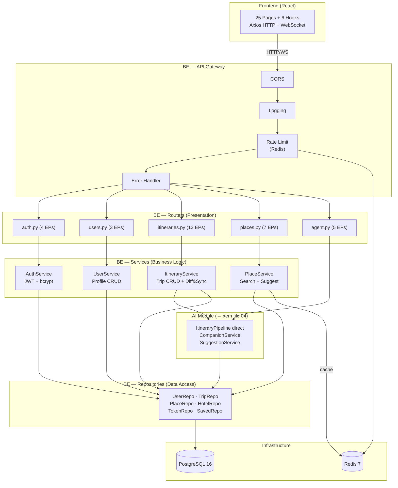
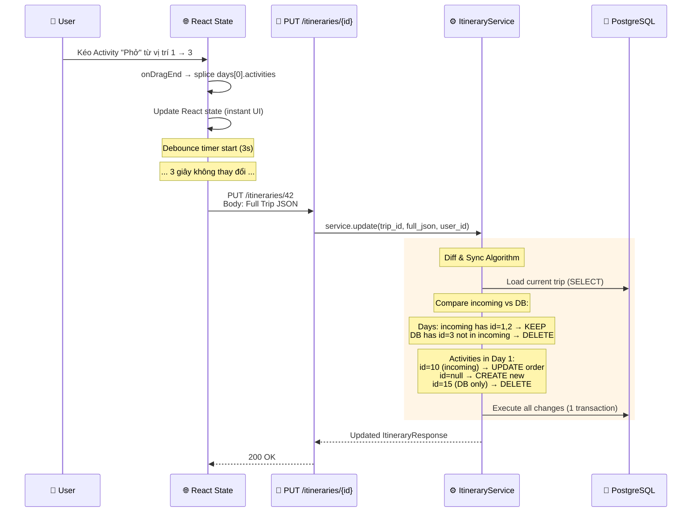
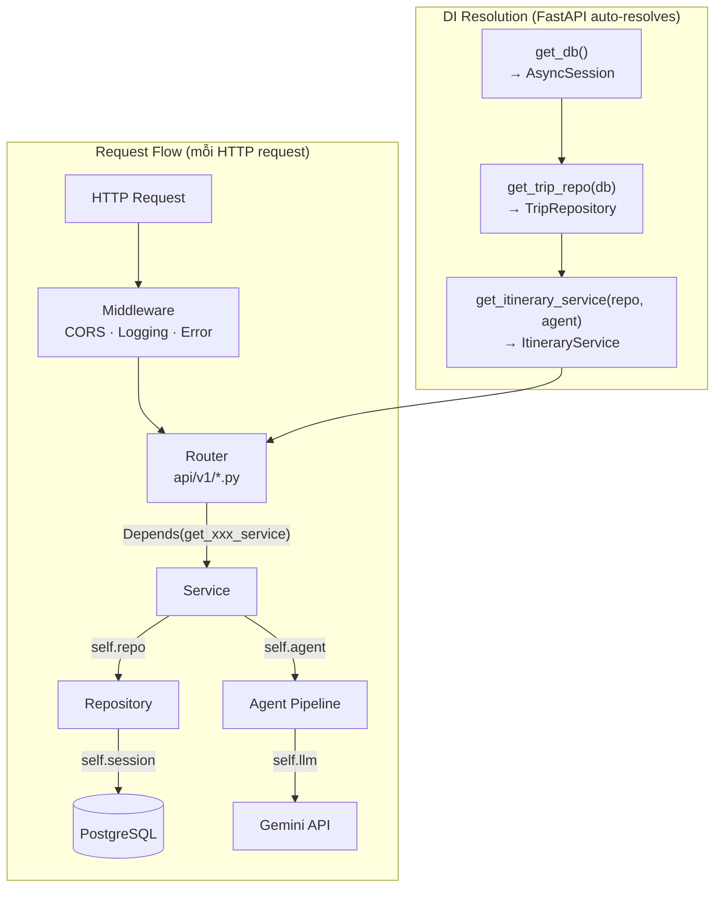

# Part 3: Backend Refactor — DETAILED (Function-Level)

> **Quyết định đã chốt:** Integer ID, Rate Limit AI, Goong key placeholder, CRUD trước AI sau
> **Mỗi file:** Max 150 dòng. Nếu dài hơn → tách helper.
> **Mỗi function:** Max 30 dòng. Type hints bắt buộc.
> **Decision lock v4.1:** Public API contract bám `trip.types.ts` và camelCase; `GET /itineraries/{id}`
> owner-only; share public qua `shareToken`; guest claim qua one-time `claimToken`; generate đi direct
> `ItineraryPipeline`; Supervisor chỉ cho chat/analytics natural-language; Analytics là optional/MVP2+.

## Mục đích file này

Đây là file QUAN TRỌNG NHẤT cho việc implement. Nếu 00_overview giải thích TẠI SAO, thì file này giải thích CÁCH — cụ thể từng file, từng function, từng tham số input/output.

Nội dung chia làm 10 phần:
1. **Git strategy** — Branch nào, merge khi nào
2. **DI chain** — Dependency injection hoạt động thế nào, async vs sync
3. **File-by-file spec** — Mỗi file trong `src/` làm gì, chứa hàm nào
4. **Latency budget** — Mỗi endpoint phải trả trong bao lâu
5. **Pipeline chi tiết** — Từng bước xử lý cho 2 endpoint phức tạp nhất
6. **Service signatures** — Business logic functions
7. **Repository signatures** — Data access functions
8. **Router specs** — HTTP endpoint code
9. **Schema specs** — Pydantic models (request + response)
10. **Error handling** — Exception chain

---

## 0. System Architecture Overview — BE Focus

> [!NOTE]
> Chi tiết toàn hệ thống (FE + BE + AI + Infrastructure) xem [13_architecture_overview.md](13_architecture_overview.md).
> Chi tiết AI Agent (direct pipeline + Supervisor vừa đủ, tools, LangGraph) xem [04_ai_agent_plan.md](04_ai_agent_plan.md).
> Section này tập trung vào **BE layers** và cách FE kết nối.

### §0.1 BE Layer Architecture (Mermaid)



### §0.2 Giải thích từng Layer (BE focus)

**Router Layer** — Chỉ làm 3 việc:
1. Parse HTTP request (headers, body, query params)
2. Gọi Service tương ứng (DI injected)
3. Format HTTP response (status code, JSON body)
- **KHÔNG chứa business logic** — nếu thấy `if/else` phức tạp trong router → move to service

**Service Layer** — Chứa business logic:
- Validate business rules (trip owner? rate limit? quota check?)
- Orchestrate repo calls (có thể gọi nhiều repos)
- Call AI module khi cần (generate, chat)
- **KHÔNG chứa SQL** — SQL nằm trong Repository

**Repository Layer** — Data access:
- 1 repo = 1 entity (UserRepo → users table)
- SQLAlchemy async queries
- **KHÔNG chứa business logic** — chỉ CRUD + specialized queries

**AI Module** — Tách riêng, public API = 4 files:
- `itinerary_pipeline.py` → direct structured-output pipeline cho EP-8, không qua Supervisor.
- `companion_service.py` → LangGraph multi-turn chat, trả patch/proposed operations thay vì tự ghi DB.
- `supervisor.py` 🆕 → chỉ điều phối chat/analytics natural-language, không bọc CRUD/direct generate/suggest.
- `analytics_pipeline.py` 🆕 → Text-to-SQL optional/MVP2+, self-user, read-only role + allowlist.
- **Quy tắc:** Code trong `src/services/` KHÔNG import trực tiếp `src/agent/tools/`. Chỉ import `itinerary_pipeline`, `companion_service`, `suggestion_service`, hoặc `supervisor` theo đúng scope.

### §0.3 Drag-Drop Auto-Save — JSON Storage Architecture

**WHAT:** Khi user kéo thả activities trên FE → FE gửi toàn bộ trip dưới dạng JSON → BE nhận, so sánh với DB (diff), và chỉ update phần thay đổi (sync).

**WHY dùng full JSON thay vì PATCH?**
- FE luôn có full trip state trong React → gửi full dễ hơn gửi diff
- BE tự diff → đảm bảo consistency (FE không cần logic phức tạp)
- AI Agent cũng output JSON cùng format → tái sử dụng sync logic



**Diff & Sync Algorithm chi tiết:**

```python
async def sync_days(trip_id: int, incoming_days: list[DayData]) -> None:
    """So sánh incoming days với DB → CREATE/UPDATE/DELETE.
    
    Algorithm:
    1. Load current days from DB → dict[id, DayORM]
    2. For each incoming day:
       a. has id? → UPDATE (if changed)
       b. no id (null)? → CREATE new day
    3. DB days NOT in incoming → DELETE (cascade activities)
    4. For each day → run sync_activities() recursively
    """
```

**JSON format mà FE gửi:** (đây cũng là format AI Agent output khi modify trip)

```json
{
  "tripName": "Hà Nội 3 ngày",
  "totalBudget": 5000000,
  "days": [
    {
      "id": 1,           // integer → UPDATE existing
      "label": "Ngày 1",
      "date": "2026-05-01",
      "activities": [
        {
          "id": 10,       // integer → UPDATE
          "name": "Phở Bát Đàn",
          "time": "08:00",
          "type": "food",
          "order_index": 0  // ← position after drag
        },
        {
          "id": null,     // null → CREATE new
          "name": "Café Giảng",
          "time": "09:30",
          "type": "food"
        }
      ]
    }
  ],
  "accommodations": [...]
}
```

> [!TIP]
> JSON format này được dùng ở 2 nơi: (1) FE auto-save (`PUT /itineraries/{id}`) và (2) AI Companion trả `proposedOperations` để user xác nhận. Khi user confirm, FE gọi endpoint apply/update dùng chung sync logic ở BE → đơn giản, không duplicate code, và AI không tự ghi DB ngoài ý muốn.

---

## 1. Git Branching Strategy

Mỗi phase của refactor là **1 roadmap bucket** để chia scope lớn. Nhưng execution thật nên đi theo
**branch ticket nhỏ** để dễ review, test, squash và trace theo task ID. Lý do: nếu phase C
(AI Agent) có bug nghiêm trọng, code của phase A+B đã merge vào main và vẫn safe; đồng thời branch
ticket nhỏ giúp mỗi PR đúng 1 mục tiêu rõ ràng.

Quy tắc: **luôn checkout từ main mới nhất** trước khi bắt đầu phase mới. Điều này đảm bảo mỗi branch đều có code của các phase trước.

> [!IMPORTANT]
> Format branch thực tế: `type/task-phase-scope`, ví dụ `feat/12345-b1-auth-register`.
> Trước khi mở PR: squash branch còn đúng 1 commit cuối với format
> `type: [#Task-ID] description`.

```mermaid
gitgraph
    commit id: "main (current)"
    branch feat/be-foundation
    checkout feat/be-foundation
    commit id: "A1: uv init + folders"
    commit id: "A2: core/ layer"
    commit id: "A3: base/ ABCs"
    commit id: "A4: models/ 16 core tables"
    commit id: "A5: Alembic + Docker"
    checkout main
    merge feat/be-foundation id: "PR #1: Foundation"
    branch feat/be-auth-users
    checkout feat/be-auth-users
    commit id: "B1: Auth domain"
    commit id: "B2: User domain"
    commit id: "B3: Unit tests"
    checkout main
    merge feat/be-auth-users id: "PR #2: Auth+Users"
    branch feat/be-itineraries
    checkout feat/be-itineraries
    commit id: "B4: Trip CRUD"
    commit id: "B5: Activity CRUD"
    commit id: "B6: Accommodation"
    commit id: "B7: Places + Saved"
    checkout main
    merge feat/be-itineraries id: "PR #3: Itineraries"
    branch feat/be-ai-agent
    checkout feat/be-ai-agent
    commit id: "C1: Itinerary Agent"
    commit id: "C2: Companion Agent"
    commit id: "C3: WebSocket"
    checkout main
    merge feat/be-ai-agent id: "PR #4: AI Agent"
```

### Git Commands cho mỗi Phase

```bash
# Ví dụ branch ticket thuộc Phase A: Foundation
git checkout main
git checkout -b feat/12345-a-foundation-uv-bootstrap
# ... work ...
git push origin feat/12345-a-foundation-uv-bootstrap
# → Tạo PR → review → merge

# Ví dụ branch ticket thuộc Phase B1: Auth + Users 
git checkout main && git pull
git checkout -b feat/12346-b1-auth-register
# ... work ...

# Ví dụ branch ticket thuộc Phase B2: Itineraries
git checkout main && git pull
git checkout -b feat/12347-b2-itinerary-create

# Ví dụ branch ticket thuộc Phase C: AI Agent
git checkout main && git pull
git checkout -b feat/12348-c-ai-chat-history
```

---

## 2. Complete DI (Dependency Injection) Chain

Dependency Injection là cơ chế **tự động cung cấp** các object mà function cần. Thay vì developer phải tự tạo `repo = TripRepository(session)` rồi truyền vào service, FastAPI `Depends()` tự làm việc này cho mỗi request.

Chuỗi DI đi từ dưới lên: `get_db()` tạo session → `get_trip_repo(session)` tạo repo → `get_itinerary_service(repo)` tạo service → Router nhận service và gọi. Tất cả tự động, developer chỉ cần khai báo `Depends()` trong function signature.



### Async vs Sync Rules

Quy tắc quan trọng: **mọi thứ có I/O (database, HTTP, file) phải dùng `async`**. Các hàm tính toán thuần (hash password, format string, validate data) dùng `sync`.

Tại sao quan trọng? Vì Python `async` cho phép server xử lý nhiều request cùng lúc. Khi 1 request đang chờ DB trả kết quả (await), server có thể xử lý request khác. Nếu dùng sync cho DB query, server sẽ BỊ CHẶN — không xử lý được request nào khác cho đến khi query xong.

```python
# ✅ ASYNC: Database operations, HTTP calls, AI calls
async def get_by_id(self, id: int) -> User | None:
    result = await self.session.execute(select(User).where(User.id == id))
    return result.scalar_one_or_none()

# ✅ ASYNC: Service methods that call repo
async def get_profile(self, user_id: int) -> UserResponse:
    user = await self.user_repo.get_by_id(user_id)
    if not user:
        raise NotFoundException("User not found")
    return UserResponse.model_validate(user)

# ✅ SYNC: Pure computation, no I/O
def hash_password(self, password: str) -> str:
    return pwd_context.hash(password)

# ✅ SYNC: Validation, formatting
def format_currency(amount: int) -> str:
    return f"{amount:,.0f} VND"
```

---

## 3. File-by-File Specification

Phần này chi tiết từng file sẽ tạo trong `src/`. Mỗi file có: docstring giải thích mục đích, danh sách functions với type hints đầy đủ, và code mẫu.

Luư ý: code mẫu ở đây là **specification** (chi tiết kỹ thuật), KHÔNG phải production code. Khi implement thật, phải viết đầy đủ logic bên trong.

### 3.1 `src/main.py` (~60 lines)

File entry point của ứng dụng. Dùng **App Factory pattern** — function `create_app()` tạo và cấu hình `FastAPI` instance. Tại sao dùng pattern này? Vì khi viết test, có thể gọi `create_app()` với config khác (VD: database test).

```python
"""FastAPI application factory.

Tạo app, register routers, setup middleware, lifespan events.
"""
from contextlib import asynccontextmanager
from fastapi import FastAPI
from src.core.config import get_settings
from src.core.middlewares import setup_middlewares
from src.api.v1.router import api_v1_router

@asynccontextmanager
async def lifespan(app: FastAPI):
    """Startup: verify DB connection. Shutdown: cleanup."""
    # startup
    yield
    # shutdown

def create_app() -> FastAPI:
    """App factory pattern."""
    settings = get_settings()
    app = FastAPI(
        title=settings.app_name,
        version=settings.app_version,
        lifespan=lifespan,
    )
    setup_middlewares(app, settings)
    app.include_router(api_v1_router, prefix="/api/v1")
    return app

app = create_app()
```

---

### 3.2 `src/core/config.py` (~80 lines)

Tất cả cấu hình của ứng dụng nằm trong 1 class duy nhất. Secrets (API keys, password) lấy từ file `.env` (không commit vào git). Config không bí mật (app name, CORS origins) lấy từ `config.yaml`.

Dùng `@lru_cache` để settings chỉ được tạo 1 lần (singleton) — tránh đọc `.env` lặp lại mỗi request.

```python
"""Application configuration.

Merge config.yaml (non-secrets) + .env (secrets).
Singleton pattern via lru_cache.
"""
from functools import lru_cache
from pydantic_settings import BaseSettings

class AppSettings(BaseSettings):
    """All application settings.
    
    Attributes:
        database_url: PostgreSQL connection string (from .env)
        jwt_secret_key: JWT signing key (from .env)
        gemini_api_key: Google Gemini API key (from .env)
        goong_api_key: Goong Maps API key (from .env, optional)
        redis_url: Redis connection string (from .env)
        app_name: Display name (from config.yaml)
        app_version: Semantic version (from config.yaml)
        debug: Debug mode flag (from config.yaml)
        cors_origins: Allowed FE origins (from config.yaml)
        access_token_expire_minutes: JWT access token TTL
        refresh_token_expire_days: Refresh token TTL
        agent_model: LLM model name
        agent_temperature: LLM temperature
        agent_max_retries: Max retry on AI failure
        agent_timeout_seconds: Timeout per LLM call
        rate_limit_ai_free: Max AI calls per day (free tier)
        rate_limit_api: Max API calls per minute
    """
    # Secrets (.env)
    database_url: str
    jwt_secret_key: str
    gemini_api_key: str = ""
    goong_api_key: str = ""  # Placeholder — user sẽ điền sau
    redis_url: str = "redis://localhost:6379"
    
    # App config
    app_name: str = "DuLichViet API"
    app_version: str = "2.0.0"
    debug: bool = False
    cors_origins: list[str] = ["http://localhost:5173"]
    
    # Auth
    access_token_expire_minutes: int = 15
    refresh_token_expire_days: int = 30
    min_password_length: int = 6
    
    # Agent
    agent_model: str = "gemini-2.5-flash"
    agent_temperature: float = 0.7
    agent_max_retries: int = 2
    agent_timeout_seconds: int = 30
    
    # Rate limiting
    rate_limit_ai_free: int = 3        # AI calls/day
    rate_limit_api: int = 100          # API calls/minute
    
    model_config = SettingsConfigDict(env_file=".env")

@lru_cache
def get_settings() -> AppSettings:
    """Singleton settings instance."""
    return AppSettings()
```

---

### 3.3 `src/core/database.py` (~50 lines)

```python
"""Async database engine and session factory.

Functions:
    get_async_engine() -> AsyncEngine
    get_session_factory() -> async_sessionmaker
    get_db() -> AsyncGenerator[AsyncSession, None]  (FastAPI Depends)
"""
from sqlalchemy.ext.asyncio import (
    AsyncEngine, AsyncSession, async_sessionmaker, create_async_engine
)
from sqlalchemy.orm import DeclarativeBase

class Base(DeclarativeBase):
    """SQLAlchemy declarative base for all models."""
    pass

def get_async_engine(database_url: str) -> AsyncEngine:
    """Create async engine with connection pool settings.
    
    Args:
        database_url: PostgreSQL async URL (postgresql+asyncpg://...)
    
    Returns:
        Configured AsyncEngine with pool_size=5, max_overflow=10.
    """

def get_session_factory(engine: AsyncEngine) -> async_sessionmaker[AsyncSession]:
    """Create session factory bound to engine."""

async def get_db() -> AsyncGenerator[AsyncSession, None]:
    """FastAPI dependency — yield async session, auto-close."""
```

---

### 3.4 `src/core/security.py` (~120 lines)

File này xử lý 2 việc: **password hashing** (bcrypt) và **JWT token management**.

Password hashing: không bao giờ lưu password dạng plain text trong DB. `hash_password()` biến "mypassword" thành "$2b$12$..." (chuỗi không thể đảo ngược). `verify_password()` so sánh password user nhập với hash đã lưu.

JWT tokens: `create_access_token()` tạo token ngắn (15 phút), `create_refresh_token()` tạo token dài (30 ngày). Refresh token được lưu hash trong DB (không lưu token thô) — nếu DB bị lộ, attacker vẫn không có raw token.

```python
"""JWT token management and password hashing.

Functions:
    hash_password(plain: str) -> str
    verify_password(plain: str, hashed: str) -> bool
    create_access_token(user_id: int) -> str
    create_refresh_token(user_id: int) -> tuple[str, str]
        Returns: (raw_token, token_hash) — raw sent to client, hash stored in DB
    verify_access_token(token: str) -> dict | None
    verify_refresh_token_hash(raw_token: str, stored_hash: str) -> bool
"""

# --- Password ---
def hash_password(plain: str) -> str:
    """Hash password with bcrypt.
    
    Args: plain: Raw password string.
    Returns: Bcrypt hash string.
    """

def verify_password(plain: str, hashed: str) -> bool:
    """Verify password against bcrypt hash.
    
    Args:
        plain: Raw password from user input.
        hashed: Stored bcrypt hash from DB.
    Returns: True if match.
    """

# --- JWT ---
def create_access_token(user_id: int) -> str:
    """Create short-lived JWT access token.
    
    Args: user_id: Integer user ID.
    Returns: JWT string. Payload: {sub: str(user_id), exp: datetime}
    Expiry: settings.access_token_expire_minutes (default 15 min).
    """

def create_refresh_token(user_id: int) -> tuple[str, str]:
    """Create long-lived refresh token.
    
    Returns:
        Tuple of (raw_token, token_hash).
        raw_token → sent to client in response.
        token_hash → stored in refresh_tokens DB table.
    Expiry: settings.refresh_token_expire_days (default 30 days).
    """

def verify_access_token(token: str) -> dict | None:
    """Decode and verify JWT access token.
    
    Args: token: JWT string from Authorization header.
    Returns: Payload dict {sub, exp} or None if invalid/expired.
    """
```

---

### 3.5 `src/core/exceptions.py` (~60 lines)

Custom exceptions cho phép trả lỗi có nghĩa cho FE. Thay vì trả `500 Internal Server Error` cho mọi trường hợp, mỗi loại lỗi có status code riêng và message riêng. FE đọc `error_code` để biết hiển thị gì (VD: "email đã tồn tại" thay vì "có lỗi").

Middleware `global_exception_handler` bắt mọi exception và format thành JSON response chuẩn.

```python
"""Custom HTTP exceptions with standard error response format.

All exceptions follow format:
    {"detail": str, "error_code": str, "status_code": int}
    
Classes:
    AppException(HTTPException) — Base, 500
    NotFoundException — 404
    ConflictException — 409 (email exists, duplicate)
    ForbiddenException — 403 (not owner)
    UnauthorizedException — 401 (bad token)
    ValidationException — 422 (bad input)
    RateLimitException — 429 (too many requests)
    ServiceUnavailableException — 503 (AI down)
"""
```

---

### 3.6 `src/core/dependencies.py` (~100 lines)

Đây là "trung tâm điều phối" của DI chain. File này định nghĩa TẤT CẢ các `get_*` function mà Router dùng `Depends()`. Mỗi function tạo 1 instance và trả về.

Ví dụ: `get_itinerary_service()` nhận 3 repo từ DI → tạo `ItineraryService(trip_repo, place_repo, hotel_repo)` → return. Router không biết cách tạo service — chỉ kết quả.

Function đặc biệt: `get_current_user()` parse JWT từ header `Authorization: Bearer <token>` → trả User object. `get_current_user_optional()` trả `None` nếu không có token (cho guest endpoints).

```python
"""FastAPI Dependency Injection chain.

Chain: get_db → get_*_repo → get_*_service

All functions are sync (return instances), except get_db (async generator).
FastAPI resolves the chain automatically via Depends().

Functions:
    get_db() -> AsyncSession
    get_current_user(token, db) -> User
    get_current_user_optional(token, db) -> User | None
    get_user_repo(db) -> UserRepository
    get_trip_repo(db) -> TripRepository
    get_place_repo(db) -> PlaceRepository  
    get_hotel_repo(db) -> HotelRepository
    get_refresh_token_repo(db) -> RefreshTokenRepository
    get_auth_service(user_repo, token_repo) -> AuthService
    get_user_service(user_repo) -> UserService
    get_itinerary_service(trip_repo, place_repo, hotel_repo) -> ItineraryService
    get_place_service(place_repo) -> PlaceService
    get_rate_limiter() -> RateLimiter
"""

# Example DI chain:
async def get_current_user(
    token: str = Depends(oauth2_scheme),
    db: AsyncSession = Depends(get_db),
) -> User:
    """Extract and verify user from JWT token.
    
    Args:
        token: JWT from Authorization: Bearer <token> header.
        db: Async database session.
    
    Returns:
        User ORM object.
    
    Raises:
        UnauthorizedException: Token invalid/expired or user not found.
    """

def get_itinerary_service(
    trip_repo: TripRepository = Depends(get_trip_repo),
    place_repo: PlaceRepository = Depends(get_place_repo),
    hotel_repo: HotelRepository = Depends(get_hotel_repo),
) -> ItineraryService:
    """Inject ItineraryService with all required repositories.
    
    Returns:
        Configured ItineraryService instance.
    """
    return ItineraryService(trip_repo, place_repo, hotel_repo)
```

---

### 3.7 `src/core/rate_limiter.py` (~80 lines)

Rate limiter dùng Redis để đếm số lần gọi API. Mỗi lần user gọi AI, Redis tăng counter. Counter ≥ limit → trả HTTP 429.

`RateLimitInfo` là schema trả về cho FE khi gọi `GET /agent/rate-limit-status` — FE dùng để hiển thị "Còn 2/3 lượt hôm nay".

```python
"""Redis-based rate limiter for API and AI endpoints.

Strategy:
    - AI Generation: 3 calls/day per user (free tier)
    - General API: 100 calls/minute per IP
    - Uses sliding window counter in Redis

Classes:
    RateLimiter:
        check_ai_limit(user_id: int) -> bool
        check_api_limit(ip: str) -> bool
        get_remaining(user_id: int) -> RateLimitInfo

Functions:
    rate_limit_ai(user = Depends(get_current_user)) -> None
        FastAPI dependency — raises RateLimitException if exceeded.
"""

class RateLimitInfo(BaseModel):
    """Rate limit status.
    
    Attributes:
        remaining: Calls remaining in current window.
        limit: Total allowed in window.
        reset_at: When the window resets (UTC timestamp).
    """
    remaining: int
    limit: int
    reset_at: datetime

class RateLimiter:
    """Redis-backed rate limiter.
    
    Args:
        redis: Async Redis connection.
        settings: AppSettings for limits config.
    """
    
    async def check_ai_limit(self, user_id: int) -> bool:
        """Check if user can make AI generation call.
        
        Key pattern: rate:ai:{user_id}:{date}
        Window: 24 hours (resets at midnight UTC)
        Limit: settings.rate_limit_ai_free (default 3)
        
        Returns: True if allowed, False if exceeded.
        """
    
    async def get_remaining(self, user_id: int) -> RateLimitInfo:
        """Get remaining AI calls for user today."""
```

---

### 3.8 `src/base/repository.py` (~80 lines)

Đây là **Abstract Base Class** (ABC) cho mọi repository. Nó định nghĩa 5 method bắt buộc mà mọi concrete repo PHẢI implement: `get_by_id`, `get_all`, `create`, `update`, `delete`.

Tại sao cần ABC? Vì nó tạo ra **hợp đồng** (contract) — nếu developer tạo `HotelRepository` nhưng quên implement `delete()`, Python sẽ báo lỗi ngay khi import (không đợi đến runtime mới crash). Dùng `Generic[T]` để type-safe: `BaseRepository[User]` biết `get_by_id()` trả về `User | None`.

```python
"""Abstract Base Repository — Generic CRUD pattern.

TypeVar T = SQLAlchemy model type.
All concrete repos MUST implement these methods.

Methods (all async):
    get_by_id(id: int) -> T | None
    get_all(skip: int, limit: int) -> list[T]
    create(**kwargs) -> T
    update(id: int, **kwargs) -> T | None
    delete(id: int) -> bool
    count() -> int
"""

from abc import ABC, abstractmethod
from typing import Generic, TypeVar, Sequence

T = TypeVar("T")

class BaseRepository(ABC, Generic[T]):
    """Abstract base for all data access layers.
    
    Args:
        session: SQLAlchemy AsyncSession (injected via DI).
    """
    
    def __init__(self, session: AsyncSession):
        self.session = session
    
    @abstractmethod
    async def get_by_id(self, id: int) -> T | None:
        """Fetch single record by primary key.
        
        Args: id: Integer primary key.
        Returns: Model instance or None.
        """
    
    @abstractmethod
    async def get_all(
        self, skip: int = 0, limit: int = 20
    ) -> Sequence[T]:
        """Fetch paginated list.
        
        Args:
            skip: Offset (default 0).
            limit: Max records (default 20, max 100).
        Returns: List of model instances.
        """
    
    @abstractmethod
    async def create(self, **kwargs) -> T:
        """Insert new record.
        
        Args: **kwargs: Column values.
        Returns: Created model instance with generated ID.
        """
    
    @abstractmethod
    async def update(self, id: int, **kwargs) -> T | None:
        """Update existing record.
        
        Args:
            id: Record ID.
            **kwargs: Fields to update (only non-None).
        Returns: Updated model or None if not found.
        """
    
    @abstractmethod
    async def delete(self, id: int) -> bool:
        """Delete record by ID.
        
        Returns: True if deleted, False if not found.
        """
```

---

### 3.9 `src/base/schema.py` (~30 lines)

Base class ngắn nhưng quan trọng: tự động convert snake_case (Python) → camelCase (JavaScript) khi trả JSON response. Mọi response schema kế thừa từ `CamelCaseModel` và không cần làm gì thêm.

`from_attributes=True` cho phép tạo Pydantic model từ SQLAlchemy ORM object (VD: `UserResponse.model_validate(user_orm)`).

```python
"""Base Pydantic schema with camelCase alias for FE compatibility.

FE uses camelCase (adultPrice), BE uses snake_case (adult_price).
This base class auto-converts on serialization.
"""
from pydantic import BaseModel, ConfigDict
from pydantic.alias_generators import to_camel

class CamelCaseModel(BaseModel):
    """Base model: snake_case in Python → camelCase in JSON response.
    
    Usage:
        class ActivityResponse(CamelCaseModel):
            adult_price: int  # → JSON: "adultPrice"
    """
    model_config = ConfigDict(
        from_attributes=True,        # Allow ORM → Pydantic
        alias_generator=to_camel,    # snake→camel
        populate_by_name=True,       # Allow both formats on input
    )
```

---

## 4. Endpoint Latency Budget

Mỗi endpoint có **thời gian mục tiêu** và **thời gian tối đa**. Nếu vượt thời gian tối đa → cần xử lý (timeout, partial response).

Đây là cơ sở để chọn chiến lược: endpoint nào cần Redis cache (giảm latency), endpoint nào cần eager loading (tránh N+1 query), endpoint nào cần timeout (AI calls).

```
┌─────────────────────────────────────────────────────────────────┐
│                    LATENCY BUDGET PER ENDPOINT                   │
├──────────────────────────────┬──────────┬──────────┬────────────┤
│ Endpoint                     │ Target   │ Max      │ Strategy   │
├──────────────────────────────┼──────────┼──────────┼────────────┤
│ GET  /destinations           │ <50ms    │ 200ms    │ Redis cache│
│ GET  /places/search          │ <100ms   │ 500ms    │ Redis cache│
│ POST /auth/login             │ <200ms   │ 500ms    │ bcrypt     │
│ GET  /itineraries/{id}       │ <100ms   │ 300ms    │ Eager load │
│ PUT  /itineraries/{id}       │ <200ms   │ 500ms    │ Batch write│
│ POST /itineraries/generate   │ <10s     │ 30s      │ AI timeout │
│ WS   /ws/agent-chat          │ <5s/msg  │ 15s/msg  │ Streaming  │
│ GET  /agent/suggest          │ <200ms   │ 500ms    │ DB only    │
└──────────────────────────────┴──────────┴──────────┴────────────┘

Nếu POST /generate > 30s → return HTTP 503 + retry message
Nếu WS message > 15s → send partial + "đang xử lý..."
```

---

## 5. Request → Response Pipeline (chi tiết từng bước)

Phần này chỉ ra **chính xác** dữ liệu đi qua từng layer như thế nào — input gì, output gì, mất bao lâu, async hay sync.

Đọc phần này khi debug hoặc khi cần hiểu "data đi từ request body đến database như thế nào".

### 5.1 Pipeline: `POST /api/v1/itineraries/generate`

Đây là endpoint phức tạp nhất (15 bước, ~20 giây). Từng bước được liệt kê với thời gian dự kiến:

```
Step  │ Layer        │ Function                    │ Input                      │ Output                    │ Async │ Time
──────┼──────────────┼─────────────────────────────┼────────────────────────────┼───────────────────────────┼───────┼──────
  1   │ Middleware   │ log_request()               │ Request object             │ (pass through)            │ Yes   │ <1ms
  2   │ Middleware   │ rate_limit_ai()             │ user_id from JWT           │ pass or 429 error         │ Yes   │ <5ms
  3   │ Router      │ generate_itinerary()        │ TripGenerateRequest body   │ ItineraryResponse         │ Yes   │ —
  4   │ DI          │ get_current_user_optional()  │ Bearer token               │ User | None               │ Yes   │ <10ms
  5   │ DI          │ get_itinerary_service()      │ repos from DI              │ ItineraryService          │ Sync  │ <1ms
  6   │ Service     │ generate_itinerary()         │ request, user_id           │ ItineraryResponse         │ Yes   │ —
  7   │ Service     │ _validate_input()            │ TripGenerateRequest        │ ValidatedInput            │ Yes   │ <10ms
  8   │ Repository  │ place_repo.get_by_dest()     │ city, categories           │ list[Place] (metadata)    │ Yes   │ <50ms
  9   │ Agent       │ pipeline.build_prompt()      │ validated + places         │ str (prompt)              │ Sync  │ <1ms
 10   │ Agent       │ pipeline.call_llm()          │ prompt string              │ AgentItinerary (Pydantic) │ Yes   │ 5-15s
 11   │ Service     │ _enrich_from_db()            │ AgentItinerary             │ enriched dict             │ Yes   │ <50ms
 12   │ Service     │ _validate_budget()           │ enriched, budget           │ adjusted dict             │ Sync  │ <1ms
 13   │ Repository  │ trip_repo.create_full()      │ trip + days + activities   │ Trip (with all relations) │ Yes   │ <100ms
 14   │ Schema      │ ItineraryResponse.validate() │ Trip ORM                   │ ItineraryResponse JSON    │ Sync  │ <5ms
 15   │ Router      │ return response              │ ItineraryResponse          │ HTTP 201 JSON             │ —     │ <1ms
──────┴──────────────┴─────────────────────────────┴────────────────────────────┴───────────────────────────┴───────┴──────
                                                                                              Total target: <20s
```

### 5.2 Pipeline: `PUT /api/v1/itineraries/{id}` (Auto-save)

Endpoint thường xuyên nhất — mỗi 3 giây FE gọi 1 lần khi user đang edit. Phải nhanh (<200ms) để không lag UI.

```
Step  │ Function                     │ Input                      │ Output              │ Time
──────┼──────────────────────────────┼────────────────────────────┼─────────────────────┼──────
  1   │ get_current_user()           │ Bearer token               │ User                │ <10ms
  2   │ itinerary_service.update()   │ trip_id, TripUpdateRequest │ ItineraryResponse   │ —
  3   │ trip_repo.get_by_id()        │ trip_id                    │ Trip | None         │ <20ms
  4   │ _check_ownership()           │ trip.user_id, user.id      │ pass or 403         │ <1ms
  5   │ _sync_days()                 │ existing days, new days    │ updated days        │ <50ms
  6   │ _sync_activities()           │ per day                    │ updated activities  │ <50ms
  7   │ _sync_accommodations()       │ existing, new              │ updated accoms      │ <30ms
  8   │ session.commit()             │ —                          │ —                   │ <20ms
  9   │ _invalidate_cache()          │ trip_id                    │ Redis DEL           │ <5ms
 10   │ Return ItineraryResponse     │ Trip ORM                   │ JSON                │ <5ms
──────┴──────────────────────────────┴────────────────────────────┴─────────────────────┴──────
                                                                         Total: <200ms
```

---

## 6. Service Layer — Function Signatures

Service là nơi chứa **toàn bộ business logic**. Service không biết HTTP, không biết SQL — chỉ biết "validate quyền sở hữu", "tính chi phí", "gọi AI Agent". Dưới đây là từng service với details function.

### 6.1 `src/services/auth_service.py` (~120 lines)

Xử lý 4 luồng auth: register (tạo tài khoản), login (đăng nhập), refresh (gia hạn token), logout (revoke token). Mỗi function được mô tả với: input, output, exceptions, và các bước xử lý.

```python
"""Authentication service — register, login, refresh, logout.

Dependencies: UserRepository, RefreshTokenRepository
"""

class AuthService:
    """Handles all authentication operations.
    
    Args:
        user_repo: UserRepository instance.
        token_repo: RefreshTokenRepository instance.
    """
    
    def __init__(
        self,
        user_repo: UserRepository,
        token_repo: RefreshTokenRepository,
    ):
        self.user_repo = user_repo
        self.token_repo = token_repo
    
    async def register(
        self, data: RegisterRequest
    ) -> AuthResponse:
        """Register new user account.
        
        Args:
            data: RegisterRequest public JSON {email, password, name}
        
        Returns:
            AuthResponse {access_token, refresh_token, user: UserResponse}
        
        Raises:
            ConflictException: Email already exists.
            ValidationException: Password too short.
        
        Steps:
            1. Check email uniqueness
            2. Hash password
            3. Create user in DB
            4. Generate JWT pair
            5. Store refresh token hash in DB
            6. Return AuthResponse
        """
    
    async def login(
        self, data: LoginRequest
    ) -> AuthResponse:
        """Login with email + password.
        
        Args:
            data: LoginRequest {email, password}
        
        Returns:
            AuthResponse with JWT pair.
        
        Raises:
            UnauthorizedException: Wrong email or password.
        """
    
    async def refresh(
        self, refresh_token: str
    ) -> TokenPair:
        """Rotate refresh token.
        
        Args:
            refresh_token: Raw refresh token from client.
        
        Returns:
            TokenPair {access_token, refresh_token} — NEW pair.
        
        Raises:
            UnauthorizedException: Token invalid, expired, or revoked.
        
        Steps:
            1. Find token in DB by hash
            2. Verify not expired, not revoked
            3. Revoke old token
            4. Create new pair
            5. Store new refresh hash
        """
    
    async def logout(self, user_id: int) -> None:
        """Revoke all refresh tokens for user.
        
        Args:
            user_id: Authenticated user ID.
        """
```

### 6.2 `src/services/itinerary_service.py` (~150 lines, tách helpers)

File lớn nhất trong service layer. MVP1 là 1 file 654 dòng — MVP2 tách thành 3 file:
- `itinerary_service.py` (150 dòng) — CRUD orchestration chính
- `_itinerary_sync.py` (80 dòng) — Diff & sync logic cho auto-save
- `_itinerary_validators.py` (50 dòng) — Ownership + budget checks

File helper dùng prefix `_` để chỉ rõ là module internal, không được import từ bên ngoài.

```python
"""Itinerary service — Trip CRUD + AI generation orchestration.

Dependencies: TripRepository, PlaceRepository, HotelRepository
AI generation delegated to agent/pipelines/itinerary_pipeline.py

Files tách:
    - itinerary_service.py: CRUD orchestration (~150 lines)
    - _itinerary_sync.py:  Auto-save sync logic (~80 lines)
    - _itinerary_validators.py: Ownership + budget checks (~50 lines)
"""

class ItineraryService:
    
    def __init__(
        self,
        trip_repo: TripRepository,
        place_repo: PlaceRepository,
        hotel_repo: HotelRepository,
    ):
        self.trip_repo = trip_repo
        self.place_repo = place_repo
        self.hotel_repo = hotel_repo
    
    # --- AI Generation ---
    
    async def generate(
        self,
        request: TripGenerateRequest,
        user_id: int | None,
    ) -> ItineraryResponse:
        """Generate itinerary via AI Agent pipeline.
        
        Args:
            request public JSON: {destination, startDate, endDate, budget,
                      interests, adultsCount, childrenCount}
            user_id: Authenticated user or None (guest).
        
        Returns:
            ItineraryResponse with full days + activities. Guest response includes one-time claimToken.
        
        Raises:
            ServiceUnavailableException: AI failed after retries.
        
        Pipeline:
            1. Validate → 2. Fetch context → 3. Prompt →
            4. Structured LLM call → 5. Save to DB → 6. Return response
            This path is direct and does not call TravelSupervisor.
        """
    
    # --- CRUD ---
    
    async def create_manual(
        self,
        request: TripCreateRequest,
        user_id: int | None,
    ) -> ItineraryResponse:
        """Create empty trip for manual setup.
        
        Creates Trip + empty TripDays (based on date range).
        User adds activities manually later.
        """
    
    async def get_by_id(self, trip_id: int) -> ItineraryResponse:
        """Get full trip with all nested data.
        
        Eagerly loads: trip → days → activities → extra_expenses
                       trip → accommodations → hotel
        
        Raises: NotFoundException if trip_id not found.
        """
    
    async def list_by_user(
        self,
        user_id: int,
        page: int = 1,
        size: int = 20,
    ) -> PaginatedResponse[ItineraryListItem]:
        """List user's trips (paginated).
        
        Returns: {items: [...], total, page, size, pages}
        """
    
    async def update(
        self,
        trip_id: int,
        data: TripUpdateRequest,
        user_id: int,
    ) -> ItineraryResponse:
        """Full update (auto-save from FE debounce).
        
        Syncs: days + activities + accommodations + extra_expenses
        
        Strategy:
            1. Load existing trip with relations
            2. Check ownership
            3. Diff days: add new, remove deleted, update existing
            4. Diff activities per day: same strategy
            5. Commit all in single transaction
            6. Invalidate Redis cache
        """
    
    async def delete(
        self, trip_id: int, user_id: int
    ) -> None:
        """Delete trip (cascade deletes days, activities, etc).
        
        Raises: ForbiddenException if not owner.
        """
    
    async def rate(
        self, trip_id: int, rating: int, feedback: str | None
    ) -> None:
        """Rate trip 1-5 stars with optional feedback."""
    
    async def share(
        self, trip_id: int, user_id: int
    ) -> ShareResponse:
        """Generate share link with unique token.
        
        Returns public JSON: {shareUrl, shareToken, expiresAt}
        Security: store only token hash; public read uses GET /shared/{shareToken}.
        """

    async def claim(
        self, trip_id: int, user_id: int, claim_token: str
    ) -> ClaimResponse:
        """Attach guest trip to authenticated user.

        Steps: load trip → verify user_id is NULL → verify claim token hash and expiry
        → consume token + update trip owner in one transaction.
        Raises: ForbiddenException for missing/invalid/expired claimToken.
        """
    
    # --- Activity-level CRUD (cho individual edits) ---
    
    async def add_activity(
        self,
        trip_id: int,
        day_id: int,
        data: ActivityUpdateData,
        user_id: int,
    ) -> ActivityResponse:
        """Add single activity to a day.
        
        Steps: verify ownership → create activity → return response.
        Raises: ForbiddenException, NotFoundException.
        """
    
    async def update_activity(
        self,
        trip_id: int,
        activity_id: int,
        data: ActivityUpdateData,
        user_id: int,
    ) -> ActivityResponse:
        """Update single activity.
        
        Steps: verify ownership → update fields → return response.
        """
    
    async def delete_activity(
        self, trip_id: int, activity_id: int, user_id: int
    ) -> None:
        """Delete single activity.
        
        Steps: verify ownership → delete → invalidate cache.
        """
    
    # --- Accommodation CRUD ---
    
    async def add_accommodation(
        self,
        trip_id: int,
        data: AccommodationUpdateData,
        user_id: int,
    ) -> AccommodationResponse:
        """Add accommodation to trip."""
    
    async def delete_accommodation(
        self, trip_id: int, accommodation_id: int, user_id: int
    ) -> None:
        """Remove accommodation from trip."""
```

### 6.4 `src/services/user_service.py` (~80 lines)

Xử lý profile CRUD và đổi mật khẩu. Tách riêng khỏi AuthService vì logic khác nhau — AuthService xử lý authentication (ai là ai?), UserService xử lý profile management (thay đổi thông tin cá nhân).

```python
"""User profile management service.

Dependencies: UserRepository
"""

class UserService:
    
    def __init__(self, user_repo: UserRepository):
        self._user_repo = user_repo
    
    async def get_profile(self, user_id: int) -> UserResponse:
        """Get user profile by ID.
        
        Returns: UserResponse {id, email, name, phone, interests, createdAt}
        Raises: NotFoundException if user not found.
        """
    
    async def update_profile(
        self, user_id: int, data: UpdateProfileRequest
    ) -> UserResponse:
        """Update user profile fields.
        
        Args:
            data public JSON: UpdateProfileRequest {name?, phone?, interests?}
        Returns: Updated UserResponse.
        Note: Email CANNOT be changed (immutable identifier).
        """
    
    async def change_password(
        self, user_id: int, data: ChangePasswordRequest
    ) -> None:
        """Change user password.
        
        Args:
            data: ChangePasswordRequest {current_password, new_password}
        Steps:
            1. Verify current_password matches hash in DB
            2. Validate new_password ≥ 6 chars
            3. Hash new_password → update DB
        Raises:
            UnauthorizedException: Current password wrong.
            ValidationException: New password too short.
        """
```

### 6.5 `src/services/place_service.py` (~100 lines)

Xử lý tìm kiếm địa điểm, destinations, và saved places. Một số method dùng Redis cache vì data ít thay đổi.

```python
"""Place and destination service.

Dependencies: PlaceRepository, HotelRepository, SavedPlaceRepository, Redis
Caching: destinations (60min), search (15min)
"""

class PlaceService:
    
    def __init__(
        self,
        place_repo: PlaceRepository,
        hotel_repo: HotelRepository,
        saved_repo: SavedPlaceRepository,
        redis: Redis,
    ):
        self._place_repo = place_repo
        self._hotel_repo = hotel_repo
        self._saved_repo = saved_repo
        self._redis = redis
    
    async def get_destinations(self) -> list[DestinationResponse]:
        """List all active destinations.
        
        Returns: [{id, name, slug, image, placesCount}]
        Cache: Redis key "destinations", TTL 60min.
        First call: DB query → cache. Next calls: from cache.
        """
    
    async def get_destination_detail(
        self, dest_name: str
    ) -> DestinationDetailResponse:
        """Get destination with all places and hotels.
        
        Returns: {destination info, places: [...], hotels: [...]}
        Cache: Redis key "dest:{name}", TTL 60min.
        """
    
    async def search_places(
        self,
        query: str,
        city: str | None = None,
        category: str | None = None,
        limit: int = 10,
    ) -> list[PlaceResponse]:
        """Search places by keyword + optional filters.
        
        Query: ILIKE '%query%' + optional city/category filter.
        Sorted by: rating DESC.
        Cache: Redis key "places:{city}:{cat}:{query}", TTL 15min.
        Returns: [] empty array if no results (NOT 404).
        """
    
    async def get_place_by_id(self, place_id: int) -> PlaceResponse:
        """Get single place detail.
        
        Raises: NotFoundException.
        """
    
    async def list_saved_places(
        self, user_id: int
    ) -> list[SavedPlaceResponse]:
        """List user's bookmarked places.
        
        Returns: [{id, place: PlaceResponse, createdAt}]
        """
    
    async def save_place(
        self, user_id: int, place_id: int
    ) -> SavedPlaceResponse:
        """Bookmark a place.
        
        Raises: ConflictException if already saved.
        """
    
    async def unsave_place(
        self, user_id: int, saved_id: int
    ) -> None:
        """Remove bookmark.
        
        Raises: NotFoundException if not found.
        """
    
    async def suggest_alternatives(
        self, activity_id: int, limit: int = 5
    ) -> list[PlaceResponse]:
        """Suggest alternative places for an activity.
        
        Logic: Same category, same city, exclude places already in trip.
        Sorted by rating DESC. NO AI call — pure DB query.
        Latency: <100ms.
        """
```

### 6.3 `src/services/_itinerary_sync.py` (~80 lines, helper)

File helper cho auto-save. Chứa logic **Diff & Sync** — so sánh dữ liệu cũ trong DB với dữ liệu mới từ FE, tạo ra danh sách "cần tạo / cần update / cần xóa".

Logic match bằng ID: nếu incoming data có `id=5` và DB cũng có `id=5` → UPDATE. Nếu incoming có `id=null` → CREATE (record mới). Nếu DB có `id=3` nhưng incoming không có → DELETE.

```python
"""Sync helpers for auto-save — diff and merge strategy.

Functions:
    sync_days(existing: list[TripDay], incoming: list[DayData]) -> SyncResult
    sync_activities(existing: list[Activity], incoming: list[ActivityData]) -> SyncResult
    sync_accommodations(existing, incoming) -> SyncResult
"""

class SyncResult:
    """Result of a sync operation.
    
    Attributes:
        to_create: New records to INSERT.
        to_update: Existing records to UPDATE.
        to_delete: IDs to DELETE.
    """

def sync_days(
    existing: list[TripDay],
    incoming: list[DayUpdateData],
) -> SyncResult:
    """Diff existing days vs incoming, produce sync operations.
    
    Strategy:
        - Match by day ID
        - New IDs in incoming → create
        - IDs in existing but not incoming → delete
        - IDs in both → update fields
    """
```

---

## 7. Repository Layer — Function Signatures

Repository chỉ chứa SQL operations. KHÔNG có business logic (đó là việc của Service). Mỗi repo kế thừa `BaseRepository[T]` và thêm các method đặc thù cho entity đó.

### 7.1 `src/repositories/trip_repo.py` (~100 lines)

TripRepository phức tạp nhất vì Trip có nhiều nested relations (Days → Activities → ExtraExpenses, Accommodations → Hotels). Method `get_with_full_data()` dùng `selectinload` để load tất cả relations trong 1 query — tránh [N+1 problem](https://stackoverflow.com/q/97197) (1 query cho trip + N query cho mỗi day + M query cho mỗi activity... → rất chậm).

```python
"""Trip repository — Data access for trips, days, activities.

Implements BaseRepository[Trip].
Uses selectinload for eager loading nested relations.
"""

class TripRepository(BaseRepository[Trip]):
    
    async def get_by_id(self, id: int) -> Trip | None:
        """Get trip by ID (basic, no relations)."""
    
    async def get_with_full_data(self, id: int) -> Trip | None:
        """Get trip with ALL nested relations eagerly loaded.
        
        Loads: days → activities → extra_expenses
               accommodations → hotel
               
        Uses selectinload to avoid N+1 queries.
        
        Returns: Trip with all relations populated, or None.
        """
    
    async def get_by_user(
        self, user_id: int, skip: int, limit: int
    ) -> tuple[list[Trip], int]:
        """Get user's trips with pagination.
        
        Returns: (trips_list, total_count)
        """
    
    async def create_full(
        self,
        trip_data: dict,
        days_data: list[dict],
        activities_data: list[list[dict]],
    ) -> Trip:
        """Create trip with all nested data in single transaction.
        
        Args:
            trip_data: Trip fields.
            days_data: List of day dicts.
            activities_data: List[List[activity_dict]], indexed by day.
        
        Returns: Created Trip with all relations.
        """
    
    async def add_activity(
        self, trip_day_id: int, data: dict
    ) -> Activity:
        """Insert single activity into a day."""
    
    async def update_activity(
        self, activity_id: int, data: dict
    ) -> Activity:
        """Update single activity fields."""
    
    async def delete_activity(self, activity_id: int) -> bool:
        """Delete single activity by ID."""
    
    async def add_accommodation(
        self, trip_id: int, data: dict
    ) -> Accommodation:
        """Insert accommodation for a trip."""
    
    async def delete_accommodation(
        self, accommodation_id: int
    ) -> bool:
        """Delete accommodation by ID."""
    
    async def update_full(
        self, trip_id: int, sync_result: SyncResult
    ) -> Trip:
        """Apply sync result (create/update/delete) in transaction."""
```

### 7.2 `src/repositories/user_repo.py` (~60 lines)

```python
"""User repository — CRUD for users table."""

class UserRepository(BaseRepository[User]):
    
    async def get_by_email(self, email: str) -> User | None:
        """Find user by email (for login).
        Index: ix_users_email.
        """
    
    async def get_by_id(self, id: int) -> User | None:
        """Get user by ID."""
    
    async def create(self, data: dict) -> User:
        """Create new user. Raises IntegrityError if email duplicate."""
    
    async def update(self, id: int, data: dict) -> User:
        """Update user fields (name, avatar, password hash)."""
```

### 7.3 `src/repositories/place_repo.py` (~80 lines)

Đây là repo phức tạp thứ 2 (sau TripRepo) vì có fuzzy search và composite index.

```python
"""Place repository — Search + CRUD for places/destinations."""

class PlaceRepository(BaseRepository[Place]):
    
    async def search(
        self,
        query: str,
        destination_id: int | None = None,
        category: str | None = None,
        limit: int = 10,
    ) -> list[Place]:
        """Search places by keyword + optional filters.
        
        Query: name ILIKE '%query%' OR description ILIKE '%query%'
        Filters: destination_id, category (AND logic)
        Sort: rating DESC
        Index: ix_places_dest_cat (composite)
        """
    
    async def get_by_destination(
        self, destination_id: int, categories: list[str] | None = None
    ) -> list[Place]:
        """Get all places for a destination, optionally filtered by categories.
        Used by AI pipeline (step 2: fetch context).
        """
    
    async def get_destinations(
        self, active_only: bool = True
    ) -> list[Destination]:
        """List all destinations."""
    
    async def get_destination_by_name(
        self, name: str
    ) -> Destination | None:
        """Get destination by name (case-insensitive)."""
    
    async def get_correlated(
        self, category: str, destination_id: int,
        exclude_ids: list[int], limit: int = 5
    ) -> list[Place]:
        """Get related places for suggestions.
        Same category + same city - already used places.
        Sort by rating DESC.
        """
```

### 7.4 `src/repositories/hotel_repo.py` (~40 lines)

```python
"""Hotel repository — CRUD for hotels table."""

class HotelRepository(BaseRepository[Hotel]):
    
    async def get_by_destination(
        self, destination_id: int, limit: int = 8
    ) -> list[Hotel]:
        """Get hotels for a city. Used by AI pipeline.
        Sort: rating DESC.
        """
```

### 7.5 `src/repositories/refresh_token_repo.py` (~50 lines)

```python
"""Refresh token repository — token lifecycle management."""

class RefreshTokenRepository(BaseRepository[RefreshToken]):
    
    async def find_by_hash(self, token_hash: str) -> RefreshToken | None:
        """Find active (not revoked, not expired) token by hash."""
    
    async def create(self, user_id: int, token_hash: str, expires_at: datetime) -> RefreshToken:
        """Store new refresh token hash."""
    
    async def revoke(self, token_id: int) -> None:
        """Mark token as revoked (is_revoked = True)."""
    
    async def revoke_all(self, user_id: int) -> int:
        """Revoke ALL tokens for user (logout from all devices).
        Returns: count of revoked tokens.
        """
```

### 7.6 `src/repositories/saved_place_repo.py` (~40 lines)

```python
"""Saved place repository — bookmark management."""

class SavedPlaceRepository(BaseRepository[SavedPlace]):
    
    async def get_by_user(
        self, user_id: int
    ) -> list[SavedPlace]:
        """Get all bookmarks for user. Eagerly loads Place."""
    
    async def create(
        self, user_id: int, place_id: int
    ) -> SavedPlace:
        """Create bookmark. Raises IntegrityError if duplicate."""
    
    async def delete_by_id(
        self, saved_id: int
    ) -> bool:
        """Remove bookmark."""
```

---

## 8. Router Layer — Endpoint Specifications

Router chỉ làm 3 việc: (1) parse request, (2) gọi service, (3) return response. Mỗi endpoint ~10 dòng code. FastAPI tự động sinh Swagger docs từ docstring và type hints.

### 8.1 `src/api/v1/itineraries.py` (~130 lines)

Đây là router lớn nhất (13 endpoints). Dưới đây là 2 endpoint quan trọng nhất — `generate` (gọi AI) và `update` (auto-save). Các endpoint còn lại tương tự về cấu trúc.

Chú ý: `Depends(rate_limit_ai)` trong `generate_itinerary` — đây là cách declare rate limit như 1 dependency. FastAPI tự động gọi rate limiter trước khi vào handler. Nếu rate exceeded → raise `RateLimitException` → handler không chạy.

```python
"""Itinerary endpoints — Trip CRUD + AI generation.

All endpoints prefixed with /api/v1/itineraries.
Uses FastAPI Depends for DI.
"""

router = APIRouter(prefix="/itineraries", tags=["Itineraries"])

@router.post(
    "/generate",
    response_model=ItineraryResponse,
    status_code=201,
    summary="Generate itinerary via AI",
    description="Gọi Gemini 2.5 Flash để sinh lộ trình. Rate limit: 3/day free.",
)
async def generate_itinerary(
    request: TripGenerateRequest,
    user: User | None = Depends(get_current_user_optional),
    service: ItineraryService = Depends(get_itinerary_service),
    _: None = Depends(rate_limit_ai),  # Rate limit check
) -> ItineraryResponse:
    """Generate AI itinerary.
    
    Request body: TripGenerateRequest
        destination: str (required)
        startDate: date (required)
        endDate: date (required)
        budget: int (VND, required)
        interests: list[str] (required, min 1)
        adultsCount: int (default 1)
        childrenCount: int (default 0)
    
    Response: ItineraryResponse (201 Created)
    
    Error responses:
        422: Validation error
        429: Rate limit exceeded
        503: AI service unavailable
    """
    user_id = user.id if user else None
    return await service.generate(request, user_id)

@router.put(
    "/{trip_id}",
    response_model=ItineraryResponse,
    summary="Update trip (auto-save)",
    description="FE gọi qua debounce 3s khi user edit. Syncs days/activities/accommodations.",
)
async def update_itinerary(
    trip_id: int,
    request: TripUpdateRequest,
    user: User = Depends(get_current_user),
    service: ItineraryService = Depends(get_itinerary_service),
) -> ItineraryResponse:
    """Full trip update (auto-save).
    
    Request body: TripUpdateRequest
        tripName: str | None
        days: list[DayUpdateData]
        accommodations: list[AccommodationUpdateData]
        totalBudget: int | None
    
    Response: Updated ItineraryResponse
    
    Error responses:
        403: Not trip owner
        404: Trip not found
    """
    return await service.update(trip_id, request, user.id)

# === Remaining 11 itinerary endpoints (cùng file) ===

@router.post(
    "",
    response_model=ItineraryResponse,
    status_code=201,
    summary="Create manual trip (no AI)",
)
async def create_manual_trip(
    request: TripCreateRequest,
    user: User | None = Depends(get_current_user_optional),
    service: ItineraryService = Depends(get_itinerary_service),
) -> ItineraryResponse:
    """Create empty trip — user adds activities manually.
    
    Request body: TripCreateRequest
        destination: str
        tripName: str
        startDate: date
        endDate: date
        budget: int
        adultsCount: int (default 1)
        childrenCount: int (default 0)
    
    Response: 201 Created — ItineraryResponse (with empty days)
    """
    user_id = user.id if user else None
    return await service.create_manual(request, user_id)

@router.get(
    "",
    response_model=PaginatedResponse[ItineraryListItem],
    summary="List user's trips (paginated)",
)
async def list_trips(
    page: int = Query(default=1, ge=1),
    size: int = Query(default=20, ge=1, le=100),
    user: User = Depends(get_current_user),
    service: ItineraryService = Depends(get_itinerary_service),
) -> PaginatedResponse[ItineraryListItem]:
    """List authenticated user's trips.
    
    Query params: ?page=1&size=20
    Response: {items: [ItineraryListItem], total, page, size, pages}
    
    ItineraryListItem (lightweight — no nested days/activities):
        id, destination, tripName, startDate, endDate, budget, totalCost, createdAt
    """
    return await service.list_by_user(user.id, page, size)

@router.get(
    "/{trip_id}",
    response_model=ItineraryResponse,
    summary="Get trip with full details",
)
async def get_trip(
    trip_id: int,
    user: User = Depends(get_current_user),
    service: ItineraryService = Depends(get_itinerary_service),
) -> ItineraryResponse:
    """Get trip with all nested data.
    
    Response: ItineraryResponse (with days → activities → extraExpenses + accommodations)
    Error: 403 if not owner, 404 if not found.
    Note: Owner-only endpoint. Public share uses GET /shared/{shareToken}.
    """
    return await service.get_owned_by_id(trip_id, user.id)

@router.delete(
    "/{trip_id}",
    status_code=204,
    summary="Delete trip",
)
async def delete_trip(
    trip_id: int,
    user: User = Depends(get_current_user),
    service: ItineraryService = Depends(get_itinerary_service),
) -> None:
    """Delete trip and all nested data (cascade).
    
    Response: 204 No Content
    Error: 403 if not owner, 404 if not found.
    """
    await service.delete(trip_id, user.id)

@router.put(
    "/{trip_id}/rating",
    status_code=200,
    summary="Rate trip 1-5 stars",
)
async def rate_trip(
    trip_id: int,
    request: RatingRequest,
    user: User = Depends(get_current_user),
    service: ItineraryService = Depends(get_itinerary_service),
) -> dict:
    """Rate trip with optional feedback.
    
    Request body: RatingRequest
        rating: int (1-5)
        feedback: str | None
    Response: {"message": "Rating saved"}
    Error: 404 if trip not found.
    """
    await service.rate(trip_id, request.rating, request.feedback)
    return {"message": "Rating saved"}

@router.post(
    "/{trip_id}/share",
    response_model=ShareResponse,
    summary="Generate share link",
)
async def share_trip(
    trip_id: int,
    user: User = Depends(get_current_user),
    service: ItineraryService = Depends(get_itinerary_service),
) -> ShareResponse:
    """Generate unique share URL for trip.
    
    Response: ShareResponse {shareUrl, shareToken, expiresAt}
    Error: 403 if not owner.
    """
    return await service.share(trip_id, user.id)

@router.post(
    "/{trip_id}/claim",
    response_model=ClaimResponse,
    summary="Claim guest trip after login",
)
async def claim_trip(
    trip_id: int,
    request: ClaimRequest,
    user: User = Depends(get_current_user),
    service: ItineraryService = Depends(get_itinerary_service),
) -> ClaimResponse:
    """Claim guest trip with one-time claimToken."""
    return await service.claim(trip_id, user.id, request.claim_token)

# In src/api/v1/shared.py (separate router, prefix="/shared")
@shared_router.get(
    "/{share_token}",
    response_model=ItineraryResponse,
    summary="Read shared trip by opaque token",
)
async def get_shared_trip(
    share_token: str,
    service: ItineraryService = Depends(get_itinerary_service),
) -> ItineraryResponse:
    """Public read-only shared trip.

    Security: token is opaque, stored hashed in DB, and grants view-only access.
    """
    return await service.get_by_share_token(share_token)

@router.post(
    "/{trip_id}/activities",
    response_model=ActivityResponse,
    status_code=201,
    summary="Add activity to day",
)
async def add_activity(
    trip_id: int,
    request: ActivityCreateRequest,
    user: User = Depends(get_current_user),
    service: ItineraryService = Depends(get_itinerary_service),
) -> ActivityResponse:
    """Add single activity to a specific day.
    
    Request body: ActivityCreateRequest
        day_id: int (which day)
        name: str
        time: str ("09:00")
        type: str
        location: str = ""
        description: str = ""
        (all Activity fields)
    
    Response: 201 Created — ActivityResponse
    Error: 403 if not owner, 404 if trip/day not found.
    """
    return await service.add_activity(trip_id, request.day_id, request, user.id)

@router.put(
    "/{trip_id}/activities/{activity_id}",
    response_model=ActivityResponse,
    summary="Update single activity",
)
async def update_activity(
    trip_id: int,
    activity_id: int,
    request: ActivityUpdateData,
    user: User = Depends(get_current_user),
    service: ItineraryService = Depends(get_itinerary_service),
) -> ActivityResponse:
    """Update activity fields (name, time, price, etc).
    Response: Updated ActivityResponse
    Error: 403 if not owner, 404 if not found.
    """
    return await service.update_activity(trip_id, activity_id, request, user.id)

@router.delete(
    "/{trip_id}/activities/{activity_id}",
    status_code=204,
    summary="Delete activity",
)
async def delete_activity(
    trip_id: int,
    activity_id: int,
    user: User = Depends(get_current_user),
    service: ItineraryService = Depends(get_itinerary_service),
) -> None:
    """Delete single activity.
    Response: 204 No Content.
    Error: 403 if not owner, 404 if not found.
    """
    await service.delete_activity(trip_id, activity_id, user.id)

@router.post(
    "/{trip_id}/accommodations",
    response_model=AccommodationResponse,
    status_code=201,
    summary="Add accommodation",
)
async def add_accommodation(
    trip_id: int,
    request: AccommodationUpdateData,
    user: User = Depends(get_current_user),
    service: ItineraryService = Depends(get_itinerary_service),
) -> AccommodationResponse:
    """Add accommodation to trip.
    
    Request body: AccommodationUpdateData
        name: str
        check_in: str
        check_out: str
        price_per_night: int
        hotel_id: int | None
    Response: 201 Created — AccommodationResponse
    """
    return await service.add_accommodation(trip_id, request, user.id)

@router.delete(
    "/{trip_id}/accommodations/{accommodation_id}",
    status_code=204,
    summary="Remove accommodation",
)
async def delete_accommodation(
    trip_id: int,
    accommodation_id: int,
    user: User = Depends(get_current_user),
    service: ItineraryService = Depends(get_itinerary_service),
) -> None:
    """Remove accommodation from trip.
    Response: 204 No Content.
    """
    await service.delete_accommodation(trip_id, accommodation_id, user.id)
```

### 8.2 `src/api/v1/auth.py` (~80 lines)

Router auth có 4 endpoints. Tất cả đều public trừ logout.

```python
"""Authentication endpoints.

All endpoints prefixed with /api/v1/auth.
"""

router = APIRouter(prefix="/auth", tags=["Auth"])

@router.post(
    "/register",
    response_model=AuthResponse,
    status_code=201,
    summary="Register new account",
)
async def register(
    request: RegisterRequest,
    service: AuthService = Depends(get_auth_service),
) -> AuthResponse:
    """Create new user account.
    
    Request body: RegisterRequest
        email: str (valid email format)
        password: str (min 6 chars)
        full_name: str (min 1 char)
    
    Response: 201 Created — AuthResponse
        access_token: str (JWT, 15min)
        refresh_token: str (random, 30 days)
        user: UserResponse {id, email, fullName, avatarUrl}
    
    Errors:
        409: Email already registered
        422: Validation error (bad email, short password)
    """
    return await service.register(request)

@router.post(
    "/login",
    response_model=AuthResponse,
    summary="Login with email + password",
)
async def login(
    request: LoginRequest,
    service: AuthService = Depends(get_auth_service),
) -> AuthResponse:
    """Authenticate user.
    
    Request body: LoginRequest
        email: str
        password: str
    
    Response: 200 OK — AuthResponse (same as register)
    
    Errors:
        401: Wrong email or password
    """
    return await service.login(request)

@router.post(
    "/refresh",
    response_model=TokenPairResponse,
    summary="Refresh access token",
)
async def refresh_token(
    request: RefreshRequest,
    service: AuthService = Depends(get_auth_service),
) -> TokenPairResponse:
    """Get new token pair using refresh token.
    
    Request body: RefreshRequest
        refresh_token: str
    
    Response: 200 OK — TokenPairResponse
        access_token: str (new)
        refresh_token: str (new — rotation)
    
    Errors:
        401: Token invalid, expired, or revoked
    
    Note: Old refresh token is REVOKED after use (rotation).
    """
    return await service.refresh(request.refresh_token)

@router.post(
    "/logout",
    status_code=204,
    summary="Logout (revoke tokens)",
)
async def logout(
    user: User = Depends(get_current_user),
    service: AuthService = Depends(get_auth_service),
) -> None:
    """Revoke all refresh tokens for user.
    
    Headers: Authorization: Bearer <access_token>
    Response: 204 No Content
    
    Note: Revokes ALL refresh tokens — logout from all devices.
    """
    await service.logout(user.id)
```

### 8.3 `src/api/v1/users.py` (~60 lines)

```python
"""User profile endpoints.

All endpoints require authentication (🔒).
Prefixed with /api/v1/users.
"""

router = APIRouter(prefix="/users", tags=["Users"])

@router.get(
    "/profile",
    response_model=UserResponse,
    summary="Get current user profile",
)
async def get_profile(
    user: User = Depends(get_current_user),
    service: UserService = Depends(get_user_service),
) -> UserResponse:
    """Get authenticated user's profile.
    
    Response: UserResponse
        id: int
        email: str
        fullName: str
        avatarUrl: str | None
        createdAt: datetime
    """
    return await service.get_profile(user.id)

@router.put(
    "/profile",
    response_model=UserResponse,
    summary="Update profile",
)
async def update_profile(
    request: UpdateProfileRequest,
    user: User = Depends(get_current_user),
    service: UserService = Depends(get_user_service),
) -> UserResponse:
    """Update user profile.
    
    Request body: UpdateProfileRequest
        full_name: str | None
        avatar_url: str | None
    
    Response: Updated UserResponse
    Note: Email cannot be changed.
    """
    return await service.update_profile(user.id, request)

@router.put(
    "/password",
    status_code=204,
    summary="Change password",
)
async def change_password(
    request: ChangePasswordRequest,
    user: User = Depends(get_current_user),
    service: UserService = Depends(get_user_service),
) -> None:
    """Change user password.
    
    Request body: ChangePasswordRequest
        current_password: str
        new_password: str (min 6 chars)
    
    Response: 204 No Content
    Errors:
        401: Current password wrong
        422: New password too short
    """
    await service.change_password(user.id, request)
```

### 8.4 `src/api/v1/places.py` (~100 lines)

Router cho places, destinations, và saved places. Phần lớn endpoints đều public (guest có thể search).

```python
"""Place and destination endpoints.

Public endpoints: search, destinations, place detail.
Auth endpoints: saved places CRUD.
Prefixed with /api/v1/.
"""

router = APIRouter(tags=["Places"])

@router.get(
    "/destinations",
    response_model=list[DestinationResponse],
    summary="List all destinations",
)
async def list_destinations(
    service: PlaceService = Depends(get_place_service),
) -> list[DestinationResponse]:
    """List all active destinations (cities).
    
    Response: [DestinationResponse]
        id: int
        name: str ("Hà Nội")
        slug: str ("ha-noi")
        image: str
        placesCount: int
    
    Cache: Redis 60min.
    """
    return await service.get_destinations()

@router.get(
    "/destinations/{dest_name}/detail",
    response_model=DestinationDetailResponse,
    summary="Destination detail with places",
)
async def get_destination_detail(
    dest_name: str,
    service: PlaceService = Depends(get_place_service),
) -> DestinationDetailResponse:
    """Get destination info + all places + hotels.
    
    Response: DestinationDetailResponse
        destination: DestinationResponse
        places: [PlaceResponse]
        hotels: [HotelResponse]
    
    Error: 404 if destination not found.
    """
    return await service.get_destination_detail(dest_name)

@router.get(
    "/places/search",
    response_model=list[PlaceResponse],
    summary="Search places",
)
async def search_places(
    q: str = Query(min_length=1, description="Search keyword"),
    city: str | None = Query(default=None, description="Filter by city"),
    category: str | None = Query(default=None, description="food|attraction|nature|..."),
    limit: int = Query(default=10, ge=1, le=50),
    service: PlaceService = Depends(get_place_service),
) -> list[PlaceResponse]:
    """Search places by keyword.
    
    Query params: ?q=phở&city=Hà Nội&category=food&limit=10
    
    Response: [PlaceResponse]
        id, name, category, location, rating, avgCost, image, description
    
    Returns [] empty if no results (NOT 404).
    Cache: Redis 15min.
    """
    return await service.search_places(q, city, category, limit)

@router.get(
    "/places/{place_id}",
    response_model=PlaceResponse,
    summary="Get place detail",
)
async def get_place(
    place_id: int,
    service: PlaceService = Depends(get_place_service),
) -> PlaceResponse:
    """Get single place by ID.
    Response: PlaceResponse
    Error: 404.
    """
    return await service.get_place_by_id(place_id)

# --- Saved Places (authenticated) ---

@router.get(
    "/users/saved-places",
    response_model=list[SavedPlaceResponse],
    summary="List bookmarked places",
)
async def list_saved_places(
    user: User = Depends(get_current_user),
    service: PlaceService = Depends(get_place_service),
) -> list[SavedPlaceResponse]:
    """List user's bookmarked places.
    
    Response: [SavedPlaceResponse]
        id: int (saved_place ID)
        place: PlaceResponse
        createdAt: datetime
    """
    return await service.list_saved_places(user.id)

@router.post(
    "/users/saved-places",
    response_model=SavedPlaceResponse,
    status_code=201,
    summary="Bookmark place",
)
async def save_place(
    request: SavePlaceRequest,
    user: User = Depends(get_current_user),
    service: PlaceService = Depends(get_place_service),
) -> SavedPlaceResponse:
    """Bookmark a place.
    
    Request body: SavePlaceRequest
        place_id: int
    
    Response: 201 Created — SavedPlaceResponse
    Error: 409 Conflict if already saved.
    """
    return await service.save_place(user.id, request.place_id)

@router.delete(
    "/users/saved-places/{saved_id}",
    status_code=204,
    summary="Remove bookmark",
)
async def unsave_place(
    saved_id: int,
    user: User = Depends(get_current_user),
    service: PlaceService = Depends(get_place_service),
) -> None:
    """Remove bookmark.
    Response: 204 No Content.
    Error: 404 if not found.
    """
    await service.unsave_place(user.id, saved_id)
```

---

## 9. Schema Specifications

### 9.1 `src/schemas/itinerary.py` (~120 lines)

Schema chia làm 2 nhóm rõ ràng:

**Request schemas** (`CamelCaseModel` hoặc BaseModel có alias): validate dữ liệu FE gửi lên bằng camelCase. Dùng `Field(min_length=1)`, `@field_validator` để kiểm tra ngay khi parse. Nếu không pass → Pydantic tự động trả HTTP 422 với chi tiết lỗi.

**Response schemas** (`CamelCaseModel`): format dữ liệu trả cho FE. Kế thừa `CamelCaseModel` để tự động convert `adult_price` → `adultPrice` trong JSON.

`id: int | None = None` trong request schemas: nếu FE gửi `id` → update record đó. Nếu gửi `null` hoặc không có → tạo record mới. Đây là cách auto-save biết record nào mới, record nào cũ.

Field mapping quan trọng: `ActivityResponse.name` (KHÔNG PHẢI `title`) — để khớp với FE `Activity.name`.

```python
"""Pydantic schemas for itinerary endpoints.

Request schemas: validate FE input.
Response schemas: format BE output for FE.
All responses use CamelCaseModel (auto camelCase aliases).
"""

# --- Requests ---

class TripGenerateRequest(BaseModel):
    """Input for AI itinerary generation.
    
    Validated fields:
        destination: Must be non-empty string.
        budget: Must be > 0.
        interests: Must have at least 1 item.
        startDate: Must be today or future.
        endDate: Must be after startDate.
    """
    destination: str = Field(min_length=1, max_length=100)
    start_date: date
    end_date: date
    budget: int = Field(gt=0)
    interests: list[str] = Field(min_length=1)
    adults_count: int = Field(default=1, ge=1)
    children_count: int = Field(default=0, ge=0)
    
    @field_validator("end_date")
    @classmethod
    def end_after_start(cls, v, info):
        if info.data.get("start_date") and v <= info.data["start_date"]:
            raise ValueError("end_date must be after start_date")
        return v

class TripUpdateRequest(CamelCaseModel):
    """Full trip update request (auto-save from FE)."""
    trip_name: str | None = None
    days: list[DayUpdateData] = []
    accommodations: list[AccommodationUpdateData] = []
    total_budget: int | None = None

class DayUpdateData(CamelCaseModel):
    """Day data in update request."""
    id: int | None = None  # None = new day
    label: str
    date: str
    destination_name: str | None = None
    activities: list[ActivityUpdateData] = []
    extra_expenses: list[ExtraExpenseData] = []

class ActivityUpdateData(CamelCaseModel):
    """Activity data in update request."""
    id: int | None = None  # None = new activity
    name: str
    time: str
    end_time: str | None = None
    type: str
    location: str = ""
    description: str = ""
    image: str = ""
    transportation: str | None = None
    adult_price: int | None = None
    child_price: int | None = None
    custom_cost: int | None = None
    bus_ticket_price: int | None = None
    taxi_cost: int | None = None
    extra_expenses: list[ExtraExpenseData] = []

# --- Responses --- (CamelCaseModel for FE)

class ItineraryResponse(CamelCaseModel):
    """Full trip response matching FE types."""
    id: int
    destination: str
    trip_name: str
    start_date: date
    end_date: date
    budget: int
    adults_count: int
    children_count: int
    total_cost: int
    rating: int | None = None
    feedback: str | None = None
    days: list[DayResponse] = []
    accommodations: list[AccommodationResponse] = []
    created_at: datetime

class DayResponse(CamelCaseModel):
    """Day response — matches FE Day interface."""
    id: int
    label: str
    date: str
    destination_name: str | None = None
    activities: list[ActivityResponse] = []
    extra_expenses: list[ExtraExpenseResponse] = []

class ActivityResponse(CamelCaseModel):
    """Activity response — matches FE Activity interface exactly."""
    id: int
    name: str        # ← "name" NOT "title"
    time: str
    end_time: str | None = None
    type: str
    location: str
    description: str
    image: str
    transportation: str | None = None
    adult_price: int | None = None
    child_price: int | None = None
    custom_cost: int | None = None
    bus_ticket_price: int | None = None
    taxi_cost: int | None = None
    extra_expenses: list[ExtraExpenseResponse] = []

class ExtraExpenseResponse(CamelCaseModel):
    """Extra expense response."""
    id: int
    description: str
    amount: int

class ExtraExpenseData(BaseModel):
    """Extra expense in update request."""
    id: int | None = None
    description: str
    amount: int = Field(ge=0)

class AccommodationResponse(CamelCaseModel):
    """Accommodation response — matches FE Accommodation interface."""
    id: int
    name: str
    check_in: str
    check_out: str
    price_per_night: int
    total_price: int
    booking_url: str | None = None
    hotel: HotelResponse | None = None

class AccommodationUpdateData(BaseModel):
    """Accommodation in update request."""
    id: int | None = None
    name: str
    check_in: str
    check_out: str
    price_per_night: int = 0
    hotel_id: int | None = None
    booking_url: str | None = None

class HotelResponse(CamelCaseModel):
    """Hotel response."""
    id: int
    name: str
    price_per_night: int
    rating: float
    location: str
    image: str

class ItineraryListItem(CamelCaseModel):
    """Lightweight trip for list view — NO nested days/activities."""
    id: int
    destination: str
    trip_name: str
    start_date: date
    end_date: date
    budget: int
    total_cost: int
    status: str
    ai_generated: bool
    created_at: datetime

class ShareResponse(CamelCaseModel):
    """Share link response."""
    share_url: str
    share_token: str
    expires_at: datetime | None

class ClaimRequest(BaseModel):
    """Guest claim request. Public JSON: {claimToken: "..."}."""
    claim_token: str = Field(min_length=16)

class ClaimResponse(CamelCaseModel):
    """Guest claim response."""
    claimed: bool
    trip_id: int

class RatingRequest(BaseModel):
    """Rating request."""
    rating: int = Field(ge=1, le=5)
    feedback: str | None = None

class TripCreateRequest(BaseModel):
    """Manual trip creation (no AI)."""
    destination: str = Field(min_length=1)
    trip_name: str = Field(min_length=1)
    start_date: date
    end_date: date
    budget: int = Field(gt=0)
    adults_count: int = Field(default=1, ge=1)
    children_count: int = Field(default=0, ge=0)
    interests: list[str] = []

class ActivityCreateRequest(BaseModel):
    """Add single activity request."""
    day_id: int
    name: str
    time: str
    type: str
    end_time: str | None = None
    location: str = ""
    description: str = ""
    image: str = ""
    transportation: str | None = None
    adult_price: int | None = None
    child_price: int | None = None
    custom_cost: int | None = None
```

### 9.2 `src/schemas/auth.py` (~60 lines)

Schemas cho authentication — request và response riêng biệt.

```python
"""Auth schemas — login, register, token management."""

# --- Requests ---

class RegisterRequest(BaseModel):
    """Registration input."""
    email: EmailStr                    # Auto-validates email format
    password: str = Field(min_length=6)
    name: str = Field(min_length=1, max_length=100)

class LoginRequest(BaseModel):
    """Login input."""
    email: EmailStr
    password: str

class RefreshRequest(BaseModel):
    """Refresh token input."""
    refresh_token: str  # public JSON alias: refreshToken

# --- Responses ---

class UserResponse(CamelCaseModel):
    """User info in auth response."""
    id: int
    email: str
    name: str
    phone: str | None = None
    interests: list[str] = []
    created_at: datetime

class AuthResponse(CamelCaseModel):
    """Login/Register response."""
    access_token: str
    refresh_token: str
    user: UserResponse

class TokenPairResponse(CamelCaseModel):
    """Refresh response — new token pair."""
    access_token: str
    refresh_token: str
```

### 9.3 `src/schemas/user.py` (~30 lines)

```python
"""User profile schemas."""

class UpdateProfileRequest(BaseModel):
    """Profile update — matches current FE profile fields."""
    name: str | None = None
    phone: str | None = None
    interests: list[str] | None = None

class ChangePasswordRequest(BaseModel):
    """Password change — requires current password."""
    current_password: str
    new_password: str = Field(min_length=6)
```

### 9.4 `src/schemas/place.py` (~60 lines)

```python
"""Place, destination, and saved place schemas."""

class PlaceResponse(CamelCaseModel):
    """Place detail response."""
    id: int
    name: str
    category: str
    description: str
    location: str
    latitude: float | None = None
    longitude: float | None = None
    avg_cost: int
    rating: float
    image: str
    opening_hours: str | None = None

class DestinationResponse(CamelCaseModel):
    """Destination (city) response."""
    id: int
    name: str
    slug: str
    description: str
    image: str
    places_count: int

class DestinationDetailResponse(CamelCaseModel):
    """Destination with all places and hotels."""
    destination: DestinationResponse
    places: list[PlaceResponse] = []
    hotels: list[HotelResponse] = []

class SavePlaceRequest(BaseModel):
    """Bookmark request."""
    place_id: int

class SavedPlaceResponse(CamelCaseModel):
    """Bookmarked place response."""
    id: int
    place: PlaceResponse
    created_at: datetime
```

### 9.5 `src/schemas/common.py` (~30 lines)

Schemas dùng chung — pagination, error format.

```python
"""Common schemas used across multiple domains."""
from typing import Generic, TypeVar

T = TypeVar("T")

class PaginatedResponse(CamelCaseModel, Generic[T]):
    """Generic paginated response.
    
    Usage: PaginatedResponse[ItineraryListItem]
    FE reads: {items, total, page, size, pages}
    """
    items: list[T]
    total: int
    page: int
    size: int
    pages: int

class ErrorResponse(BaseModel):
    """Standard error format — used by global_exception_handler."""
    detail: str
    error_code: str
    status_code: int
```

---

## 10. Error Handling Chain

Mọi exception được bắt bởi `global_exception_handler` trong middleware. Handler này kiểm tra loại exception:
- `AppException` (đã định nghĩa ở 3.5) → trả status tương ứng (404, 403, 409...)
- `ValidationError` (Pydantic) → trả 422
- Mọi exception khác (unexpected) → trả 500 + log error stack trace

FE luôn nhận response format chuẩn: `{"detail": "...", "error_code": "...", "status_code": ...}`. Không bao giờ nhận HTML error page hoặc empty response.

```
Exception raised anywhere
        │
        ▼
┌──────────────────────────────────┐
│ src/core/middlewares.py          │
│ global_exception_handler()      │
│                                  │
│ AppException → custom status     │
│ ValidationError → 422            │
│ Exception → 500 + log error     │
│                                  │
│ Response format:                 │
│ {                                │
│   "detail": "Human message",    │
│   "error_code": "NOT_FOUND",    │
│   "status_code": 404            │
│ }                                │
└──────────────────────────────────┘
```
