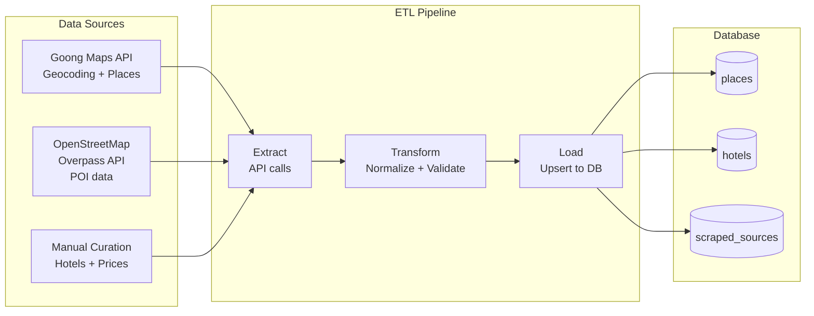
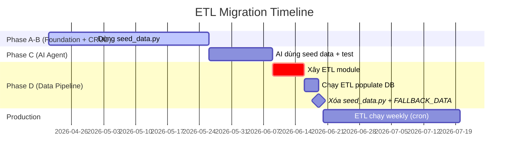
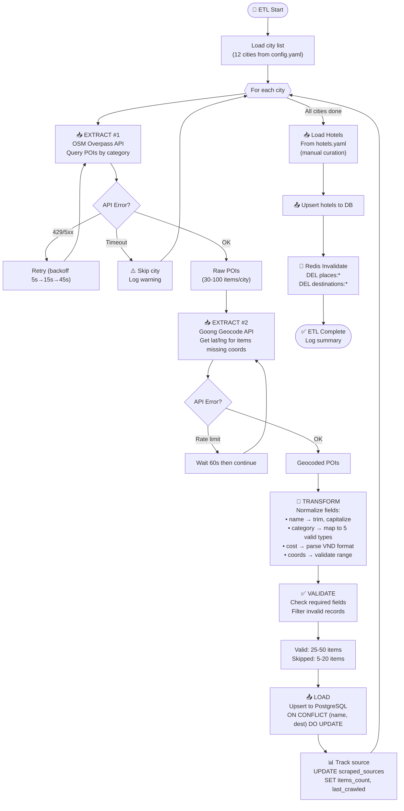
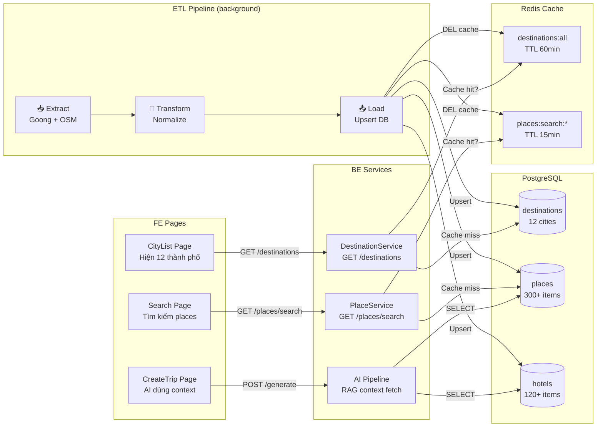

# Part 5: Data Pipeline Plan — ETL + Data Freshness

## Mục đích file này

AI Agent cần dữ liệu THẬT (places, hotels) trong database để đưa ra gợi ý chính xác. MVP1 dùng data hardcoded trong `seed_data.py` — chỉ 20 places cho 4 thành phố, không cập nhật. File này mô tả kế hoạch thay thế seed data bằng **ETL pipeline tự động** — tự động crawl dữ liệu từ Goong Maps API và OpenStreetMap, xử lý, và nhập vào PostgreSQL.

ETL là gì? **E**xtract (lấy data từ nguồn), **T**ransform (chuẩn hóa, validate), **L**oad (lưu vào DB). Đây là pattern chuẩn trong data engineering.

> [!NOTE]
> File này mô tả Phase D (tuần 8). Các phase trước (đặc biệt Phase A+B) sẽ dùng seed data tạm để phát triển.

---

## 1. Vấn đề hiện tại

Hiện tại dữ liệu được đưa vào DB bằng cách chạy file `seed_data.py` 1 lần duy nhất. Data này là hardcoded trong code Python — nghĩa là nếu muốn thêm places mới hoặc cập nhật giá, phải sửa code và chạy lại. Không có cơ chế tự động nào.

| Vấn đề | Chi tiết |
|--------|---------|
| `seed_data.py` | Hardcoded 4 thành phố, ~20 places, chạy 1 lần |
| Mock data FE | `data/cities.ts` (12 cities), `data/places.ts` (~50 places) — tất cả hardcoded |
| AI fallback | Hardcoded `FALLBACK_DATA` cho 4 thành phố trong `itinerary_service.py` |
| Không có cơ chế refresh | Data cũ vĩnh viễn, không tracking source |

---

## 2. Data Sources Strategy

MVP2 sẽ lấy dữ liệu từ **3 nguồn**, mỗi nguồn phục vụ mục đích riêng:

- **Goong Maps API** — API bản đồ Việt Nam, cho geocoding (lấy tọa độ từ tên địa điểm) và tìm kiếm địa điểm. Free tier cho 1000 requests/ngày.
- **OpenStreetMap Overpass API** — API mở, miễn phí, cung cấp POI data (nhà hàng, bảo tàng, công viên...) cho bất kỳ khu vực nào trên thế giới.
- **Manual Curation** — Dữ liệu khách sạn sẽ nhập thủ công qua file YAML, vì chưa có API giá khách sạn VN công khai.



### 2.1 Goong Maps API

**Dùng cho:** Geocoding (lat/lng) + Places Search  
**Free tier:** 1,000 requests/day  
**Key endpoints:**
```
GET https://rsapi.goong.io/Place/AutoComplete
  ?input=Văn Miếu Hà Nội&api_key=YOUR_KEY

GET https://rsapi.goong.io/Place/Detail
  ?place_id=xxx&api_key=YOUR_KEY

GET https://rsapi.goong.io/geocode
  ?address=Hà Nội&api_key=YOUR_KEY
```

### 2.2 OpenStreetMap Overpass API

**Dùng cho:** POI data (restaurants, attractions, parks)  
**Free:** Unlimited (nhưng cần polite usage)  
**Query ví dụ:**
```
[out:json][timeout:25];
area["name"="Hà Nội"]->.searchArea;
(
  node["tourism"~"attraction|museum|viewpoint"](area.searchArea);
  node["amenity"~"restaurant|cafe"](area.searchArea);
);
out body;
```

### 2.3 Manual Curation

**Dùng cho:** Hotels (giá cả VN chưa có API public)  
**Format:** YAML/JSON file → import script  
**Example:**
```yaml
hotels:
  - name: "Sofitel Legend Metropole Hà Nội"
    city: "Hà Nội"
    rating: 4.9
    price: 5500000  # VND/night
    amenities: ["wifi", "pool", "spa", "restaurant"]
    image: "https://..."
    location: "15 Ngô Quyền, Hoàn Kiếm"
```

---

## 3. ETL Pipeline Architecture

Pipeline được tổ chức theo pattern ETL chuẩn: mỗi bước (extract, transform, load) nằm trong folder riêng. Như vậy nếu muốn thêm nguồn data mới (VD: TripAdvisor API), chỉ cần thêm 1 file extractor mới — không sửa code cũ.

### 3.1 File Structure

```
Backend/
├── src/
│   ├── etl/                          ← ETL module
│   │   ├── __init__.py
│   │   ├── base_extractor.py         ← ABC cho extractors
│   │   ├── extractors/
│   │   │   ├── goong_extractor.py    ← Goong API client
│   │   │   ├── osm_extractor.py      ← Overpass API client
│   │   │   └── manual_extractor.py   ← YAML/JSON file reader
│   │   ├── transformers/
│   │   │   ├── place_transformer.py  ← Normalize place data
│   │   │   └── hotel_transformer.py  ← Normalize hotel data
│   │   ├── loaders/
│   │   │   └── db_loader.py          ← Upsert to DB
│   │   └── runner.py                 ← CLI entry point: orchestrate E→T→L
│   │
│   └── data/                         ← Static seed data (Phase A-C)
│       └── hotels.yaml               ← Manual hotels data
```

### 3.2 ETL Flow

```python
# src/etl/runner.py

VIETNAM_CITIES = [
    "Hà Nội", "TP. Hồ Chí Minh", "Đà Nẵng", "Hội An",
    "Nha Trang", "Phú Quốc", "Sapa", "Vịnh Hạ Long",
    "Huế", "Đà Lạt", "Vũng Tàu", "Cần Thơ",
]

async def run_etl(cities: list[str] | None = None):
    """Run full ETL pipeline.
    
    Steps:
        1. For each city → extract POIs from OSM
        2. For each POI → geocode via Goong
        3. Transform → normalize fields
        4. Load → upsert to places table
        5. Load hotels from YAML
        6. Update scraped_sources table
    """
    target_cities = cities or VIETNAM_CITIES
    
    for city in target_cities:
        # Step 1: Extract
        raw_pois = await osm_extractor.extract(city)
        
        # Step 2: Geocode
        for poi in raw_pois:
            if not poi.get("lat"):
                coords = await goong_extractor.geocode(poi["name"] + " " + city)
                poi["lat"] = coords["lat"]
                poi["lng"] = coords["lng"]
        
        # Step 3: Transform
        places = place_transformer.transform(raw_pois, city)
        
        # Step 4: Load
        await db_loader.upsert_places(places)
    
    # Hotels
    hotels = manual_extractor.load_hotels("src/data/hotels.yaml")
    await db_loader.upsert_hotels(hotels)
    
    # Track source
    await db_loader.update_source_tracking(
        source="etl_pipeline",
        items_count=len(places),
        status="success",
    )
```

### 3.3 CLI Commands

```bash
# Run full ETL
uv run python -m src.etl.runner

# Run for specific cities
uv run python -m src.etl.runner --cities "Hà Nội" "Đà Nẵng"

# Dry run (no DB writes)
uv run python -m src.etl.runner --dry-run

# Check data freshness
uv run python -m src.etl.runner --check-freshness
```

---

## 4. Data Freshness Service

Data cũ là data sai — nếu quán ăn đã đóng cửa 3 tháng trước nhưng vẫn còn trong DB, AI sẽ gợi ý sai. `DataFreshnessService` giải quyết vấn đề này bằng cách theo dõi lần cập nhật cuối cùng cho mỗi thành phố. Nếu data quá cũ (>7 ngày), tự động chạy lại ETL cho thành phố đó.

```python
# src/services/data_freshness_service.py

class DataFreshnessService:
    """Kiểm tra và trigger ETL khi data quá cũ.
    
    Config:
        update_interval_days: 7 (default)
        max_places_per_city: 50
    """
    
    async def check_freshness(self, city: str) -> bool:
        """Check nếu data city cần update.
        
        Returns True nếu last_crawled > update_interval_days.
        """
        source = await self.source_repo.find_by_city(city)
        if not source:
            return True  # Chưa crawl bao giờ
        
        age = datetime.utcnow() - source.last_crawled
        return age.days > self.config.update_interval_days
    
    async def ensure_fresh_data(self, city: str):
        """Ensure city data is fresh, trigger ETL if needed."""
        if await self.check_freshness(city):
            await run_etl(cities=[city])
```

### 4.1 scraped_sources Table

```sql
CREATE TABLE scraped_sources (
    id SERIAL PRIMARY KEY,
    source_name VARCHAR(100) NOT NULL,
    city VARCHAR(100),
    url TEXT,
    last_crawled TIMESTAMP NOT NULL DEFAULT NOW(),
    items_count INTEGER DEFAULT 0,
    status VARCHAR(20) DEFAULT 'pending',  -- pending/running/success/failed
    error_message TEXT,
    created_at TIMESTAMP DEFAULT NOW()
);
```

---

## 5. Migration từ seed_data.py

Chuyển đổi từ seed data sang ETL không xảy ra ngay lập tức. Trong Phase A-B (tuần 1-5), vẫn dùng seed data để phát triển và test CRUD. Phase D (tuần 8) mới xây ETL thật và xóa seed_data.py.

### 5.1 Kế hoạch

| Step | Action | Timeline |
|------|--------|----------|
| 1 | Giữ `seed_data.py` tạm thời cho development | Phase A |
| 2 | Tạo ETL module + Goong/OSM extractors | Phase D |
| 3 | Chạy ETL → populate DB | Phase D |
| 4 | Verify data đủ cho AI Agent | Phase D |
| 5 | Xóa `seed_data.py` + FALLBACK_DATA | Phase D |

### 5.2 Minimum Data Requirements cho AI

| Entity | Minimum | Mỗi city |
|--------|---------|----------|
| Places | 300+ total | 25-50 per city |
| Hotels | 120+ total | 10+ per city |
| Cities covered | 12 | Như danh sách FE |

> [!TIP]
> **Giai đoạn đầu (Phase A-B):** Dùng seed data/mock data cho development.
> **Giai đoạn sau (Phase D):** Thay bằng ETL pipeline thật.
> AI Agent cần ít nhất 25 places/city để RAG context đủ phong phú.

---

## 6. Data Quality Rules

Không phải mọi dữ liệu crawl được đều hợp lệ. Transformer kiểm tra mỗi record trước khi lưu: tên phải có, category phải thuộc 5 loại hợp lệ, chi phí không âm. Record không pass validation sẽ bị skip và log warning.

```python
# src/etl/transformers/place_transformer.py

REQUIRED_FIELDS = ["name", "category", "destination", "location"]
VALID_CATEGORIES = ["food", "attraction", "nature", "entertainment", "shopping"]

def validate_place(place: dict) -> bool:
    """Validate place data trước khi load vào DB.
    
    Tại sao validate? Vì data từ OSM/Goong không luôn clean:
    - Tên quá ngắn (VD: "A" — không phải place name)
    - Category không match 5 loại hệ thống hỗ trợ
    - Chi phí âm (lỗi data source)
    
    Records fail validation → SKIP + log warning (không stop pipeline).
    """
    # 1. Required fields
    for field in REQUIRED_FIELDS:
        if not place.get(field):
            return False
    
    # 2. Category phải valid  
    if place["category"] not in VALID_CATEGORIES:
        return False
    
    # 3. Name không quá ngắn
    if len(place["name"]) < 3:
        return False
    
    # 4. Cost phải >= 0
    if place.get("avg_cost", 0) < 0:
        return False
    
    return True
```

---

## 7. Error Handling & Retry Strategy

### 7.1 Tại sao cần chiến lược error riêng cho ETL?

ETL chạy NGOÀI request-response cycle (không có user đang chờ). Khi API fail giữa chừng → không thể trả 500 cho user. Cần: retry tự động, partial success, và logging chi tiết để troubleshoot.

### 7.2 Error Handling Matrix

| Lỗi | Nguyên nhân | Xử lý | Retry? |
|------|-----------|-------|--------|
| `HTTPError 429` | Goong API rate limited | Wait 60s → retry | ✅ Max 3 |
| `HTTPError 5xx` | API server down | Backoff 5s, 15s, 45s | ✅ Max 3 |
| `ConnectionError` | Network issue | Backoff 10s → retry | ✅ Max 2 |
| `TimeoutError` | API quá chậm (>10s) | Skip city → log warning | ❌ |
| `ValidationError` | Data invalid (xem §6) | Skip record → log | ❌ |
| `IntegrityError` | Duplicate place in DB | UPSERT (update nếu có) | ❌ |

### 7.3 Retry Implementation

```python
# src/etl/base_extractor.py

import asyncio
from src.core.logger import get_logger

logger = get_logger(__name__)

class BaseExtractor:
    """Abstract base cho tất cả extractors.
    
    Cung cấp:
    - retry_request(): HTTP request với exponential backoff
    - _handle_rate_limit(): Sleep khi bị 429
    """
    
    async def retry_request(
        self,
        url: str,
        max_retries: int = 3,
        base_delay: float = 5.0,
    ) -> dict:
        """HTTP GET với exponential backoff.
        
        Backoff schedule: 5s → 15s → 45s (base × 3^attempt)
        Tại sao exponential? Vì nếu API đang overloaded,
        retry ngay → càng tệ hơn. Delay tăng dần cho API hồi phục.
        """
        for attempt in range(max_retries):
            try:
                response = await self.client.get(url)
                response.raise_for_status()
                return response.json()
            except Exception as e:
                delay = base_delay * (3 ** attempt)
                logger.warning(
                    f"ETL request failed (attempt {attempt+1}/{max_retries}): {e}. "
                    f"Retry in {delay}s"
                )
                if attempt < max_retries - 1:
                    await asyncio.sleep(delay)
        
        logger.error(f"ETL request failed after {max_retries} attempts: {url}")
        raise RuntimeError(f"ETL failed: {url}")
```

---

## 8. Monitoring & Observability

### 8.1 Tại sao cần monitoring cho ETL?

ETL chạy background (CLI hoặc cron) — nếu fail mà không ai biết → DB data cũ → AI gợi ý sai. Monitoring đảm bảo team biết ngay khi có vấn đề.

### 8.2 Logging Strategy

```python
# Mỗi ETL run log 4 điểm quan trọng:

# 1. START — biết ETL đã bắt đầu
logger.info("ETL started", extra={"cities": target_cities, "run_id": run_id})

# 2. PER-CITY PROGRESS — biết city nào đang chạy
logger.info(f"Processing {city}: extracted {len(raw_pois)} POIs")

# 3. PER-CITY RESULT — biết thành công hay không
logger.info(f"Loaded {loaded}/{total} places for {city} (skipped: {skipped})")

# 4. FINAL SUMMARY — tổng kết
logger.info(f"ETL completed in {elapsed:.1f}s: {total_loaded} places, {total_skipped} skipped")
```

### 8.3 Metrics Dashboard (PostgreSQL-based)

Bảng `scraped_sources` (§4.1) đóng vai trò **metrics store** đơn giản:

```sql
-- Kiểm tra city nào data cũ nhất
SELECT city, last_crawled, items_count,
       NOW() - last_crawled AS age
FROM scraped_sources
ORDER BY last_crawled ASC;

-- Kết quả:
-- | city      | last_crawled       | items_count | age     |
-- | Sa Pa     | 2026-04-01 10:00   | 32          | 19 days |  ← cần re-crawl!
-- | Hà Nội    | 2026-04-15 08:00   | 48          | 5 days  |  ← OK
```

---

## 9. ETL vs Seed Data — Khi nào dùng gì?

> [!IMPORTANT]
> Đây là timeline rõ ràng. KHÔNG chạy ETL trong Phase A-B. Dùng seed data cho đến Phase D.



**Tại sao không xây ETL ngay?** Vì ETL phụ thuộc vào Goong API key (cần đăng ký) và DB schema ổn định (cần sau Phase B). Xây ETL khi CRUD chưa xong → model thay đổi → ETL phải sửa lại.

---

## 10. ETL Step-by-Step Flow — Chi tiết từng bước

### §10.1 ETL Pipeline Diagram (chi tiết)



### §10.2 Mỗi bước giải thích chi tiết

| Step | Input | Output | Error Handling | Latency |
|------|-------|--------|---------------|---------|
| **EXTRACT OSM** | City name | Raw POIs (JSON) | Retry 3x backoff, skip on timeout | 2-5s/city |
| **EXTRACT Goong** | POI name + city | {lat, lng} | Rate limit wait 60s, skip if no key | 0.2s/item |
| **TRANSFORM** | Raw POIs | Normalized dicts | Log invalid records, continue | <1ms/item |
| **VALIDATE** | Normalized dicts | Valid dicts only | Skip + warning, never stop | <1ms/item |
| **LOAD** | Valid dicts | DB rows (upsert) | IntegrityError → update existing | 5-10ms/batch |
| **TRACK** | Run metadata | scraped_sources row | Always succeeds | <5ms |
| **CACHE INVALIDATE** | None | Redis DEL keys | Redis down → log warning, continue | <5ms |

---

## 11. ETL ↔ BE ↔ FE Data Connection — Data đi từ ETL đến User thế nào?

### §11.1 Full Data Flow Diagram



### §11.2 Giải thích kết nối

**ETL → DB (Write):**
- ETL chạy background (CLI hoặc cron weekly)
- Writes vào 3 bảng reference: `destinations`, `places`, `hotels`
- Dùng UPSERT (`ON CONFLICT DO UPDATE`) → không tạo duplicate
- Sau khi load xong → invalidate Redis cache (`DEL places:*`, `DEL destinations:*`)

**DB → BE (Read):**
- `DestinationService` đọc `destinations` (10 rows, cached 60 phút)
- `PlaceService` đọc `places` (search queries, cached 15 phút)
- AI Pipeline đọc `places` + `hotels` (30 items mỗi lần generate, KHÔNG cache — cần data mới nhất)

**BE → FE (API):**
- `GET /destinations` → FE hiển thị CityList cards (12 cities)
- `GET /places/search?q=phở&city=HN` → FE hiển thị search results
- `POST /itineraries/generate` → AI dùng places context → sinh trip → FE hiển thị

**Vòng đời data:**
```
ETL crawl → DB store → Redis cache → BE read → FE display → User sees
                ↑                          ↑
                |                          |
    Weekly refresh (cron)        Cache invalidate on ETL run
```

> [!TIP]
> **Cache invalidation strategy:** Khi ETL chạy xong, tất cả cache keys liên quan bị xóa. Request tiếp theo sẽ miss cache → query DB mới → cache lại data mới. Đây là pattern "write-through invalidation" — đơn giản và đảm bảo data consistency.

> [!WARNING]
> **Guest trip cleanup (cron job):** Trip tạo bởi guest (`user_id = NULL`) tồn tại tối đa 24 giờ trong DB. Cần thêm cron job chạy hàng ngày:
> ```sql
> DELETE FROM trips WHERE user_id IS NULL AND created_at < now() - interval '24 hours';
> DELETE FROM guest_claim_tokens WHERE expires_at < now() OR consumed_at IS NOT NULL;
> ```
> Cron này nên chạy song song với ETL pipeline (Phase D) hoặc thêm vào `docker-compose` scheduler. Guest trip CHƯA được claim bằng `claimToken` sau 24h sẽ bị xóa vĩnh viễn → FE nên hiển thị warning: *"Đăng nhập để lưu lộ trình vĩnh viễn"*.

---

## 12. Security Considerations — ETL 🆕

| Concern | Risk | Mitigation |
|---------|------|------------|
| **API Key exposure** | Goong API key trong `.env` bị commit | `.env` trong `.gitignore`. Key chỉ load qua `AppSettings`. KHÔNG hardcode trong ETL code |
| **API Key rotation** | Key bị leak hoặc expired | 1. Regenerate key trong Goong Dashboard → 2. Update `.env` → 3. Re-run ETL |
| **OSM Overpass abuse** | Gọi quá nhiều → bị IP ban | Polite usage: max 1 query/10s. User-Agent header: `DuLichViet-ETL/1.0` |
| **SQL injection via ETL data** | Place name chứa `'; DROP TABLE` | Dùng SQLAlchemy ORM (parameterized queries). KHÔNG bao giờ string-format SQL |
| **Data poisoning** | Attacker submit fake POI vào OSM | Validate: name length 3-200 chars, category in whitelist, coords within VN bounds (8°N-23°N, 102°E-110°E) |

```python
# Coordinate validation (VN bounds check)
VN_BOUNDS = {"lat_min": 8.0, "lat_max": 23.5, "lng_min": 102.0, "lng_max": 110.0}

def validate_coords(lat: float, lng: float) -> bool:
    """Reject POIs outside Vietnam boundaries."""
    return (VN_BOUNDS["lat_min"] <= lat <= VN_BOUNDS["lat_max"] and
            VN_BOUNDS["lng_min"] <= lng <= VN_BOUNDS["lng_max"])
```

---

## 13. Acceptance Tests — ETL Pipeline 🆕

| # | Test Case | Steps | Expected Result |
|---|-----------|-------|-----------------|
| ETL-01 | Full ETL run success | `uv run python -m src.etl.runner --cities "Hà Nội"` | ≥25 places upserted, log `"ETL completed"`, `scraped_sources` updated |
| ETL-02 | Dry run no DB writes | `uv run python -m src.etl.runner --dry-run` | Log extracted/transformed data, 0 DB writes, exit 0 |
| ETL-03 | API timeout graceful | Mock Goong API timeout → run ETL | Skip city, log warning, continue with other cities |
| ETL-04 | Invalid data filtered | Include POI with name="" in mock data | Record skipped, log `"Validation failed"`, valid records still loaded |
| ETL-05 | Cache invalidated after run | Cache destinations → run ETL → GET /destinations | Data from ETL (not stale cache) |
| ETL-06 | Duplicate handling (upsert) | Run ETL twice for same city | Same place count (no duplicates), `updated_at` refreshed |
| ETL-07 | Data freshness check | `uv run python -m src.etl.runner --check-freshness` | Output: list of cities with `age > 7 days` flagged |

**Data contract — Normalized Place object (ETL output):**
```json
{
  "place_name": "Phở Bát Đàn",
  "category": "food",
  "destination": "Hà Nội",
  "location": "49 Bát Đàn, Hoàn Kiếm",
  "latitude": 21.0340,
  "longitude": 105.8480,
  "rating": 4.5,
  "avg_cost": 50000,
  "description": "Quán phở nổi tiếng nhất Hà Nội",
  "image": null,
  "source": "osm_overpass"
}
```
