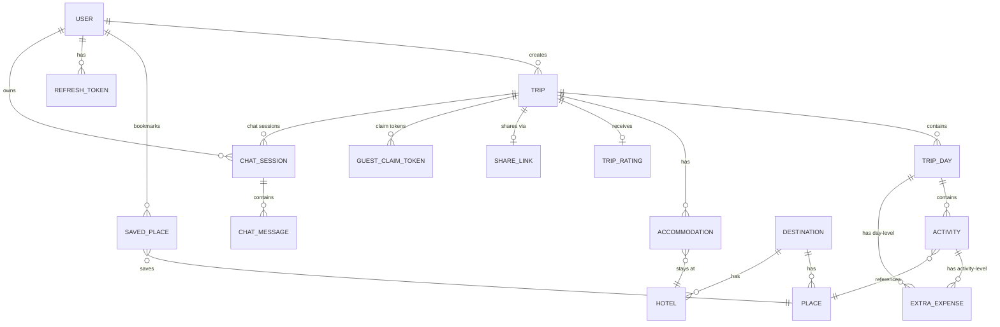
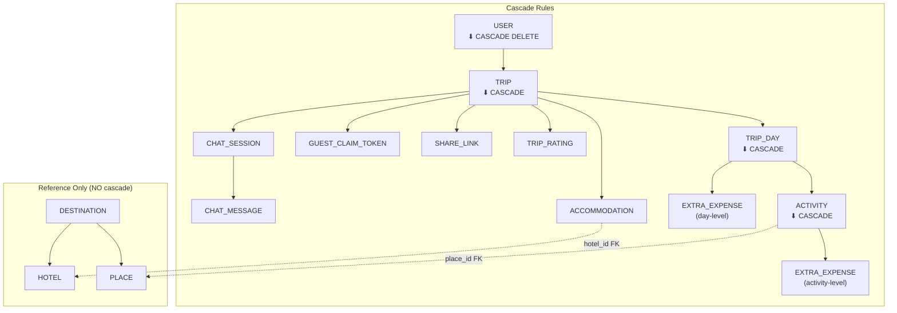
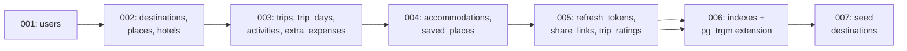
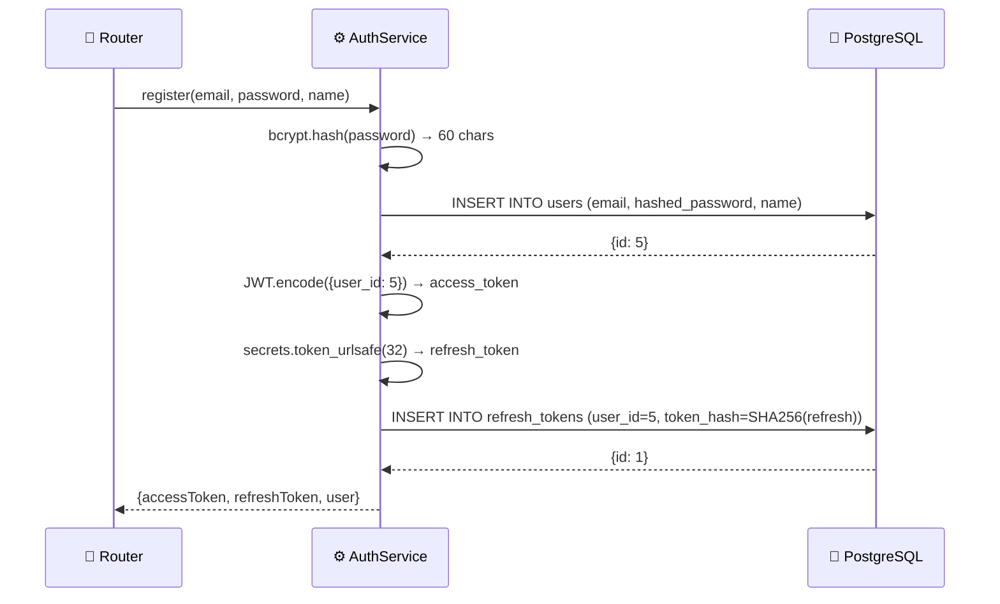
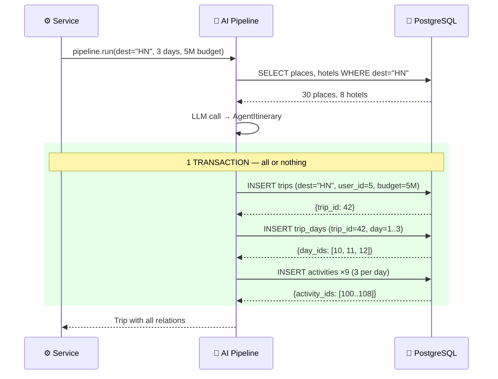

# Part 9: Database Design — ERD, Constraints, Migrations

## Mục đích file này

Database là **nền tảng** của toàn bộ hệ thống. Nếu DB sai → mọi thứ phía trên (repo, service, API) đều sai. File này mô tả chi tiết:

- **16 bảng core** với tất cả columns, data types, constraints
- **Mối quan hệ** giữa các bảng (1:1, 1:N, N:M) + cascade rules
- **Indexes** để tối ưu query performance
- **Migration strategy** với Alembic
- **Seed data** cho development

> **Decision lock v4.1:** 13 bảng ban đầu chưa đủ cho security/session của FE revamp.
> MVP2 core cần thêm `guest_claim_tokens`, `chat_sessions`, `chat_messages`. `EP-34 Analytics`
> nếu bật sẽ thêm `analytics_audit_logs` hoặc log sink tương đương. Public share dùng token hash,
> không public raw integer trip ID.

Đọc file này TRƯỚC khi implement models — mỗi column, constraint, index đều có lý do.

> [!IMPORTANT]
> Tất cả bảng dùng **Integer auto-increment** làm primary key (KHÔNG phải UUID).
> FE dùng `id: number` — bắt buộc khớp.

### Quyết định thiết kế chính (WHY)

| Quyết định | Tại sao (WHY) | Khi nào review lại (WHEN) |
|------------|--------------|---------------------------|
| **Integer PK** thay vì UUID | FE TypeScript dùng `number` cho ID. UUID (string) khiến comparison phức tạp. Integer cũng nhẹ hơn cho index. | Nếu cần multi-database replication → chuyển UUID |
| **16 bảng core** thay vì 13 | 13 bảng đủ cho domain trip/place, nhưng FE revamp cần security/session riêng: guest claim token và chat history API. Không gộp vào checkpoints để tránh lộ state nội bộ. | Nếu bật Analytics → thêm audit log optional |
| **Cascade DELETE** từ User → Trip → Days → Activities | User xóa trip = xóa sạch. Không để orphan records. Nhưng KHÔNG cascade xóa Place/Hotel (dữ liệu tham chiếu). | Nếu cần soft-delete trips → thêm `deleted_at` column |
| **String dates** cho `trip_days.date`, `accommodations.check_in` | FE gửi "2026-05-01" (ISO string). Lưu string đơn giản, không timezone issues. `trips.start_date` dùng Date vì cần so sánh. | Nếu cần timezone support → chuyển sang Date |
| **JSON column** cho `trips.interests` | Array ["food", "nature"] không cần normalize thành bảng riêng. JSON column đủ cho filter đơn giản. | Nếu cần index interests → tạo junction table |

---

## 1. Entity Relationship Diagram — Toàn cảnh

### 1.1 ERD



### 1.2 Giải thích sơ đồ — Đọc thế nào?

Ký hiệu ERD: `||` = exactly one, `o{` = zero or many, `o|` = zero or one.

**Đọc từ trên xuống — data flows giống cây:**

```
USER (root)
├── TRIP (1 user → N trips)
│   ├── TRIP_DAY (1 trip → N days)
│   │   ├── ACTIVITY (1 day → N activities)
│   │   │   └── EXTRA_EXPENSE (activity-level costs)
│   │   └── EXTRA_EXPENSE (day-level costs)
│   ├── ACCOMMODATION (1 trip → N accommodations)
│   ├── TRIP_RATING (1 trip → 0-1 rating)
│   ├── SHARE_LINK (1 trip → 0-1 share link)
│   ├── GUEST_CLAIM_TOKEN (1 trip → N one-time tokens)
│   └── CHAT_SESSION → CHAT_MESSAGE (history API)
├── SAVED_PLACE (1 user → N bookmarks)
└── REFRESH_TOKEN (1 user → N tokens)

DESTINATION (reference data, từ ETL)
├── PLACE (1 city → N places)
└── HOTEL (1 city → N hotels)
```

**Hai nhóm bảng tách biệt:**
1. **User data** (USER → TRIP → ...) — tạo bởi user, cascade delete khi xóa user
2. **Reference data** (DESTINATION → PLACE/HOTEL) — tạo bởi ETL/seed, KHÔNG bị xóa khi xóa user

---

## 2. Chi tiết từng bảng

### 2.1 `users` — Thông tin người dùng

| Column | Type | Constraints | Giải thích |
|--------|------|-------------|-----------|
| `id` | `Integer` | PK, auto-increment | ID số nguyên, FE dùng `number` |
| `email` | `String(255)` | UNIQUE, NOT NULL, INDEX | Email đăng nhập, phải unique |
| `hashed_password` | `String(255)` | NOT NULL | Bcrypt hash, KHÔNG lưu plain text |
| `name` | `String(100)` | NOT NULL | Tên hiển thị theo FE `User.name` |
| `phone` | `String(30)` | NULL | Số điện thoại optional |
| `interests` | `JSON` | DEFAULT [] | Sở thích/onboarding |
| `is_active` | `Boolean` | DEFAULT true | Soft delete: false = đã xóa |
| `created_at` | `DateTime(tz)` | DEFAULT now() | Thời điểm tạo tài khoản |
| `updated_at` | `DateTime(tz)` | DEFAULT now(), ON UPDATE | Lần sửa cuối |

```python
# src/models/user.py
class User(Base):
    __tablename__ = "users"
    
    id = mapped_column(Integer, primary_key=True, autoincrement=True)
    email = mapped_column(String(255), unique=True, nullable=False, index=True)
    hashed_password = mapped_column(String(255), nullable=False)
    name = mapped_column(String(100), nullable=False)
    phone = mapped_column(String(30), nullable=True)
    interests = mapped_column(JSON, default=list)
    is_active = mapped_column(Boolean, default=True)
    created_at = mapped_column(DateTime(timezone=True), server_default=func.now())
    updated_at = mapped_column(DateTime(timezone=True), server_default=func.now(), onupdate=func.now())
    
    # Relationships
    trips = relationship("Trip", back_populates="user", cascade="all, delete-orphan")
    saved_places = relationship("SavedPlace", back_populates="user")
    refresh_tokens = relationship("RefreshToken", back_populates="user")
    chat_sessions = relationship("ChatSession", back_populates="user")
```

### 2.2 `trips` — Chuyến đi

| Column | Type | Constraints | Giải thích |
|--------|------|-------------|-----------|
| `id` | `Integer` | PK | |
| `user_id` | `Integer` | FK → users.id, **NULLABLE**, INDEX | NULL = guest trip (chưa đăng nhập) |

> [!IMPORTANT]
> **WHY `user_id` là NULLABLE?** Guest user có thể tạo trip mà không cần đăng nhập. Trip được lưu vào DB với `user_id = NULL`, nhưng claim sau login **không được** chỉ dựa vào `user_id IS NULL`. FE phải gửi `claimToken`; BE verify hash/expiry trong `guest_claim_tokens` rồi mới set `user_id = current_user.id`. Trip guest chưa claim bị cleanup sau 24h bởi cron job.

| `destination` | `String(100)` | NOT NULL | Tên thành phố đích |
| `trip_name` | `String(200)` | NOT NULL | Tên chuyến đi (auto-generated hoặc user đặt) |
| `start_date` | `Date` | NOT NULL | Ngày bắt đầu |
| `end_date` | `Date` | NOT NULL | Ngày kết thúc |
| `budget` | `Integer` | NOT NULL, CHECK > 0 | Budget VND |
| `total_cost` | `Integer` | DEFAULT 0 | Tổng chi phí tính toán |
| `adults_count` | `Integer` | DEFAULT 1, CHECK ≥ 1 | Số người lớn |
| `children_count` | `Integer` | DEFAULT 0, CHECK ≥ 0 | Số trẻ em |
| `interests` | `JSON` | DEFAULT [] | ["food", "nature", "culture"] |
| `status` | `String(20)` | DEFAULT "draft" | draft, active, completed |
| `ai_generated` | `Boolean` | DEFAULT false | True nếu tạo bởi AI |
| `created_at` | `DateTime(tz)` | DEFAULT now() | |
| `updated_at` | `DateTime(tz)` | DEFAULT now() | |

**Indexes:**
- `ix_trips_user_id` — Tìm trips theo user (fast)
- `ix_trips_destination` — Tìm trips theo thành phố
- `ix_trips_created_at` — Sắp xếp theo thời gian tạo

### 2.3 `trip_days` — Ngày trong chuyến đi

| Column | Type | Constraints | Giải thích |
|--------|------|-------------|-----------|
| `id` | `Integer` | PK | |
| `trip_id` | `Integer` | FK → trips.id, NOT NULL, INDEX | |
| `day_number` | `Integer` | NOT NULL | 1, 2, 3... |
| `label` | `String(50)` | NOT NULL | "Ngày 1", "Ngày 2" |
| `date` | `String(20)` | NOT NULL | "2026-05-01" |
| `destination_name` | `String(100)` | NULL | Override destination per day |

**Unique constraint:** `(trip_id, day_number)` — mỗi trip không thể có 2 "Ngày 1"

### 2.4 `activities` — Hoạt động trong ngày

Bảng LỚN NHẤT và QUAN TRỌNG NHẤT — phải khớp 1:1 với FE `Activity` interface.

| Column | Type | Constraints | Giải thích |
|--------|------|-------------|-----------|
| `id` | `Integer` | PK | |
| `trip_day_id` | `Integer` | FK → trip_days.id, NOT NULL, INDEX | |
| `place_id` | `Integer` | FK → places.id, NULL | Link đến DB place (NULL nếu custom) |
| `name` | `String(200)` | NOT NULL | ⚠️ "name" KHÔNG PHẢI "title" |
| `time` | `String(10)` | NOT NULL | "09:00" |
| `end_time` | `String(10)` | NULL | "10:30" |
| `type` | `String(30)` | NOT NULL | "food", "attraction", "nature"... |
| `location` | `String(300)` | DEFAULT "" | Địa chỉ text |
| `description` | `Text` | DEFAULT "" | Mô tả |
| `image` | `String(500)` | DEFAULT "" | URL ảnh |
| `transportation` | `String(50)` | NULL | "taxi", "bus", "walk" |
| `adult_price` | `Integer` | NULL | Giá người lớn (VND) |
| `child_price` | `Integer` | NULL | Giá trẻ em |
| `custom_cost` | `Integer` | NULL | Chi phí tùy chỉnh |
| `bus_ticket_price` | `Integer` | NULL | Giá vé bus |
| `taxi_cost` | `Integer` | NULL | Giá taxi |
| `order_index` | `Integer` | DEFAULT 0 | Thứ tự trong ngày (drag & drop) |
| `created_at` | `DateTime(tz)` | DEFAULT now() | |

> [!WARNING]
> Column `name` KHÔNG PHẢI `title`. FE dùng `activity.name` — mapping phải khớp.

### 2.5 `extra_expenses` — Chi phí phát sinh

| Column | Type | Constraints | Giải thích |
|--------|------|-------------|-----------|
| `id` | `Integer` | PK | |
| `activity_id` | `Integer` | FK → activities.id, NULL | Chi phí level activity |
| `trip_day_id` | `Integer` | FK → trip_days.id, NULL | Chi phí level ngày |
| `description` | `String(200)` | NOT NULL | "Vé tham quan thêm" |
| `amount` | `Integer` | NOT NULL, CHECK ≥ 0 | Số tiền VND |

**Constraint:** Chính xác 1 trong 2 FK phải NOT NULL (`activity_id XOR trip_day_id`).

### 2.6 `accommodations` — Nơi ở

| Column | Type | Constraints | Giải thích |
|--------|------|-------------|-----------|
| `id` | `Integer` | PK | |
| `trip_id` | `Integer` | FK → trips.id, NOT NULL | |
| `hotel_id` | `Integer` | FK → hotels.id, NULL | NULL = custom accommodation |
| `name` | `String(200)` | NOT NULL | Tên khách sạn |
| `check_in` | `String(20)` | NOT NULL | Ngày check-in |
| `check_out` | `String(20)` | NOT NULL | Ngày check-out |
| `price_per_night` | `Integer` | DEFAULT 0 | VND/đêm |
| `total_price` | `Integer` | DEFAULT 0 | Tổng = price × nights |
| `booking_url` | `String(500)` | NULL | Link booking |

### 2.7 `places` — Địa điểm (từ ETL)

| Column | Type | Constraints | Giải thích |
|--------|------|-------------|-----------|
| `id` | `Integer` | PK | |
| `destination_id` | `Integer` | FK → destinations.id, NOT NULL, INDEX | |
| `name` | `String(200)` | NOT NULL | Tên địa điểm |
| `category` | `String(30)` | NOT NULL | "food", "attraction", "nature", "entertainment", "shopping" |
| `description` | `Text` | DEFAULT "" | |
| `location` | `String(300)` | DEFAULT "" | Địa chỉ |
| `latitude` | `Float` | NULL | Tọa độ |
| `longitude` | `Float` | NULL | |
| `avg_cost` | `Integer` | DEFAULT 0 | Chi phí trung bình VND |
| `rating` | `Float` | DEFAULT 0 | 0-5 stars |
| `image` | `String(500)` | DEFAULT "" | |
| `opening_hours` | `String(100)` | NULL | "08:00-22:00" |
| `source` | `String(30)` | DEFAULT "seed" | "seed", "goong", "osm" |
| `updated_at` | `DateTime(tz)` | DEFAULT now() | Lần cập nhật cuối |

**Indexes:**
- `ix_places_destination_category` — Composite index cho search
- `ix_places_name_trgm` — Trigram index cho fuzzy search (pg_trgm extension)

### 2.8 `destinations` — Thành phố

| Column | Type | Constraints | |
|--------|------|-------------|--|
| `id` | `Integer` | PK | |
| `name` | `String(100)` | UNIQUE, NOT NULL | "Hà Nội" |
| `slug` | `String(100)` | UNIQUE, NOT NULL | "ha-noi" |
| `description` | `Text` | DEFAULT "" | |
| `image` | `String(500)` | DEFAULT "" | |
| `latitude` | `Float` | NULL | Tọa độ trung tâm |
| `longitude` | `Float` | NULL | |
| `is_active` | `Boolean` | DEFAULT true | Có hiển thị cho user? |
| `places_count` | `Integer` | DEFAULT 0 | Denormalized count |
| `last_etl_at` | `DateTime(tz)` | NULL | Lần chạy ETL cuối |

### 2.9 `hotels` — Khách sạn (từ ETL/manual)

| Column | Type | Constraints | |
|--------|------|-------------|--|
| `id` | `Integer` | PK | |
| `destination_id` | `Integer` | FK → destinations.id, INDEX | |
| `name` | `String(200)` | NOT NULL | |
| `price_per_night` | `Integer` | DEFAULT 0 | VND |
| `rating` | `Float` | DEFAULT 0 | 0-5 |
| `location` | `String(300)` | DEFAULT "" | |
| `image` | `String(500)` | DEFAULT "" | |
| `booking_url` | `String(500)` | NULL | |

### 2.10 `saved_places` — Bookmark

| Column | Type | Constraints | |
|--------|------|-------------|--|
| `id` | `Integer` | PK | |
| `user_id` | `Integer` | FK → users.id, NOT NULL | |
| `place_id` | `Integer` | FK → places.id, NOT NULL | |
| `created_at` | `DateTime(tz)` | DEFAULT now() | |

**Unique constraint:** `(user_id, place_id)` — mỗi user chỉ bookmark 1 place 1 lần

### 2.11 `refresh_tokens` — JWT Refresh Token

| Column | Type | Constraints | |
|--------|------|-------------|--|
| `id` | `Integer` | PK | |
| `user_id` | `Integer` | FK → users.id, NOT NULL, INDEX | |
| `token_hash` | `String(255)` | NOT NULL | SHA-256 hash (KHÔNG lưu raw) |
| `expires_at` | `DateTime(tz)` | NOT NULL | |
| `is_revoked` | `Boolean` | DEFAULT false | Logout → revoke |
| `created_at` | `DateTime(tz)` | DEFAULT now() | |

### 2.12 `share_links` — Chia sẻ trip

| Column | Type | Constraints | |
|--------|------|-------------|--|
| `id` | `Integer` | PK | |
| `trip_id` | `Integer` | FK → trips.id, UNIQUE | 1 trip = 1 share link |
| `token_hash` | `String(255)` | UNIQUE, NOT NULL | Hash của shareToken, KHÔNG lưu raw token |
| `created_by_user_id` | `Integer` | FK → users.id, NOT NULL | Owner tạo link |
| `permission` | `String(20)` | DEFAULT "view" | MVP2 chỉ cho read-only |
| `expires_at` | `DateTime(tz)` | NULL | NULL = không hết hạn |
| `revoked_at` | `DateTime(tz)` | NULL | Revoke link |
| `created_at` | `DateTime(tz)` | DEFAULT now() | |

### 2.13 `trip_ratings` — Đánh giá trip

| Column | Type | Constraints | |
|--------|------|-------------|--|
| `id` | `Integer` | PK | |
| `trip_id` | `Integer` | FK → trips.id, UNIQUE | 1 trip = 1 rating |
| `rating` | `Integer` | NOT NULL, CHECK 1-5 | 1-5 stars |
| `feedback` | `Text` | NULL | Feedback text |
| `created_at` | `DateTime(tz)` | DEFAULT now() | |

### 2.14 `guest_claim_tokens` — Token claim trip guest

| Column | Type | Constraints | |
|--------|------|-------------|--|
| `id` | `Integer` | PK | |
| `trip_id` | `Integer` | FK → trips.id, NOT NULL, INDEX | Trip guest cần claim |
| `token_hash` | `String(255)` | UNIQUE, NOT NULL | Hash của claimToken, không lưu raw |
| `expires_at` | `DateTime(tz)` | NOT NULL | Thường 24h |
| `consumed_at` | `DateTime(tz)` | NULL | Đã dùng thì không dùng lại |
| `created_at` | `DateTime(tz)` | DEFAULT now() | |

**WHY:** Integer `trip_id` dễ đoán. Nếu chỉ check `trips.user_id IS NULL`, bất kỳ user đăng nhập nào đoán được ID đều có thể claim trip guest của người khác. `claimToken` là bằng chứng user đang giữ browser/session đã tạo trip đó.

### 2.15 `chat_sessions` — Phiên chat AI

| Column | Type | Constraints | |
|--------|------|-------------|--|
| `id` | `Integer` | PK | |
| `trip_id` | `Integer` | FK → trips.id, NOT NULL, INDEX | Chat gắn với trip |
| `user_id` | `Integer` | FK → users.id, NULLABLE, INDEX | NULL nếu guest chat |
| `thread_id` | `String(120)` | UNIQUE, NOT NULL | Thread dùng cho LangGraph checkpoint |
| `status` | `String(20)` | DEFAULT "active" | active/closed |
| `created_at` | `DateTime(tz)` | DEFAULT now() | |
| `updated_at` | `DateTime(tz)` | DEFAULT now(), ON UPDATE | |

### 2.16 `chat_messages` — Lịch sử chat cho API

| Column | Type | Constraints | |
|--------|------|-------------|--|
| `id` | `Integer` | PK | |
| `session_id` | `Integer` | FK → chat_sessions.id, NOT NULL, INDEX | |
| `role` | `String(20)` | NOT NULL | user/assistant/tool |
| `content` | `Text` | NOT NULL | Nội dung hiển thị |
| `proposed_operations` | `JSON` | DEFAULT [] | Patch AI đề xuất, chưa auto-apply |
| `requires_confirmation` | `Boolean` | DEFAULT false | FE cần confirm trước khi DB đổi |
| `created_at` | `DateTime(tz)` | DEFAULT now() | |

**WHY tách khỏi LangGraph checkpoints:** checkpoint lưu state nội bộ để replay/memory, không phải API contract. `chat_messages` là projection sạch, phân trang dễ, không lộ tool state hoặc prompt nội bộ.

---

## 3. Relationship Map — Chi tiết mối quan hệ



**Cascade rules giải thích:**
- Xóa User → xóa toàn bộ trips của user
- Xóa Trip → xóa tất cả days, activities, accommodations, rating, share link, claim tokens, chat sessions/messages
- Xóa TripDay → xóa tất cả activities + extra expenses của ngày đó
- Xóa Activity → xóa extra expenses của activity đó
- **KHÔNG xóa** Place/Hotel khi xóa Activity/Accommodation (chỉ reference)

---

## 4. Alembic Migration Strategy

> **Migration decision:** Vì MVP1 dùng UUID và schema mới chuyển sang Integer ID + bảng mới,
> nếu chưa có production data cần giữ thì chấp nhận **reset dev DB** và tạo initial migration sạch.
> Nếu đã có production data cần preserve, phải viết migration riêng với UUID→Integer mapping/dual-id
> strategy, không được chạy bản reset này.

### 4.1 Setup

```bash
# Cấu trúc folder
Backend/
├── alembic/
│   ├── versions/              ← Migration files
│   │   ├── 001_init_users.py
│   │   ├── 002_init_trips.py
│   │   └── ...
│   ├── env.py                 ← Alembic config
│   └── script.py.mako         ← Template
├── alembic.ini                ← Connection string
└── src/
    └── ...
```

### 4.2 Migration Commands

```bash
# Tạo migration mới từ model changes
uv run alembic revision --autogenerate -m "add_activities_table"

# Apply tất cả pending migrations
uv run alembic upgrade head

# Rollback 1 version
uv run alembic downgrade -1

# Xem current version
uv run alembic current

# Xem history
uv run alembic history
```

### 4.3 Migration Checklist

```
Trước khi tạo migration:
□ Model class đã cập nhật
□ Import model trong alembic/env.py
□ Review auto-generated migration file
□ Check UP và DOWN function đều có
□ Test rollback: upgrade → downgrade → upgrade

Naming convention:
001_init_users.py
002_init_destinations_places.py
003_init_trips_days_activities.py
004_init_auth_tokens.py
005_add_indexes.py
006_seed_destinations.py
```

### 4.4 Initial Migration Order



**Tại sao thứ tự này?** Vì FK constraints yêu cầu bảng cha tồn tại trước bảng con:
- `places.destination_id` FK → `destinations.id` → tạo destinations trước
- `activities.trip_day_id` FK → `trip_days.id` → tạo trip_days trước
- `trip_days.trip_id` FK → `trips.id` → tạo trips trước

---

## 5. Query Performance — Indexes & Optimization

### 5.1 Index Strategy

| Index | Table | Columns | Lý do | Query pattern |
|-------|-------|---------|-------|---------------|
| `ix_users_email` | users | email | Login lookup | `WHERE email = ?` |
| `ix_trips_user_id` | trips | user_id | My trips list | `WHERE user_id = ?` |
| `ix_trips_destination` | trips | destination | Search by city | `WHERE destination = ?` |
| `ix_trip_days_trip_id` | trip_days | trip_id | Load trip days | `WHERE trip_id = ?` |
| `ix_activities_trip_day_id` | activities | trip_day_id | Load activities | `WHERE trip_day_id = ?` |
| `ix_places_dest_cat` | places | (destination_id, category) | Place search | `WHERE dest_id = ? AND cat = ?` |
| `ix_places_name_trgm` | places | name (GIN trgm) | Fuzzy search | `WHERE name % ?` |
| `ix_saved_user_place` | saved_places | (user_id, place_id) | Bookmark check | UNIQUE constraint |
| `ix_tokens_user_id` | refresh_tokens | user_id | Token lookup | `WHERE user_id = ?` |
| `ix_share_links_token_hash` | share_links | token_hash | Public shared trip lookup | `WHERE token_hash = ?` |
| `ix_guest_claim_trip_hash` | guest_claim_tokens | (trip_id, token_hash) | Secure guest claim | `WHERE trip_id = ? AND token_hash = ?` |
| `ix_chat_sessions_trip_user` | chat_sessions | (trip_id, user_id) | Chat history lookup | `WHERE trip_id = ? AND user_id = ?` |
| `ix_chat_messages_session_time` | chat_messages | (session_id, created_at) | Paginated chat history | `WHERE session_id = ? ORDER BY created_at` |

### 5.2 N+1 Problem Prevention

```python
# ❌ N+1 Problem: 1 query trip + N queries per day + M per activity
trip = await session.get(Trip, trip_id)          # Query 1
for day in trip.days:                             # N queries (lazy load)
    for activity in day.activities:               # M queries (lazy load)
        print(activity.name)

# ✅ Eager Loading: 1 query loads everything
stmt = (
    select(Trip)
    .where(Trip.id == trip_id)
    .options(
        selectinload(Trip.days)
        .selectinload(TripDay.activities)
        .selectinload(Activity.extra_expenses),
        selectinload(Trip.accommodations)
        .selectinload(Accommodation.hotel),
    )
)
result = await session.execute(stmt)
trip = result.scalar_one_or_none()
# Only 1 query → all relations loaded
```

---

## 6. Seed Data — Development

```python
# alembic/versions/007_seed_destinations.py
"""Seed 10 destinations for development."""

destinations = [
    {"name": "Hà Nội", "slug": "ha-noi", "latitude": 21.0285, "longitude": 105.8542},
    {"name": "Hồ Chí Minh", "slug": "ho-chi-minh", "latitude": 10.8231, "longitude": 106.6297},
    {"name": "Đà Nẵng", "slug": "da-nang", "latitude": 16.0544, "longitude": 108.2022},
    {"name": "Hội An", "slug": "hoi-an", "latitude": 15.8801, "longitude": 108.3380},
    {"name": "Huế", "slug": "hue", "latitude": 16.4637, "longitude": 107.5909},
    {"name": "Nha Trang", "slug": "nha-trang", "latitude": 12.2388, "longitude": 109.1967},
    {"name": "Đà Lạt", "slug": "da-lat", "latitude": 11.9404, "longitude": 108.4583},
    {"name": "Phú Quốc", "slug": "phu-quoc", "latitude": 10.2899, "longitude": 103.9840},
    {"name": "Sa Pa", "slug": "sa-pa", "latitude": 22.3364, "longitude": 103.8438},
    {"name": "Ninh Bình", "slug": "ninh-binh", "latitude": 20.2506, "longitude": 105.9745},
]

# Mỗi destination seed ~10 places cho mỗi category (tổng ~50 places/city)
```

---

## 7. PK/FK Relationships — Giải thích bằng ngôn ngữ tự nhiên

### §7.1 Tổng hợp tất cả Foreign Keys

Mỗi FK dưới đây giải thích: "Bảng A.column liên kết tới bảng B — **nghĩa là** [business meaning]"

| FK Column | Bảng chứa FK | References | Cascade | Business Meaning |
|-----------|-------------|-----------|---------|-----------------|
| `trips.user_id` | trips | users.id | SET NULL | Trip thuộc về user nào. **NULL = guest trip** (chưa claim) |
| `trip_days.trip_id` | trip_days | trips.id | CASCADE DELETE | Ngày nào thuộc chuyến đi nào. Xóa trip → xóa tất cả ngày |
| `activities.trip_day_id` | activities | trip_days.id | CASCADE DELETE | Hoạt động thuộc ngày nào. Xóa ngày → xóa hoạt động |
| `activities.place_id` | activities | places.id | SET NULL | Activity link tới place trong DB (nếu có). NULL = custom activity |
| `extra_expenses.activity_id` | extra_expenses | activities.id | CASCADE DELETE | Chi phí phát sinh cấp activity |
| `extra_expenses.trip_day_id` | extra_expenses | trip_days.id | CASCADE DELETE | Chi phí phát sinh cấp ngày |
| `accommodations.trip_id` | accommodations | trips.id | CASCADE DELETE | Nơi ở thuộc chuyến đi nào |
| `accommodations.hotel_id` | accommodations | hotels.id | SET NULL | Link tới hotel trong DB (nếu có) |
| `saved_places.user_id` | saved_places | users.id | CASCADE DELETE | User nào bookmark place nào |
| `saved_places.place_id` | saved_places | places.id | CASCADE DELETE | Bookmark link tới place nào |
| `refresh_tokens.user_id` | refresh_tokens | users.id | CASCADE DELETE | Token thuộc user nào. Logout → revoke tokens |
| `share_links.trip_id` | share_links | trips.id | CASCADE DELETE | Share link cho trip nào. Xóa trip → xóa share |
| `share_links.created_by_user_id` | share_links | users.id | CASCADE DELETE | User nào tạo share link |
| `guest_claim_tokens.trip_id` | guest_claim_tokens | trips.id | CASCADE DELETE | Claim token thuộc guest trip nào |
| `chat_sessions.trip_id` | chat_sessions | trips.id | CASCADE DELETE | Session chat thuộc trip nào |
| `chat_sessions.user_id` | chat_sessions | users.id | SET NULL | Giữ transcript nếu user bị xóa/anonymized |
| `chat_messages.session_id` | chat_messages | chat_sessions.id | CASCADE DELETE | Message thuộc session nào |
| `trip_ratings.trip_id` | trip_ratings | trips.id | CASCADE DELETE | Rating cho trip nào |
| `places.destination_id` | places | destinations.id | CASCADE DELETE | Place thuộc thành phố nào |
| `hotels.destination_id` | hotels | destinations.id | CASCADE DELETE | Hotel thuộc thành phố nào |

### §7.2 Cascade Chain — Xóa user thì ảnh hưởng gì?

```
Xóa USER (id=5)
  ├── CASCADE → trips (WHERE user_id=5) → xóa trip 42, 43
  │     ├── CASCADE → trip_days (WHERE trip_id=42) → xóa day 1, 2, 3
  │     │     ├── CASCADE → activities (WHERE trip_day_id IN (1,2,3)) → xóa 9 activities
  │     │     │     └── CASCADE → extra_expenses (WHERE activity_id IN (...))
  │     │     └── CASCADE → extra_expenses (WHERE trip_day_id IN (1,2,3))
  │     ├── CASCADE → accommodations (WHERE trip_id=42) → xóa 2 accommodations
  │     ├── CASCADE → trip_ratings (WHERE trip_id=42) → xóa rating
  │     ├── CASCADE → share_links (WHERE trip_id=42) → xóa share
  │     ├── CASCADE → guest_claim_tokens (WHERE trip_id=42) → xóa claim tokens
  │     └── CASCADE → chat_sessions → chat_messages → xóa chat history của trip
  ├── CASCADE → saved_places (WHERE user_id=5) → xóa 8 bookmarks
  └── CASCADE → refresh_tokens (WHERE user_id=5) → xóa tokens

  ❌ KHÔNG ảnh hưởng: places, hotels, destinations (reference data, thuộc ETL)
```

---

## 8. Business Process Data Flows — Data đi qua DB thế nào?

### §8.1 Flow 1: Register → Tạo account



**Nghiệp vụ:** 1 user == 1 row trong `users` + 1 row trong `refresh_tokens`. Register tạo cả 2 trong 1 transaction.

### §8.2 Flow 2: Generate Trip → Tạo lộ trình AI



**Nghiệp vụ:** 1 generate call tạo: 1 trip + 3 days + 9 activities = **13 rows** trong 1 transaction. Nếu bất kỳ INSERT fail → rollback tất cả.

### §8.3 Flow 3: Auto-save → Diff & Sync

```
Incoming JSON (from FE or AI Agent):
  Trip 42 has days: [id=10, id=11, id=null]
  Day 10 has activities: [id=100, id=null]

DB current state:
  Trip 42 has days: [id=10, id=11, id=12]
  Day 10 has activities: [id=100, id=101, id=102]

DIFF RESULT:
  Days: KEEP id=10, KEEP id=11, DELETE id=12, CREATE new (id=null)
  Activities in Day 10: KEEP id=100, DELETE id=101, DELETE id=102, CREATE new

SYNC (1 transaction):
  UPDATE trip_days SET ... WHERE id=10  (update label, date)
  UPDATE trip_days SET ... WHERE id=11
  DELETE FROM trip_days WHERE id=12     (cascade → delete activities 103-105)
  INSERT INTO trip_days (trip_id=42, ...) → {id=13}  (new day)
  UPDATE activities SET ... WHERE id=100 (update time, order_index)
  DELETE FROM activities WHERE id IN (101, 102)
  INSERT INTO activities (trip_day_id=10, ...) → {id=109}  (new activity)
```

### §8.4 Example Data — Sample Rows

**users:**
```json
{"id": 5, "email": "khoi@gmail.com", "name": "Khôi Bùi", "phone": null, "interests": ["food"], "is_active": true, "created_at": "2026-04-20T10:00:00Z"}
```

**trips:**
```json
{"id": 42, "user_id": 5, "destination": "Hà Nội", "trip_name": "Khám phá HN 3 ngày", "start_date": "2026-05-01", "end_date": "2026-05-03", "budget": 5000000, "total_cost": 3200000, "interests": ["food","culture"], "ai_generated": true}
```

**trip_days:**
```json
{"id": 10, "trip_id": 42, "day_number": 1, "label": "Ngày 1", "date": "2026-05-01", "destination_name": null}
```

**activities:**
```json
{"id": 100, "trip_day_id": 10, "place_id": 1, "name": "Phở Bát Đàn", "time": "08:00", "end_time": "09:00", "type": "food", "location": "49 Bát Đàn", "adult_price": 50000, "order_index": 0}
```

---

## 9. Security Considerations — Database 🆕

### §9.1 SQL Injection Prevention

| Rule | Implementation | WHY |
|------|---------------|-----|
| **Parameterized queries only** | SQLAlchemy ORM — KHÔNG bao giờ `f"SELECT * WHERE id={user_input}"` | ORM auto-parameterize, prevent injection |
| **Input validation** | Pydantic schemas validate TRƯỚC khi reach repo | Invalid data rejected at API layer |
| **Least privilege DB user** | App user: `SELECT, INSERT, UPDATE, DELETE` — KHÔNG có `DROP, CREATE, ALTER` | Limit blast radius nếu SQL injection xảy ra |

### §9.2 Data Protection

| Data | Sensitivity | Protection |
|------|------------|------------|
| `users.password_hash` | 🔴 Critical | bcrypt hash (cost 12). Raw password NEVER stored |
| `users.email` | 🟡 PII | Unique constraint. Sanitize trước display |
| `refresh_tokens.token_hash` | 🔴 Critical | SHA-256 hash. Raw token NEVER stored in DB |
| `share_links.token_hash` | 🔴 Critical | Hash của shareToken. Raw token chỉ trả 1 lần cho FE |
| `guest_claim_tokens.token_hash` | 🔴 Critical | Hash của claimToken. Expiry + consumed_at enforced |
| `chat_messages.content` | 🟡 User data | Ownership check + retention policy; không lưu system prompt |
| `trips.*` | 🟢 User data | Ownership check: `trip.user_id == current_user.id` trước mọi operation |

### §9.3 Missing Index Alert

> [!WARNING]
> Bảng `share_links` cần index cho `token_hash` column (query by token cho shared trip access):
> ```sql
> CREATE INDEX idx_share_links_token_hash ON share_links(token_hash);
> ```
> Thêm index này vào Alembic migration!

---

## 10. Backup & Data Retention 🆕

### §10.1 Backup Strategy

| Method | Schedule | Retention | Command |
|--------|----------|-----------|---------|
| **pg_dump** (full backup) | Daily 02:00 UTC | 7 ngày rolling | `pg_dump -Fc dulviet_db > backup_$(date +%Y%m%d).dump` |
| **WAL archiving** | Continuous | 24 hours | PostgreSQL `archive_mode = on` (MVP3) |
| **Table export** | On-demand | Permanent | `COPY places TO '/backup/places.csv' CSV HEADER` |

### §10.2 Data Retention Policy

| Entity | Retention | Action | Trigger |
|--------|-----------|--------|---------|
| `trips` (guest, unclaimed) | 24 hours | Hard DELETE | Cron job daily (xem 05_data_pipeline_plan §11) |
| `trips` (auth user) | Indefinite | User controls (manual delete) | `DELETE /itineraries/{id}` |
| `refresh_tokens` (expired) | 30 days after expiry | Hard DELETE | Cron job weekly |
| `refresh_tokens` (revoked) | 7 days | Hard DELETE | Cron job weekly |
| `scraped_sources` | Indefinite | UPDATE on re-crawl | ETL pipeline |
| `share_links` (expired) | 7 days after expiry | Hard DELETE | Cron job weekly |
| `guest_claim_tokens` (expired/consumed) | 24 hours after expiry/consume | Hard DELETE | Cron job daily |
| `chat_messages` | 180 days after last trip update | Soft/hard delete per policy | Cron job monthly |

```sql
-- Cleanup cron jobs (run weekly)
-- 1. Expired refresh tokens
DELETE FROM refresh_tokens WHERE expires_at < now() - interval '30 days';
DELETE FROM refresh_tokens WHERE is_revoked = true AND updated_at < now() - interval '7 days';

-- 2. Expired share links
DELETE FROM share_links WHERE expires_at IS NOT NULL AND expires_at < now() - interval '7 days';

-- 3. Expired/consumed guest claim tokens
DELETE FROM guest_claim_tokens
WHERE expires_at < now() - interval '24 hours'
   OR consumed_at < now() - interval '24 hours';

-- 4. Guest trips (daily — see file 05)
DELETE FROM trips WHERE user_id IS NULL AND created_at < now() - interval '24 hours';
```
