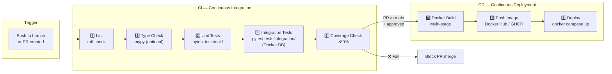
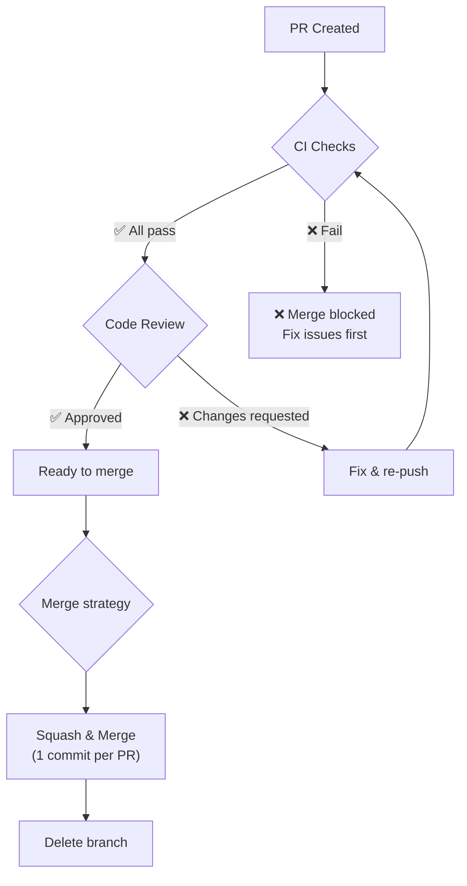
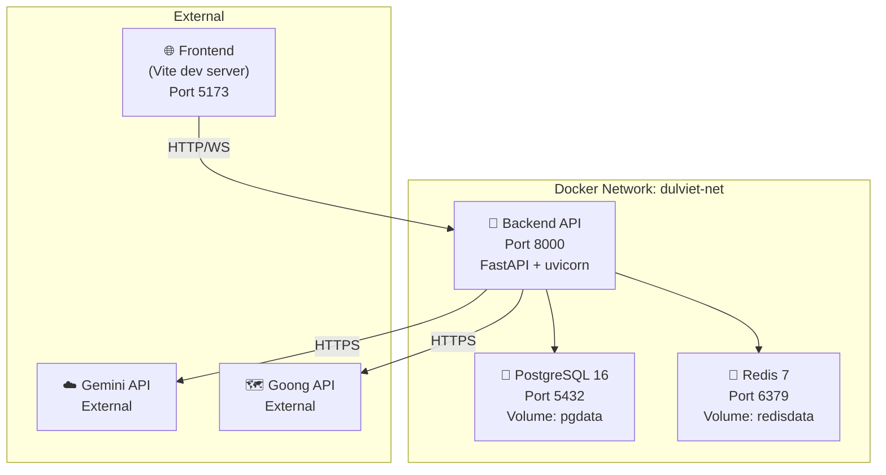
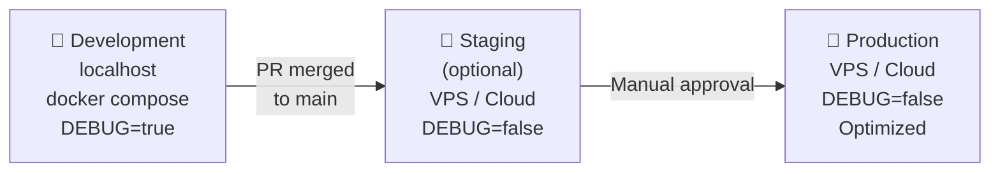
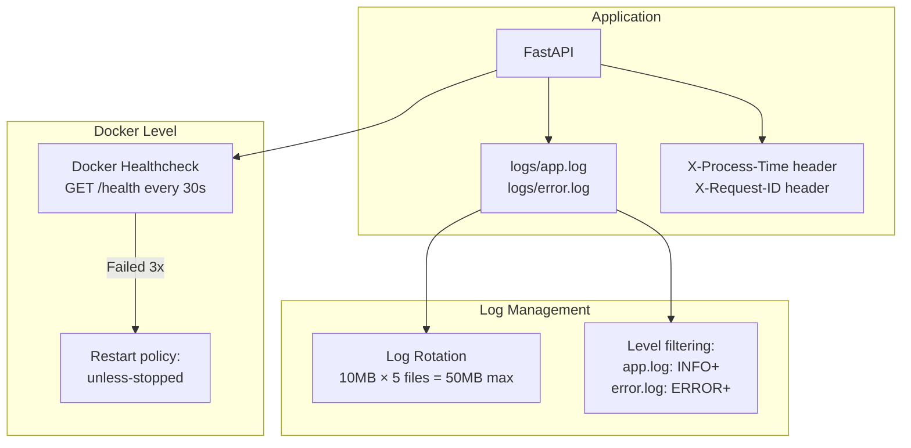

# Part 11: CI/CD, Docker & Deployment Plan

## Mục đích file này

Code xong mà không deploy được = vô nghĩa. File này mô tả **toàn bộ pipeline triển khai** — từ khi developer push code đến khi user truy cập API:

1. **CI/CD Pipeline** — Tự động test + build + deploy khi push code
2. **Docker** — Container hóa ứng dụng, tối ưu image size
3. **Merge Rules** — Quy tắc merge code giữa các branch
4. **Environment** — Dev, staging, production config
5. **Monitoring** — Health check, alerts, log aggregation

Đọc file này SAU khi đọc `08_coding_standards.md` (hiểu dev workflow) và `10_use_cases_test_plan.md` (hiểu test).

> [!IMPORTANT]
> Mọi thay đổi PHẢI qua PR. Direct push vào `main` bị CẤM.

> [!IMPORTANT]
> **Decision lock v4.2 (2026-04-25):** Phase A/B1/B2/B3/C/D vẫn là roadmap. Nhưng branch thực tế
> để code là **branch theo ticket nhỏ**: `type/task-phase-scope`, squash còn **1 commit cuối cùng**
> trước khi mở PR. Required checks trên GitHub dùng đúng 5 tên: `pr-policy`,
> `backend-lint`, `backend-unit`, `backend-integration`, `backend-migrations`.

> [!TIP]
> Operational summary cho Claude/AI assistant nam o
> [../CLAUDE.md](../CLAUDE.md) va [../.claude/context/06_ops_workflow_ci.md](../.claude/context/06_ops_workflow_ci.md).
> Khi doi branch/commit/PR/CI rules trong file nay, phai sync hai file do.

### Quyết định thiết kế chính (WHY)

| Quyết định | Tại sao (WHY) | Khi nào review (WHEN) |
|------------|--------------|----------------------|
| **GitHub Actions** thay vì Jenkins/GitLab CI | Repo trên GitHub, integrated tốt, free cho public repos. Không cần server CI riêng. | Nếu chuyển self-hosted → xem GitLab CI |
| **Squash merge** thay vì merge commit | 1 PR = 1 commit trên main → history sạch, revert dễ (1 lệnh). | Nếu team cần commit history chi tiết → rebase merge |
| **Multi-stage Docker** | Image production nhỏ (~400MB vs ~1.5GB). Không có dev tools, compiler trong production → bảo mật + nhanh. | — (best practice, không đổi) |
| **Docker Compose** thay vì Kubernetes | K8s quá phức tạp cho 1 VPS. Docker Compose đủ cho 1-3 container. | Nếu cần auto-scaling, multi-node → chuyển K8s |
| **uv** thay vì pip/poetry | Nhanh hơn 10-100x. Lockfile deterministic. Tích hợp tốt với Docker. | — (performance advantage rõ ràng) |

---

## 1. Git Workflow — Branch Strategy

### 1.1 Branch Naming Convention

```mermaid
gitgraph
    commit id: "main (stable)"
    branch feat/12345-a-foundation-uv-bootstrap
    checkout feat/12345-a-foundation-uv-bootstrap
    commit id: "wip commits..."
    checkout main
    merge feat/12345-a-foundation-uv-bootstrap id: "feat: [#12345] add uv bootstrap and backend skeleton"
    branch fix/67890-b2-itinerary-owner-check
    checkout fix/67890-b2-itinerary-owner-check
    commit id: "wip commits..."
    checkout main
    merge fix/67890-b2-itinerary-owner-check id: "fix: [#67890] fix itinerary owner authorization"
```

### 1.2 Branch Rules

| Branch Pattern | Mục đích | Merge vào | Ai tạo |
|---------------|---------|----------|--------|
| `main` | Production-ready code | — | Chỉ qua PR |
| `feat/<task>-<phase>-<scope>` | Feature ticket | `main` | Developer |
| `fix/<task>-<phase>-<scope>` | Bug fix ticket | `main` | Developer |
| `docs/<task>-<phase>-<scope>` | Docs ticket | `main` | Developer |
| `style/<task>-<phase>-<scope>` | Formatting only | `main` | Developer |
| `refactor/<task>-<phase>-<scope>` | Refactor ticket | `main` | Developer |
| `chore/<task>-<phase>-<scope>` | Tooling/config ticket | `main` | Developer |

**Regex chuẩn để validate branch:**

```text
^(feat|fix|docs|style|refactor|chore)\/[0-9]+-(a|b1|b2|b3|c|d)-[a-z0-9-]+$
```

**Ví dụ đúng:**

```text
feat/12345-b1-auth-register
fix/67890-b2-itinerary-owner-check
docs/13579-c-ai-chat-docs
```

**Quy tắc cứng:**
- 1 branch = 1 ticket chính
- Luôn tạo branch từ `main` mới nhất
- Phase (`a|b1|b2|b3|c|d`) chỉ để map roadmap, không thay thế Task ID
- Có thể có nhiều commit làm việc trong lúc code, nhưng trước PR phải squash còn đúng 1 commit cuối

### 1.3 Commit Message Convention

Dùng [Conventional Commits](https://www.conventionalcommits.org/) cho **commit cuối sau squash**:

```
feat: [#12345] add refresh token endpoint
fix: [#67890] fix guest claim token validation
docs: [#22222] update branch and pr workflow
```

**Format:** `<type>: [#<Task-ID>] <description>`

| Type | Khi nào dùng |
|------|------------|
| `feat` | Thêm tính năng mới |
| `fix` | Sửa bug |
| `docs` | Cập nhật tài liệu |
| `style` | Format code, không đổi logic |
| `refactor` | Thay đổi code nhưng không đổi behavior |
| `chore` | Dev tools, dependencies |

**Rule cho description:**
- Bắt đầu bằng động từ
- Viết thường chữ cái đầu
- Không dùng `fix`, `update`, `part 2`, `final`, `temp`

### 1.4 PR Title và Squash Rule

- PR title PHẢI trùng với final squash commit title
- Trước khi push branch để review: squash toàn bộ commit làm việc còn đúng 1 commit sạch
- Merge strategy trên GitHub: **Squash merge only**
- Sau merge: auto-delete branch

---

## 2. CI/CD Pipeline

### 2.1 Pipeline Overview



### 2.2 GitHub Actions Workflow

```yaml
# .github/workflows/backend-ci.yml
name: Backend CI

on:
  pull_request:
    branches: [main]
  push:
    branches:
      - 'feat/**'
      - 'fix/**'
      - 'docs/**'
      - 'style/**'
      - 'refactor/**'
      - 'chore/**'

jobs:
  backend-lint:
    name: backend-lint
    runs-on: ubuntu-latest

  backend-unit:
    name: backend-unit
    runs-on: ubuntu-latest

  backend-integration:
    name: backend-integration
    runs-on: ubuntu-latest

  backend-migrations:
    name: backend-migrations
    runs-on: ubuntu-latest
```

**Repo-support files bắt buộc:**
- `.github/workflows/backend-ci.yml`
- `.github/workflows/pr-policy.yml`
- `.github/PULL_REQUEST_TEMPLATE.md`
- `plan/17_execution_tracker.md`

**Required check names PHẢI đúng 100% để set trong GitHub GUI:**
- `pr-policy`
- `backend-lint`
- `backend-unit`
- `backend-integration`
- `backend-migrations`

> [!TIP]
> Tên job nên **unique** và giữ ổn định giữa các lần sửa workflow. Nếu đổi tên job sau khi đã set
> ruleset trên GitHub, required status checks sẽ không match nữa và PR sẽ bị block cho đến khi
> update lại ruleset.

> [!IMPORTANT]
> Workflow `backend-ci.yml` nên được viết **forward-compatible**:
> - Nếu repo đã có `Backend/pyproject.toml`, `Backend/src/`, `Backend/tests/`, `Backend/alembic.ini`
>   thì chạy check thật bằng `uv`, `ruff`, `pytest`, `alembic`
> - Nếu cấu trúc refactor chưa có đủ, job vẫn phải **pass an toàn** bằng fallback/no-op rõ ràng để
>   bạn có thể bật branch protection ngay từ bây giờ, rồi siết chặt dần sau Phase A

### 2.3 PR Policy Workflow

`pr-policy.yml` chạy trên `pull_request` và fail nếu:
- Branch name sai regex
- PR title sai format `type: [#Task-ID] description`
- PR body thiếu 1 trong 4 section:
  - `## Mô tả`
  - `## Thay đổi chính`
  - `## Cách kiểm tra (Testing)`
  - `## Lưu ý khác`

### 2.4 PR Merge Rules



**Merge checklist (tự động enforce):**

```
Required checks PHẢI pass trước khi merge:
□ pr-policy — branch/PR title/PR body đúng chuẩn
□ backend-lint — lint hoặc syntax fallback pass
□ backend-unit — unit tests pass hoặc placeholder pass có chủ đích
□ backend-integration — integration tests pass hoặc placeholder pass có chủ đích
□ backend-migrations — alembic upgrade head pass hoặc placeholder pass có chủ đích

Branch protection rules:
□ Require PR (no direct push to main)
□ Require 1 approval (code review)
□ Require status checks to pass
□ Dismiss stale approvals when new commits are pushed
□ Require approval of the most recent reviewable push
□ Require conversation resolution before merging
□ Require strict status checks (branch up to date)
□ Require linear history (squash merge)
□ Block force pushes
□ Restrict deletions
□ Do not allow bypassing the rules
□ Auto-delete branch after merge
```

### 2.5 GitHub GUI Setup

**`Settings → General → Pull Requests`:**
- Bật `Allow squash merging`
- Tắt `Allow merge commits`
- Tắt `Allow rebase merging`
- Bật `Allow auto-merge`
- Bật `Automatically delete head branches`

**`Settings → Rules → Rulesets → New branch ruleset` cho `main`:**
- `Require a pull request before merging`
- `Required approvals = 1`
- `Dismiss stale approvals when new commits are pushed`
- `Require approval of the most recent reviewable push`
- `Require conversation resolution before merging`
- `Require status checks to pass before merging`
- Chọn 5 checks: `pr-policy`, `backend-lint`, `backend-unit`, `backend-integration`, `backend-migrations`
- Bật strict mode: branch phải up to date trước khi merge
- `Require linear history`
- `Block force pushes`
- `Restrict deletions`
- `Do not allow bypassing the above settings`

### 2.6 Auto-merge và Conflict Behavior

- Chỉ bật `Auto-merge` sau khi PR đã nhận diện đủ required checks
- Nếu branch bị out-of-date hoặc có conflict, GitHub sẽ không auto-merge
- Nếu push commit mới lên PR, approval cũ bị stale và phải review lại
- Giai đoạn này dùng `auto-merge` là đủ; `merge queue` để optional về sau
- Nếu sau này bật `merge queue`, workflow phải thêm trigger `merge_group`

---

## 3. Docker — Container Architecture

### 3.1 Docker Compose Architecture



### 3.2 Dockerfile — Multi-stage Build (Tối ưu size)

Tại sao multi-stage? Vì build stage cần tools (gcc, build-essential) nhưng production KHÔNG cần. Multi-stage giữ lại chỉ những gì cần thiết → image nhỏ hơn 3-5x.

```dockerfile
# Backend/Dockerfile

# =============================================
# Stage 1: BUILD — Install dependencies
# =============================================
FROM python:3.12-slim AS builder

WORKDIR /app

# Install uv
COPY --from=ghcr.io/astral-sh/uv:latest /uv /uvx /bin/

# Copy dependency files first (cache layer)
COPY pyproject.toml uv.lock ./

# Install dependencies (cached if pyproject.toml unchanged)
RUN uv sync --frozen --no-dev --no-editable

# =============================================
# Stage 2: PRODUCTION — Minimal runtime
# =============================================
FROM python:3.12-slim AS production

# Security: non-root user
RUN groupadd -r appuser && useradd -r -g appuser appuser

WORKDIR /app

# Copy only virtual environment from builder
COPY --from=builder /app/.venv /app/.venv

# Copy application code
COPY src/ ./src/
COPY alembic/ ./alembic/
COPY alembic.ini ./
COPY config.yaml ./

# Create logs directory
RUN mkdir -p logs && chown -R appuser:appuser /app

# Switch to non-root user
USER appuser

# Environment
ENV PATH="/app/.venv/bin:$PATH"
ENV PYTHONPATH="/app"
ENV PYTHONUNBUFFERED=1

# Health check
HEALTHCHECK --interval=30s --timeout=5s --start-period=10s --retries=3 \
    CMD python -c "import httpx; httpx.get('http://localhost:8000/health')" || exit 1

# Expose port
EXPOSE 8000

# Run with uvicorn
CMD ["uvicorn", "src.main:app", "--host", "0.0.0.0", "--port", "8000", "--workers", "2"]
```

### 3.3 Image Size Optimization

```
┌──────────────────────────────────────────────────────────────┐
│              DOCKER IMAGE SIZE OPTIMIZATION                   │
├──────────────────────────────────────────────────────────────┤
│                                                              │
│  ❌ KHÔNG tối ưu:                                            │
│  python:3.12 (full) ≈ 1.0 GB                                │
│  + all dev dependencies ≈ 1.5 GB                             │
│                                                              │
│  ✅ CÓ tối ưu (multi-stage):                                │
│  python:3.12-slim ≈ 150 MB                                   │
│  + production deps only ≈ 250 MB                             │
│  + app code ≈ 5 MB                                           │
│  TOTAL ≈ 405 MB (giảm ~73%)                                 │
│                                                              │
│  Techniques used:                                            │
│  ├── python:3.12-slim (not full)                             │
│  ├── Multi-stage (no build tools in final)                   │
│  ├── --no-dev (skip pytest, ruff in production)              │
│  ├── COPY dependencies before code (Docker cache)            │
│  ├── .dockerignore (skip __pycache__, .git, tests)           │
│  └── Non-root user (security best practice)                  │
│                                                              │
└──────────────────────────────────────────────────────────────┘
```

### 3.4 `.dockerignore`

```dockerignore
# Git
.git
.gitignore

# Python
__pycache__
*.pyc
*.pyo
.pytest_cache
.mypy_cache
.ruff_cache
htmlcov/

# IDE
.vscode
.idea

# Tests (not needed in production)
tests/

# Env files (secrets — inject via docker-compose)
.env
.env.*

# Documentation
*.md
plan/
docs/

# OS
.DS_Store
Thumbs.db
```

### 3.5 Docker Compose — Development

```yaml
# docker-compose.yml (development)
version: "3.9"

services:
  # ============ Backend API ============
  api:
    build:
      context: ./Backend
      target: production       # Use production stage
    ports:
      - "8000:8000"
    env_file:
      - ./Backend/.env         # Inject secrets
    environment:
      - ENVIRONMENT=development
      - DEBUG=true
    volumes:
      - ./Backend/logs:/app/logs     # Persist logs
    depends_on:
      db:
        condition: service_healthy
      redis:
        condition: service_healthy
    networks:
      - dulviet-net
    restart: unless-stopped

  # ============ PostgreSQL ============
  db:
    image: postgres:16-alpine
    environment:
      POSTGRES_USER: dulviet
      POSTGRES_PASSWORD: dulviet_secret
      POSTGRES_DB: dulviet_db
    ports:
      - "5432:5432"
    volumes:
      - pgdata:/var/lib/postgresql/data
    healthcheck:
      test: ["CMD-SHELL", "pg_isready -U dulviet"]
      interval: 10s
      timeout: 5s
      retries: 5
    networks:
      - dulviet-net

  # ============ Redis ============
  redis:
    image: redis:7-alpine
    ports:
      - "6379:6379"
    volumes:
      - redisdata:/data
    command: redis-server --appendonly yes --maxmemory 100mb --maxmemory-policy allkeys-lru
    healthcheck:
      test: ["CMD", "redis-cli", "ping"]
      interval: 10s
      timeout: 5s
      retries: 5
    networks:
      - dulviet-net

volumes:
  pgdata:
  redisdata:

networks:
  dulviet-net:
    driver: bridge
```

### 3.6 Docker Commands — Quick Reference

```bash
# ========================
# Development
# ========================

# Start tất cả services
docker compose up -d

# Xem logs
docker compose logs -f api

# Rebuild sau khi sửa Dockerfile
docker compose up -d --build api

# Chỉ start DB + Redis (dev local, không cần Docker cho API)
docker compose up -d db redis

# ========================
# Database
# ========================

# Run migrations
docker compose exec api alembic upgrade head

# Create new migration
docker compose exec api alembic revision --autogenerate -m "add_table"

# Rollback
docker compose exec api alembic downgrade -1

# ========================
# Debug
# ========================

# Shell vào container
docker compose exec api bash

# Check health
docker compose ps

# Check image size
docker images | grep dulviet

# ========================
# Cleanup
# ========================

# Stop tất cả
docker compose down

# Stop + xóa volumes (WARNING: xóa DB data)
docker compose down -v

# Xóa dangling images
docker image prune -f
```

---

## 4. Environment Management

### 4.1 Environment Workflow



### 4.2 Config per Environment

```
┌──────────────┬─────────────────┬─────────────────┬─────────────────┐
│ Setting      │ Development     │ Staging         │ Production      │
├──────────────┼─────────────────┼─────────────────┼─────────────────┤
│ DEBUG        │ true            │ false           │ false           │
│ LOG_LEVEL    │ DEBUG           │ INFO            │ WARNING         │
│ DB           │ localhost:5432  │ staging-db      │ prod-db (RDS)   │
│ REDIS        │ localhost:6379  │ staging-redis   │ prod-redis      │
│ CORS origins │ localhost:5173  │ staging.app.com │ app.dulviet.com │
│ Workers      │ 1               │ 2               │ 4               │
│ Rate limit   │ 100/min         │ 50/min          │ 30/min          │
│ AI limit     │ 10/day          │ 5/day           │ 3/day           │
└──────────────┴─────────────────┴─────────────────┴─────────────────┘
```

---

## 5. Health Check & Monitoring

### 5.1 Health Check Endpoint

```python
# src/api/v1/health.py
"""Health check endpoint for Docker + monitoring."""

from fastapi import APIRouter
from sqlalchemy import text

router = APIRouter(tags=["Health"])

@router.get("/health")
async def health_check(db = Depends(get_db)):
    """Check API + DB + Redis connectivity.
    
    Returns:
        200: {"status": "healthy", "db": "ok", "redis": "ok"}
        503: {"status": "unhealthy", "db": "error", ...}
    """
    checks = {"status": "healthy"}
    
    # DB check
    try:
        await db.execute(text("SELECT 1"))
        checks["db"] = "ok"
    except Exception:
        checks["db"] = "error"
        checks["status"] = "unhealthy"
    
    # Redis check
    try:
        await redis.ping()
        checks["redis"] = "ok"
    except Exception:
        checks["redis"] = "error"
        checks["status"] = "unhealthy"
    
    status_code = 200 if checks["status"] == "healthy" else 503
    return JSONResponse(checks, status_code=status_code)
```

### 5.2 Monitoring Architecture



---

## 6. Deployment Checklist

### 6.1 First Deployment

```
□ 1. Clone repo
□ 2. Copy .env.example → .env, fill in real values
     □ DATABASE_URL (production DB)
     □ JWT_SECRET_KEY (generate: openssl rand -hex 32)
     □ GEMINI_API_KEY (from Google AI Studio)
     □ REDIS_URL (production Redis)
□ 3. Build images: docker compose build
□ 4. Start services: docker compose up -d
□ 5. Run migrations: docker compose exec api alembic upgrade head
□ 6. Seed data: docker compose exec api python -m src.etl.seed
□ 7. Verify health: curl http://localhost:8000/health
□ 8. Check logs: docker compose logs -f api
```

### 6.2 New Features Verification (v4.0)

```
□ 1. Guest tạo trip → verify trip lưu DB với user_id = NULL và response có claimToken một lần
□ 2. Guest login → POST /itineraries/{id}/claim với claimToken → verify token hash/expiry và user_id updated
□ 3. Auth user tạo 5 trips → tạo trip thứ 6 → verify 403 MAX_TRIPS_REACHED
□ 4. Auth user xóa 1 trip → tạo mới → verify thành công (limit - 1)
□ 5. WS chat → verify LangGraph checkpoint lưu state nội bộ và chat_messages lưu API history
□ 6. GET /agent/chat-history/{trip_id} → verify trả paginated history
□ 7. Share link (read-only) → verify không có edit permissions
```

### 6.3 Update Deployment

```
□ 1. Pull latest: git pull origin main
□ 2. Rebuild API only: docker compose up -d --build api
□ 3. Run new migrations: docker compose exec api alembic upgrade head
□ 4. Verify: curl http://localhost:8000/health
□ 5. Monitor logs 5 minutes: docker compose logs -f api
```

### 6.3 Rollback

```bash
# Nếu có lỗi sau deploy:
# 1. Rollback code
git revert HEAD
docker compose up -d --build api

# 2. Rollback DB migration
docker compose exec api alembic downgrade -1

# 3. Verify
curl http://localhost:8000/health
```

---

## 7. Security Checklist (Production)

```
┌──────────────────────────────────────────────────────────────┐
│              SECURITY CHECKLIST                               │
├──────────────────────────────────────────────────────────────┤
│                                                              │
│  ✅ .env NEVER committed to Git (.gitignore)                 │
│  ✅ JWT_SECRET_KEY ≥ 32 bytes random                        │
│  ✅ Database password is strong                              │
│  ✅ Docker runs as non-root user                             │
│  ✅ CORS restricted to specific origins                      │
│  ✅ Rate limiting enabled                                    │
│  ✅ SQL injection prevented (SQLAlchemy parameterized)       │
│  ✅ Password hashed with bcrypt                              │
│  ✅ Refresh tokens hashed in DB                              │
│  ✅ HTTPS in production (nginx/cloudflare)                   │
│  ✅ DEBUG=false in production                                │
│  ✅ Sensitive data NOT in logs                                │
│                                                              │
└──────────────────────────────────────────────────────────────┘
```

---

## 8. Tóm tắt — Quick Reference

```
Developer Workflow:
  1. Chọn row trong plan/17_execution_tracker.md
  2. git checkout main && git pull
  3. git checkout -b feat/<task>-<phase>-<scope>
  4. Code → Test local → update tracker
  5. Squash branch còn 1 commit: type: [#Task-ID] description
  6. Push → CI runs (pr-policy + backend-ci)
  7. Create PR đúng template → Code review
  8. All checks pass + approved → Auto-merge/Squash merge
  9. Branch auto-deleted
 10. Main updated → CD deploys (if configured)

Docker Commands:
  docker compose up -d                 ← Start all
  docker compose logs -f api           ← Watch logs
  docker compose exec api alembic upgrade head  ← Migrate
  docker compose down                  ← Stop all

ETL Commands:
  docker compose exec api python -m src.etl.runner          ← Full ETL
  docker compose exec api python -m src.etl.runner --cities "Hà Nội"  ← One city

File locations:
  .env                  ← Secrets (GITIGNORED)
  .env.example          ← Template (committed)
  config.yaml           ← Non-secret config (committed, 30+ params — xem 14_config_plan.md)
  docker-compose.yml    ← Service definition
  Backend/Dockerfile    ← Multi-stage build
  .github/workflows/    ← CI/CD pipeline

System Overview (v4.0):
  Total endpoints: 33 (31 CRUD + EP-32 claim + EP-33 chat-history)
  New features: Guest Claim, 5 Trips Limit, Chat History, Share Read-Only
  Architecture: 5 layers — xem 13_architecture_overview.md
  Config: 30+ params — xem 14_config_plan.md
```
