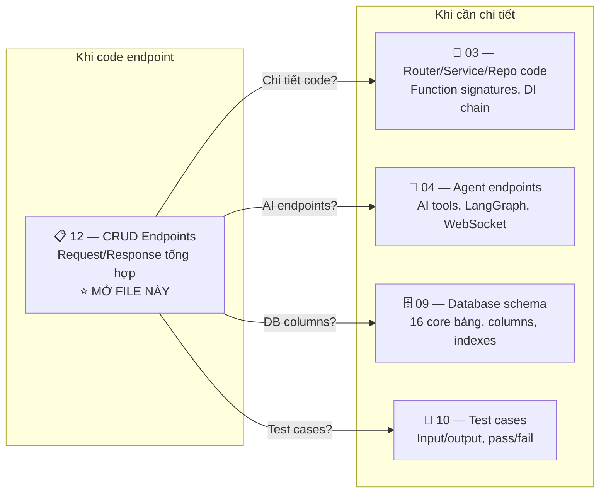
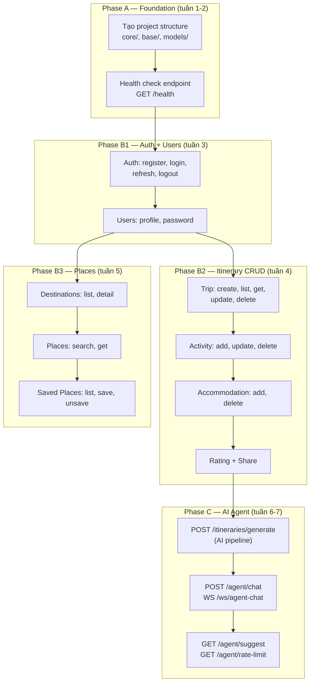

# Part 12: BE CRUD Endpoints — Bảng tổng hợp 33 core API + EP-34 optional

## Mục đích file này

Đây là file **"mở ra khi code"** — 1 nguồn duy nhất chứa TẤT CẢ 33 core endpoints với:
- Request body (fields + types + validation)
- Response body (fields + types + camelCase mapping)
- Status codes (success + error)
- Auth requirement
- File nào implement (router → service → repo → schema)

> **Decision lock v4.1:** Public API dùng camelCase theo FE `trip.types.ts`. Python nội bộ
> có thể dùng snake_case nhưng request/response JSON phải là `tripName`, `startDate`,
> `adultPrice`, `claimToken`, `shareToken`. `GET /itineraries/{id}` là owner-only;
> public share đọc qua `GET /shared/{shareToken}`. Guest claim phải verify one-time
> `claimToken`. EP-34 Analytics là optional/MVP2+ sau khi bật feature flag và guardrails.

**Tại sao cần file này?** Vì specs nằm rải rác trong nhiều file:
- File `03` có router/service/repo/schema nhưng theo TỪ FILE (nhóm theo layer)
- File `04` có agent endpoints
- File `09` có DB schema
- File `10` có test cases
- File `implementation_plan` có endpoint mapping table

File này **gộp tất cả theo ENDPOINT** — khi code endpoint X, chỉ cần tìm endpoint X trong file này, mọi thông tin đều ở đó. EP-34 vẫn được mô tả để chuẩn bị tương lai nhưng không tính vào MVP2 core Definition of Done.

> [!IMPORTANT]
> File này ĐỒNG BỘ với các file khác. Nếu sửa file này → sửa file liên quan. Xem bảng cross-reference ở cuối.

---

## Cross-reference — File nào chứa gì?



| Câu hỏi khi code | Mở file |
|-------------------|---------|
| "Endpoint X nhận request gì, trả response gì?" | **File 12 (này)** |
| "Function nào implement endpoint X?" | [03_be_refactor_plan.md](03_be_refactor_plan.md) |
| "Agent endpoint X gọi tool nào?" | [04_ai_agent_plan.md](04_ai_agent_plan.md) |
| "Bảng DB column nào map với field này?" | [09_database_design.md](09_database_design.md) |
| "Test case nào verify endpoint X?" | [10_use_cases_test_plan.md](10_use_cases_test_plan.md) |
| "Import rules, coding style?" | [08_coding_standards.md](08_coding_standards.md) |

---

## Implementation Order — Code gì trước?



> [!TIP]
> **Code CRUD trước, AI sau.** Vì AI Agent cần Trip data trong DB để gợi ý. Nếu chưa có Trip CRUD, AI không có data để RAG.

---

## Nhóm 1: Auth (4 endpoints)

### EP-01: `POST /api/v1/auth/register`

| | |
|---|---|
| **Mô tả** | Đăng ký tài khoản mới |
| **Auth** | ❌ Public |
| **Rate limit** | Không |

**Request Body:**
```json
{
  "email": "user@example.com",      // EmailStr — tự validate format
  "password": "secret123",          // str, min 6 ký tự
  "full_name": "Nguyễn Văn A"      // str, min 1, max 100
}
```

**Response 201 Created:**
```json
{
  "accessToken": "eyJ...",          // JWT, hết hạn 15 phút
  "refreshToken": "abc123...",      // Random string, hết hạn 30 ngày
  "user": {
    "id": 1,                        // int (auto-increment)
    "email": "user@example.com",
    "fullName": "Nguyễn Văn A",     // ⚠️ camelCase 
    "avatarUrl": null,
    "createdAt": "2026-05-01T12:00:00Z"
  }
}
```

**Error Responses:**
| Status | error_code | Khi nào | 
|--------|------------|---------|
| 409 | `CONFLICT` | Email đã tồn tại |
| 422 | `VALIDATION_ERROR` | Email sai format, password < 6 ký tự |

**Implementation chain:**
```
Router: src/api/v1/auth.py → register()
Service: src/services/auth_service.py → AuthService.register()
Repo:    src/repositories/user_repo.py → UserRepo.create()
         src/repositories/refresh_token_repo.py → RefreshTokenRepo.create()
Schema:  src/schemas/auth.py → RegisterRequest, AuthResponse
DB:      users (INSERT), refresh_tokens (INSERT)
Test:    TC-AUTH-01, TC-AUTH-02, TC-AUTH-03, TC-AUTH-04
```

**How it works (step by step):**
1. Router parse `RegisterRequest` (Pydantic validate email format + password length)
2. Service check `UserRepo.get_by_email(email)` → nếu tồn tại → 409
3. Service gọi `bcrypt.hash(password, rounds=12)` → 60-char hash
4. Service gọi `UserRepo.create(email, hashed_password, full_name)` → INSERT users
5. Service tạo JWT access token (15 min) + refresh token (random 32 bytes)
6. Service lưu `RefreshTokenRepo.create(user_id, SHA256(refresh_token))` → INSERT refresh_tokens
7. Return `AuthResponse` với camelCase fields

---

### EP-02: `POST /api/v1/auth/login`

| | |
|---|---|
| **Auth** | ❌ Public |

**Request Body:**
```json
{
  "email": "user@example.com",
  "password": "secret123"
}
```

**Response 200 OK:** (giống register — `AuthResponse`)
```json
{
  "accessToken": "eyJ...",
  "refreshToken": "abc123...",
  "user": { "id": 1, "email": "...", "fullName": "...", "avatarUrl": null, "createdAt": "..." }
}
```

**Errors:** `401 UNAUTHORIZED` — Email hoặc password sai

**Chain:** `auth.py → login()` → `AuthService.login()` → `UserRepo.get_by_email()` → verify bcrypt

---

### EP-03: `POST /api/v1/auth/refresh`

| | |
|---|---|
| **Auth** | ❌ Public (nhưng cần refresh token trong body) |

**Request Body:**
```json
{
  "refresh_token": "abc123..."     // ⚠️ snake_case trong request
}
```

**Response 200 OK:**
```json
{
  "accessToken": "eyJ...(new)",
  "refreshToken": "xyz789...(new)"
}
```

**Errors:** `401 UNAUTHORIZED` — Token invalid, expired, hoặc đã bị revoke

**Logic đặc biệt:** Refresh token **rotation** — token cũ bị revoke ngay sau khi dùng. Nếu attacker dùng token cũ → cả 2 (user + attacker) đều bị revoke → user buộc login lại.

**Chain:** `auth.py → refresh_token()` → `AuthService.refresh()` → `RefreshTokenRepo.find_by_hash()` → revoke old → create new

---

### EP-04: `POST /api/v1/auth/logout`

| | |
|---|---|
| **Auth** | 🔒 Required |

**Request:** Không có body — chỉ cần `Authorization: Bearer <token>` header

**Response 204 No Content:** Không có body

**Logic:** Revoke TẤT CẢ refresh tokens của user → logout from all devices

**Chain:** `auth.py → logout()` → `AuthService.logout()` → `RefreshTokenRepo.revoke_all(user_id)`

---

## Nhóm 2: Users (3 endpoints)

### EP-05: `GET /api/v1/users/profile`

| | |
|---|---|
| **Auth** | 🔒 Required |

**Request:** Không có body/query — user_id lấy từ JWT

**Response 200 OK:**
```json
{
  "id": 1,
  "email": "user@example.com",
  "fullName": "Nguyễn Văn A",
  "avatarUrl": "https://...",
  "createdAt": "2026-05-01T12:00:00Z"
}
```

**Chain:** `users.py → get_profile()` → `UserService.get_profile()` → `UserRepo.get_by_id()`

---

### EP-06: `PUT /api/v1/users/profile`

| | |
|---|---|
| **Auth** | 🔒 Required |

**Request Body:**
```json
{
  "full_name": "Tên mới",         // str | null — null = không đổi
  "avatar_url": "https://..."     // str | null
}
```
> ⚠️ Email KHÔNG thể thay đổi (immutable identifier)

**Response 200 OK:** `UserResponse` (giống EP-05)

**Chain:** `users.py → update_profile()` → `UserService.update_profile()` → `UserRepo.update()`

---

### EP-07: `PUT /api/v1/users/password`

| | |
|---|---|
| **Auth** | 🔒 Required |

**Request Body:**
```json
{
  "current_password": "old_pass",
  "new_password": "new_pass_123"   // min 6 ký tự
}
```

**Response 204 No Content**

**Errors:**
| Status | Khi nào |
|--------|---------|
| 401 | Current password sai |
| 422 | New password < 6 ký tự |

**Chain:** `users.py → change_password()` → `UserService.change_password()` → verify old → hash new → `UserRepo.update()`

---

## Nhóm 3: Itineraries — Trip CRUD (13 endpoints)

> [!WARNING]
> Đây là nhóm LỚN NHẤT (13 endpoints) và PHỨC TẠP NHẤT. Response trả về nested structure: Trip → Days → Activities → ExtraExpenses + Accommodations.

### EP-08: `POST /api/v1/itineraries/generate` ⭐ AI

| | |
|---|---|
| **Auth** | 🔓 Optional (guest có thể tạo) |
| **Rate limit** | ✅ 3 lần/ngày (free) |

**Request Body:**
```json
{
  "destination": "Hà Nội",         // str, required
  "startDate": "2026-05-01",      // date, required
  "endDate": "2026-05-03",        // date, must be after start
  "budget": 5000000,              // int (VND), must be > 0
  "interests": ["food", "culture"], // list[str], min 1 item
  "adultsCount": 2,               // int, default 1, min 1
  "childrenCount": 0              // int, default 0, min 0
}
```

**Response 201 Created:** `ItineraryResponse` — xem [Full ItineraryResponse](#full-itineraryresponse-structure) bên dưới. Nếu request là guest, response kèm `claimToken` một lần để claim sau login.

**Errors:**
| Status | error_code | Khi nào |
|--------|------------|---------|
| 422 | `VALIDATION_ERROR` | Date sai, budget ≤ 0, interests rỗng |
| 429 | `RATE_LIMIT_EXCEEDED` | Đã hết 3 lượt AI hôm nay |
| 503 | `SERVICE_UNAVAILABLE` | Gemini API fail sau 2 retries |

**Chain:** `itineraries.py → generate_itinerary()` → `ItineraryService.generate()` → AI Pipeline 5 steps → `TripRepo.create_full()`

**How it works (5-step RAG Pipeline):**
1. **Rate limit check:** Middleware kiểm tra Redis counter `ratelimit:generate:{user_id}` → nếu >= 3 → 429
2. **Creation limit check** (auth user only): `COUNT trips WHERE user_id=X AND status!='deleted'` → nếu >= 5 → 403 `MAX_TRIPS_REACHED`
3. **Validate input:** Pydantic parse `GenerateRequest` → destination tồn tại trong DB? date range 1-14 ngày? budget > 0?
4. **Fetch context:** `asyncio.gather(place_repo.get_by_dest(city, limit=30), hotel_repo.get_by_city(city, limit=8))` — 2 queries song song
5. **Build prompt:** Inject 30 places + 8 hotels vào system prompt template → ~2500 tokens
6. **Call Gemini:** `model.with_structured_output(AgentItinerary).ainvoke(prompt)` — retry max 2x (1s, 2s backoff)
7. **Save to DB:** Map AI place names → DB place IDs (fuzzy match) → INSERT trip + days + activities trong 1 transaction
8. **Guest vs Auth:** `user_id=NULL` nếu guest, `user_id=current_user.id` nếu auth. Guest response phải có `claimToken`; BE chỉ lưu hash + expiry trong `guest_claim_tokens`.

> [!NOTE]
> Chi tiết AI pipeline → [04_ai_agent_plan.md §3 (ItineraryPipeline)](04_ai_agent_plan.md)

---

### EP-09: `POST /api/v1/itineraries`

| | |
|---|---|
| **Mô tả** | Tạo trip thủ công (không AI) — user tự thêm activities sau |
| **Auth** | 🔓 Optional |

**Request Body:**
```json
{
  "destination": "Đà Nẵng",
  "tripName": "Đà Nẵng 3 ngày",
  "startDate": "2026-06-01",
  "endDate": "2026-06-03",
  "budget": 3000000,
  "adultsCount": 1,
  "childrenCount": 0,
  "interests": ["nature"]
}
```

**Response 201 Created:** `ItineraryResponse` (với days rỗng — chưa có activities)

**Chain:** `itineraries.py → create_manual_trip()` → `ItineraryService.create_manual()` → `TripRepo.create()`

---

### EP-10: `GET /api/v1/itineraries`

| | |
|---|---|
| **Mô tả** | Danh sách trips của user (trang TripHistory) |
| **Auth** | 🔒 Required |

**Query Params:** `?page=1&size=20`

**Response 200 OK:** `PaginatedResponse[ItineraryListItem]`
```json
{
  "items": [
    {
      "id": 42,
      "destination": "Hà Nội",
      "tripName": "Khám phá Hà Nội",
      "startDate": "2026-05-01",
      "endDate": "2026-05-03",
      "budget": 5000000,
      "totalCost": 3200000,
      "status": "active",
      "aiGenerated": true,
      "createdAt": "2026-04-20T10:00:00Z"
    }
  ],
  "total": 5,
  "page": 1,
  "size": 20,
  "pages": 1
}
```

> ⚠️ `ItineraryListItem` KHÔNG chứa days/activities (nhẹ). Chỉ `ItineraryResponse` mới có full nested data.

**Chain:** `itineraries.py → list_trips()` → `ItineraryService.list_by_user()` → `TripRepo.get_by_user()`

---

### EP-11: `GET /api/v1/itineraries/{id}`

| | |
|---|---|
| **Auth** | 🔒 Required (owner only) |

**Response 200 OK:** `ItineraryResponse` — xem [Full ItineraryResponse](#full-itineraryresponse-structure)

**Errors:** `403 FORBIDDEN`, `404 NOT_FOUND`

**Chain:** `itineraries.py → get_trip()` → `ItineraryService.get_owned_by_id()` → owner check → `TripRepo.get_with_full_data()` (eager load all relations)

> [!IMPORTANT]
> Không dùng endpoint này cho public share. Integer ID dễ đoán, nên shared page phải gọi `GET /api/v1/shared/{shareToken}`.

---

### EP-12: `PUT /api/v1/itineraries/{id}` ⭐ Auto-save

| | |
|---|---|
| **Mô tả** | Auto-save — FE gọi mỗi 3 giây khi user edit trip |
| **Auth** | 🔒 Required (owner only) |

**Request Body:** `TripUpdateRequest`
```json
{
  "tripName": "Hà Nội updated",
  "days": [
    {
      "id": 1,                     // int → UPDATE existing day
      "label": "Ngày 1",
      "date": "2026-05-01",
      "destinationName": null,
      "activities": [
        {
          "id": 1,                 // int → UPDATE existing activity
          "name": "Phở Bát Đàn",
          "time": "08:00",
          "endTime": "09:00",
          "type": "food",
          "location": "49 Bát Đàn",
          "description": "",
          "image": "",
          "transportation": null,
          "adultPrice": 50000,
          "childPrice": null,
          "customCost": null,
          "busTicketPrice": null,
          "taxiCost": null,
          "extraExpenses": [
            {"id": null, "description": "Nước", "amount": 10000}
          ]
        },
        {
          "id": null,              // null → CREATE new activity
          "name": "Bún chả mới",
          "time": "12:00",
          "type": "food"
        }
      ],
      "extraExpenses": []
    },
    {
      "id": null,                  // null → CREATE new day
      "label": "Ngày 3",
      "date": "2026-05-03",
      "activities": []
    }
  ],
  "accommodations": [
    {
      "id": null,
      "name": "Hilton Hanoi",
      "checkIn": "2026-05-01",
      "checkOut": "2026-05-03",
      "pricePerNight": 1500000,
      "hotelId": 5,
      "bookingUrl": null
    }
  ],
  "totalBudget": 6000000
}
```

**Diff & Sync Logic:**
```
Incoming có id=1 (day) → UPDATE day 1
Incoming có id=null (day) → CREATE new day
DB có day id=2, incoming KHÔNG có → DELETE day 2 (cascade delete activities)

Tương tự cho activities trong mỗi day:
  Incoming id=1 (activity) → UPDATE
  Incoming id=null → CREATE  
  DB có nhưng incoming không có → DELETE
```

**Response 200 OK:** `ItineraryResponse` (full updated trip)

**Errors:** `403 FORBIDDEN` (not owner), `404 NOT_FOUND`

**Chain:** `itineraries.py → update_itinerary()` → `ItineraryService.update()` → sync_days/sync_activities → `TripRepo.update_full()` → Redis invalidate

**How it works (Diff & Sync):**
1. **Ownership check:** `trip.user_id == current_user.id` → nếu sai → 403
2. **Load DB state:** `TripRepo.get_with_full_data(trip_id)` — eager load trips + days + activities
3. **Classify days:**
   - Incoming day có `id` (int) → **UPDATE** nếu fields thay đổi
   - Incoming day có `id: null` → **CREATE** new day
   - DB day id KHÔNG có trong incoming → **DELETE** (cascade xóa activities)
4. **Classify activities** (recursive per day): same logic với `id` presence
5. **Reindex order:** Sau sync → đảm bảo `order_index` liền mạch (0, 1, 2...)
6. **Recalculate cost:** SUM `adult_price + child_price + custom_cost` → update `trip.total_cost`
7. **Single transaction:** Tất cả changes trong `async with session.begin()` — all or nothing
8. **Cache invalidate:** `redis.delete(f"trip:{trip_id}")` sau commit thành công

> [!NOTE]
> Chi tiết Diff & Sync algorithm → [03_be_refactor_plan.md §0.3](03_be_refactor_plan.md)

---

### EP-13: `DELETE /api/v1/itineraries/{id}`

| **Auth** | 🔒 Required (owner only) |
|---|---|

**Response 204 No Content**

**Errors:** `403 FORBIDDEN`, `404 NOT_FOUND`

**Logic:** Cascade delete → xóa trip + tất cả days + activities + accommodations + rating + share link

---

### EP-14: `PUT /api/v1/itineraries/{id}/rating`

| **Auth** | 🔒 Required |
|---|---|

**Request Body:**
```json
{
  "rating": 4,            // int, 1-5
  "feedback": "Rất tốt!"  // str | null
}
```

**Response 200 OK:** `{"message": "Rating saved"}`

---

### EP-15: `POST /api/v1/itineraries/{id}/share`

| **Auth** | 🔒 Required (owner only) |
|---|---|

**Request:** Không có body

**Response 200 OK:**
```json
{
  "shareUrl": "https://app.dulviet.com/shared/abc123",
  "shareToken": "abc123...",
  "expiresAt": null          // null = không hết hạn
}
```

**Public read endpoint:** `GET /api/v1/shared/{shareToken}` trả read-only `ItineraryResponse`. Endpoint này không nhận integer `tripId`, không cho edit/save, và trả `404` nếu token hết hạn/revoked.

**DB:** `share_links.token_hash`, `trip_id`, `created_by_user_id`, `expires_at`, `revoked_at`, `permission="view"`.

---

### EP-16: `POST /api/v1/itineraries/{id}/activities`

| **Auth** | 🔒 Required (owner only) |
|---|---|

**Request Body:**
```json
{
  "dayId": 1,              // int — thêm vào ngày nào
  "name": "Phở Bát Đàn",
  "time": "08:00",
  "type": "food",
  "endTime": "09:00",
  "location": "49 Bát Đàn, HN",
  "description": "",
  "image": "",
  "transportation": null,
  "adultPrice": 50000,
  "childPrice": null,
  "customCost": null
}
```

**Response 201 Created:** `ActivityResponse`
```json
{
  "id": 99,               // auto-generated ID
  "name": "Phở Bát Đàn",
  "time": "08:00",
  "endTime": "09:00",
  "type": "food",
  "location": "49 Bát Đàn, HN",
  "description": "",
  "image": "",
  "transportation": null,
  "adultPrice": 50000,
  "childPrice": null,
  "customCost": null,
  "busTicketPrice": null,
  "taxiCost": null,
  "extraExpenses": []
}
```

---

### EP-17: `PUT /api/v1/itineraries/{id}/activities/{aid}`

| **Auth** | 🔒 Required (owner only) |
|---|---|

**Request Body:** `ActivityUpdateData` (giống EP-16 nhưng không cần dayId)

**Response 200 OK:** Updated `ActivityResponse`

---

### EP-18: `DELETE /api/v1/itineraries/{id}/activities/{aid}`

| **Auth** | 🔒 Required |
|---|---|

**Response 204 No Content**

---

### EP-19: `POST /api/v1/itineraries/{id}/accommodations`

| **Auth** | 🔒 Required |
|---|---|

**Request Body:**
```json
{
  "name": "Hilton Hanoi",
  "checkIn": "2026-05-01",
  "checkOut": "2026-05-03",
  "pricePerNight": 1500000,
  "hotelId": 5,             // int | null — link to DB hotel
  "bookingUrl": null
}
```

**Response 201 Created:** `AccommodationResponse`
```json
{
  "id": 10,
  "name": "Hilton Hanoi",
  "checkIn": "2026-05-01",
  "checkOut": "2026-05-03",
  "pricePerNight": 1500000,
  "totalPrice": 3000000,    // pricePerNight × 2 nights (auto-calculated)
  "bookingUrl": null,
  "hotel": {                 // populated if hotelId != null
    "id": 5,
    "name": "Hilton Hanoi",
    "pricePerNight": 1500000,
    "rating": 4.5,
    "location": "1 Le Thanh Ton",
    "image": "https://..."
  }
}
```

---

### EP-20: `DELETE /api/v1/itineraries/{id}/accommodations/{aid}`

| **Auth** | 🔒 Required |
|---|---|

**Response 204 No Content**

---

## Nhóm 4: Places & Destinations (4 endpoints)

### EP-21: `GET /api/v1/destinations`

| **Auth** | ❌ Public |
|---|---|
| **Cache** | Redis 60 phút |

**Response 200 OK:**
```json
[
  {
    "id": 1,
    "name": "Hà Nội",
    "slug": "ha-noi",
    "description": "Thủ đô nghìn năm văn hiến...",
    "image": "https://...",
    "placesCount": 45
  },
  ...  // 10 cities
]
```

---

### EP-22: `GET /api/v1/destinations/{name}/detail`

| **Auth** | ❌ Public |
|---|---|
| **Cache** | Redis 60 phút |

**Response 200 OK:**
```json
{
  "destination": { "id": 1, "name": "Hà Nội", "slug": "ha-noi", "image": "...", "placesCount": 45 },
  "places": [
    { "id": 1, "name": "Phở Bát Đàn", "category": "food", "rating": 4.8, "avgCost": 50000, "image": "...", "location": "49 Bát Đàn" },
    ...
  ],
  "hotels": [
    { "id": 1, "name": "Hilton Hanoi", "pricePerNight": 1500000, "rating": 4.5, "location": "1 Le Thanh Ton", "image": "..." },
    ...
  ]
}
```

**Errors:** `404 NOT_FOUND` if destination doesn't exist

---

### EP-23: `GET /api/v1/places/search`

| **Auth** | ❌ Public |
|---|---|
| **Cache** | Redis 15 phút |

**Query Params:** `?q=phở&city=Hà Nội&category=food&limit=10`

| Param | Type | Required | Default |
|-------|------|----------|---------|
| `q` | string | ✅ | — |
| `city` | string | ❌ | null (all cities) |
| `category` | string | ❌ | null (all categories) |
| `limit` | int | ❌ | 10 (max 50) |

**Response 200 OK:** `list[PlaceResponse]`
```json
[
  {
    "id": 1,
    "name": "Phở Bát Đàn",
    "category": "food",
    "description": "Quán phở nổi tiếng...",
    "location": "49 Bát Đàn, Hoàn Kiếm",
    "latitude": 21.0337,
    "longitude": 105.8480,
    "avgCost": 50000,
    "rating": 4.8,
    "image": "https://...",
    "openingHours": "06:00-22:00"
  }
]
```

> ⚠️ Trả `[]` empty array nếu không tìm thấy — KHÔNG trả 404.

---

### EP-24: `GET /api/v1/places/{id}`

| **Auth** | ❌ Public |
|---|---|

**Response 200 OK:** `PlaceResponse` (giống 1 item trong EP-23)

**Errors:** `404 NOT_FOUND`

---

## Nhóm 5: Saved Places (3 endpoints)

### EP-25: `GET /api/v1/users/saved-places`

| **Auth** | 🔒 Required |
|---|---|

**Response 200 OK:**
```json
[
  {
    "id": 1,                       // saved_place ID (for delete)
    "place": {
      "id": 42,
      "name": "Phở Bát Đàn",
      "category": "food",
      "rating": 4.8,
      ...                          // full PlaceResponse
    },
    "createdAt": "2026-04-20T10:00:00Z"
  }
]
```

---

### EP-26: `POST /api/v1/users/saved-places`

| **Auth** | 🔒 Required |
|---|---|

**Request Body:**
```json
{
  "place_id": 42
}
```

**Response 201 Created:** `SavedPlaceResponse`

**Errors:** `409 CONFLICT` — already bookmarked

---

### EP-27: `DELETE /api/v1/users/saved-places/{saved_id}`

| **Auth** | 🔒 Required |
|---|---|

**Response 204 No Content**

**Errors:** `404 NOT_FOUND`

---

## Nhóm 6: AI Agent (4 endpoints)

> 📖 Chi tiết LangGraph, tools, prompts: [04_ai_agent_plan.md](04_ai_agent_plan.md)

### EP-28: `POST /api/v1/agent/chat`

| **Auth** | 🔓 Optional (Guest = stateless, Auth = có trip context) |
|---|---|
| **Mô tả** | REST chat — Guest dùng stateless mode, Auth user dùng với trip_id |

**Request Body:**
```json
{
  "trip_id": 42,
  "message": "Gợi ý quán ăn ngon ở Hà Nội cho ngày 1"
}
```

**Response 200 OK:**
```json
{
  "content": "Tôi gợi ý Phở Bát Đàn — quán phở nổi tiếng ở phố cổ, rating 4.8/5. Bạn muốn thêm vào Ngày 1 lúc 08:00 không?",
  "requiresConfirmation": true,
  "proposedOperations": [
    {
      "op": "addActivity",
      "dayNumber": 1,
      "payload": {
        "name": "Phở Bát Đàn",
        "startTime": "08:00",
        "adultPrice": 50000
      }
    }
  ]
}
```

**Errors:** `401`, `404`, `429 RATE_LIMIT_EXCEEDED`, `503 SERVICE_UNAVAILABLE`

**How it works:**
1. **Guest mode** (no JWT): Gọi Gemini trực tiếp — KHÔNG bind tools, KHÔNG có trip context → chỉ trả lời general travel info
2. **Auth mode** (có JWT + `trip_id`): Load trip context → `CompanionService.chat()` → LangGraph invoke → có thể gọi tools đọc DB/tạo patch
3. **LangGraph flow:** agent_node → tool_node (0-5 lần) → agent_node → final response
4. **Không lưu session** trong REST mode — mỗi request độc lập (stateless), nhưng message vẫn có thể ghi projection vào `chat_messages` nếu có `trip_id`
5. **FE nhận `proposedOperations`** → hiển thị UI confirm; chỉ sau khi user xác nhận mới gọi `PUT /itineraries/{id}` hoặc endpoint apply-patch

> [!NOTE]
> Chi tiết Guest vs Auth chatbot → [04_ai_agent_plan.md §4.8](04_ai_agent_plan.md)

---

### EP-29: `WS /ws/agent-chat/{trip_id}?token=JWT`

| **Auth** | 🔒 JWT trong query param |
|---|---|

**Connection:** `ws://localhost:8000/ws/agent-chat/42?token=eyJ...`

**Client → Server:**
```json
{"type": "message", "content": "Thêm quán phở vào sáng ngày 1"}
```

**Server → Client (typing):**
```json
{"type": "typing", "content": ""}
```

**Server → Client (response):**
```json
{
  "type": "response",
  "content": "Mình tìm được Phở Bát Đàn. Bạn muốn thêm vào Ngày 1 lúc 08:00 không?",
  "requiresConfirmation": true,
  "proposedOperations": [
    {
      "op": "addActivity",
      "dayNumber": 1,
      "payload": {"name": "Phở Bát Đàn", "startTime": "08:00"}
    }
  ]
}
```

**Server → Client (error):**
```json
{"type": "error", "content": "Đã hết lượt AI hôm nay (3/3)"}
```

**Connection rejection codes:** `4001` (invalid JWT), `4003` (not trip owner)

**How it works (WebSocket lifecycle):**
1. **Handshake:** FE kết nối WS với JWT trong query param → BE verify JWT → accept hoặc reject
2. **Init state:** Load `trip.days + activities` → build `CompanionState` → load LangGraph checkpoint nội bộ; API history đọc từ `chat_sessions/chat_messages`
3. **Per message:**
   - FE gửi `{"type":"message", "content":"..."}` 
   - BE gửi `{"type":"typing"}` ngay → FE hiện bubble loading
   - BE invoke LangGraph: `graph.ainvoke(state, config={"thread_id": f"companion-{trip_id}-{user_id}"})`
   - **ReAct loop:** agent_node → tool_node (0-5 iter) → final answer hoặc patch đề xuất
   - BE gửi `{"type":"response", "content":"...", "requiresConfirmation":true, "proposedOperations":[...]}`
4. **Checkpoint + history:** `AsyncPostgresSaver` lưu state nội bộ; đồng thời ghi `chat_messages` để EP-33 phân trang lịch sử chat sạch
5. **Timeout:** Inactive 30 phút → server close WS → reconnect sẽ resume từ checkpoint

> [!NOTE]
> Chi tiết LangGraph ReAct, session lifecycle → [04_ai_agent_plan.md §4.9](04_ai_agent_plan.md)

---

### EP-30: `GET /api/v1/agent/suggest/{activity_id}`

| **Auth** | ❌ Public |
|---|---|
| **Mô tả** | Gợi ý thay thế — NO AI, pure DB query |

**Response 200 OK:** `list[PlaceResponse]` (max 5 items, sorted by rating)

**Logic:** Same category + same city - already used places in trip

**How it works:**
1. **Load activity:** `activity_repo.get_by_id(activity_id)` → lấy `category`, `city` từ linked place
2. **Load trip activities:** Tìm tất cả place_id đã dùng trong trip → `exclude_ids[]`
3. **Query DB:** `SELECT * FROM places WHERE category='{cat}' AND destination='{city}' AND id NOT IN (exclude_ids) ORDER BY rating DESC LIMIT 5`
4. **No AI call:** Pure SQL → latency < 100ms, không tốn quota
5. **Fallback:** Nếu < 5 results → bỏ filter category, chỉ giữ same city

> [!NOTE]  
> Chi tiết SuggestionService DB-only → [04_ai_agent_plan.md §0.2](04_ai_agent_plan.md)

---

### EP-31: `GET /api/v1/agent/rate-limit-status`

| **Auth** | 🔒 Required |
|---|---|

**Response 200 OK:**
```json
{
  "remaining": 2,
  "limit": 3,
  "resetAt": "2026-05-02T00:00:00Z"   // midnight UTC
}
```

---

## Full ItineraryResponse Structure

Đây là response cho EP-08 (generate), EP-09 (create), EP-11 (get), EP-12 (update). Structure lớn nhất trong hệ thống.

```json
{
  "id": 42,
  "destination": "Hà Nội",
  "tripName": "Khám phá Hà Nội - 3 ngày",
  "startDate": "2026-05-01",
  "endDate": "2026-05-03",
  "budget": 5000000,
  "adultsCount": 2,
  "childrenCount": 0,
  "totalCost": 3200000,
  "rating": null,
  "feedback": null,
  "createdAt": "2026-04-20T10:00:00Z",
  
  "days": [
    {
      "id": 1,
      "label": "Ngày 1",
      "date": "2026-05-01",
      "destinationName": null,
      
      "activities": [
        {
          "id": 1,
          "name": "Phở Bát Đàn",
          "time": "08:00",
          "endTime": "09:00",
          "type": "food",
          "location": "49 Bát Đàn, Hoàn Kiếm",
          "description": "Quán phở nổi tiếng nhất Hà Nội",
          "image": "https://...",
          "transportation": "walk",
          "adultPrice": 50000,
          "childPrice": null,
          "customCost": null,
          "busTicketPrice": null,
          "taxiCost": null,
          "extraExpenses": [
            {"id": 1, "description": "Nước uống", "amount": 10000}
          ]
        },
        {
          "id": 2,
          "name": "Văn Miếu",
          "time": "10:00",
          "endTime": "11:30",
          "type": "attraction",
          "location": "58 Quốc Tử Giám, Đống Đa",
          "adultPrice": 30000,
          "childPrice": 15000,
          "transportation": "taxi",
          "taxiCost": 50000,
          "extraExpenses": []
        }
      ],
      
      "extraExpenses": [
        {"id": 5, "description": "Tip hướng dẫn viên", "amount": 200000}
      ]
    }
  ],
  
  "accommodations": [
    {
      "id": 1,
      "name": "Hilton Hanoi",
      "checkIn": "2026-05-01",
      "checkOut": "2026-05-03",
      "pricePerNight": 1500000,
      "totalPrice": 3000000,
      "bookingUrl": "https://booking.com/...",
      "hotel": {
        "id": 5,
        "name": "Hilton Hanoi",
        "pricePerNight": 1500000,
        "rating": 4.5,
        "location": "1 Le Thanh Ton",
        "image": "https://..."
      }
    }
  ]
}
```

---

## Nhóm 6: New Core Endpoints (2 endpoints)

### EP-32: `POST /api/v1/itineraries/{id}/claim`

| | |
|---|---|
| **Mô tả** | Guest claim trip về account sau khi đăng nhập |
| **Auth** | 🔒 Required |

**Request Body:** `claimToken` là token one-time BE trả cho guest khi tạo trip. Không gửi token này thì `403`.

```json
{
  "claimToken": "claim_7f1..."
}
```

**Response 200 OK:**
```json
{
  "claimed": true,
  "tripId": 77
}
```

**Error Responses:**
| Status | error_code | Khi nào |
|--------|------------|---------|
| 404 | `NOT_FOUND` | Trip không tồn tại |
| 403 | `FORBIDDEN` | Thiếu/sai/expired `claimToken` |
| 409 | `CONFLICT` | Trip đã có owner (user_id != NULL) |

**Implementation chain:**
```
Router: src/api/v1/itineraries.py → claim_trip()
Service: src/services/itinerary_service.py → ItineraryService.claim()
Repo:    src/repositories/trip_repo.py + guest_claim_repo.py → verify token hash, consume token, update trip owner
Schema:  src/schemas/itinerary.py → ClaimResponse
DB:      trips (UPDATE user_id), guest_claim_tokens (token_hash, expires_at, consumed_at)
Test:    TC-CLAIM-01 (success), TC-CLAIM-02 (already owned), TC-CLAIM-03 (invalid/expired token)
```

**How it works:**
1. Router parse JWT → lấy `current_user.id`, parse body `claimToken`
2. Service: `TripRepo.get_by_id(trip_id)` → nếu không tìm thấy → 404
3. Service: check `trip.user_id` — nếu != NULL → 409 (trip đã có owner)
4. Service: hash `claimToken`, verify trong `guest_claim_tokens` theo `trip_id`, chưa expired, chưa consumed
5. Service: transaction `UPDATE trips SET user_id=X` + `UPDATE guest_claim_tokens SET consumed_at=now()`
6. Return `{"claimed": true}`

---

### EP-33: `GET /api/v1/agent/chat-history/{trip_id}`

| | |
|---|---|
| **Mô tả** | Xem lịch sử chat AI cho trip |
| **Auth** | 🔒 Required |

**Request:** `trip_id` từ URL. Query params: `?limit=50&offset=0`

**Response 200 OK:**
```json
{
  "tripId": 42,
  "messages": [
    {
      "role": "user",
      "content": "Thêm quán phở ngon cho sáng ngày 1",
      "timestamp": "2026-05-01T10:00:00Z"
    },
    {
      "role": "assistant",
      "content": "Đã thêm Phở Bát Đàn vào Ngày 1 lúc 08:00!",
      "timestamp": "2026-05-01T10:00:05Z",
      "requiresConfirmation": true,
      "proposedOperations": [{"op": "addActivity", "dayId": 1, "payload": {"name": "Phở Bát Đàn"}}]
    }
  ],
  "totalMessages": 12,
  "sessionActive": true
}
```

**Errors:** `403 FORBIDDEN` — Trip không thuộc user này

**Implementation chain:**
```
Router: src/api/v1/agent.py → get_chat_history()
Service: src/agent/companion_service.py → CompanionService.get_history()
Data:    chat_sessions + chat_messages (API projection); LangGraph checkpoints chỉ dùng nội bộ
Schema:  src/schemas/agent.py → ChatHistoryResponse
Test:    TC-CHAT-HISTORY-01
```

**How it works:**
1. Router verify JWT + trip ownership (trip.user_id == current_user.id)
2. Service find active `chat_sessions` by `(trip_id, user_id)`
3. Service query `chat_messages` ordered by `created_at`
4. Format as `{role, content, timestamp, proposedOperations}`
5. Return paginated response (default limit=50)

> [!NOTE]
> Chi tiết AI và session management → xem [04_ai_agent_plan.md §4.9](04_ai_agent_plan.md)

---

## Tổng hợp — Quick Lookup Matrix

| EP | Method | Path | Auth | Status | Schema File |
|----|--------|------|------|--------|-------------|
| 01 | POST | `/auth/register` | ❌ | 201 | `auth.py` |
| 02 | POST | `/auth/login` | ❌ | 200 | `auth.py` |
| 03 | POST | `/auth/refresh` | ❌ | 200 | `auth.py` |
| 04 | POST | `/auth/logout` | 🔒 | 204 | — |
| 05 | GET | `/users/profile` | 🔒 | 200 | `auth.py` (UserResponse) |
| 06 | PUT | `/users/profile` | 🔒 | 200 | `user.py` |
| 07 | PUT | `/users/password` | 🔒 | 204 | `user.py` |
| 08 | POST | `/itineraries/generate` | 🔓 | 201 | `itinerary.py` |
| 09 | POST | `/itineraries` | 🔓 | 201 | `itinerary.py` |
| 10 | GET | `/itineraries` | 🔒 | 200 | `common.py` + `itinerary.py` |
| 11 | GET | `/itineraries/{id}` | 🔒 owner | 200 | `itinerary.py` |
| 12 | PUT | `/itineraries/{id}` | 🔒 | 200 | `itinerary.py` |
| 13 | DELETE | `/itineraries/{id}` | 🔒 | 204 | — |
| 14 | PUT | `/itineraries/{id}/rating` | 🔒 | 200 | `itinerary.py` |
| 15 | POST | `/itineraries/{id}/share` | 🔒 | 200 | `itinerary.py` |
| 15b | GET | `/shared/{shareToken}` | ❌ | 200 | `itinerary.py` |
| 16 | POST | `/itineraries/{id}/activities` | 🔒 | 201 | `itinerary.py` |
| 17 | PUT | `/itineraries/{id}/activities/{aid}` | 🔒 | 200 | `itinerary.py` |
| 18 | DELETE | `/itineraries/{id}/activities/{aid}` | 🔒 | 204 | — |
| 19 | POST | `/itineraries/{id}/accommodations` | 🔒 | 201 | `itinerary.py` |
| 20 | DELETE | `/itineraries/{id}/accommodations/{aid}` | 🔒 | 204 | — |
| 21 | GET | `/destinations` | ❌ | 200 | `place.py` |
| 22 | GET | `/destinations/{name}/detail` | ❌ | 200 | `place.py` |
| 23 | GET | `/places/search` | ❌ | 200 | `place.py` |
| 24 | GET | `/places/{id}` | ❌ | 200 | `place.py` |
| 25 | GET | `/users/saved-places` | 🔒 | 200 | `place.py` |
| 26 | POST | `/users/saved-places` | 🔒 | 201 | `place.py` |
| 27 | DELETE | `/users/saved-places/{saved_id}` | 🔒 | 204 | — |
| 28 | POST | `/agent/chat` | 🔓 | 200 | `agent.py` |
| 29 | WS | `/ws/agent-chat/{trip_id}` | 🔒 | — | `agent.py` |
| 30 | GET | `/agent/suggest/{aid}` | ❌ | 200 | `place.py` |
| 31 | GET | `/agent/rate-limit-status` | 🔒 | 200 | `agent.py` |
| **32** | **POST** | **`/itineraries/{id}/claim`** | **🔒** | **200** | **`itinerary.py`** |
| **33** | **GET** | **`/agent/chat-history/{trip_id}`** | **🔒** | **200** | **`agent.py`** |
| **34** | **POST** | **`/agent/analytics`** | **🔒** | **200** | **`agent.py`** | 🆕 optional/MVP2+

**Legend:** ❌ Public | 🔓 Optional (guest OK) | 🔒 Required (JWT)

> [!IMPORTANT]
> Tổng core: **33 endpoints** (31 gốc + EP-32 Claim + EP-33 Chat History). `GET /shared/{shareToken}` là public read path của EP-15 share flow. EP-34 Analytics là optional/MVP2+.
> Features mới: Guest Claim có `claimToken` (§4.10 file 04), Share Read-Only bằng `shareToken` (EP-15), Chat History qua `chat_sessions/chat_messages`, Analytics Text-to-SQL optional (§10 file 04).

---

## EP-34: POST /agent/analytics — Text-to-SQL Analytics 🆕 optional/MVP2+

**Auth:** 🔒 Required (self-user only — auto-filter user_id)
**Rate Limit:** 10 queries/hour per user
**Phase:** MVP2+ optional, chỉ bật bằng `ENABLE_ANALYTICS=true`

### Request

```
POST /api/v1/agent/analytics
Authorization: Bearer {jwt}
Content-Type: application/json

{
  "question": "Tôi đã tạo bao nhiêu trips tháng này?"
}
```

| Field | Type | Required | Validation |
|-------|------|----------|------------|
| `question` | `string` | ✅ | min=5, max=500 chars |

### Response 200

```json
{
  "answer": "Tháng 4/2026, bạn đã tạo 3 trips.",
  "sqlExecuted": "SELECT COUNT(*) FROM trips WHERE user_id = 42 AND created_at >= '2026-04-01'",
  "rowsPreview": [{"count": 3}],
  "source": "database"
}
```

| Field | Type | Description |
|-------|------|-------------|
| `answer` | `string` | Câu trả lời tự nhiên (tiếng Việt) |
| `sqlExecuted` | `string` | SQL query đã chạy (transparency) |
| `rowsPreview` | `array` | Raw results, max 10 rows |
| `source` | `string` | Luôn là `"database"` |

### Errors

| Status | Khi nào |
|--------|--------|
| 401 | Token missing/invalid |
| 400 | Question không thể convert sang SQL ("Hi!" hoặc off-topic) |
| 429 | Rate limit exceeded (>10 queries/hour) |
| 500 | SQL execution error sau 2 lần retry |
| 503 | Analytics disabled hoặc read-only DB role unavailable |

### Implementation

| Layer | File | Function |
|-------|------|----------|
| Router | `src/api/v1/agent.py` | `analytics_query()` |
| Pipeline | `src/agent/pipelines/analytics_pipeline.py` | `AnalyticsWorker.run()` |
| Prompt | `src/agent/prompts/analytics_prompts.py` | `ANALYTICS_SYSTEM_PROMPT` |
| Schema | `src/schemas/agent.py` | `AnalyticsRequest`, `AnalyticsResponse` |

### Guardrails

- 🔒 **Read-only:** Chỉ SELECT — không INSERT/UPDATE/DELETE
- 🔒 **Read-only DB role:** Connection riêng chỉ có quyền SELECT, không dùng app writer role
- 🔒 **Allowlist:** Chỉ 4 tables: trips, trip_days, activities, places
- 🔒 **User-scoped:** Auto-inject `WHERE user_id = current_user_id`
- 🔒 **SQL validator:** Parse/validate AST trước khi execute; reject DML, multi-statement, comments nguy hiểm
- 🔒 **Query Checker:** LLM verify SQL trước khi execute
- 🔒 **LIMIT 100:** Tối đa 100 rows per query
- 🔒 **Audit log:** Log question, generated SQL hash, user_id, row count, latency

> 📖 Chi tiết workflow 7 bước: [04_ai_agent_plan.md §10](04_ai_agent_plan.md)
