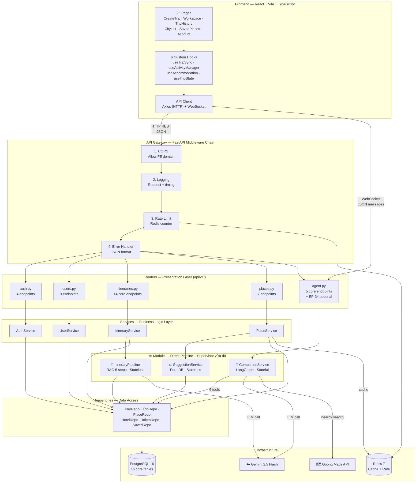
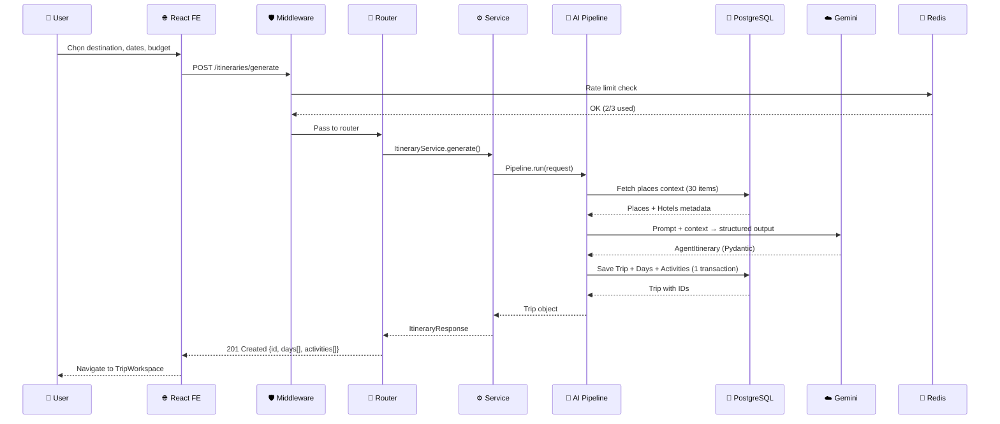
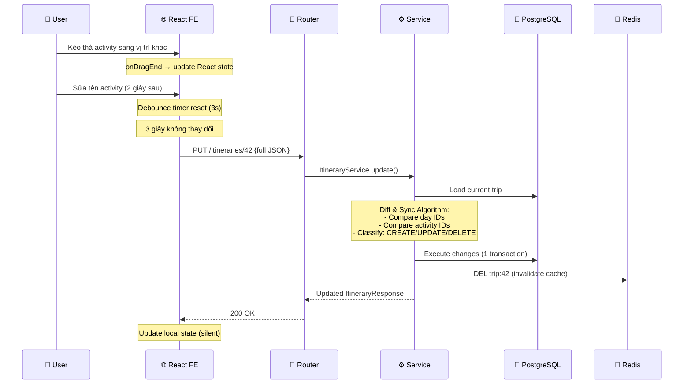
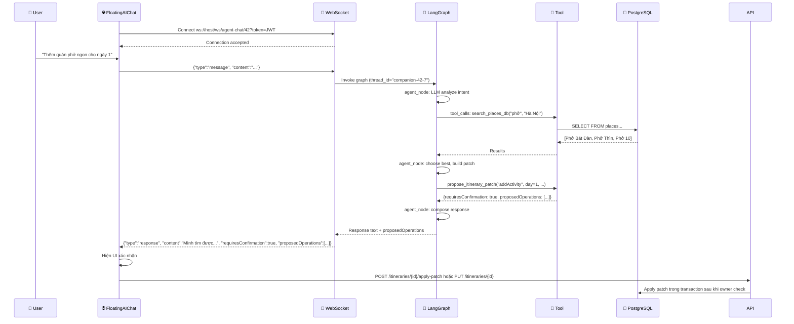
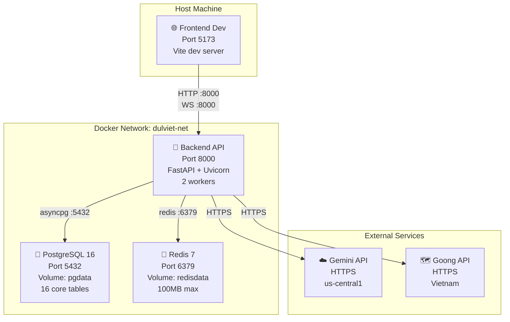
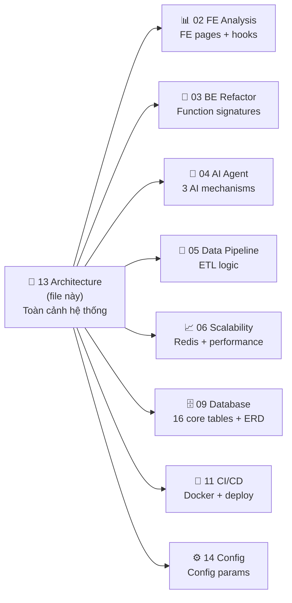
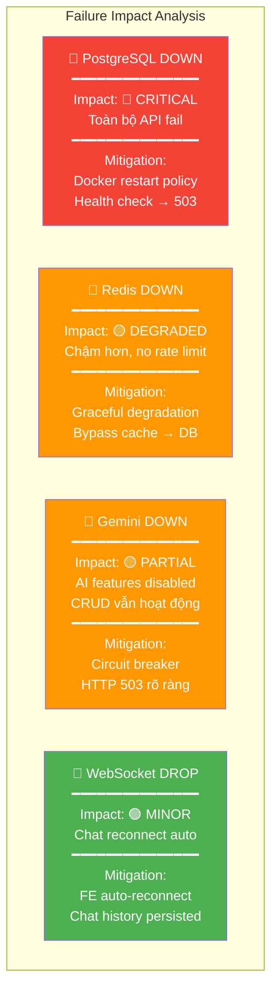

# Part 13: Architecture Overview — Kiến trúc Tổng thể Hệ thống

> **Decision lock v4.1:** Architecture chuẩn cho MVP2 là **contract-first + security-first**:
> FE `trip.types.ts` quyết định public JSON shape, BE dùng camelCase ở API boundary.
> MVP2 core có 33 endpoints; `EP-34 Analytics` là optional/MVP2+. Generate itinerary đi
> direct `ItineraryPipeline`; Supervisor chỉ điều phối chat/analytics natural-language.
> Share public qua `shareToken`, claim guest qua `claimToken`, chat history lưu ở
> `chat_sessions/chat_messages` thay vì expose raw LangGraph checkpoints.

## Mục đích file này

### WHAT — File này chứa gì?

File này vẽ và mô tả **toàn bộ kiến trúc hệ thống** — từ trình duyệt user đến database, từ AI Agent đến Cache, từ WebSocket đến REST API. Mọi thành phần, mọi kết nối, mọi protocol đều được liệt kê và giải thích.

### WHY — Tại sao cần file riêng cho architecture?

Các file plan khác (03, 04, 06...) mô tả chi tiết **bên trong** từng module. File này cho **cái nhìn từ trên xuống** — "hệ thống gồm những gì, kết nối ra sao". Khi debug production issue, developer cần biết nhanh: "request đi qua đâu" → mở file này.

### WHEN — Khi nào đọc?

- **Onboarding dev mới** — đọc file này TRƯỚC TẤT CẢ file khác
- **Debug cross-service issues** — xem data flow giữa các layers
- **Thêm tính năng mới** — xác định tính năng ở layer nào, ảnh hưởng layers nào
- **Deploy/scale** — xem deployment topology

---

## 1. Full System Architecture — Toàn cảnh

### §1.1 Block Diagram (ASCII)

```
┌─────────────────────────────────────────────────────────────────────────┐
│                          👤 USER (Browser)                              │
│                                                                         │
│  ┌──────────────────────────── FRONTEND ─────────────────────────────┐  │
│  │  React 18 + Vite 5 + TypeScript                                   │  │
│  │  ┌──────────┐ ┌──────────┐ ┌──────────┐ ┌──────────┐            │  │
│  │  │CreateTrip│ │Workspace │ │TripHist  │ │CityList  │  25 pages  │  │
│  │  │(AI Gen)  │ │(Edit+AI) │ │(List)    │ │(Browse)  │            │  │
│  │  └────┬─────┘ └────┬─────┘ └────┬─────┘ └────┬─────┘            │  │
│  │       │ POST        │ PUT/WS     │ GET         │ GET              │  │
│  │  ┌────┴─────────────┴────────────┴─────────────┴──────────────┐  │  │
│  │  │  Axios (HTTP) + WebSocket Client + React Hooks              │  │  │
│  │  │  useTripSync · useActivityManager · useAccommodation        │  │  │
│  │  └────────────────────────────┬───────────────────────────────┘  │  │
│  └───────────────────────────────┼───────────────────────────────────┘  │
│                                  │ HTTP REST (JSON) / WebSocket          │
│                                  ▼                                       │
│  ┌──────────────────────── API GATEWAY ──────────────────────────────┐  │
│  │  FastAPI + Uvicorn (Port 8000)                                    │  │
│  │  ┌──────┐ ┌──────┐ ┌──────────┐ ┌──────────┐ ┌──────────┐      │  │
│  │  │ CORS │→│ Log  │→│Rate Limit│→│Error Hdlr│→│Auth (JWT)│      │  │
│  │  └──────┘ └──────┘ └──────────┘ └──────────┘ └──────────┘      │  │
│  │  ┌────────────────────────────────────────┐  │ │  │
│  │  │  🎯 TravelSupervisor (AI chat/analytics)│  │ │  │
│  │  │  Intent Classification → Route → Validate│  │ │  │
│  │  │  Không bọc CRUD/direct generate          │  │ │  │
│  │  └────┬─────────┬─────────────┬──────────┘  │ │  │
│  │  ┌─────────────────┐  ┌─────────────────┐  ┌──────────────┐  ┌────────────┐ │ │  │
│  │  │ItineraryPipeline│  │CompanionService │  │SuggestionSvc │  │Analytics  │ │ │  │
│  │  │(direct RAG)     │  │(LangGraph+Tools)│  │(Pure DB)      │  │(T2SQL opt)│ │ │  │
│  │  │Stateless        │  │Stateful (PG)    │  │Stateless      │  │Read-only  │ │ │  │
│  │  └────────┬────────┘  └────────┬────────┘  └──────┬───────┘  └─────┬──────┘ │ │  │
│  └───────────┤────────────────────┤───────────────────┤───────────────┘ │  │─────────────────┘  │
│                                  ▼                                       │
│  ┌─────────────────── PRESENTATION LAYER ────────────────────────────┐  │
│  │  Routers (api/v1/)                                                │  │
│  │  ┌────────┐ ┌────────┐ ┌────────────┐ ┌────────┐ ┌───────┐      │  │
│  │  │auth.py │ │users.py│ │itineraries │ │places  │ │agent  │      │  │
│  │  │4 EPs   │ │3 EPs   │ │14 EPs core │ │4+3 EPs │ │5 EPs core │  │
│  │  └───┬────┘ └───┬────┘ └─────┬──────┘ └───┬────┘ └───┬───┘      │  │
│  └──────┼──────────┼────────────┼─────────────┼──────────┼───────────┘  │
│         ▼          ▼            ▼             ▼          ▼               │
│  ┌─────────────────── BUSINESS LOGIC LAYER ──────────────────────────┐  │
│  │  Services (DI injected)                                           │  │
│  │  ┌──────────┐ ┌──────────┐ ┌──────────────┐ ┌──────────┐        │  │
│  │  │AuthSvc   │ │UserSvc   │ │ItinerarySvc  │ │PlaceSvc  │        │  │
│  │  │(JWT+bcrypt│ │(CRUD)    │ │(CRUD+AI pipe)│ │(search)  │        │  │
│  │  └──────────┘ └──────────┘ └──────┬───────┘ └──────────┘        │  │
│  │                                    │                               │  │
│  │  ┌─────────────────── AI MODULE ──┴────────────────────────────┐ │  │
│  │  │  ┌─────────────────┐  ┌─────────────────┐  ┌────────────┐  │ │  │
│  │  │  │ItineraryPipeline│  │CompanionService │  │ContextSuggest│ │ │  │
│  │  │  │(RAG 5 steps)    │  │(LangGraph+Tools)│  │(Pure DB)    │  │ │  │
│  │  │  │Stateless        │  │Stateful (PG)    │  │Stateless    │  │ │  │
│  │  │  └────────┬────────┘  └────────┬────────┘  └──────┬─────┘  │ │  │
│  │  └───────────┼────────────────────┼───────────────────┼────────┘ │  │
│  └──────────────┼────────────────────┼───────────────────┼──────────┘  │
│                 ▼                    ▼                   ▼              │
│  ┌─────────────────── DATA ACCESS LAYER ─────────────────────────────┐  │
│  │  Repositories (SQLAlchemy 2.0 async)                              │  │
│  │  ┌────────┐ ┌────────┐ ┌────────┐ ┌────────┐ ┌────────┐         │  │
│  │  │UserRepo│ │TripRepo│ │PlaceRepo│ │HotelRepo│ │TokenRepo│        │  │
│  │  └───┬────┘ └───┬────┘ └───┬────┘ └───┬─────┘ └───┬────┘         │  │
│  └──────┼──────────┼──────────┼──────────┼────────────┼──────────────┘  │
│         ▼          ▼          ▼          ▼            ▼                  │
│  ┌─────────────────── INFRASTRUCTURE LAYER ──────────────────────────┐  │
│  │  ┌──────────────┐  ┌──────────────┐  ┌──────────────────────┐    │  │
│  │  │PostgreSQL 16 │  │ Redis 7      │  │ External APIs        │    │  │
│  │  │  16 tables   │  │ Cache(TTL)   │  │ ┌────────────────┐   │    │  │
│  │  │  Alembic     │  │ Rate limit   │  │ │Gemini 2.5 Flash│   │    │  │
│  │  │  migrations  │  │ JWT blacklist│  │ │Goong Maps API  │   │    │  │
│  │  └──────────────┘  └──────────────┘  │ └────────────────┘   │    │  │
│  │                                       └──────────────────────┘    │  │
│  └───────────────────────────────────────────────────────────────────┘  │
└─────────────────────────────────────────────────────────────────────────┘
```

### §1.2 Mermaid Architecture Graph



### §1.3 Giải thích từng Layer

**Layer 1 — Frontend (React + Vite):**
- **Vai trò:** Hiển thị UI, thu thập input, gửi API requests, hiển thị responses.
- **Tech stack:** React 18, Vite 5, TypeScript, React Router, CSS modules.
- **Communication:** Axios cho HTTP REST, native WebSocket API cho chat.
- **State management:** 6 custom hooks, KHÔNG dùng Redux/Zustand — hooks đủ cho app này.
- **UI/UX:** KHÔNG thay đổi trong MVP2 — chỉ thay data source (localStorage → API).

**Layer 2 — API Gateway (Middleware Chain):**
- **Vai trò:** Lọc requests trước khi đến routers. Mỗi request đi qua 4 middleware theo thứ tự.
- **CORS:** Chỉ cho phép domain FE (`localhost:5173` dev, `app.dulviet.com` prod).
- **Logging:** Ghi lại method, path, status code, duration. Cảnh báo nếu > 5s.
- **Rate Limit:** Redis counter. AI endpoints: 3 calls/day. API chung: 100 calls/min.
- **Error Handler:** Catch exceptions → format thành `{error_code, message, detail}` JSON.

**Layer 3 — Presentation (Routers):**
- **Vai trò:** Parse HTTP requests → gọi Services → format HTTP responses.
- **33 core endpoints** chia 5 nhóm: Auth (4), Users (3), Itineraries (14 — bao gồm EP-32 claim), Places (7), Agent/Suggestion (5 — bao gồm EP-33 chat-history). `EP-34 analytics` là optional/MVP2+.
- **Quy tắc:** Router KHÔNG chứa business logic — chỉ parse + validate + delegate.

**Layer 4 — Business Logic (Services + AI):**
- **Vai trò:** Xử lý logic nghiệp vụ. Mỗi Service nhận Repositories qua DI.
- **AI Module** tách riêng: `ItineraryPipeline` direct cho generate, `CompanionService` + `TravelSupervisor` cho chat, `SuggestionService` DB-only, `AnalyticsWorker` optional/MVP2+.
- **Chi tiết AI:** Xem [04_ai_agent_plan.md](04_ai_agent_plan.md).

**Layer 5 — Data Access (Repositories + Infrastructure):**
- **Vai trò:** CRUD operations trên database. Mỗi Repo = 1 entity.
- **SQLAlchemy 2.0 async** — tất cả queries đều async, không block event loop.
- **Redis:** Cache responses (TTL 5-60 phút) + Rate limit counters + JWT blacklist.

---

## 2. Communication Protocols — Ai nói chuyện với ai?

### §2.1 Protocol Matrix

| Source | Target | Protocol | Data Format | Latency Target | Khi nào dùng |
|--------|--------|----------|-------------|----------------|-------------|
| FE → BE | REST API | HTTP/1.1 | JSON | < 200ms (CRUD) | Mọi CRUD operations |
| FE → BE | Chat | WebSocket | JSON messages | < 10s/msg | AI Companion chat |
| BE → DB | Queries | asyncpg | SQL (parameterized) | < 50ms | Mọi data read/write |
| BE → Redis | Cache/Rate | Redis protocol | Key-Value strings | < 5ms | Cache hit, rate check |
| BE → Gemini | LLM call | HTTPS | JSON (REST API) | 5-20s | AI generation, chat |
| BE → Goong | Maps API | HTTPS | JSON (REST API) | 200-500ms | Geocoding, nearby |
| ETL → DB | Bulk insert | asyncpg | SQL (batch upsert) | N/A (background) | ETL pipeline |

### §2.2 Data Flow Diagrams

#### Luồng 1: User tạo lộ trình AI



#### Luồng 2: Auto-save (Drag-drop → API)



#### Luồng 3: AI Chat qua WebSocket



---

## 3. Tech Stack Matrix

### §3.1 Mỗi Layer dùng công nghệ gì?

| Layer | Technology | Version | WHY chọn? |
|-------|-----------|---------|-----------|
| **Frontend** | React | 18 | Component-based, hooks, large ecosystem |
| | Vite | 5 | HMR nhanh, ESM-first, nhẹ hơn CRA |
| | TypeScript | 5 | Type safety, IDE support, `trip.types.ts` source of truth |
| | Axios | 1.x | Promise-based HTTP, interceptors (refresh token) |
| | React Router | 6 | Client-side routing, 25 pages |
| **API** | FastAPI | 0.115+ | Async native, Pydantic validation, auto OpenAPI docs |
| | Uvicorn | 0.30+ | ASGI server, async workers |
| | Pydantic | 2.x | Request/response validation, JSON schema |
| **Auth** | python-jose | 3.x | JWT encode/decode |
| | bcrypt | 4.x | Password hashing (salt + hash) |
| **ORM** | SQLAlchemy | 2.0 | Async ORM, type-safe queries, relationship loading |
| | Alembic | 1.14+ | Database migrations, version control for schema |
| **Database** | PostgreSQL | 16+ | ACID, JSON columns, trigram search, robust |
| **Cache** | Redis | 7+ | In-memory, TTL, INCR (rate limit), sub-millisecond |
| **AI** | LangChain | 0.2+ | LLM abstraction, tool binding, structured output |
| | LangGraph | 0.2+ | StateGraph for multi-turn chat, checkpoints |
| | Gemini 2.5 Flash | latest | Fast, cheap, Vietnamese support, structured output |
| **Maps** | Goong Maps API | v1 | Vietnam-specific, Vietnamese address geocoding |
| **Package** | uv | latest | 10-100x faster than pip, deterministic lockfile |
| **Container** | Docker | 24+ | Containerization, multi-stage builds |
| | Docker Compose | 3.9 | Multi-service orchestration (BE + DB + Redis) |
| **CI/CD** | GitHub Actions | v4 | Integrated with repo, free for public repos |

### §3.2 WHY NOT — Tại sao KHÔNG chọn alternatives?

| Không chọn | Thay bằng | Lý do |
|-----------|----------|-------|
| Django | FastAPI | Django sync-first, FastAPI async-first (cần cho AI + WebSocket) |
| MongoDB | PostgreSQL | Relational data (trips → days → activities), ACID, strong schema |
| Memcached | Redis | Redis có INCR (rate limit), TTL, patterns. Memcached chỉ key-value |
| OpenAI GPT | Gemini | Gemini rẻ hơn, native Vietnamese, structured output tốt |
| pip/poetry | uv | uv nhanh 10-100x, better lockfile, Rust-based |
| Kubernetes | Docker Compose | K8s quá phức tạp cho 1-3 containers. Docker Compose đủ cho MVP |
| Redux/Zustand | React Hooks | App không lớn đủ cần global store. Custom hooks đủ |

---

## 4. Deployment Architecture

### §4.1 Docker Compose Topology



### §4.2 Environment Matrix

| Setting | Development | Staging | Production |
|---------|------------|---------|------------|
| DEBUG | true | false | false |
| LOG_LEVEL | DEBUG | INFO | WARNING |
| DB | localhost:5432 | staging-db | prod-db |
| Workers | 1 | 2 | 4 |
| CORS | localhost:5173 | staging.app.com | app.dulviet.com |
| Rate limit (AI) | 10/day | 5/day | 3/day |
| Rate limit (API) | 1000/min | 100/min | 100/min |
| Max trips/user | 50 | 10 | 5 |
| Redis maxmemory | 50MB | 100MB | 256MB |

---

## 5. Cross-Reference Map — File nào mô tả phần nào?



| Muốn biết chi tiết... | Mở file |
|----------------------|---------|
| FE pages cần API nào? | [02_fe_revamp_analysis.md](02_fe_revamp_analysis.md) |
| Function signature cụ thể? | [03_be_refactor_plan.md](03_be_refactor_plan.md) |
| AI pipeline + tools + WS? | [04_ai_agent_plan.md](04_ai_agent_plan.md) |
| ETL luồng data nào? | [05_data_pipeline_plan.md](05_data_pipeline_plan.md) |
| Redis cache strategy? | [06_scalability_plan.md](06_scalability_plan.md) |
| DB schema + ERD? | [09_database_design.md](09_database_design.md) |
| Docker + deploy? | [11_cicd_docker_plan.md](11_cicd_docker_plan.md) |
| Config parameters? | [14_config_plan.md](14_config_plan.md) |

---

## 7. System Failure Scenarios & Resilience 🆕

Kiến trúc hệ thống cần chịu tải và xử lý lỗi graceful. Bảng dưới phân tích từng component và hành vi khi fail:

### §7.1 Component Failure Matrix



### §7.2 Resilience Patterns áp dụng

| Pattern | Component | Mô tả |
|---------|-----------|--------|
| **Graceful Degradation** | Redis | Khi Redis down → system vẫn hoạt động (chậm hơn), query DB trực tiếp |
| **Circuit Breaker** | Gemini API | Sau 3 lần fail liên tiếp → ngưng gọi AI 60s → trả 503 ngay |
| **Retry with Backoff** | ETL Pipeline | API call fail → retry 3 lần (5s, 15s, 45s) trước khi skip |
| **Auto-Reconnect** | WebSocket | FE tự reconnect với exponential backoff (1s→2s→4s→8s max) |
| **Health Check** | Docker | `GET /health` kiểm tra DB + Redis connectivity. Docker restart on unhealthy |
| **Idempotent Operations** | Auto-save | PUT /itineraries/{id} là idempotent — gọi nhiều lần cho cùng kết quả |

### §7.3 Single Point of Failure (SPOF) Analysis

| Component | SPOF? | MVP2 Strategy | MVP3 Strategy |
|-----------|-------|---------------|---------------|
| PostgreSQL | ✅ Yes | Docker restart policy `on-failure`, pg_dump daily | Read replica + connection pooling (PgBouncer) |
| Redis | ❌ No | Optional — system works without it | Redis Sentinel for HA |
| Gemini API | ❌ No | AI features disabled when down | Multi-provider fallback (Gemini → Claude) |
| Backend | ❌ No | Single container, Docker restart | 3 replicas + Nginx load balancer |

> [!IMPORTANT]
> **MVP2 chấp nhận PostgreSQL là SPOF duy nhất.** Risk thấp vì: (1) PostgreSQL rất stable, (2) Docker restart tự động, (3) pg_dump daily backup. MVP3 sẽ thêm read replica.

> 📖 Chi tiết failure modes cho từng endpoint: [00_overview_changes.md §18](00_overview_changes.md)
> 📖 Redis graceful degradation code: [06_scalability_plan.md §8](06_scalability_plan.md)
