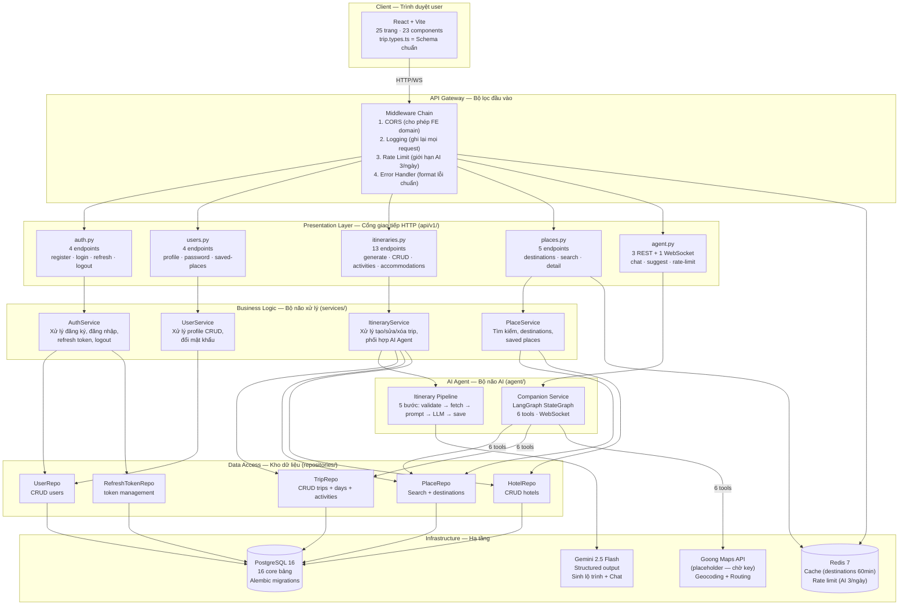

# Implementation Plan — Backend Refactor MVP2

> **Version:** 4.1 (2026-04-24) — Contract-first + security-first update after FE revamp/codebase review
> **Quyết định đã chốt:** Integer ID ✅ | Redis rate limit ✅ | Goong key placeholder ✅ | CRUD trước, AI sau ✅ | 33 core endpoints + EP-34 optional ✅
> **New features (v4.0):** Guest Claim Trip ✅ | 5 Active Trips Limit ✅ | Share Read-Only ✅ | Chat History ✅
> **Coding standards:** Mỗi file max 150 dòng | Mỗi function max 30 dòng | PEP8 + Google docstrings
> **AI Architecture:** Direct ItineraryPipeline + Supervisor vừa đủ cho Companion/Analytics + DB-only SuggestionService ✅
> **Total endpoints:** 33 core (31 gốc + EP-32 Claim + EP-33 Chat History). EP-34 Analytics là optional/MVP2+ feature flag.
> **Granular tasks:** Xem [plan/15_todo_checklist.md](15_todo_checklist.md) cho checklist từng bước nhỏ

---

## Tổng quan

File này là **bản đồ tổng thể** của dự án refactor. Nó chứa 4 phần chính:

1. **Architecture** — Sơ đồ toàn bộ hệ thống, từ client đến database
2. **4 Workflow chi tiết** — Luồng dữ liệu đi qua từng layer cho 4 chức năng chính
3. **Bảng mapping 33 endpoint core + EP-34 optional** — Mỗi API gọi function nào, ở tầng nào
4. **Git branching** — Tách branch thế nào, merge khi nào, verify ra sao
5. **New features** — Guest Claim, Creation Limit, Chat History

### Navigation Guide — Đọc file nào, khi nào?

| Mục đích | File đọc | Lý do |
|----------|---------|-------|
| Hiểu TẠI SAO phải thay đổi | [00_overview_changes.md](00_overview_changes.md) | Giải thích 13 thay đổi bằng ngôn ngữ tự nhiên |
| Hiểu code hiện tại (MVP1) | [01_mvp1_analysis.md](01_mvp1_analysis.md) | 10 endpoints, 4 models, weaknesses |
| Hiểu FE cần gì (MVP2) | [02_fe_revamp_analysis.md](02_fe_revamp_analysis.md) | Schema source of truth, 15 breaking changes, hooks pipeline |
| Code endpoint cụ thể | [12_be_crud_endpoints.md](12_be_crud_endpoints.md) ⭐ | 33 core endpoints + EP-34 optional: request/response body, auth, chain |
| Đọc function signatures | [03_be_refactor_plan.md](03_be_refactor_plan.md) | DI chain, latency budget, error handling |
| Implement AI Agent | [04_ai_agent_plan.md](04_ai_agent_plan.md) | Direct generator, Supervisor cho chat/analytics, DB-only suggest, WebSocket, LangGraph |
| Implement ETL Pipeline | [05_data_pipeline_plan.md](05_data_pipeline_plan.md) | Goong + OSM → DB, error handling, monitoring |
| Hiểu performance plan | [06_scalability_plan.md](06_scalability_plan.md) | Redis cache, rate limit, performance targets |
| Setup development env | [07_readme_plan.md](07_readme_plan.md) | 5-bước setup, commands, troubleshooting |
| Biết quy tắc code | [08_coding_standards.md](08_coding_standards.md) | OOP rules, imports, config, logger, dev workflow |
| Hiểu DB schema | [09_database_design.md](09_database_design.md) | ERD 16 core bảng, WHY decisions, PK/FK explanations, migrations |
| Viết tests | [10_use_cases_test_plan.md](10_use_cases_test_plan.md) | Core tests + optional Analytics/Supervisor/Guardrails cases |
| **Viết unit test code** | **[16_unit_test_specs.md](16_unit_test_specs.md)** 🆕 | **64 TCs: input/output/mock/assert cho từng function** |
| Setup deploy pipeline | [11_cicd_docker_plan.md](11_cicd_docker_plan.md) | GitHub Actions, Docker multi-stage, merge rules |
| Xem endpoint specs | [12_be_crud_endpoints.md](12_be_crud_endpoints.md) ⭐ | 33 core endpoints + EP-34 optional: request/response body, auth, chain |
| **Xem kiến trúc tổng** | **[13_architecture_overview.md](13_architecture_overview.md)** 🆕 | **5-layer architecture, tech stack, deployment, protocols** |
| **Xem config params** | **[14_config_plan.md](14_config_plan.md)** 🆕 | **30 config params, yaml/.env merge, environment overrides** |

---

## Sub-plans Index

Toàn bộ kế hoạch được chia thành **17 file**, mỗi file phục vụ 1 mục đích:

| # | File | Nó chứa gì? | Khi nào đọc? | KB |
|---|------|------------|-------------|-----|
| **[00](00_overview_changes.md)** | Tổng quan thay đổi | 13 thay đổi + 3 AI mechanism overview + diagrams | Đọc TRƯỚC tiên | 37 |
| **[01](01_mvp1_analysis.md)** | Phân tích MVP1 | 10 endpoints, 4 models, weaknesses analysis | Khi cần hiểu code CŨ | 14 |
| **[02](02_fe_revamp_analysis.md)** | FE revamp analysis | Schema, hooks, API status, claim flow, migration priority | Khi cần hiểu FE cần gì | 22 |
| **[03](03_be_refactor_plan.md)** | BE refactor chi tiết | §0 Architecture, DI chain, Drag-drop JSON, Diff&Sync | Khi bắt đầu CODE | 85 |
| **[04](04_ai_agent_plan.md)** | AI Agent (Supervisor vừa đủ) | Direct generator, companion patch-confirm, DB-only suggest, optional analytics | Khi làm Phase C | 72 |
| **[05](05_data_pipeline_plan.md)** | Data pipeline | ETL step-by-step, ETL↔BE↔FE connection, timeline | Khi làm Phase D | 22 |
| **[06](06_scalability_plan.md)** | Scalability | Redis cache/rate limit, performance targets, WHY decisions | Khi cần performance | 15 |
| **[07](07_readme_plan.md)** | README template | WHO/WHEN guide, 5 bước setup, Docker, troubleshooting | Khi viết README | 9 |
| **[08](08_coding_standards.md)** | Coding Standards | OOP rules, import patterns, config, logger, dev workflow | Đọc TRƯỚC khi code | 33 |
| **[09](09_database_design.md)** | Database Design | ERD 16 core bảng, PK/FK explanations, business flows, examples | Khi implement models | 30 |
| **[10](10_use_cases_test_plan.md)** | Use Cases & Tests | Core use cases + optional UC Analytics/Supervisor/Guardrails | Khi viết tests | 44 |
| **[11](11_cicd_docker_plan.md)** | CI/CD & Docker | GitHub Actions, Docker multi-stage, WHY decisions | Khi setup pipeline | 23 |
| **[12](12_be_crud_endpoints.md)** | BE CRUD Endpoints | 33 core endpoints + EP-32/33 + EP-34 optional | ⭐ MỞ KHI CODE | 30 |
| **[13](13_architecture_overview.md)** 🆕 | Architecture Overview | 5-layer diagram, tech stack matrix, deploy topology | 🆕 Đọc ĐẦU TIÊN | 22 |
| **[14](14_config_plan.md)** 🆕 | Config Plan | 30+ params, config.yaml + .env, AppSettings merge | 🆕 Khi setup config | 12 |
| **[15](15_todo_checklist.md)** | Todo Checklist | 98 tasks: Phase A→D, milestones, dependencies | Tracking progress | 42 |
| **[16](16_unit_test_specs.md)** 🆕 | Unit Test Specs | 64 TCs: function-level input/output/mock/assert | 🆕 Khi viết pytest | 30 |
| **[Master](implementation_plan.md)** | File này | Architecture, workflows, endpoint map, git strategy | Tham khảo thường xuyên | 30 |

---

## Architecture — Toàn bộ hệ thống hoạt động thế nào?

Sơ đồ dưới đây cho thấy **mọi thành phần** trong hệ thống và cách chúng kết nối.
Đọc từ trên xuống dưới — giống như dữ liệu đi từ user cho đến database:



### Giải thích sơ đồ

**Dòng dữ liệu chính:** User thao tác trên FE → request đi qua Middleware (kiểm tra CORS, log, rate limit) → đến Router (parse HTTP) → đến Service (xử lý logic) → đến Repository (query DB) → PostgreSQL trả kết quả → response ngược lại về user.

**AI flow riêng:** Khi user nhấn "Tạo lộ trình", ItineraryService gọi Pipeline (5 bước), Pipeline gọi Gemini → nhận structured output → lưu DB → trả response.

**WebSocket flow:** Khi user chat với AI Companion, request đi qua WebSocket → CompanionService → LangGraph graph → tools (có thể gọi DB hoặc Goong API) → response streaming về FE.

**Redis đứng giữa** Middleware và Database: cache response đã query trước đó (tránh query lại), limit số lần gọi AI.

---

## 4 Workflow chính — Luồng dữ liệu đi qua từng bước

### Workflow 1: AI Generate Itinerary

Đây là chức năng cốt lõi — user điền thông tin trip (thành phố, ngày, ngân sách, sở thích) và AI tạo lộ trình.

```
Bước │ Ở đâu?        │ Làm gì?                              │ Async? │ Thời gian
─────┼───────────────┼──────────────────────────────────────┼────────┼─────────
  1  │ Middleware    │ Log request + kiểm tra rate limit     │ Yes    │ <5ms
     │               │ → Redis: user này đã gọi AI mấy lần? │        │
     │               │ → Nếu ≥3 → trả 429 "Hết quota"       │        │
─────┼───────────────┼──────────────────────────────────────┼────────┼─────────
  2  │ Router        │ Parse TripGenerateRequest body         │ Sync   │ <1ms
     │               │ Pydantic tự validate: dest non-empty,  │        │
     │               │ budget > 0, dates hợp lệ              │        │
─────┼───────────────┼──────────────────────────────────────┼────────┼─────────
  3  │ DI            │ Resolve dependencies tự động:          │ Yes    │ <10ms
     │               │ get_db → get_repos → get_service       │        │
     │               │ get_current_user_optional (JWT)        │        │
─────┼───────────────┼──────────────────────────────────────┼────────┼─────────
  4  │ Service       │ Gọi ItineraryAgentPipeline.run()       │ Yes    │ ~15s
     │  ↓            │                                        │        │
     │ Pipeline      │ Step 1: Validate — thành phố có        │ Yes    │ <10ms
     │ step 1        │ trong DB không? Ngày hợp lệ?           │        │
     │               │                                        │        │
     │ Pipeline      │ Step 2: Fetch context — SELECT 30      │ Yes    │ <50ms
     │ step 2        │ places + 8 hotels từ PostgreSQL         │        │
     │               │ (chỉ lấy metadata nhẹ: name, category, │        │
     │               │ avg_cost, description[:80])              │        │
     │               │                                         │        │
     │ Pipeline      │ Step 3: Build prompt — nhúng places     │ Sync   │ <1ms
     │ step 3        │ data vào template prompt (string format)│        │
     │               │                                         │        │
     │ Pipeline      │ Step 4: Call Gemini 2.5 Flash           │ Yes    │ 5-15s
     │ step 4        │ → .with_structured_output(AgentItinerary)│       │
     │               │ → Nhận Pydantic object (100% parse)      │       │
     │               │ → Retry 2 lần nếu fail                   │       │
     │               │ → Fail hoàn toàn = HTTP 503 (không mock!) │       │
     │               │                                           │       │
     │ Pipeline      │ Step 5: Save to DB — tạo Trip + 3 Days   │ Yes   │ <100ms
     │ step 5        │ + 12 Activities trong 1 transaction        │       │
─────┼───────────────┼────────────────────────────────────────┼────────┼────────
  5  │ Router        │ Return ItineraryResponse (HTTP 201)      │ —     │ <1ms
     │               │ → FE navigate("/daily-itinerary/42")     │       │
─────┴───────────────┴────────────────────────────────────────┴────────┴────────
                                                        Tổng target: <20s
```

**Tại sao pipeline có 5 bước thay vì 1 lời gọi AI?**

Nếu chỉ gọi AI thô (gửi "Tạo lộ trình Hà Nội"), AI sẽ hallucinate — bịa ra địa điểm không tồn tại, giá không đúng. Bước 2 (fetch context) lấy data THẬT từ DB và nhúng vào prompt, giúp AI biết "những địa điểm NÀO có sẵn, giá BAO NHIÊU". Đây gọi là **RAG** (Retrieval-Augmented Generation) — AI sinh nội dung dựa trên data thật, không phải bịa.

### Workflow 2: Auto-Save (FE debounce 3s)

Khi user edit trip trên FE (kéo thả hoạt động, đổi giờ, thêm chi phí...), FE tự động gọi `PUT /itineraries/{id}` sau mỗi 3 giây idle. User không cần nhấn nút "Lưu" — giống Google Docs.

```
Bước │ Ở đâu?     │ Làm gì?                                │ Thời gian
─────┼────────────┼────────────────────────────────────────┼──────────
  1  │ Router     │ Nhận TripUpdateRequest (full trip JSON)  │ <1ms
  2  │ Service    │ Load trip hiện tại từ DB (kèm relations) │ <20ms
  3  │ Service    │ Kiểm tra: user này có phải owner?        │ <1ms
  4  │ Service    │ Diff & Sync: so sánh data cũ vs data mới │ <50ms
     │            │ → Days: id=1 tồn tại → UPDATE            │
     │            │         id=null → CREATE (ngày mới)       │
     │            │         id cũ không có → DELETE             │
     │            │ → Activities: tương tự cho mỗi ngày        │
     │            │ → Accommodations: tương tự                  │
  5  │ Repository │ Commit tất cả trong 1 transaction          │ <20ms
  6  │ Service    │ Invalidate Redis cache (DEL trip:42)        │ <5ms
  7  │ Router     │ Return updated ItineraryResponse            │ <5ms
─────┴────────────┴──────────────────────────────────────────┴──────────
                                                      Tổng: <200ms
```

**Tại sao dùng "Diff & Sync" thay vì xóa hết rồi tạo lại?**

Nếu DELETE toàn bộ days + activities rồi INSERT lại, ID sẽ thay đổi mỗi lần save. FE đang giữ reference đến id=42 (activity), sau khi save id biến thành id=99 → FE confused. Diff & Sync giữ nguyên ID cho records không thay đổi, chỉ create/update/delete records thực sự thay đổi.

### Workflow 3: AI Companion Chat (WebSocket)

User mở FloatingAIChat, nhắn "Thêm quán phở ngon vào sáng ngày 1".

```
Bước │ Ở đâu?          │ Làm gì?
─────┼─────────────────┼──────────────────────────────────────────
  1  │ FE              │ Kết nối WebSocket: ws://host/ws/agent-chat/42?token=JWT
  2  │ BE WebSocket    │ Accept + verify JWT → biết user nào
  3  │ BE              │ Tạo thread_id = "companion-42-7" (trip_id-user_id)
     │                 │ LangGraph dùng thread này để nhớ cuộc hội thoại
  4  │ FE → BE         │ User gửi: {"type":"message", "content":"Thêm quán phở..."}
  5  │ LangGraph       │ Agent node: Gemini đọc message → quyết định dùng tool
     │                 │ → tool_calls: [search_places_db("phở", "Hà Nội", "food")]
  6  │ LangGraph       │ Tools node: chạy search_places_db → query PostgreSQL
     │                 │ → Kết quả: [{name:"Phở Bát Đàn", rating:4.8, cost:50k}...]
  7  │ LangGraph       │ Agent node (lại): Gemini đọc kết quả → quyết định
     │                 │ → tool_calls: [propose_itinerary_patch("addActivity", day=1, ...)]
  8  │ LangGraph       │ Tools node: tạo patch, KHÔNG ghi DB
     │                 │ → Kết quả: {requiresConfirmation:true, proposedOperations:[...]}
  9  │ LangGraph       │ Agent node (lần 3): tạo response text chờ user xác nhận
 10  │ BE → FE         │ Gửi qua WebSocket:
     │                 │ {type:"response",
     │                 │  content:"Mình tìm được Phở Bát Đàn, bạn muốn thêm vào ngày 1 không?",
     │                 │  requiresConfirmation:true, proposedOperations:[...]}
 11  │ FE              │ Hiển thị message AI + UI confirm patch
     │                 │ → Sau khi user confirm: gọi PUT /itineraries/42 hoặc endpoint apply-patch
```

**Tại sao dùng WebSocket thay vì REST?**

Chat cần real-time — user gửi message, chờ response ngay. REST phải mở connection mới mỗi lần, không thể stream response. WebSocket giữ connection liên tục, server có thể gửi `{type:"typing"}` khi AI đang xử lý (giống "đang nhập..." trên Messenger).

**Session persistence hoạt động thế nào?**

LangGraph có `AsyncPostgresSaver` — tự động lưu toàn bộ state (messages, tool results) vào PostgreSQL sau mỗi turn. Khi user quay lại chat sau 1 giờ, LangGraph load state từ DB → AI nhớ cuộc hội thoại trước đó. Không cần code thêm — LangGraph xử lý hết.

### Workflow 4: Place Search (Redis Cache)

User tìm kiếm "cafe" ở "Đà Nẵng" trong PlaceSelectionModal.

```
Lần gọi ĐẦU TIÊN:
  FE → GET /places/search?q=cafe&city=Đà Nẵng
  → Redis: GET "places:Đà Nẵng:food:cafe" → MISS (chưa có)
  → PostgreSQL: SELECT * FROM places WHERE dest='Đà Nẵng' AND name ILIKE '%cafe%'
  → Redis: SET "places:Đà Nẵng:food:cafe" → lưu cache (TTL 15 phút)
  → Response: [{name, rating, image}...] (latency: ~50ms)

Lần gọi THỨ HAI (trong 15 phút):
  FE → GET /places/search?q=cafe&city=Đà Nẵng
  → Redis: GET "places:Đà Nẵng:food:cafe" → HIT!
  → Response: trả ngay từ Redis (latency: ~5ms, nhanh 10x)

Khi ETL chạy lại (mỗi 7 ngày):
  → Redis: DEL "places:*" → xóa toàn bộ cache cũ
  → Lần gọi tiếp = query DB + cache mới
```

---

## Bảng mapping 33 endpoint core + EP-34 optional — Endpoint nào gọi function nào?

Bảng này cho biết: khi FE gọi endpoint X, request đi qua những function nào ở mỗi tầng.
Cột "Auth" cho biết endpoint cần đăng nhập hay không.

### Nhóm Auth (4 endpoints)

| # | Method | Endpoint | Router fn | Service fn | Repo fn | Auth |
|---|--------|----------|-----------|------------|---------|------|
| 1 | POST | `/auth/register` | `register()` | `auth_svc.register()` | `user_repo.create()` | Public |
| 2 | POST | `/auth/login` | `login()` | `auth_svc.login()` | `user_repo.find_by_email()` | Public |
| 3 | POST | `/auth/refresh` | `refresh()` | `auth_svc.refresh()` | `token_repo.find_by_hash()` | Public |
| 4 | POST | `/auth/logout` | `logout()` | `auth_svc.logout()` | `token_repo.revoke_all()` | 🔒 |

### Nhóm User (3 endpoints)

| # | Method | Endpoint | Router fn | Service fn | Repo fn | Auth |
|---|--------|----------|-----------|------------|---------|------|
| 5 | GET | `/users/profile` | `get_profile()` | `user_svc.get_profile()` | `user_repo.get_by_id()` | 🔒 |
| 6 | PUT | `/users/profile` | `update_profile()` | `user_svc.update()` | `user_repo.update()` | 🔒 |
| 7 | PUT | `/users/password` | `change_password()` | `user_svc.change_pw()` | `user_repo.update()` | 🔒 |

### Nhóm Itinerary (13 endpoints — lớn nhất)

| # | Method | Endpoint | Router fn | Service fn | Repo fn | Auth |
|---|--------|----------|-----------|------------|---------|------|
| 8 | POST | `/itineraries/generate` | `generate()` | `itin_svc.generate()` | `trip_repo.create_full()` | Optional |
| 9 | POST | `/itineraries` | `create_manual()` | `itin_svc.create_manual()` | `trip_repo.create()` | Optional |
| 10 | GET | `/itineraries` | `list_trips()` | `itin_svc.list_by_user()` | `trip_repo.get_by_user()` | 🔒 |
| 11 | GET | `/itineraries/{id}` | `get_trip()` | `itin_svc.get_by_id()` | `trip_repo.get_with_full()` | 🔒 owner |
| 12 | PUT | `/itineraries/{id}` | `update_trip()` | `itin_svc.update()` | `trip_repo.update_full()` | 🔒 |
| 13 | DELETE | `/itineraries/{id}` | `delete_trip()` | `itin_svc.delete()` | `trip_repo.delete()` | 🔒 |
| 14 | PUT | `/itineraries/{id}/rating` | `rate_trip()` | `itin_svc.rate()` | `trip_repo.update()` | 🔒 |
| 15 | POST | `/itineraries/{id}/share` | `share_trip()` | `itin_svc.share()` | `share_link_repo.create()` | 🔒 |
| 16 | POST | `/itineraries/{id}/activities` | `add_activity()` | `itin_svc.add_activity()` | `trip_repo.add_activity()` | 🔒 |
| 17 | PUT | `/itineraries/{id}/activities/{aid}` | `update_activity()` | `itin_svc.update_act()` | `trip_repo.update_act()` | 🔒 |
| 18 | DELETE | `/itineraries/{id}/activities/{aid}` | `delete_activity()` | `itin_svc.delete_act()` | `trip_repo.delete_act()` | 🔒 |
| 19 | POST | `/itineraries/{id}/accommodations` | `add_accom()` | `itin_svc.add_accom()` | `trip_repo.add_accom()` | 🔒 |
| 20 | DELETE | `/itineraries/{id}/accommodations/{aid}` | `delete_accom()` | `itin_svc.del_accom()` | `trip_repo.del_accom()` | 🔒 |

### Nhóm Places (4 endpoints)

| # | Method | Endpoint | Router fn | Service fn | Repo fn | Auth |
|---|--------|----------|-----------|------------|---------|------|
| 21 | GET | `/destinations` | `list_destinations()` | `place_svc.get_dests()` | `place_repo.get_dests()` | Public |
| 22 | GET | `/destinations/{name}/detail` | `get_dest_detail()` | `place_svc.get_detail()` | `place_repo.get_by_dest()` | Public |
| 23 | GET | `/places/search` | `search_places()` | `place_svc.search()` | `place_repo.search()` | Public |
| 24 | GET | `/places/{id}` | `get_place()` | `place_svc.get_by_id()` | `place_repo.get_by_id()` | Public |

### Nhóm Saved Places (3 endpoints)

| # | Method | Endpoint | Router fn | Service fn | Repo fn | Auth |
|---|--------|----------|-----------|------------|---------|------|
| 25 | GET | `/users/saved-places` | `list_saved()` | `place_svc.list_saved()` | `saved_repo.get_by_user()` | 🔒 |
| 26 | POST | `/users/saved-places` | `save_place()` | `place_svc.save()` | `saved_repo.create()` | 🔒 |
| 27 | DELETE | `/users/saved-places/{id}` | `unsave()` | `place_svc.unsave()` | `saved_repo.delete()` | 🔒 |

### Nhóm AI/Suggestion (4 endpoints core)

| # | Method | Endpoint | Router fn | Service fn | Repo fn | Auth |
|---|--------|----------|-----------|------------|---------|------|
| 28 | POST | `/agent/chat` | `chat_rest()` | `companion_svc.chat()` | — | 🔓 |
| 29 | WS | `/ws/agent-chat/{trip_id}` | `chat_ws()` | `companion_svc.chat()` | — | 🔒 |
| 30 | GET | `/agent/suggest/{aid}` | `suggest()` | `place_svc.suggest()` | `place_repo.correlated()` | Public |
| 31 | GET | `/agent/rate-limit-status` | `rate_status()` | `limiter.remaining()` | — | 🔒 |
| **32** | **POST** | **`/itineraries/{id}/claim`** | **`claim_trip()`** | **`itin_svc.claim()`** | **`guest_claim_repo.verify_and_consume()`** | **🔒 + claimToken** |
| **33** | **GET** | **`/agent/chat-history/{trip_id}`** | **`get_history()`** | **`companion_svc.get_history()`** | **`chat_message_repo.list()`** | **🔒 owner** |

**Optional/MVP2+ endpoint:** EP-34 `POST /agent/analytics` chỉ bật khi có read-only DB role, SQL allowlist, query checker, max rows, audit log và user-scope enforced. Không tính vào Definition of Done MVP2 core.

---

## Git Branching — Mỗi phase = 1 branch = 1 PR

Tại sao tách branch? Để mỗi lần merge chỉ thêm 1 nhóm tính năng. Nếu phase C (AI Agent) có bug, phase A+B (Foundation + CRUD) vẫn safe trên main.

```mermaid
gitgraph
    commit id: "main (hiện tại)"
    branch feat/be-foundation
    checkout feat/be-foundation
    commit id: "A1: uv init"
    commit id: "A2: core/ layer"
    commit id: "A3: base/ ABCs"
    commit id: "A4: models/ 16 core tables"
    commit id: "A5: Alembic + Docker"
    commit id: "A6: README.md"
    checkout main
    merge feat/be-foundation id: "PR #1 (Foundation)"
    branch feat/be-auth-users
    commit id: "B1: Auth 4 endpoints"
    commit id: "B2: User 3 endpoints"
    commit id: "B3: Tests"
    checkout main
    merge feat/be-auth-users id: "PR #2 (Auth+Users)"
    branch feat/be-itineraries
    commit id: "B4: Trip CRUD"
    commit id: "B5: Activity & Accommodation"
    commit id: "B6: Tests"
    checkout main
    merge feat/be-itineraries id: "PR #3 (Itineraries)"
    branch feat/be-places
    commit id: "B7: Places + Destinations"
    commit id: "B8: Saved Places + Redis"
    commit id: "B9: Tests"
    checkout main
    merge feat/be-places id: "PR #4 (Places)"
    branch feat/be-ai-agent
    commit id: "C1: Itinerary Agent"
    commit id: "C2: Companion Agent"
    commit id: "C3: WebSocket + Rate Limit"
    commit id: "C4: Tests"
    checkout main
    merge feat/be-ai-agent id: "PR #5 (AI Agent)"
```

### Commands cụ thể cho mỗi phase

```bash
# ── Phase A: Foundation (tuần 1-2) ──
git checkout main
git checkout -b feat/be-foundation
# ... code Phase A ...
git push origin feat/be-foundation
# Tạo PR → tự review → merge to main

# ── Phase B1: Auth + Users (tuần 3) ──
git checkout main && git pull         # Pull code Phase A đã merge
git checkout -b feat/be-auth-users
# ... code Phase B1 ...

# ── Phase B2: Itineraries (tuần 4) ──
git checkout main && git pull
git checkout -b feat/be-itineraries

# ── Phase B3: Places (tuần 5) ──
git checkout main && git pull
git checkout -b feat/be-places

# ── Phase C: AI Agent (tuần 6-7) ──
git checkout main && git pull
git checkout -b feat/be-ai-agent
```

---

## Build Order — Phase nào làm trước?

Thứ tự QUAN TRỌNG vì các phase **phụ thuộc nhau**:

> [!TIP]
> Xem [15_todo_checklist.md](15_todo_checklist.md) cho **granular tasks** của từng phase (90 tasks chi tiết với file + endpoint mapping).

```
Phase A: Foundation (tuần 1-2) — KHÔNG phụ thuộc gì
   Tạo nền tảng: uv, core/, base/, models/, Alembic, Docker.
   Kết quả: Server khởi động được, DB tables tạo xong, chưa có endpoint.
   Test: uv run uvicorn src.main:app → health check trả {"status":"healthy"}

Phase B1: Auth + Users (tuần 3) — Phụ thuộc: Phase A
   Xây xong Auth mới có thể test "user đăng nhập → gọi API → trả data".
   Kết quả: 7 endpoints hoạt động, register → login → get profile.

Phase B2: Itineraries (tuần 4) — Phụ thuộc: Phase A + B1
   Cần Auth (để biết ai sở hữu trip). Cần Models (Trip, Day, Activity).
   Kết quả: 13 endpoints, full trip CRUD + activity CRUD + auto-save.

Phase B3: Places (tuần 5) — Phụ thuộc: Phase A
   Có thể làm song song với B2 (không phụ thuộc Auth).
   Kết quả: search, destinations, saved places, Redis cache.

Phase C: AI Agent (tuần 6-7) — Phụ thuộc: Phase A + B2 + B3
   AI Agent CẦN data trong DB (places, hotels) để làm RAG context.
   Bao gồm: direct ItineraryPipeline, Companion Supervisor, patch-confirm flow, prompt framework, guardrails.
   Kết quả core: AI generate + companion chat + DB-only suggest + chat history + WebSocket.
   Endpoints core: EP 28-31, 33. EP-34 Analytics là optional/MVP2+ sau hardening Text-to-SQL.
```

**Ưu tiên nếu thiếu thời gian:**
- Phase A + B = **bắt buộc** (4 tuần) — FE cần API để hoạt động
- Phase C1 (ItineraryPipeline direct) + C2 (Companion patch-confirm) = **quan trọng** (1 tuần) — Core AI feature
- Phase C6 (Analytics) + Phase D (ETL nâng cao) = **nice-to-have/MVP2+**

---

## Verification Checklist — Kiểm tra sau mỗi PR

### Mỗi PR phải pass toàn bộ:

```
□ Mọi file mới có Google docstring giải thích mục đích
□ Mọi function có type hints (input + output)
□ Không file nào vượt 150 dòng
□ Không function nào vượt 30 dòng
□ uv run ruff check src/ → 0 errors (code style)
□ uv run pytest src/tests/ → all pass (tests)
□ Server khởi động: uv run uvicorn src.main:app → no crash
□ Swagger UI: http://localhost:8000/docs → render đúng endpoints
□ Endpoints mới test được trong Swagger (click "Try it out")
```

### Final Integration (sau khi merge tất cả PR):

```
□ FE CreateTrip → POST /generate → AI trả lộ trình thật
□ FE TripWorkspace → PUT /itineraries/{id} → auto-save thành công
□ FE TripHistory → GET /itineraries → hiển thị list trips
□ FE PlaceSearch → GET /places/search → trả kết quả
□ FE FloatingAIChat → WS → nhận response AI
□ Rate limit → lần gọi AI thứ 4 trả 429
□ Redis cache → GET /destinations lần 2 nhanh hơn lần 1
□ Auth → token hết hạn trả 401
□ Auth → refresh token tạo cặp token mới
□ Docker Compose → docker compose up → tất cả services healthy
```

---

## Risk Register 🆕

| # | Risk | Probability | Impact | Mitigation | Owner |
|---|------|------------|--------|------------|-------|
| R1 | **Gemini API deprecation** (model renamed/removed) | 🟡 Medium | 🔴 High — AI features broken | Pin model version trong `config.yaml`. Monitor Gemini changelog. Fallback: switch model name in config, no code change | Backend dev |
| R2 | **Goong API pricing change** | 🟢 Low | 🟡 Medium — ETL cost increase | Free tier (1000 req/day) đủ cho 12 cities. Fallback: OSM-only mode | Backend dev |
| R3 | **FE schema change after BE complete** | 🟡 Medium | 🔴 High — API mismatch | `trip.types.ts` là source of truth (frozen after Phase A). Mọi thay đổi FE types cần PR review | FE + BE dev |
| R4 | **PostgreSQL data loss** | 🟢 Low | 🔴 Critical | pg_dump daily backup. Alembic migration versioned. Docker volume persistent | DevOps |
| R5 | **Team member unavailable** | 🟡 Medium | 🟡 Medium | Mỗi PR có code review. Documentation đầy đủ (17 files). Any dev can pick up | Team leads |
| R6 | **Rate limit bypass** | 🟢 Low | 🟡 Medium — AI cost | Redis-based counter. Guest: IP-based. Auth: user_id-based. Both enforced server-side | Backend dev |
| R7 | **WebSocket connection instability** | 🟡 Medium | 🟢 Low | FE auto-reconnect. Chat history persisted. REST fallback (`POST /agent/chat`) | FE dev |

---

## Acceptance Criteria — MVP2 Definition of Done 🆕

> [!IMPORTANT]
> MVP2 được coi là **SHIPPED** khi TẤT CẢ criteria dưới đây pass.

### Functional Criteria

| # | Criterion | Verification |
|---|-----------|-------------|
| AC-01 | Tất cả 33 core endpoints return correct status codes; EP-34 nếu bật phải pass guardrail tests | `uv run pytest` — 100% pass |
| AC-02 | Auth flow: register → login → refresh → logout | Manual test: 4-step flow complete |
| AC-03 | Trip CRUD: create → read → update → delete | Manual test + auto-save debounce 3s |
| AC-04 | AI generate: trả lộ trình thật từ Gemini (không mock) | Manual test: chọn destination → nhận trip |
| AC-05 | AI chat: WebSocket connected, multi-turn works | Manual test: 3 tin nhắn liên tiếp |
| AC-06 | Guest claim: tạo trip → login → claim → trip thuộc user | Manual test |
| AC-07 | Trip limit: user thứ 6 trips → 403 | Manual test |
| AC-08 | Rate limit: lần thứ 4 AI → 429 | Manual test |
| AC-09 | Public share chỉ đọc qua `shareToken`; raw integer itinerary ID không public | Manual test + API test |
| AC-10 | AI companion chỉ trả `proposedOperations`; DB chỉ đổi sau khi user confirm | Unit + integration test |

### Non-Functional Criteria

| # | Criterion | Target | Verification |
|---|-----------|--------|-------------|
| NF-01 | Test coverage | ≥ 80% | `uv run pytest --cov=src` |
| NF-02 | All files ≤ 150 lines | 100% compliance | `find src -name "*.py" \| xargs wc -l` |
| NF-03 | Docker Compose starts | All 4 services healthy | `docker compose up --build` — no errors |
| NF-04 | P95 latency CRUD | < 100ms | Locust load test |
| NF-05 | P95 latency AI | < 25s | Manual timing |
| NF-06 | Zero hardcoded secrets | 0 violations | `grep -r "API_KEY\|SECRET" src/ --include="*.py"` = 0 results |
