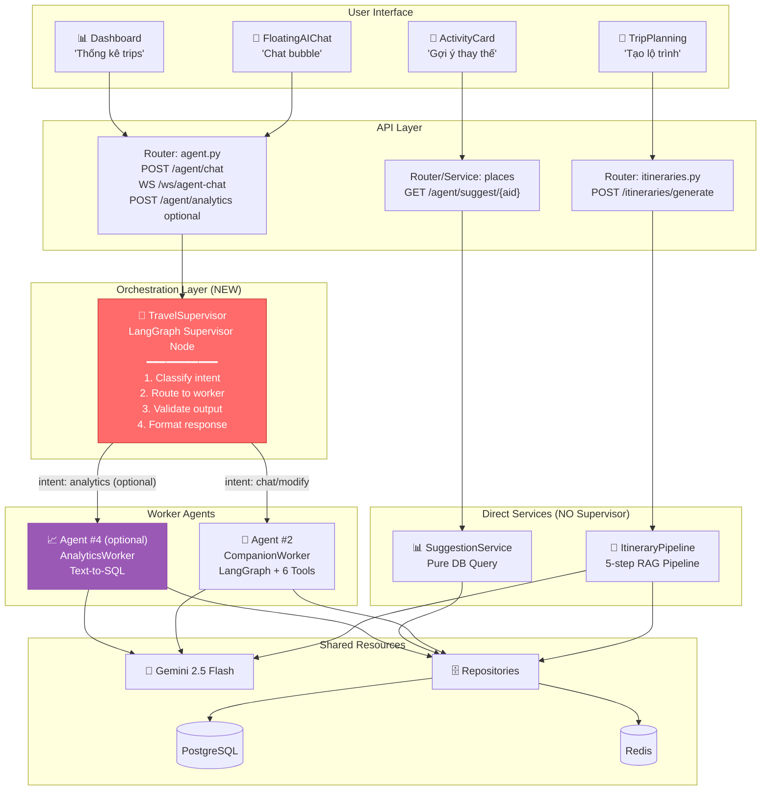

# Phân tích & Kế hoạch Update — Multi-Agent Orchestration

> **Mục đích:** Phân tích 2 PDF tham khảo + research LangGraph patterns → đề xuất kế hoạch update plan files
> **Trạng thái v4.1:** Các quyết định dưới đây đã được refined để tránh over-engineering:
> Supervisor chỉ dùng cho chat/analytics natural-language; generate và suggest đi direct.
> **Date:** 2026-04-20

---

## 1. Tóm tắt 3 nguồn tham khảo

### 1.1 PDF: Text-to-SQL Agent (21 slides)

**Bài toán:** Agent truy vấn database bài báo khoa học bằng ngôn ngữ tự nhiên.

**Kiến trúc chính:**
```
User question → Agent (LangChain) → 7-step workflow:
  1. Fetch available tables/schemas
  2. Quyết định tables liên quan
  3. Generate SQL query
  4. Double-check query (LLM-based linter)
  5. Execute query (read-only)
  6. Correct mistakes nếu lỗi (retry loop)
  7. Formulate response từ results
```

**Key takeaways cho project travel:**
- **Schema-Aware Prompting:** Inject DB schema + field descriptions vào prompt → LLM hiểu context → sinh SQL đúng hơn
- **Query Checker (double-check):** LLM kiểm tra SQL trước khi execute → giảm errors + retry
- **Guardrails:** Read-only mode, allowlist tables/columns, SQL validator middleware
- **2-layer design:** Agent layer (reasoning) tách biệt Tool layer (execution) → agent "có bịa" cũng không phá DB
- **Fuzzy Match:** Xử lý typo/synonym ("NLP" ↔ "Xử lý ngôn ngữ tự nhiên") qua column descriptions

### 1.2 PDF: UIT Chat Agent (Đồ án UIT, 952 dòng)

**Bài toán:** Chatbot hỗ trợ sinh viên UIT tra cứu thông tin học vụ.

**Kiến trúc đa công cụ (3-tool orchestration):**
```
User question → Receptionist LLM (Supervisor) → Tool selection:
  ├── Tool 1: queryKnowledgeBase (LightRAG — hybrid: Neo4j Graph + Qdrant Vector)
  ├── Tool 2: tavilySearch (web search, domain-restricted: uit.edu.vn)
  └── Tool 3: getUITWeather (real-time weather API)
```

**Key takeaways:**
- **Receptionist LLM = Supervisor pattern:** 1 LLM trung tâm quyết định gọi tool nào → giống Supervisor trong LangGraph
- **3-bước tư duy mỗi lượt:** Đánh giá → Điều phối công cụ → Tổng hợp phản hồi
- **Priority fallback:** Cache → Knowledge Base → Web Search
- **Guardrails mạnh:** Domain restriction + groundedness + prompt injection protection
- **Prompt Engineering 4 trụ cột:** Identity, Safety, Reasoning, Tool Selection
- **LightRAG hybrid retrieval:** Kết hợp Graph traversal + Vector similarity → xử lý câu hỏi multi-hop

### 1.3 Research: LangGraph Supervisor Pattern (2025)

**Supervisor Pattern = pattern phổ biến cho multi-agent orchestration khi request cần routing/context isolation:**
```
User query → Supervisor Node (LLM) → Route to Worker Agent:
  ├── Worker B: Companion Chatbot  
  ├── Worker C: Analytics Agent (text-to-SQL)

Worker hoàn thành → Handoff kết quả → Supervisor → Response
```

**Key principles áp dụng cho project này:**
- Chỉ request natural-language ambiguous mới qua Supervisor; endpoint explicit không cần route.
- Workers trong cùng Supervisor flow không giao tiếp trực tiếp → handoff qua Supervisor.
- Mỗi worker có local state riêng, supervisor giữ global state
- `create_supervisor` utility từ `langgraph-supervisor` package
- `TypedDict` cho explicit state schema
- Persistent state qua PostgreSQL (AsyncPostgresSaver)

---

## 2. So sánh Plan hiện tại vs. Best Practices

### Hiện tại (file `04_ai_agent_plan.md`)

| Aspect | Hiện tại | Đánh giá |
|--------|----------|----------|
| **3 cơ chế core** | ✅ Itinerary Generator + Companion + SuggestionService | Đúng rồi, giữ nguyên nhưng SuggestionService không gọi là agent AI |
| **Orchestration** | FE gọi endpoint explicit trực tiếp; chat chưa có routing thông minh | Cần Supervisor vừa đủ cho chat/analytics, không bọc generate/suggest |
| **Supervisor** | ❌ Chưa có concept supervisor/orchestrator | Cần thêm nhưng scope hẹp |
| **Agent #1 design** | ✅ 5-step RAG pipeline, structured output | Tốt, giữ nguyên |
| **Agent #2 design** | ✅ LangGraph + 6 tools + WebSocket | Tốt, bổ sung thêm |
| **SuggestionService design** | ✅ Pure DB query, no AI | Giữ DB-only để tránh over-engineering |
| **Text-to-SQL** | ❌ Chưa có — không có analytics feature | Optional/MVP2+, không block core |
| **Prompt Engineering** | ⚠️ Có nhưng chưa structured (4 trụ cột) | Cần bổ sung framework |
| **Guardrails** | ⚠️ Có rate limit nhưng chưa có content guardrails | Cần thêm output validation |
| **Error recovery** | ⚠️ Có retry nhưng chưa có query checker pattern | Cần thêm double-check step |
| **State management** | ✅ AsyncPostgresSaver cho Companion | Tốt |
| **Context engineering** | ⚠️ RAG có nhưng chưa schema-aware prompting | Bổ sung field descriptions |

### 6 Gaps cần giải quyết

| # | Gap | Từ nguồn nào | Priority |
|---|-----|-------------|----------|
| G1 | **Thiếu Orchestrator cho chat/analytics** — natural-language requests chưa có routing/validation tập trung | UIT Chat + LangGraph research | 🔴 HIGH |
| G2 | **Thiếu Text-to-SQL** — không có analytics ("bao nhiêu trips tháng này?") | Text-to-SQL PDF | 🟡 MEDIUM, optional |
| G3 | **Thiếu Prompt Engineering framework** — prompt chưa structured theo 4 trụ cột | UIT Chat §3.3 | 🔴 HIGH |
| G4 | **Thiếu Output Guardrails** — AI trả gì cũng accept, chưa validate response | Text-to-SQL PDF + UIT Chat | 🟡 MEDIUM |
| G5 | **Thiếu Query Checker** — Agent #1 RAG chưa có double-check step | Text-to-SQL PDF | 🟡 MEDIUM |
| G6 | **Thiếu Observability** — chưa có tracing/logging cho AI decisions | UIT Chat (Langfuse) + LangGraph | 🟢 LOW |

---

## 3. Đề xuất kiến trúc mới: "Travel AI Supervisor"

### 3.1 Tổng quan — Supervisor-based Orchestration



### 3.2 Supervisor vs. Hiện tại — So sánh

| Aspect | Hiện tại (No Supervisor) | Đề xuất (Supervisor) |
|--------|--------------------------|----------------------|
| **Routing** | Endpoint explicit đi direct; chat chưa có intent routing | Supervisor phân tích intent trong chat/analytics, không bọc generate/suggest |
| **Hybrid requests** | FE xử lý generate, chat xử lý follow-up | ✅ Sau khi generate xong, user follow-up trong chat → Supervisor → Companion patch |
| **Analytics** | ❌ Không có | ✅ Optional/MVP2+: "Tháng này tôi đã tạo bao nhiêu trips?" → analytics worker |
| **Error recovery** | Mỗi agent tự xử lý | Supervisor catch errors → retry/fallback to another worker |
| **Tracing** | Scattered logs | Centralized: Supervisor log mọi decision |

### 3.3 Khi nào Supervisor CẦN và KHÔNG cần

> [!IMPORTANT]
> **Supervisor KHÔNG cần cho tất cả requests.** Chỉ cần cho natural-language AI channel (chat/analytics). Requests thuần CRUD, generate explicit, và suggest DB-only vẫn đi thẳng qua Service layer.

```
Request types:
├── CRUD (80% traffic) → Direct to Service layer (NO Supervisor)
│   ├── GET /itineraries → ItineraryService.list()
│   ├── PUT /itineraries/{id} → ItineraryService.update()
│   └── POST /auth/login → AuthService.login()
│
└── AI-enhanced (20% traffic)
    ├── POST /itineraries/generate → Direct ItineraryPipeline
    ├── WS /ws/agent-chat → Supervisor → CompanionWorker
    ├── POST /agent/chat → Supervisor → route by intent
    ├── GET /agent/suggest/{aid} → Direct SuggestionService
    └── POST /agent/analytics → Supervisor → AnalyticsWorker (optional/MVP2+)
```

---

## 4. Text-to-SQL — Nên bổ sung không?

### 4.1 Phân tích

**Lợi ích:**
- User hỏi "Tôi đã tạo bao nhiêu trips tháng này?" → SELECT COUNT(*) FROM trips WHERE user_id = X AND created_at >= month_start
- Admin dashboard: "Top 5 destinations phổ biến nhất?" → GROUP BY destination ORDER BY count DESC LIMIT 5
- Analytics không cần hardcode — AI tự sinh SQL từ câu hỏi

**Rủi ro:**
- Hallucination: AI bịa SQL sai → trả kết quả sai
- Security: SQL injection nếu không validate

**Giảm thiểu (từ Text-to-SQL PDF):**
1. **Read-only DB role** — KHÔNG cho phép INSERT/UPDATE/DELETE
2. **Allowlist tables** — chỉ cho query: trips, trip_days, activities, places; không query users/tokens/chat
3. **SQL parser/validator + Query Checker** — validate AST trước, LLM verify sau
4. **Schema-aware prompting** — inject column descriptions vào prompt
5. **MAX_RETRIES = 2 + LIMIT 100 + audit log** — tối đa 2 lần retry, giới hạn rows và ghi audit

### 4.2 Đề xuất: Agent #4 — AnalyticsWorker

```
Scope hiện tại:
  ✅ Agent #1: Itinerary Generator (giữ nguyên)
  ✅ Agent #2: Companion Chatbot (bổ sung thêm)
  ✅ Service #3: SuggestionService (DB-only, giữ direct)
  🆕 Optional Agent #4: AnalyticsWorker (text-to-SQL, read-only)

Agent #4 workflow:
  1. Nhận câu hỏi analytics từ Supervisor
  2. Fetch DB schema (cached) — chỉ allowlist tables
  3. Generate SQL (Gemini + schema context)
  4. Query Checker (Gemini verify SQL)
  5. Execute (read-only) → results
  6. Format response (natural language)
  7. Nếu lỗi → retry (max 2)
```

### 4.3 Quan điểm: NÊN hay KHÔNG?

| Option | Pros | Cons |
|--------|------|------|
| **A: Thêm Agent #4 trong MVP2 core** | Feature giá trị cao | Cần test kỹ SQL injection, làm chậm core |
| **B: Để EP-34 optional/MVP2+ (recommend v4.1)** | Giữ core ổn định, vẫn có spec sẵn | Analytics chưa có ngay ngày đầu |
| **C: Không thêm** | Đơn giản hơn, ít rủi ro | Mất cơ hội analytics |

> **Đề xuất v4.1: Option B** — giữ Agent #4 trong docs/spec nhưng bật bằng feature flag sau khi CRUD + AI core ổn định.

---

## 5. Kế hoạch Update — File nào sửa gì?

### 5.1 Phân loại: KEEP / ADD / CHANGE

#### ✅ KEEP (giữ nguyên)
- Agent #1 RAG pipeline 5-step → vẫn đúng, nhưng direct EP-8, không qua Supervisor
- Agent #2 LangGraph + 6 tools → vẫn đúng
- SuggestionService pure DB query → giữ là service/tool, không gọi là AI agent
- WebSocket protocol → vẫn đúng
- Rate limiting → vẫn đúng
- AsyncPostgresSaver → vẫn đúng cho checkpoint nội bộ; chat history API đọc `chat_sessions/chat_messages`

#### 🆕 ADD (thêm mới)
1. **Orchestration Layer:** Supervisor node + routing logic + intent classification cho chat/analytics
2. **Agent #4 optional:** AnalyticsWorker (text-to-SQL, read-only role, feature flag)
3. **Prompt Engineering Framework:** 4 trụ cột (Identity, Safety, Reasoning, Tool Selection)
4. **Output Guardrails:** Response validation layer
5. **Query Checker:** Double-check step cho Agent #1 và #4
6. **Observability hooks:** Structured logging cho AI decisions

#### ✏️ CHANGE (sửa đổi)
1. **Agent #2 routing:** Chat requests qua Supervisor; generate/suggest vẫn direct
2. **Endpoint design:** `/agent/chat` là natural-language entry point; `/itineraries/generate` giữ explicit direct route
3. **Mutation model:** Companion không tự ghi DB; trả `proposedOperations` để FE confirm

### 5.2 File-by-file Update Plan

| File | Update scope | Priority | Est. lines added | Status |
|------|-------------|----------|------------------|--------|
| **`04_ai_agent_plan.md`** | MAJOR — thêm §9-§13 Orchestration, Supervisor, Agent #4, Prompt, Guardrails, Observability | 🔴 HIGH | ~500 lines | ✅ DONE |
| **`00_overview_changes.md`** | AI System section + agent/ folder tree + reading order | 🔴 HIGH | ~60 lines | ✅ DONE |
| **`03_be_refactor_plan.md`** | Thêm `supervisor.py` + `analytics_pipeline.py` specs | 🟡 MED | ~80 lines | ✅ DONE |
| **`12_be_crud_endpoints.md`** | Thêm EP-34 `POST /agent/analytics` | 🟡 MED | ~70 lines | ✅ DONE |
| **`13_architecture_overview.md`** | Thêm Orchestration vừa đủ + 33 core endpoints + EP-34 optional | 🟡 MED | ~70 lines | ✅ DONE |
| **`implementation_plan.md`** | Phase C tasks, file 16, endpoint count, cross-ref | 🟡 MED | ~30 lines | ✅ DONE |
| **`07_readme_plan.md`** | agent/ description, 33 core endpoints + optional analytics | 🟢 LOW | ~5 lines | ✅ DONE |
| **`15_todo_checklist.md`** | Task C5-C7, 33 core endpoints + EP-34 optional | 🟢 LOW | ~80 lines | ✅ DONE |
| **`10_use_cases_test_plan.md`** | UC-20/21/22, §4.5-4.7, test tree, matrix 64 TCs | 🟢 LOW | ~420 lines | ✅ DONE |
| **`16_unit_test_specs.md`** 🆕 | 64 TCs: function-level input/output/mock/assert | 🟡 MED | ~800 lines | ✅ DONE |
| **`02_fe_revamp_analysis.md`** | 33 core endpoints + EP-34 optional, Mermaid diagram | 🟢 LOW | ~5 lines | ✅ DONE |

### 5.3 Chi tiết nội dung thêm vào `04_ai_agent_plan.md`

```markdown
## Sections to ADD:

§0.5 — Orchestration Layer: TravelSupervisor
  - WHY: agents rời rạc → cần central coordinator
  - WHAT: LangGraph Supervisor node, intent classification, routing
  - HOW: create_supervisor() utility, TypedDict state, handoff mechanism
  - Diagram: Supervisor graph (Mermaid)
  - Sequence diagram: User → Supervisor → Worker → Supervisor → Response

§0.6 — Multi-Agent Communication Protocol
  - State schema (TravelAgentState TypedDict)
  - Handoff format: {worker_id, task, context, result}
  - Error propagation: Worker error → Supervisor catch → retry/fallback
  - Context engineering: what context each worker receives

§11 — Agent #4: AnalyticsWorker (Text-to-SQL)
  - Purpose: Analytics queries via natural language
  - Workflow: 7-step (fetch schema → generate SQL → check → execute → format)
  - Guardrails: read-only, allowlist, query checker
  - Schema-aware prompting with field descriptions
  - Supported query types: filter, aggregate, join
  - Endpoint: EP-34 POST /agent/analytics

§12 — Prompt Engineering Framework (4 trụ cột)
  - Trụ 1: Identity & Tone (Vietnamese travel advisor)
  - Trụ 2: Safety & Guardrails (domain restriction, groundedness)
  - Trụ 3: Reasoning & Decision-making (3-step thinking)
  - Trụ 4: Tool Selection Strategy (few-shot examples)
  - Per-agent prompt templates
  
§13 — Output Guardrails
  - Response validation pipeline
  - Hallucination detection (groundedness check)
  - Budget sanity check (Agent #1: total cost ≤ user budget)
  - SQL safety check (Agent #4: no DML, allowlist tables)
  
§14 — Observability & Tracing
  - Structured logging for AI decisions
  - LangSmith/LangFuse integration hooks
  - Metrics: latency per agent, tool usage stats, error rates
```

---

## 6. Prompt tối ưu cho việc Update Plan

> Bạn hỏi: "Nên viết prompt sao để tối ưu?" → Đây là prompt template bạn nên dùng:

### Prompt cho Update `04_ai_agent_plan.md`

```
CONTEXT: Dự án AI Travel Itinerary (FastAPI + LangGraph + Gemini 2.5 Flash).
Hệ thống cần 2 AI cơ chế core (Itinerary Generator direct pipeline, Companion Chatbot LangGraph) + 1 SuggestionService DB-only + Analytics optional.
Cần nâng cấp thành kiến trúc multi-agent vừa đủ: Supervisor chỉ orchestration chat/analytics, không bọc generate/suggest.

REFERENCES (ĐỌC KỸ trước khi viết):
1. plan/04_ai_agent_plan.md (file hiện tại — PHẢI giữ nguyên §0–§10)
2. References/text_to_sql.pdf (7-step Text-to-SQL workflow)
3. References/UIT-chatbit-agent.pdf (3-tool orchestration, Receptionist LLM Supervisor)
4. LangGraph Supervisor Pattern: https://langchain-ai.github.io/langgraph/concepts/multi_agent/

TASK: Thêm 5 sections MỚI vào cuối file 04_ai_agent_plan.md:
  §0.5 — TravelSupervisor (Orchestration Layer)
  §11 — Agent #4: AnalyticsWorker (Text-to-SQL)
  §12 — Prompt Engineering Framework (4 trụ cột)
  §13 — Output Guardrails
  §14 — Observability & Tracing

YÊU CẦU cho mỗi section:
1. MỤC ĐÍCH file này (tại sao cần section này)
2. KIẾN TRÚC Mermaid diagram (graph TB hoặc sequenceDiagram)
3. GIẢI THÍCH kỹ thuật (WHY trước WHAT trước HOW)
4. CODE MẪU Python (class/function signatures, 80% specification)
5. DATA CONTRACTS (input/output types, TypedDict schemas)
6. SO SÁNH trước/sau (table format)
7. FAILURE MODES & MITIGATION (ít nhất 3 scenarios)
8. LIÊN KẾT cross-file (tham chiếu file nào trong /plan)

RULES:
- Viết tiếng Việt, style giống các section hiện có trong file 04
- KHÔNG xóa hoặc sửa content hiện có (§0–§10)
- KHÔNG tạo file mới
- Mỗi section có "Tại sao cần?" block giải thích rationale
- Max 150 dòng/section
- Code mẫu là specification, KHÔNG phải production code
```

### Prompt cho Update cross-files (00, 03, 12, 13)

```
CONTEXT: File plan/04_ai_agent_plan.md đã được cập nhật với:
- §0.5: TravelSupervisor (Orchestration Layer)
- §11: Agent #4 AnalyticsWorker (Text-to-SQL)
- §12-§14: Prompt Framework, Guardrails, Observability

TASK: Cập nhật 4 files SAU cho đồng bộ:

1. plan/00_overview_changes.md:
   - Phần 9 "AI System": thêm mô tả Supervisor + AnalyticsWorker optional
   - Cross-reference table: thêm row cho §0.5, §11
   
2. plan/03_be_refactor_plan.md:
   - §3: thêm file specs cho src/agent/supervisor.py, src/agent/analytics_worker.py
   
3. plan/12_be_crud_endpoints.md:
   - Thêm EP-34: POST /agent/analytics (text-to-SQL query) ở trạng thái optional/MVP2+
   - Giữ endpoint count MVP2 core = 33; EP-34 không tính vào core DoD
   
4. plan/13_architecture_overview.md:
   - Thêm Orchestration Layer trong system architecture diagram

RULES:
- KHÔNG xóa content hiện có
- Giữ style Vietnamese, concise
- Mỗi thay đổi kèm [ASSUMPTION] nếu thiếu data
```

---

## 7. Quyết định cần bạn confirm

> [!WARNING]
> Trước khi apply, tôi cần bạn xác nhận các quyết định sau:

| # | Quyết định | Options | Đề xuất |
|---|-----------|---------|---------|
| Q1 | **Thêm Supervisor không?** | A: Có (recommend) / B: Không | A — giải quyết G1 |
| Q2 | **Thêm Agent #4 Text-to-SQL không?** | A: Có trong core / B: Không / C: Sau MVP2 | C — optional/MVP2+ |
| Q3 | **Endpoint count tăng?** | 33 core + EP-34 optional | Không tăng core DoD |
| Q4 | **Prompt framework detail level?** | A: Full 4 trụ cột / B: Chỉ overview | A — cho báo cáo kỹ thuật |
| Q5 | **Observability tool?** | A: LangSmith / B: LangFuse / C: structlog only | C (MVP) → B (production) |
| Q6 | **Agent #4 access level?** | A: All users / B: Admin only / C: Self-user only | C — user chỉ query data của mình |
