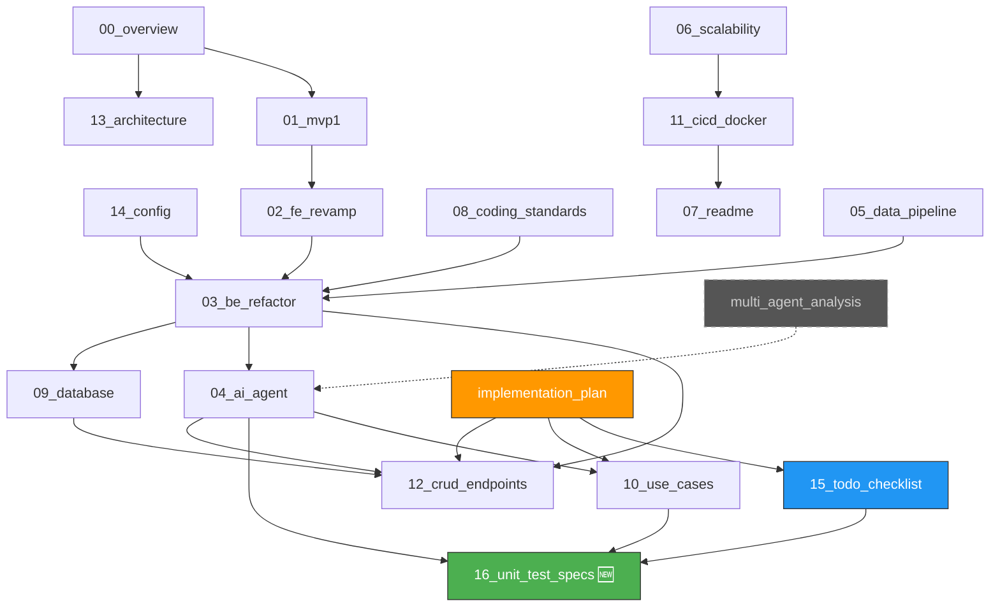

```mermaid
graph TD
    00["00_overview"] --> 13["13_architecture"]
    00 --> 01["01_mvp1"]
    01 --> 02["02_fe_revamp"]
    02 --> 03["03_be_refactor"]
    08["08_coding_standards"] --> 03
    14["14_config"] --> 03
    06["06_scalability"] --> 11["11_cicd_docker"]
    11 --> 07["07_readme"]
    
    03 --> 09["09_database"]
    03 --> 04["04_ai_agent"]
    03 --> 12["12_crud_endpoints"]
    05["05_data_pipeline"] --> 03
    09 --> 12
    04 --> 12
    
    IMP["implementation_plan"] --> 12
    IMP --> 10["10_use_cases"]
    IMP --> 15["15_todo_checklist"]
    
    10 --> 16["16_unit_test_specs 🆕"]
    04 --> 16
    04 --> 10
    15 --> 16
    
    MA["multi_agent_analysis"] -.-> 04

    style 16 fill:#4CAF50,stroke:#333,color:#fff
    style MA fill:#555,stroke:#999,stroke-dasharray: 5 5,color:#ccc
    style 15 fill:#2196F3,stroke:#333,color:#fff
    style IMP fill:#FF9800,stroke:#333,color:#fff
```
